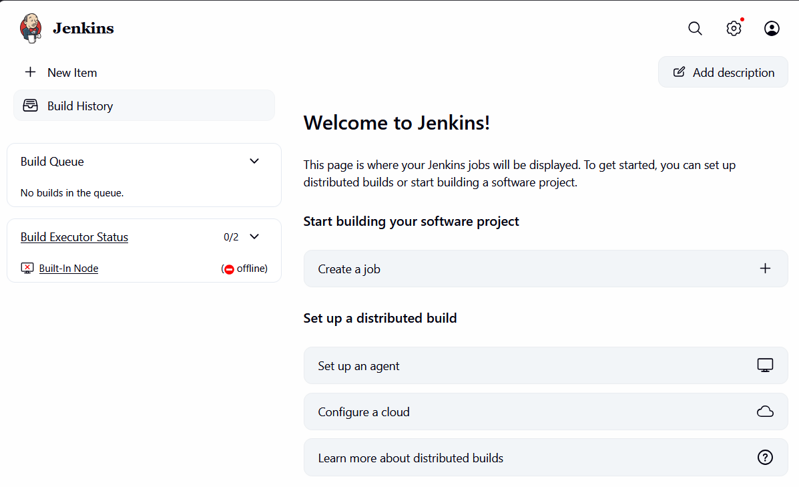
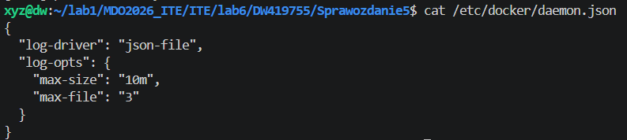
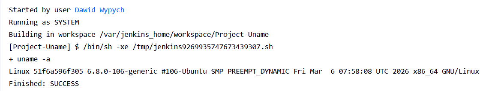
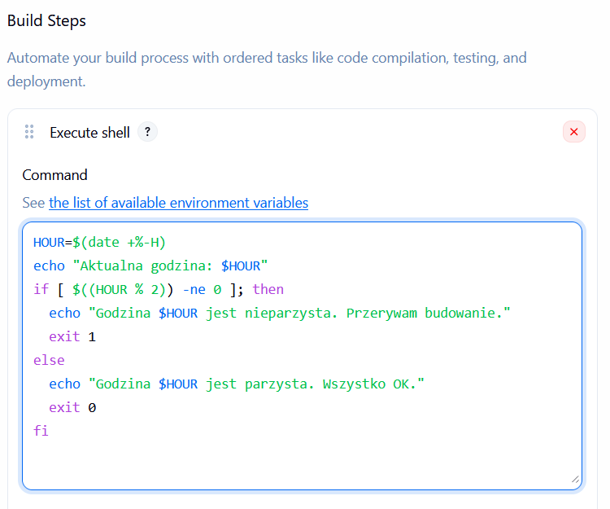
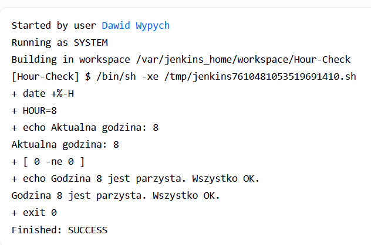
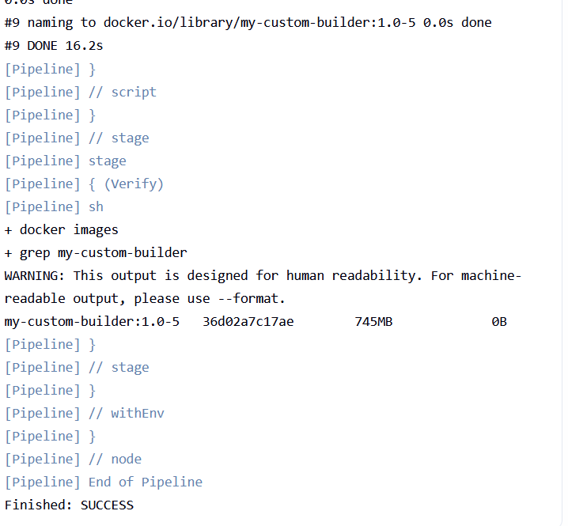

Przygotowanie:
Uruchomienie środowiska zagnieżdżonego (Docker-in-Docker):

Przygotowanie obrazu Blue Ocean:

Budowanie obrazu:

Uruchomienie kontenera Blue Ocean:

Strona startowa Jankins:

Gotowy setup:

Zabezpiecznia Jenkinsa:
max-size (10m): Jeden plik logu nie przekroczy 10 megabajtów.
max-file (3): Docker będzie trzymał maksymalnie 3 archiwalne pliki logów.

Zadanie wstępne: uruchomienie:
Uname

Wyświetlanie uname:

Execute shell dla godziny nieprarzystej:

Działa:

Pobieranie obrazu kontenera ubuntu:

Obiekt typu pipeline
Towrzenie pipeline:

Wykonany pipeline:

Wykonany drugi pipeline:

Drugi pipeline wykonał się dużo szybciej, ponieważ obraz ubuntu został już pobrany podczas pierwszego pipeline'a.