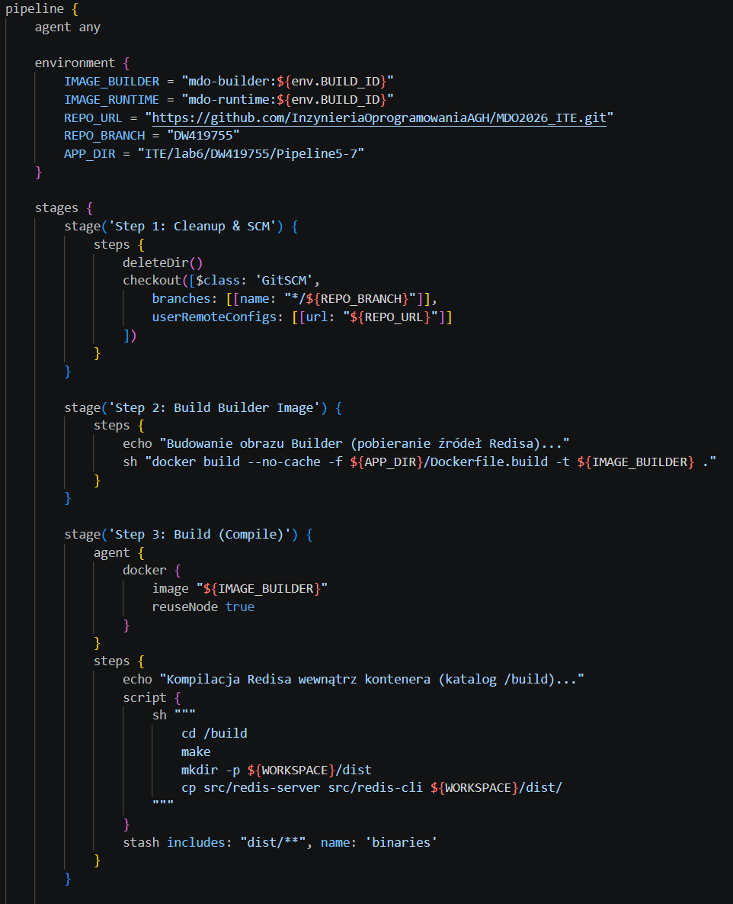
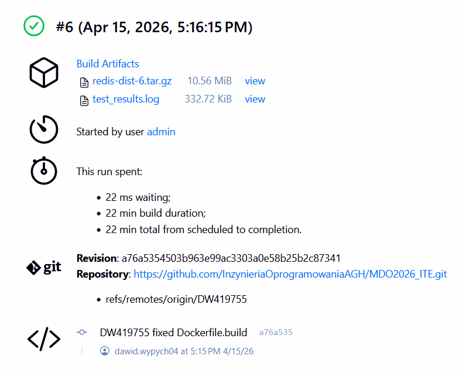
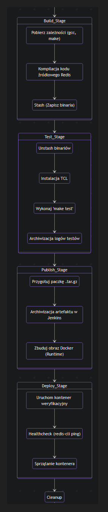
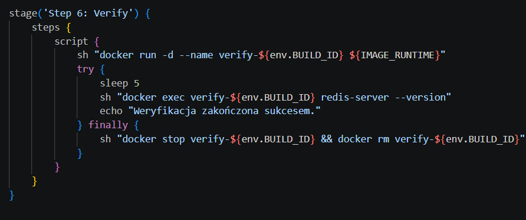

# Zajęcia 06
---

## Pipeline: lista kontrolna
Scharakteryzuj plan na *pipeline* i przedstaw postęp prac. Czy mamy pomysł na każdy krok poniżej?

### Ścieżka krytyczna
Podstawowy zbiór czynności do wykonania w ramach zadania z pipelinem CI/CD. Ścieżką krytyczną jest:
- [X] commit (lub tzw. *manual trigger* @ Jenkins)
- [X] clone
- [X] build
- [X] test
- [X] deploy
- [X] publish

Jenkinsfile z krokami:

Poniższe czynności wykraczają ponad tę ścieżkę, ale zrealizowanie ich pozwala stworzyć pełny, udokumentowany, jednoznaczny i łatwy do utrzymania pipeline z niskim progiem wejścia dla nowych *maintainerów*.

### Pełna lista kontrolna
Zweryfikuj dotychczasową postać sprawozdania oraz planowane czynności względem ścieżki krytycznej oraz poniższej listy. Realizacja punktu wymaga opisania czynności,
wykazania skuteczności (np. zrzut ekranu), podania poleceń i uzasadnienia decyzji dot. implementacji.

- [X] Aplikacja została wybrana - Redis
- [X] Licencja potwierdza możliwość swobodnego obrotu kodem na potrzeby zadania
- [X] Wybrany program buduje się

- [X] Przechodzą dołączone do niego testy

- [X] Zdecydowano, czy jest potrzebny fork własnej kopii repozytorium
- [X] Stworzono diagram UML zawierający planowany pomysł na proces CI/CD:

- [X] Wybrano kontener bazowy lub stworzono odpowiedni kontener wstepny (runtime dependencies):

- [X] *Build* został wykonany wewnątrz kontenera:

- [X] Testy zostały wykonane wewnątrz kontenera (kolejnego):

- [X] Kontener testowy jest oparty o kontener build: obraz o nazwie Image_Builder
- [X] Logi z procesu są odkładane jako numerowany artefakt, niekoniecznie jawnie

- [X] Zdefiniowano kontener typu 'deploy' pełniący rolę kontenera, w którym zostanie uruchomiona aplikacja (niekoniecznie docelowo - może być tylko integracyjnie)

- [X] Uzasadniono czy kontener buildowy nadaje się do tej roli/opisano proces stworzenia nowego, specjalnie do tego przeznaczenia: Kontener buildowy zawiera zbędne w środowisku produkcyjnym narzędzia kompilacyjne oraz zależności testowe, co niepotrzebnie zwiększa rozmiar obrazu i rozszerza płaszczyznę potencjalnego ataku. Z tego powodu proces kończy się stworzeniem dedykowanego obrazu runtime, który obejmuje wyłącznie niezbędne binaria i biblioteki, co gwarantuje wyższy poziom bezpieczeństwa oraz znacznie szybsze wdrażanie aplikacji dzięki mniejszej wadze kontenera.
- [X] Wersjonowany kontener 'deploy' ze zbudowaną aplikacją jest wdrażany na instancję Dockera
- [X] Następuje weryfikacja, że aplikacja pracuje poprawnie (*smoke test*) poprzez uruchomienie kontenera 'deploy'

- [X] Zdefiniowano, jaki element ma być publikowany jako artefakt: Docker i tar.gz
- [X] Uzasadniono wybór: kontener z programem, plik binarny, flatpak, archiwum tar.gz, pakiet RPM/DEB:
Równoległe generowanie obrazu Docker oraz archiwum .tar.gz zapewnia pełną elastyczność w doborze docelowej infrastruktury wdrożeniowej. Obraz kontenerowy jest optymalny dla nowoczesnych środowisk orkiestracji, natomiast paczka tar.gz umożliwia tradycyjną instalację bezpośrednio w systemie operacyjnym, co czyni artefakt uniwersalnym i niezależnym od dostępności silnika Docker na maszynie docelowej.
- [X] Opisano proces wersjonowania artefaktu (można użyć *semantic versioning*)
Wersjonowanie artefaktów oparto na unikalnej zmiennej BUILD_ID generowanej przez serwer Jenkins, co pozwala na bezbłędne powiązanie każdej paczki z konkretnym przebiegiem potoku i rewizją kodu źródłowego. Takie podejście zapewnia pełną trasowalność procesu CI/CD, umożliwiając szybką weryfikację pochodzenia binariów i stanowi solidną podstawę do późniejszego przejścia na pełny standard Semantic Versioning przy wydaniach stabilnych.
- [X] Dostępność artefaktu: publikacja do Rejestru online, artefakt załączony jako rezultat builda w Jenkinsie: jako archive artefacts
- [X] Przedstawiono sposób na zidentyfikowanie pochodzenia artefaktu: ${env.BUILD_ID}

- [X] Pliki Dockerfile i Jenkinsfile dostępne w sprawozdaniu w kopiowalnej postaci oraz obok sprawozdania, jako osobne pliki
- [X] Zweryfikowano potencjalną rozbieżność między zaplanowanym UML a otrzymanym efektem:
W trakcie implementacji zdecydowano się na optymalizację procesu względem pierwotnego planu UML. Zamiast instalować zależności bezpośrednio w pipeline, zostały one przeniesione do Dockerfile, co zapewnia powtarzalność środowiska. Zmieniono również metodę healthchecku z redis-cli ping na weryfikację wersji, aby uprościć pierwszy etap wdrożenia