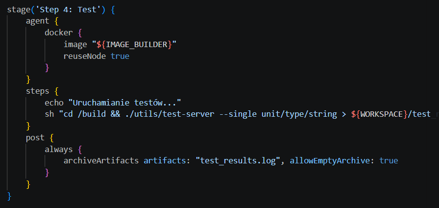
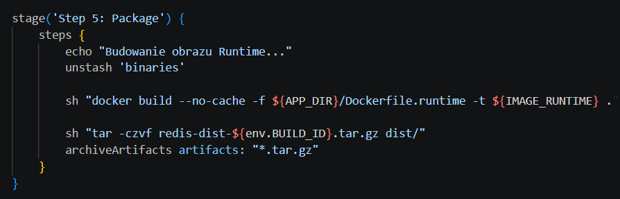
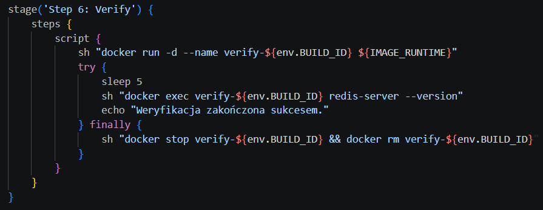
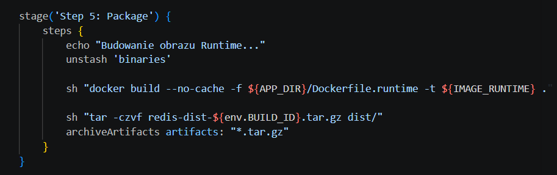

DevOps 7: CI/CD z Jenkins i Docker

### Kroki Jenkinsfile
Zweryfikuj, czy definicja pipeline'u obecna w repozytorium pokrywa ścieżkę krytyczną:

- [X] Przepis dostarczany z SCM, a nie wklejony w Jenkinsa lub sprawozdanie (co załatwia nam `clone` ):
Pipeline jest zdefiniowany jako kod, a Stage 1 wykonuje checkout z Git.

- [X] Posprzątaliśmy i wiemy, że odbyło się to skutecznie - mamy pewność, że pracujemy na najnowszym (a nie *cache'owanym* kodzie):
Użycie deleteDir() na samym początku gwarantuje czysty workspace

- [X] Etap `Build` dysponuje repozytorium i plikami `Dockerfile`:
Repozytorium jest klonowane w kroku 1, a w kroku 2 jest odwołanie do ${APP_DIR}/Dockerfile.build.
- [X] Etap `Build` tworzy obraz buildowy, np. `BLDR`:
Stage 2 buduje obraz przypisany do zmiennej IMAGE_BUILDER.

- [X] Etap `Build` (krok w tym etapie) lub oddzielny etap (o innej nazwie), przygotowuje artefakt - **jeżeli docelowy kontener ma być odmienny**, tj. nie wywodzimy `Deploy` z obrazu `BLDR`:
Stage 3 kompiluje kod wewnątrz kontenera builder i wyciąga binarki do folderu dist/ za pomocą stash.

- [X] Etap `Test` przeprowadza testy:
Stage 4 uruchamia testy jednostkowe Redisa (test-server) w środowisku buildera:

- [X] Etap `Deploy` przygotowuje **obraz lub artefakt** pod wdrożenie. W przypadku aplikacji pracującej jako kontener, powinien to być obraz z odpowiednim entrypointem. W przypadku buildu tworzącego artefakt niekoniecznie pracujący jako kontener (np. interaktywna aplikacja desktopowa), należy przesłać i uruchomić artefakt w środowisku docelowym.:
Stage 5 buduje IMAGE_RUNTIME na podstawie osobnego pliku Dockerfile.runtime.

- [X] Etap `Deploy` przeprowadza wdrożenie (start kontenera docelowego lub uruchomienie aplikacji na przeznaczonym do tego celu kontenerze sandboxowym):
Stage 6 (Verify) uruchamia kontener, sprawdza wersję i sprząta po sobie – klasyczny smoke test.

- [X] Etap `Publish` wysyła obraz docelowy do Rejestru i/lub dodaje artefakt do historii builda:
Wykonywane jest polecenie archiveArtifacts dla paczki .tar.gz
- [X] Ponowne uruchomienie naszego *pipeline'u* powinno zapewniać, że pracujemy na najnowszym (a nie *cache'owanym*) kodzie. Innymi słowy, *pipeline* musi zadziałać więcej niż jeden raz 😎
deleteDir() + docker build --no-cache gwarantują, że każdy build jest świeży

### *"Definition of done"*
Proces jest skuteczny, gdy "na końcu rurociągu" powstaje możliwy do wdrożenia artefakt (*deployable*).
* Czy opublikowany obraz może być pobrany z Rejestru i uruchomiony w Dockerze **bez modyfikacji** (acz potencjalnie z szeregiem wymaganych parametrów, jak obraz DIND)? Nie chcemy posyłać w świat czegoś, co działa tylko u nas!:  
Ten obraz zadziała na dowolnej maszynie, ponieważ Dockerfile.runtime zawiera nie tylko binarkę Redisa, ale też wszystkie niezbędne biblioteki systemowe, na których Redis polega. Jeśli Redis wewnątrz obrazu nasłuchuje na standardowym porcie, użytkownik końcowy musi jedynie wykonać docker run -p 6379:6379 nazwa_obrazu. Nie wymaga to specyficznych ustawień typu DinD. Stage 6 (Verify) udowadnia, że obraz jest kompletny. Komenda redis-server --version wykonuje się wewnątrz świeżo uruchomionego kontenera, co oznacza, że binarka znalazła wszystkie swoje zależności wewnątrz tego obrazu.
* Czy dołączony do jenkinsowego przejścia artefakt, gdy pobrany, ma szansę zadziałać **od razu** na maszynie o oczekiwanej konfiguracji docelowej?:  
Pobrany artefakt zadziała od razu, ale pod jednym  warunkiem: zgodności środowiska wykonawczego (Runtime) ze środowiskiem budowania (Builder). Jeśli builder to np. Ubuntu (korzystające z glibc), a ktoś spróbuje uruchomić te binarki bezpośrednio na maszynie z Alpine Linux (korzystającym z musl), Redis wyrzuci błąd: file not found lub segmentation fault.

Obraz jest w pełni deployable, ponieważ zawiera wszystkie niezbędne komponenty do uruchomienia Redisa. 