Instalacja zarządcy Ansible:

Ten sam system opracyjny, nazwa ansible-target:

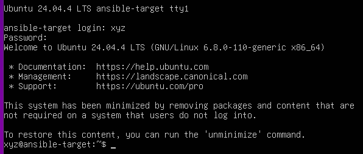

Zainstalowane tar, openssh, utowrzone hostname i nazwe użytkownika:

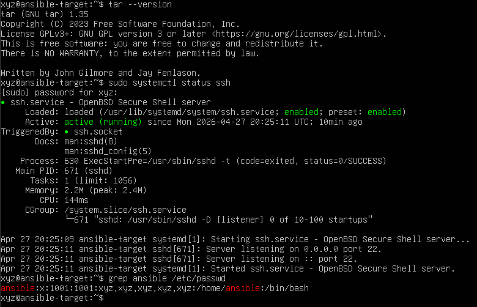

Łączenie z głównej maaszyny na ansible-target:

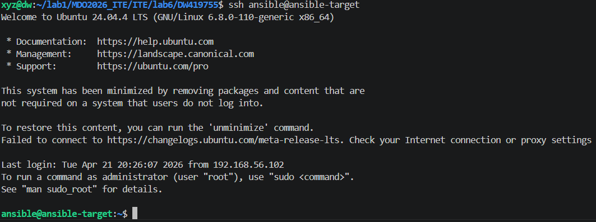

Inwentaryzacja:
Ustalenie nazwy komputerów:
Host:

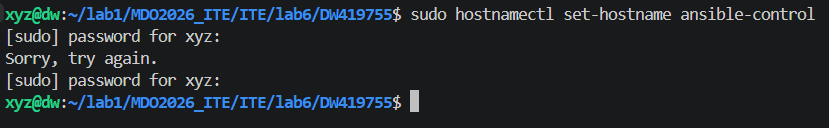

Docelowa:

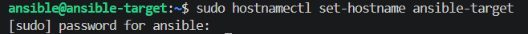

Weryfikacja łączności:

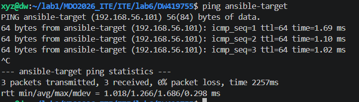

Plik inwentaryzacji:

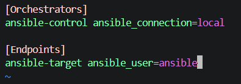

Zapytanie o ping:

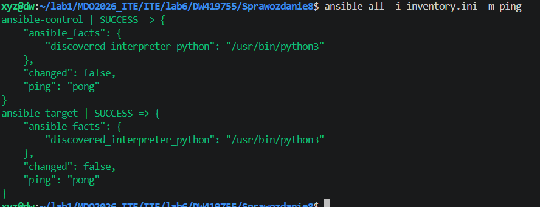

tasks.yaml:
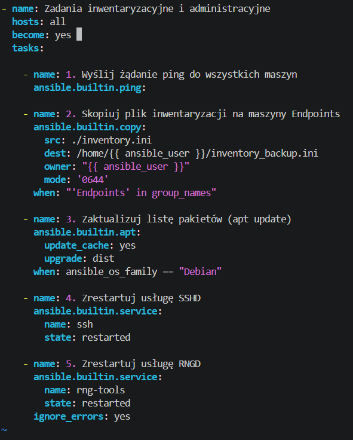

Uruchamianie aplikacji redis:
Dockerfile:
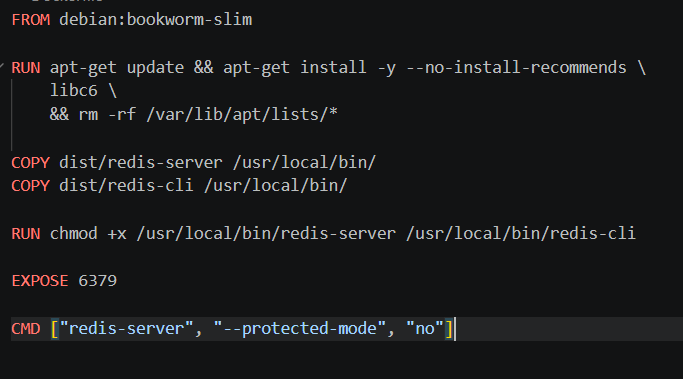
Werfyfikowanie czy działa:
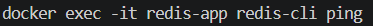

plik tasks.yaml:

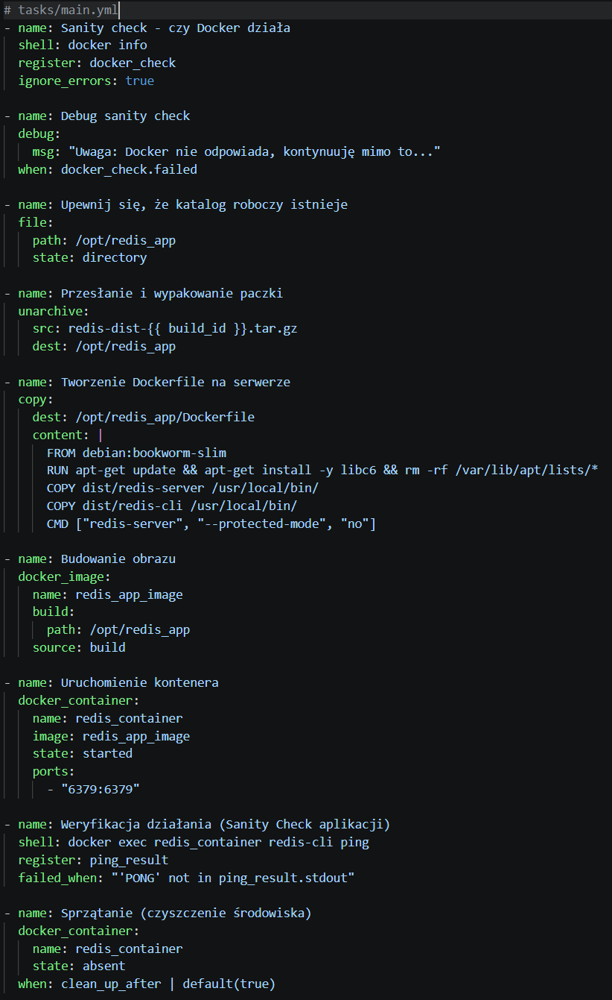

deploy.yaml:

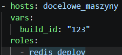

ansible-galaxy:

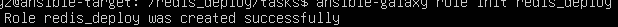