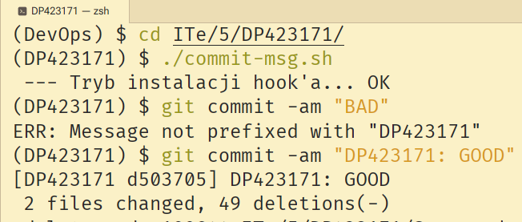

# Sprawozdanie 1

Sprawozdanie dla [ćwiczenia pierwszego][ex1].

## Cel ćwiczenia

Zapoznanie się z podstawami zarządzania repozytorium `git`. Wykorzystanie *hook*'ów
celem walidacji commit'ów.

## Sprzęt

Wykorzystano jednostkę fizyczną z zainstalowanym systemem Linux.

Z uwagi na to, że sprawozdanie jest publiczne, jako administrator
systemu wolę wstrzymać się od podawania dalszych szczegółów
(SECURITY BY OBSCURITY RULE).

Jestem skory podać więcej informacji prywatnie.

## Przebieg ćwiczenia

1. **Wstępne operacje przygotowywawcze (można to robić headless i GUI, ja w większości korzystałem z GUI pomijając polecenia `git`):**

    - Sprawdzenie konfiguracji konta GitHub zgodnie z założeniami: 2FA+SSH, token zbędny **bo repo jest publiczne**,
      zamiast tego sprywatyzowałem email aby wskazać możliwość.

    - Klon repo (działa bez logowania kluczem / publiczne repo???):
      ```console
      $ git clone 'https://github.com/InzynieriaOprogramowaniaAGH/MDO2026_ITE DevOps'
      ```
    
    - Utworzenie katalogu `ITe/5/DP423171`: `mkdir -p ITe/5/DP423171`.

    - Przejście do właściwego katalogu: `cd ITe/5/DP423171`.

    - Utworzenie skryptu wykonywalnego: `touch pre-commit.sh && chmod +x pre-commit.sh`.

    - Dodanie wyjścia dla repo dla push'a przez SSH:
      ```console
      $ git remote set-url --push origin 'git@github.com:InzynieriaOprogramowaniaAGH/MDO2026_ITE DevOps.git'.
      ```

2. **Napisano samo-instalujący[^1] skrypt hook'a (edytor [Zed] /
   obsługuje maszyny *headless* SSH, ale i pozwala pisać lokalnie dla GUI):**

<details><summary><code>commit-hook.sh</code></summary>

```sh
#!/bin/sh
ME="$(which "$0")"
MDIR="${ME%/*}"
PDIR="${ME%/*/*}"
USR=DP423171
HOOK_NAME="$(basename $0 .sh)"

if [ "$(basename "$MDIR")" == "hooks" ] && [ "$(basename "$PDIR")" == ".git" ] && [ "$(basename "$ME")" == "$HOOK_NAME" ]; then
    ### 1. Wywołanie logiki hook'a
    case $HOOK_NAME in
        ## Walidacja autora (opcjonalny kod, bo to całkiem przydatna rzecz na przyszłość)
        pre-commit)
            COMMITER="$(git var GIT_COMMITTER_IDENT | sed -n 's/^\(.*\) <.*> .*/\1/p')"
            if [ "$COMMITER" == "$USR" ]; then
                exit 0
            fi
            echo "ERR: Invalid commiter name \"$COMMITER\"!" >&2;
            exit 1
            ;;
        ## Walidacja wiadomości (część wymagana)
        commit-msg)
            COMMITMSG_PREFIX="$(head -n1 "$1" | cut -b-$(printf "$USR" | wc -c))"
            if [ "$COMMITMSG_PREFIX" == "$USR" ]; then
                exit 0
            fi
            echo "ERR: Message not prefixed with \"$USR\""
            exit 1
            ;;
    esac
else
    ### 2. Auto instalka skryptu z złej ścieżki
    printf " --- Tryb instalacji hook'a... "
    # INFO: instalujemy poszukując .git z katalogu skryptu w kolejnych krokach
    #       warunkiem zakończnenia jest '/'
    # FIXME: może startować z PWD? nasz use-case w sumie to hook w repo skryptu,
    #        ale standardowo skrypty tego typu używają PWD.
    SEARCH_PATH="$MDIR/"
    while [ -n "$SEARCH_PATH" ]; do
        # Krążenie po ścieżkach rodzicielskich
        SEARCH_PATH="${SEARCH_PATH%/*}"
        # Warunek poprawności przeszukiwania
        if [ -d "${SEARCH_PATH}/.git" ] && [ -d "${SEARCH_PATH}/.git/hooks" ]; then
            INSTALL="$SEARCH_PATH/.git/hooks/$HOOK_NAME"
            if [ -f "$INSTALL" ]; then
                # Bulletproof backup
                mv "$INSTALL" "$INSTALL.old"
            fi
            ln -s "$ME" "$INSTALL"
            chmod +x "$INSTALL"
            if [ ! -f "$INSTALL" ]; then
                echo "ERR: Nie zainstalowano"
                exit 1
            fi
            if [ ! -x "$INSTALL" ]; then
                echo "ERR: Hook to nie plik wykonywalny"
                exit 2
            fi
            echo "OK"
            exit 0
        fi
    done
    echo 'ERR: Nie znaleziono repozytorium .git' >&2
    exit 3
fi
```

</details>

3. **Wywołano ten skrypt celem instalacji hook'a w właściwym katalogu oraz sprawdzono jego
   funkcjonowanie w praktyce:**

<div align=center>



</div>

4. **Całość wrzucono na (dokładnie to!) repozytorium zgodnie z podaną strukturą katalogową i udokumentowano.**

[^1]: Samoinstalujący w tym kontekście, że wywołanie skryptu z nie tej ścieżki go
      instaluje: obecnie jest to na zasadzie krążenia po ścieżkach rodzicielskich
      względem położenia skryptu celem znalezienia przynależnego repozytorium git.

[ex1]: ../../../../READMEs/01-Class.md
