# Sprawozdanie 10

Sprawozdanie dla [ćwiczenia dziesiątego][ex10].

Cel ćwiczenia
-------------

Wdrożenie aplikacji w środowisku orkiestracji kontenerów Kubernetes:
instalacja klastra lokalnego (`minikube`), przygotowanie i analiza obrazu
kontenera nadającego się do pracy w klastrze, uruchomienie aplikacji w klastrze,
uruchomienie Dashboardu oraz przekucie ręcznego uruchomienia w deklaratywny plik YML
(*Deployment* + *Service*).

Sprzęt
------

Wykorzystano jednostkę fizyczną z zainstalowanym systemem Linux.

Przebieg ćwiczenia
------------------

### Instalacja klastra Kubernetes (minikube)

- Wybrano implementację: `minikube` (lokalny, lekki klaster dla celów laboratoryjnych).

- Instalacji dokonano przez menedżer pakietów z repozytorium, które gwarantuje przez
  podpis GPG kluczem zaufanym integralność i bezpieczeństwo instalacji (klucz zaufany
  jest z uwagi na to, że podpis dokonywany jest przez autora pakietu, który jest
  odpowiedzialny za jego wdrożenie w dystrybucję) w odróżnieniu do poleceń `curl`
  o ograniczonej walidacji.

  - Dodatkowo też zainstalowano narzędzia `kubectl` oraz `kompose`.

- Po instalacji uruchomiono klastrer (Docker Rootless):


> [!NOTE]
> W kwestii wymagań z uwagi na zastosowanie połączenia `containerd` i Docker'a
> dla [konfiguracji klastra zgodnej z Arch Wiki][archwiki], udało się ominąć
> właściwie wymagania dla instalacji klastra, jako że domyślnie `minicube start`
> jest stworzona dla klasycznej konfiguracji Dockera. Warto zaznaczyć, że
> w trybie rootless ograniczony jest wpływ kontenerów na system hosta.

- Dokonano pierwszego otwarcia Dashboard'u poleceniem `minicube dashboard`:

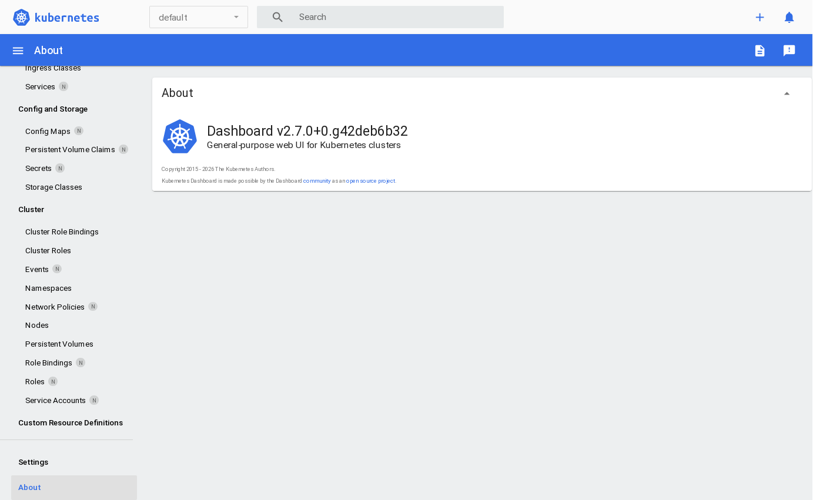

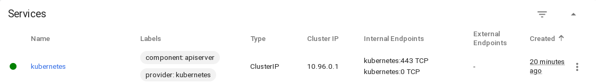

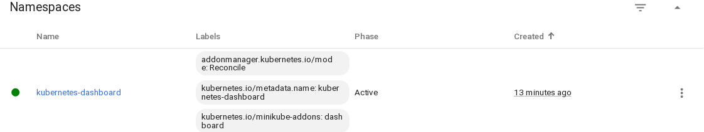

### Analiza posiadanego kontenera

- Jako że mój projekt / kontener nie nadaje się jako aplikacja sieciowa,
  zastosowałem implementację prostej aplikacji *speedtest* wychodząc z
  gotowego obrazu Dockera ale implementując własny `compose.yml` z zmianą
  konfiguracji:

```yml
services:
  speedtest:
    container_name: speedtest
    image: ghcr.io/librespeed/speedtest:latest
    restart: always
    environment:
      MODE: standalone
      TITLE: "Speedtest AGH"
      TAGLINE: "...w oparciu o LibreSpeed"
      USE_NEW_DESIGN: true
    ports:
      - "8880:8080"
```

- Konfigurację `docker compose` sprawdzono:


https://github.com/user-attachments/assets/4bbddd80-ef6d-471e-a08b-d85fdc5bb8bc

### Uruchamianie oprogramowania w minikube

1. Skonwertowano konfigurację `compose` narzędziem `kompose`:
  załatwia to potrzebę ręcznego wdrażania obrazu od początku
  i skutkuje zasobami [`deployment.yaml`] i [`service.yaml`].

```console
$ kompose -f path/to/compose.yml convert
```

2. Wdrożenie przez dashboard graficznie plików wynikowych `kompose`.

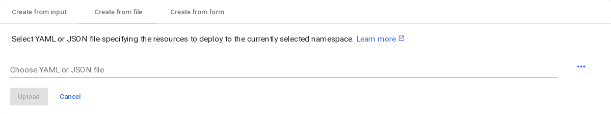

- Sprawdzenie `kubectl`:

```console
$ kubectl get pods
NAME                        READY   STATUS    RESTARTS   AGE
speedtest-ff655c8cd-cgzl9   1/1     Running   0          5m
```

- Sprawdzenie dashboard'u:

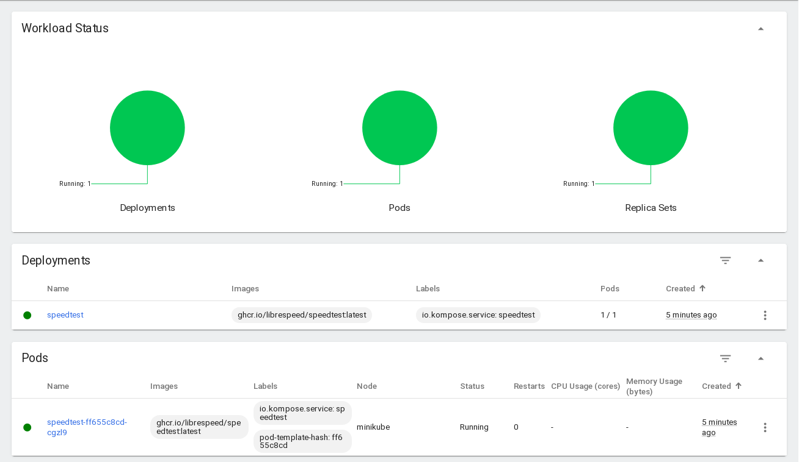

- Wyprowadzenie portu (port-forward):


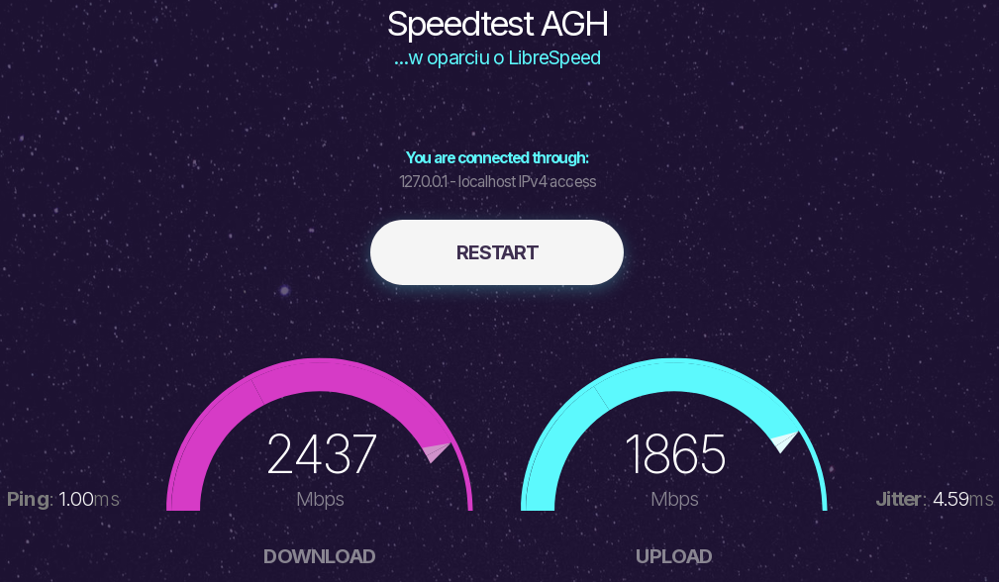

### Rozszerzenie zakresu działania o usługę, więcej replik i wdrożenie

`kompose` pozwolił na już wygenerowanie gotowej konfiguracji dla usługi
i wdrożenia:

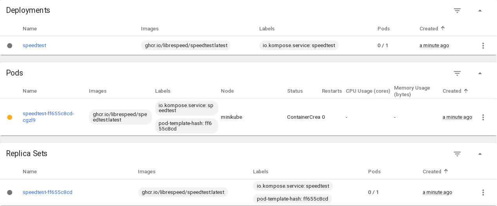


Dodanie zasobów przez Dashboard (przesłanie zasobów), a także aktualizacja
konfiguracji, wywołuje właściwie `kubectl apply`:

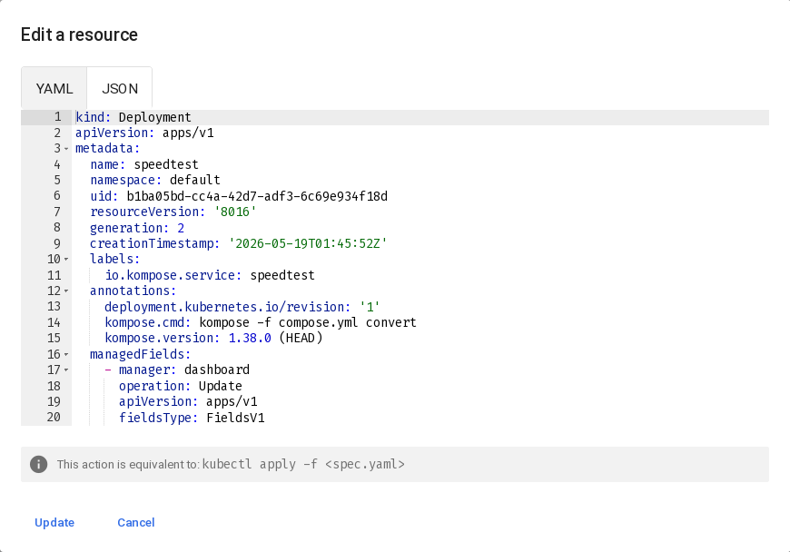

Dla rozszerzenia implementacji o dodatkowe kroki, wystarczy dokonać
eksportu portów dla usługi zamiast *pod*'a:


…i powiększyć replset do 5 przez przeskalowanie wdrożenia (z poziomu Dashboard):

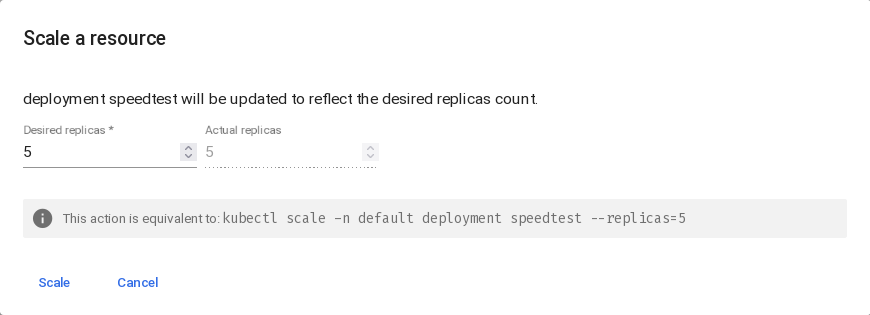

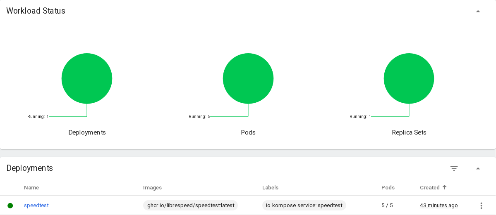

Dalsze uwagi
------------

- Obejście ograniczeń sprzętowych: Docker Rootless wraz z
  `minicube` pozwolił na obejście wszelkich ograniczeń
  instalacyjnych, w przeciwieństwie do klasycznej konfiguracji
  dla Dockera system nie był rygorystycznie sprawdzany, co
  pozwoliło na bezproblemowe działanie z `minicube`.

- Walidacja instalacji: instalację zwalidowano, sprawdzając
  stan `minicube` oraz testując działanie `dashboard`. Jest
  to opisane w odpowiedniej sekcji.

- Bezpieczeństwo instalacji: zadbano o instalację z bezpiecznego
  i kryptograficznie walidowalnego źródła, dodatkowo klaster
  skonfigurowano dla Docker'a w trybie rootless, także kontenery
  fizycznie nie mogą mieć dostępu do operacji wymagających uprawnień
  root.

- Przy skalowaniu próbowałem też początkowo przeskalować podset:
  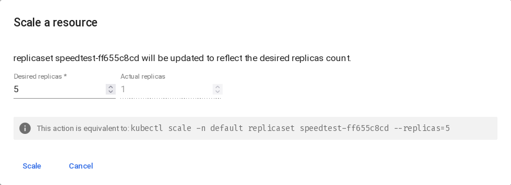 <br>
  Zauważyłem, że z uwagi na konfigurację wdrożenia, pula pod'ów
  właściwie nie uległa zmianie, a operacja nie miała wpływu na liczbę
  oczekiwanych pod'ów.

- Sieć działa, mimo ostrzeżeń w konfiguracji: zwalidowano to zarówno
  przez polecenie [z wiki][archwiki], a wszelkie połączenia w dalszej
  części działają bez potrzeby całkowitego umożliwienia na *packet forwarding*
  (nie widać dla tej częsci działań z Kubernetes problemów z taką
   konfiguracją – a konfiguracja bez pełnego przenoszenia pakietów jest
   też bezpieczniejsza).

Wnioski
-------

- Konwersja konfiguracji z `docker-compose` przy pomocy `kompose` znacząco
  przyspieszyła przeniesienie aplikacji do Kubernetesa i pozwoliła na
  szybsze konfiguracji aplikacji zarówno pod Docker Compose, jak i Kubernetes
  przy zachowaniu zgodnej konfiguracji między tymi różnymi technologiami.

- Uruchomienie klastra w trybie Docker Rootless okazało się praktycznym
  obejściem ograniczeń instalacyjnych i umocnieniem bezpieczeństwa na
  maszynie laboratoryjnej; należy jednak pamiętać, że tryb rootless może
  ograniczać możliwości (np. dla tego zadania najbardziej widocznym mogą
  być porty, które nie mogą być w zakresie zarezerwowanych dla systemu).

- Zarządzanie kontenerami na zasadzie klastra znacząco ułatwia na replikowanie
  usług i ich elastyczne wdrażanie. Może być to przydatne chociażby dla systemów
  budowy, gdzie tworzenie kontenerów tymczasowych dla danego cyklu i ich usuwanie
  jest zjawiskiem pożądanym, prostszym i nawet bezpieczenjszym (gwarantując czysty
  stan dla każdej operacji) niż czyszczenie ekosystemu maszyny czy konteneru przy
  każdej nowej operacji. Klaster ułatwia też ujednolicenie konfiguracji i kontrolę
  stanu każdego z kontentrów.

Lista kontrolna
---------------

- [X] Zainstalowano `minikube` i `kubectl`.
- [X] Dodatkowo: zainstalowano `kompose` dla generowania konfiguracji (a ściślej: zasobów) dla Kubernetes.
- [X] Uruchomiono klaster `minikube` i potwierdzono działanie (`minikube status`, `kubectl get nodes`).
- [X] Przygotowano obraz kontenera, który pracuje i z którym można połączyć się przez sieć.
- [X] Załadowano konfigurację wdrożenia i usługi, wychodząc z gotowym podem, usługą i wdrożeniem.
- [X] Uruchomiono pod lub deployment w klastrze i potwierdzono działanie (get pods / graficznie).
- [X] Uruchomiono Dashboard i przedstawiono łączność.
- [X] Dostarczono [`deployment.yaml`] i [`service.yaml`] z sprawozdaniem i wykonano `kubectl apply`.

[ex10]: ../../../../READMEs/10-Class.md
[archwiki]: https://wiki.archlinux.org/title/Minikube#Rootless_Docker
[`deployment`]: kubernetes/deployment.yaml
[`service`]: kubernetes/service.yaml
