Sprawozdanie 11
===============

Sprawozdanie dla [ćwiczenia jedynastego][ex11].

Cel ćwiczenia
-------------

Doskonalenie technologii Kubernetes przez różne
możliwości skalowania, wdrażania, kontroli wdrażania
i przywracania stanu.

Przebieg ćwiczenia
------------------

### Wstęp

1. Dobór obrazów: kontynuacja `speedtest`, tym razem jednak (tagi):
   - dla nowszej wersji: `6.1.0`
   - dla starszej wersji: `6.0.2`
    - dla *uszkodzonego* obrazu: `broken`

2. Utworzenie obrazu uszkodzonego:

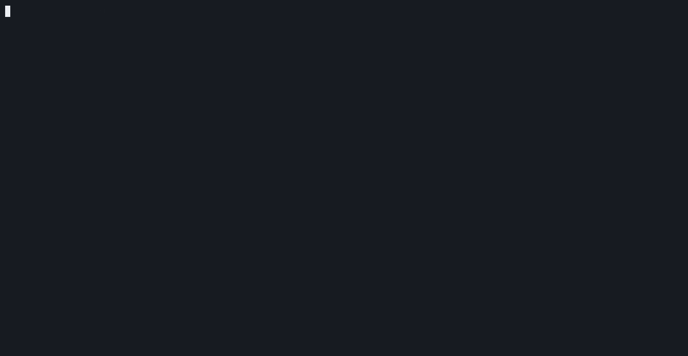

### Skalowanie

Przeprowadzenie różnych wariantów konfiguracji zestawu podów
w wdrożeniu, w kolejności zgodnie z instrukcją ćwieczenia (animacja
wykonana z zrzutów):

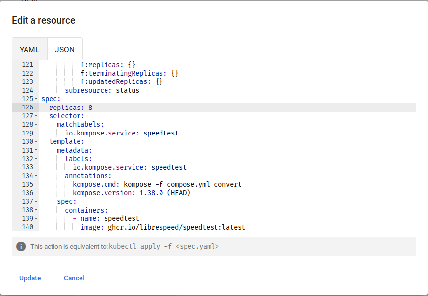

Rezultaty:

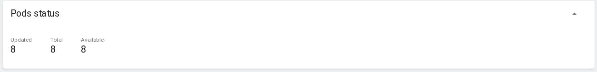
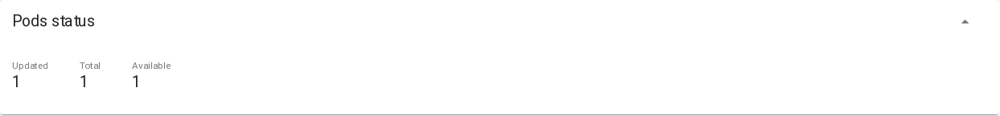
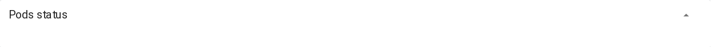

Końcowy rescalling do czterech:

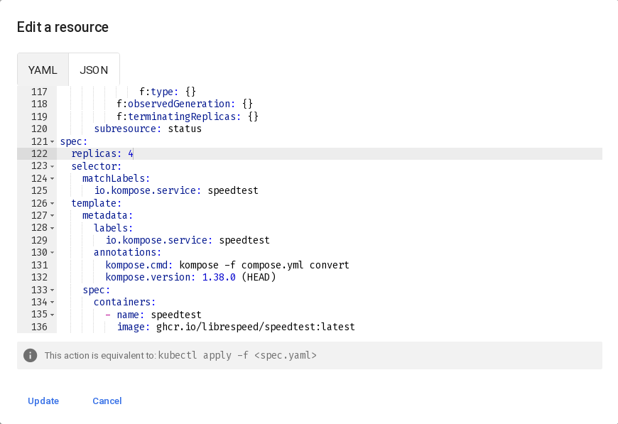

### Zmiany wariantów obrazu:


Po edycji:

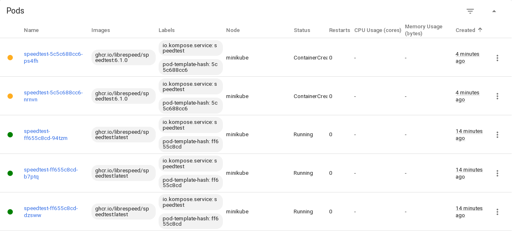

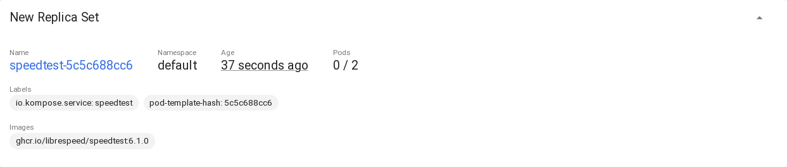

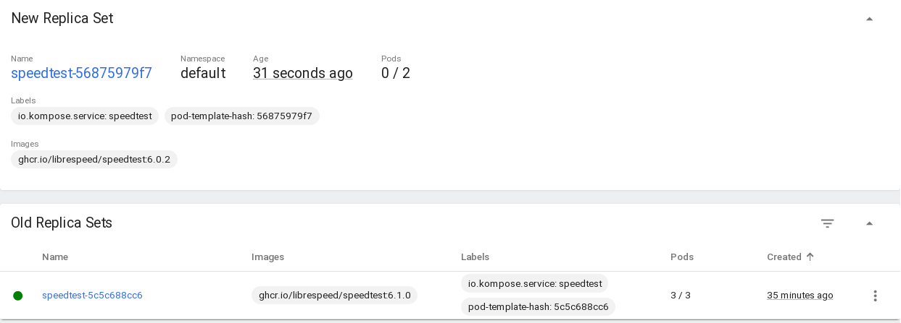

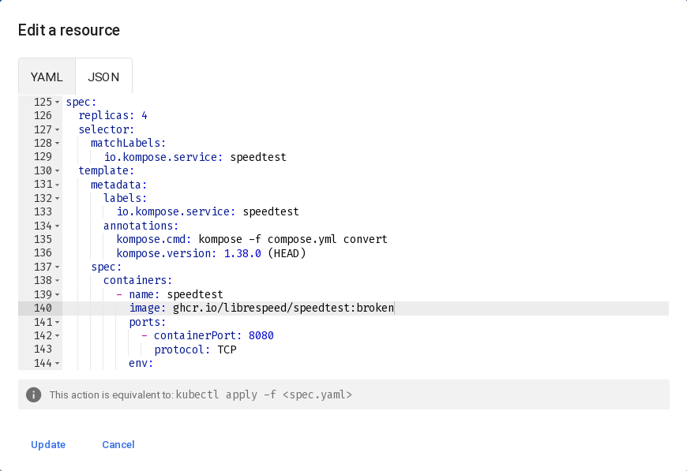


Prócz poputych obrazów, utworzenie nowych zestawów
podów powiodło się i dla starych obrazów, i dla nowych.

### Kontrola wdrożenia

Definicja skryptu:

```sh
#!/usr/bin/env sh
NAMESPACE="${1:-default}"
DEPLOYMENT="${2:-speedtest}"
TIMEOUT_SECONDS=60

echo " --- Namespace: ${NAMESPACE}"
echo " --- Deployment: ${DEPLOYMENT}"

printf " --- Rollout history: "
kubectl rollout history deployment.apps/${DEPLOYMENT} -n ${NAMESPACE} || true

printf " --- Current rollout status..."
if STATUS="$(kubectl rollout status deployment.apps/${DEPLOYMENT} -n ${NAMESPACE} --timeout=${TIMEOUT_SECONDS}s)"
then
    echo " OK!"
else
    echo " $STATUS"
    echo " --- Deployment details:"
    kubectl describe deployment.apps/${DEPLOYMENT} -n ${NAMESPACE} || true
    echo " --- Pods:"
    kubectl get pods -n ${NAMESPACE} -o wide || true
    echo " --- Recent events:"
    kubectl get events -n ${NAMESPACE} \
        --sort-by=.metadata.creationTimestamp \
        | tail -20
    exit 1
fi
echo " --- Done!"
```

Działanie skryptu w praktyce:


Skrypt pozwolił na badanie błędu przy wdrażaniu podów,
tu akurat przypadek był związany z błędami w pullingu
dla nieistniejących obrazów. Ciekawym zachowaniem jest
też to, że w przypadku ów błędu zmiana nie została
wdrożona na wszystkie pody, a jedynie na jeden: pozwoliła
na to strategia Rolling Update, opisana dalej.

Pozwoliło to znaleźć błąd w konfiguracji i poprawić
politykę zaciągania na `IfNotPresent`:

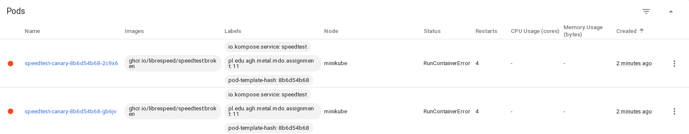

Jak widać, teraz mamy błąd taki, jaki chcieliśmy mieć,
domykając nieścisłośći w realizacji też poprzedniej części
zadania: kontener się psuje kontrolowanie, nie niekontrolowanie 😄️.

### Strategie aktualizacji zestawów:

#### Recreate


Po aktualizacji konfiguracji:

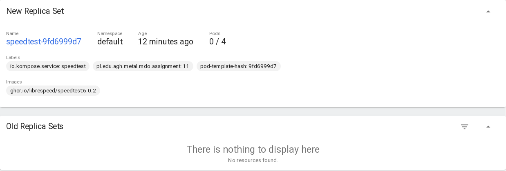

Jak widać, strategia tworzy "od nowa" zestaw podów,
a stary zestaw przy tej operacji nie działa w tle.

#### Rolling Update

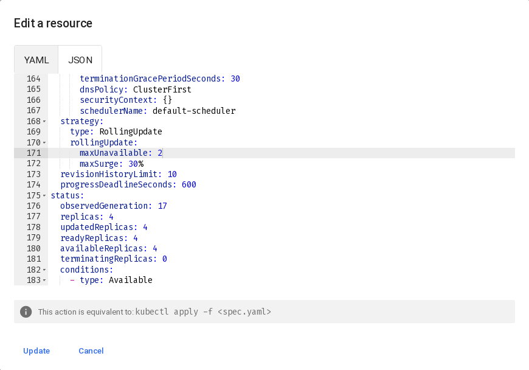

Po aktualizacji:

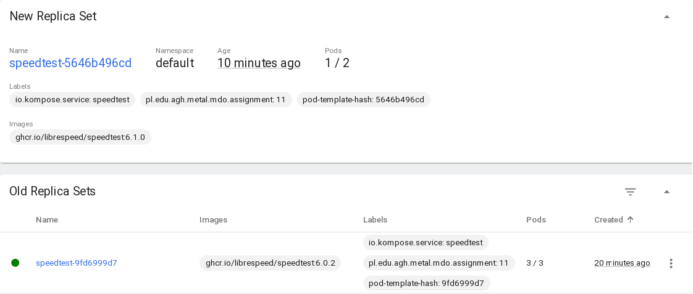

Strategia ta ogranicza wdrażanie obrazów z tym, że
dla obecnej konfiguracji, może być co najwyżej 2 podów
niedostępnych podczas rollout'u, a chwilowo też utworzone
być 30% nowych replik ponad liczbę docelową.

#### Canary Deployment Workflow

Nie jest to ściśle mówiąc zasada definiowana przez konfigurację,
a praktyka wykorzystująca 2 deploymenty, złączone usługą, celem
podziału wdrożeń na produkcyjne i testowe, przez stosowanie
etykiet:

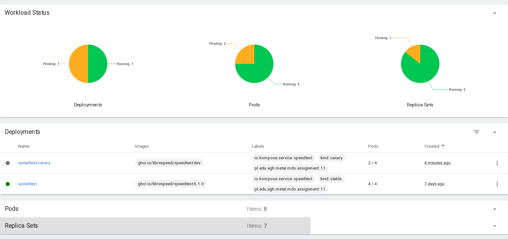

Miejsca edycji etykiet (deployment oraz dodatkowo w podsetach):

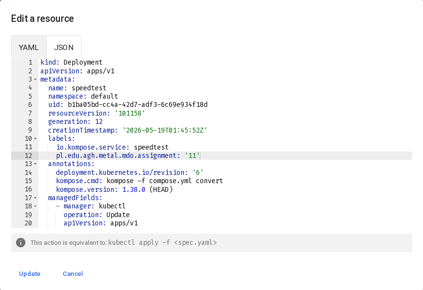
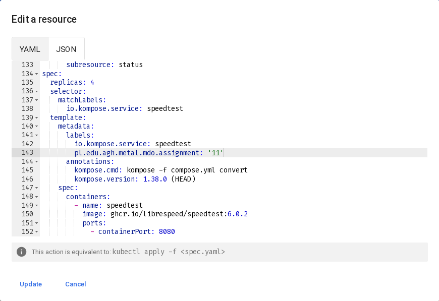

Finalny dashboard:

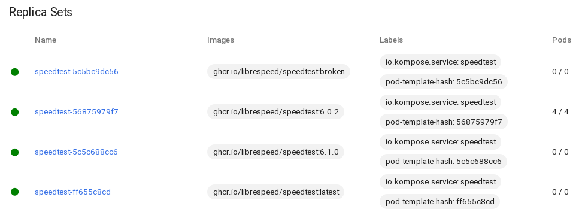

Wdrożenia są powielone usługą:

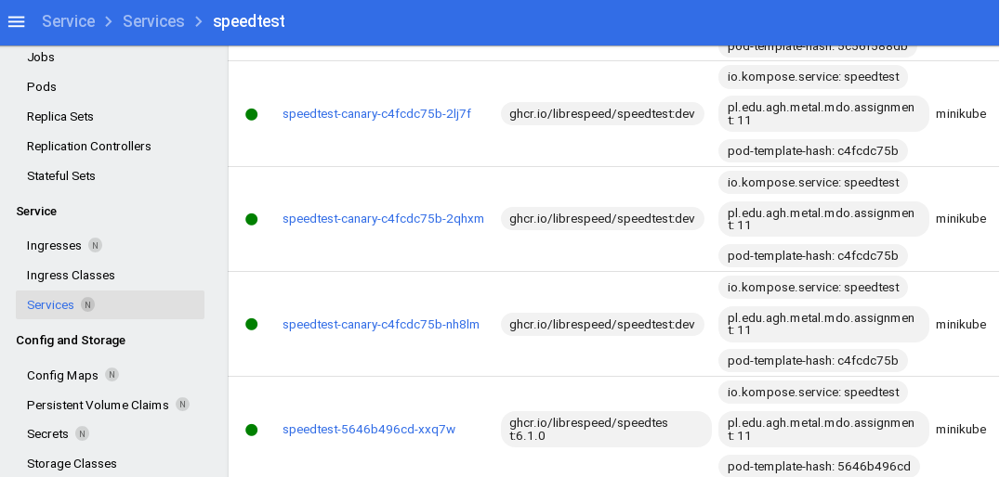

…zgodnie z założeniami ćwiczenia.

[ex11]: ../../../../READMEs/11-Class.md
