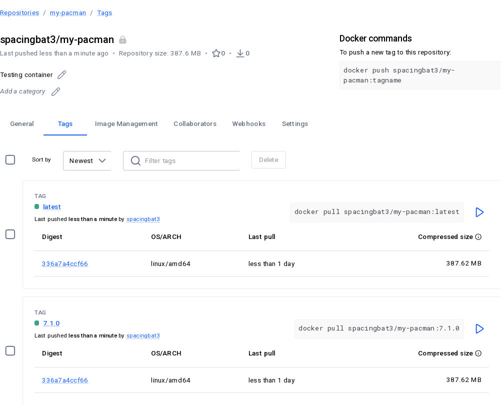
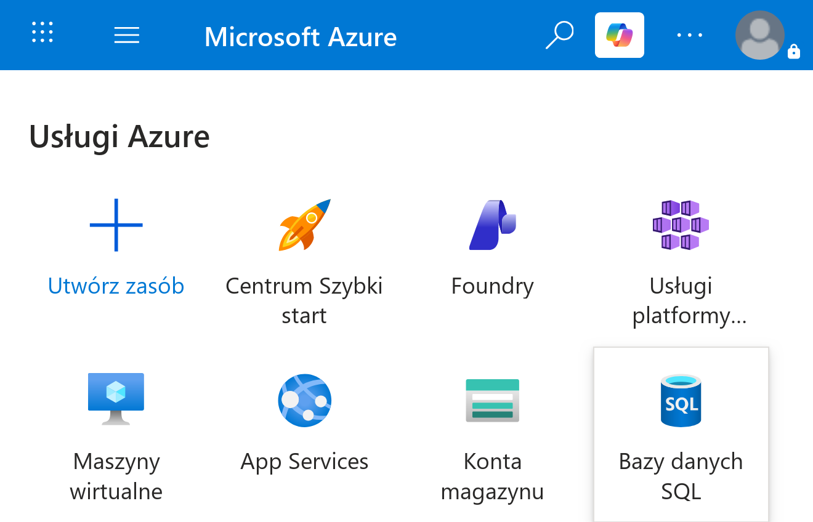
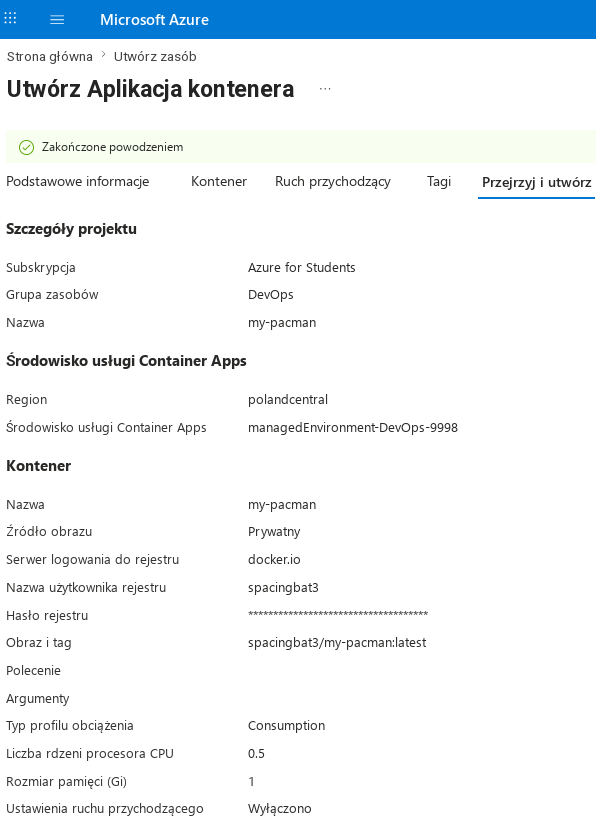
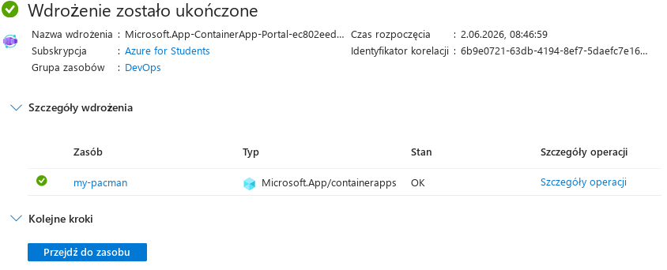
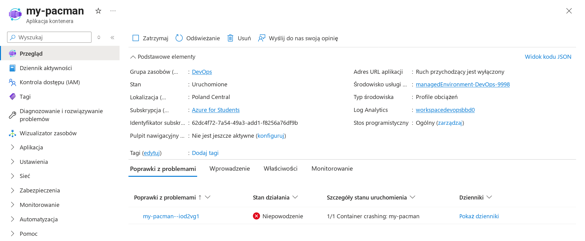
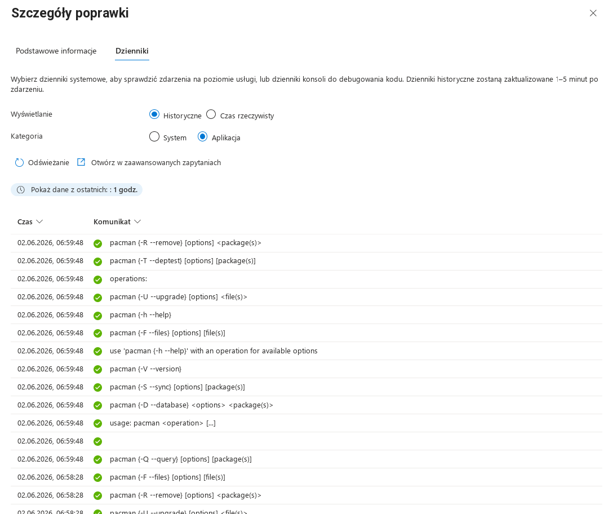

Sprawozdanie 11
===============

Sprawozdanie dla [ćwiczenia dwunastego][ex12].

Cel ćwiczenia
-------------

Wdrożenie kontenera na platformę Azure.

Przebieg ćwiczenia
------------------

> [!NOTE]
> Wdrożony kontener jest aplikacją typu *one-shot* i nadaje
> się głównie do operacji w CLI! Jednakże mimo stanu *crashed* na Azure
> wynikającego z natury aplikacji, da się potwierdzić że aplikacja
> została uruchomiona poprawnie – domyślnie wyświetlony zostanie help/usage
> dla aplikacji, i to będzie widoczne w logach dla poprawnego wdrożenia.

Zadanie zrealizowano graficznie w następujących krokach:

1. Wdrożenie obrazu na **prywatny** Docker Hub.

2. Utworzenie nowego zasobu i wybór *aplikacji kontenerowej*:

3. Na tym etapie można zobaczyć, że wdrożenie się powiodło:

…i mimo oznaczenia kontenera jako *crashed*:

…to z uwagi na naturę *oneshot* uruchomienie było prawidłowe,
co widać po logach, które zachowują się tak, jak jest to oczekiwane:

To samo, ale robiąc w CLI (nie przez panel):

