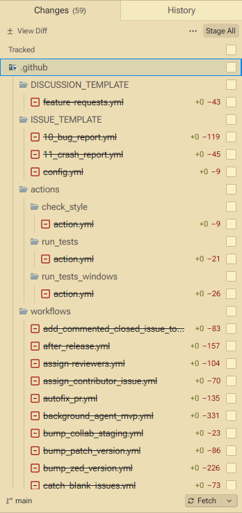
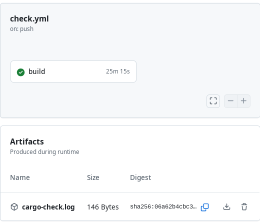

Sprawozdanie 13
===============

Sprawozdanie dla [ćwiczenia trzynastego][ex13].

Cel ćwiczenia
-------------

GitHub Actions jako środowisko CI/CD

Przebieg ćwiczenia
------------------

### 1. Fork [`zed-industries/zed`] i usunięcie `.github`.

…w tym usunięte jest też `workflows`, ale mój fork też nie potrzebował
innych plików, tak więc je również usunąłem, skoro są zbędne i prawidłowe
właściwie tylko w kontekście [`zed-industries/zed`]:



### 2. Utworzenie na nowo workflow `check.yml`:

```yaml
name: Compiler insights
on:
  push:
    branches:
      - ino_dev
      - master
env:
  CARGO_TERM_COLOR: always
permissions:
    contents: read
jobs:
  build:
    runs-on: windows-11-arm
    steps:
    - name: Set Git identity
      run: |
        git config --global user.name  "github-actions[bot]"
        git config --global user.email "41898282+github-actions[bot]@users.noreply.github.com"
    - name: Checkout
      uses: actions/checkout@v6
    - name: Enable long paths
      run: |
        git config --system core.longpaths true
        New-ItemProperty -Path "HKLM:\SYSTEM\CurrentControlSet\Control\FileSystem" -Name "LongPathsEnabled" -Value 1 -PropertyType DWORD -Force
    - name: Check
      run: cargo check > cargo-check.log
    - name: Upload a check logs
      if: always()
      uses: actions/upload-artifact@v7.0.1
      with:
        name: cargo-check.log
        path: cargo-check.log
        compression-level: 9
```

Tu krokiem nadmiarowym może być ustalenie tożsamości Git, choć
jest to przydarne dla późniejszej rozbudowy, np. o patchowanie
repozytorium i budowy pod patchami (gdzie może być uzasadnionym
wdrażanie patchy jako commitów na branch).

Plik ten skomitowano jako `.github/workflows/check.yml` na prywatne
repozytorium forka oraz na branch (*Nazwa taka jak w instrukcji!*)
`ino_dev`.

### 3. Push jako nowe prywatne repo (narzędzie `gh`)

Wykorzystałem `gh`, jako że sam `git` nie pozwala na zarządzanie
GitHub'em i pushowaniem forków bez utworzenia repozytorium, z `gh`
mogę to swobodnie zrobić, choć może być wymagana konfiguracja repo
dla włączenia CI/CD i/lub zmiany uprawnień, z uwagi na to że ostatnio
GitHub stosunkowo często zmienia domyślne zachowania dla GitHub Actions
celem ograniczenia niebezpieczeńśtw na linii (*ciągu*) produkcyjnej
oprogramowania:


Gdyby wynagane było wywołanie wydarzenia `push` jeszcze raz, a nie chcemy
zmieniać historii `git`, można wykorzystać `git commit --amend && git push -f`
dla czystego stanu repozytorium i braku zmian (mając na uwadzę, że `git push -f`
jest dozwolony dla danej polityki projektu – w naszym przypadku prywatne repozytorium
jest zarządzane przez jedną osobę, `git push -f` nie spowoduje więc problemu dla
innych lokalnych repozytoriów, jako że innych być nie powinno).

### 4. Interpretacja wyników pipeline:

Końcowo `check.yml` sprawdzające `cargo check` dla repozytorium [`zed-industries/zed`]
przebiegło pozytywnie:



## Wnioski i uwagi końcowe

Końcowo mam nadzieję, że udało się przedstawić możliwości GitHub Actions
w kwestii rozwiązania CI/CD – dla przypadku code quality check, jako że `zed` sam w sobie
buduje się długo, sam `check` zajął tak naprawdę 30m+ czasu.

Osobiście jestem bardzo aktywnym użytkownikiem GitHub Actions i dla uzupełnienia sprawozdania
o praktyczne wykorzystanie GitHub Actions polecam zapoznanie się z projektami takimi jak
`SpacingBat3/ReForged` czy `SpacingBat3/YAVL` – choć nie jest to wymogiem ćwiczenia, tu
implementacje workflow były rozszerzone o aspekty takie jak deployment dokumentacji na GitHub
Pages, testy czy budowę dla wielu platform / wersji.

Warto zauważyć, że wymogiem ćwiczeń nie było publikacji forku: dodatkowo to utrudniło
pewne aspekty i wymagało nadania odpowiednich uprawnień dla odczytu prywatnych repozytorów
(co widać w załączonym kodzie *inline* dla workflow'u).

[ex12]: ../../../../READMEs/12-Class.md
[`zed-industries/zed`]: /zed-industries/zed "Innowacyjny edytor kodu od twórców Atoma i tree-sitter'a napisany w Rust"
