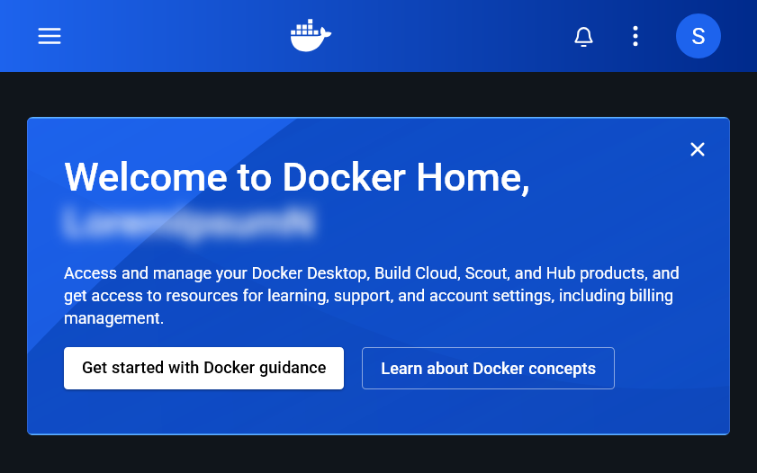

# Sprawozdanie 2

## Cel

Zapoznanie się z środowiskiem konteneryzacji Docker.

## Przebieg:

### Setup Docker'a na ArchLinux

1. Instalacja docker'a z repozytorium:


2. Konfiguracja usługi i użytkownika, zgodnie z ArchWiki (oraz zwróconymi instrukcjami w trakcie instalacji).

3. Podążając za ArchWiki, utworzenie contekstu dla Docker rootless:


### Rejestracja w DockerHub



### Zaciąganie obrazów


Jak widać, obrazy od Microsoft nie są połozone globalnie w repozytorium,
a lokalnie względem właściciela:


### Uruchamianie / testowanie obrazów


### Korzystanie interaktywne z obrazów


W trakcie działania obrazu, w kolejnej sesji terminala:


### Korzystanie z dystrybucji Linux w ramach Docker:


### Tworzenie i wykorzystanie własnego DockerFile:

W oparciu o `DockerFile`:

```DockerFile
# ArchLinux my beloved <3
FROM archlinux:latest

# Najlepsze combo: update + install
RUN pacman -Syu --noconfirm git

RUN git clone https://github.com/InzynieriaOprogramowaniaAGH/MDO2026_ITE /repo

# katalog roboczy
WORKDIR /repo

# domyślna powłoka
CMD ["bash"]
```

Zbudowano i sprawdzono obraz:


### Sprzątanie / czyszczenie środowiska Docker

Sprawdzenie kontenerów:


Podejście w czyszczeniu:


To nie usunie wszystkich obrazów, tak więc:


## Wnioski

Docker to potężne narzędzie do konteneryzacji aplikacji, które umożliwia łatwe zarządzanie i izolację środowisk. W trakcie laboratorium zapoznano się z podstawowymi funkcjonalnościami platformy Docker, od instalacji po tworzenie własnych obrazów.

Docker sam w sobie pozwala na szereg złożonych operacji, mających sens dla osiągnięcia konteneryzacji:

1. **Instalacja i konfiguracja** - Docker na ArchLinux wymaga odpowiedniej konfiguracji usługi oraz użytkownika. Tryb rootless zwiększa bezpieczeństwo systemu.

2. **Organizacja obrazów** - Obrazy w DockerHub mogą być przechowywane globalnie lub w przestrzeniach nazw należących do konkretnych organizacji (np. Microsoft), co wpływa na sposób ich pobierania.

3. **Elastyczność środowisk** - Docker umożliwia łatwe uruchamianie różnych dystrybucji Linux (np. Fedora) oraz środowisk deweloperskich bez konieczności instalowania ich bezpośrednio na systemie hosta.

4. **DockerFile** - Tworzenie własnych obrazów za pomocą plików DockerFile jest intuicyjne i pozwala na automatyzację procesu budowania środowisk. Możliwość definiowania katalogu roboczego oraz domyślnych poleceń ułatwia późniejsze korzystanie z obrazu.

5. **Zarządzanie zasobami** - Regularne czyszczenie nieużywanych kontenerów i obrazów jest istotne dla utrzymania porządku i oszczędności przestrzeni dyskowej. Docker dostarcza odpowiednie komendy do zarządzania cyklem życia kontenerów.

Docker znacząco usprawnia proces tworzenia, testowania i wdrażania aplikacji, zapewniając spójne środowiska niezależnie od systemu operacyjnego hosta. Idąc z memem: *if it works just on your machine, send your machine*.
