# Sprawozdanie 5

Sprawozdanie dla ćwiczenia piątego.

## Cel ćwiczenia

<!-- WIP --->

## Sprzęt

Wykorzystano jednostkę fizyczną z zainstalowanym systemem Linux.

## Przebieg ćwiczenia

### Przygotowanie do pracy:

1. Dokonano instalacji Jenkins'a:

  - Instalacja się właściwie nie zmienia w stosunku do tego,
    co już konfigurowałem na ostatnich zajęciach.
  
  - Jenkins dodatkowo bazuje na własnym [`Dockerfile`],
    zgodnie z domyślnym cyklem instalacyjnym i założeniami
    zadania. Sprawia to, że dostępny staje się dodatek /
    interfejs `blueocean` (zrzut też przedstawia wizualnie
    różnicę, widać że `blueocean` to odrębna nakładka
    sterująca Jenkins'em):
  
  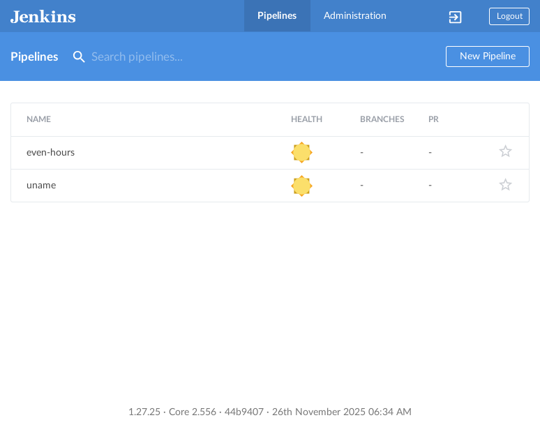
    
  - Dodatkowo zadbano o założenie własnego konta administratorskiego.
    Proces ten jest poufny, tak więc nie pokażę jego przebiegu,
    aby wskazać dobrą praktykę produkcyjną (przypominam, że
    repozytorium jest publicznie dostępne, także taka praktyka
    jest nawet wskazana).
  
  - Zadbano również o retencję (archiwizację) logów i ustawienie
    jasnej polityki dostępu do treści (też logów). Dla dobrej praktyki
    bezpieczeństwa, bluruję nazwę administratora (dobrą praktyką jest
    nieznajomość loginu adminów):
  
  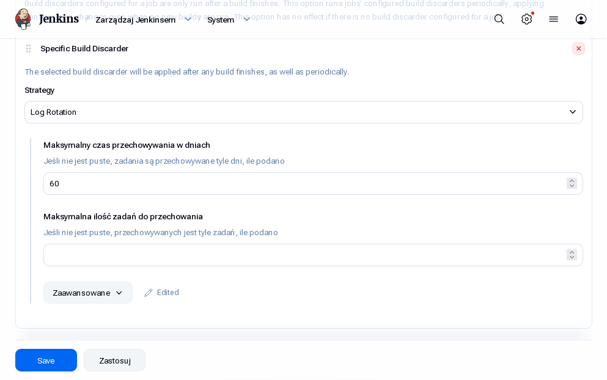
  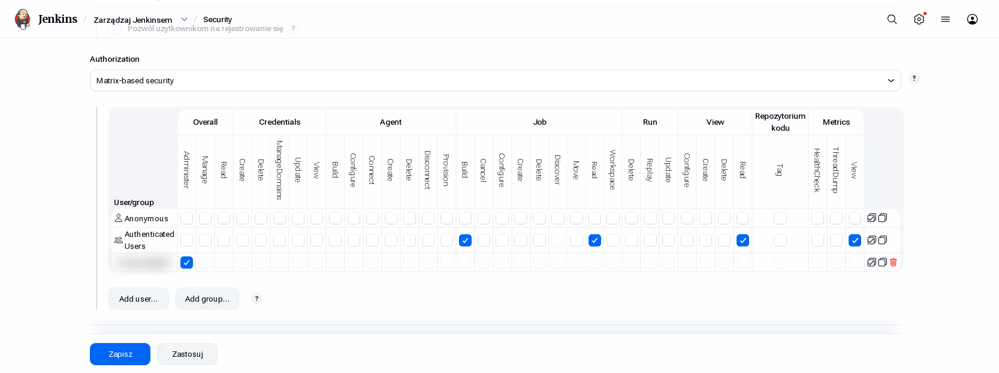
  
### Pierwszy projekt: `uname`:

Tworzę nowy projekt z tablicy głównej w Jenkinsie…

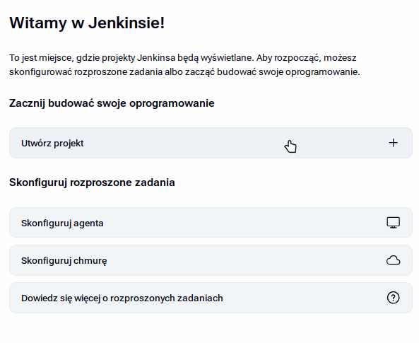

…o charakterze ogólnym:

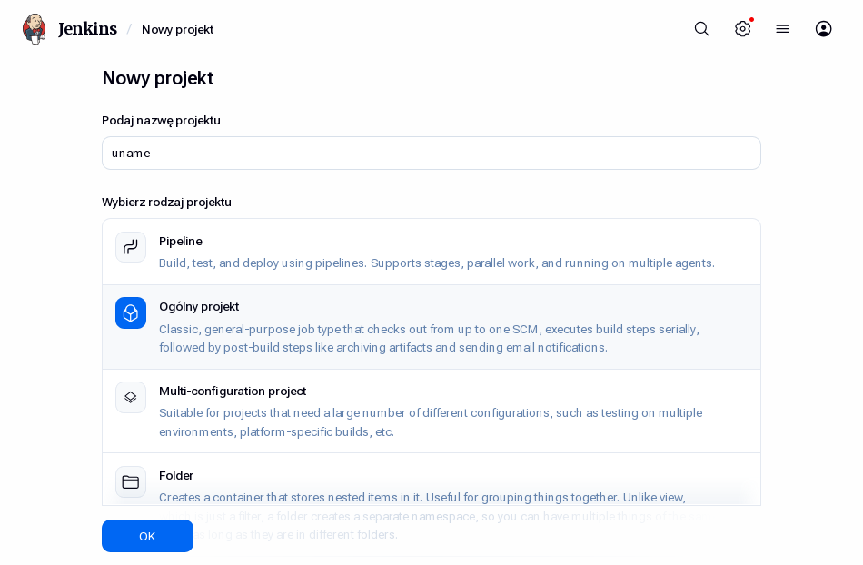

Proces budowy definiuję przez skrypt (jedyne ustawienie prócz nazwy):

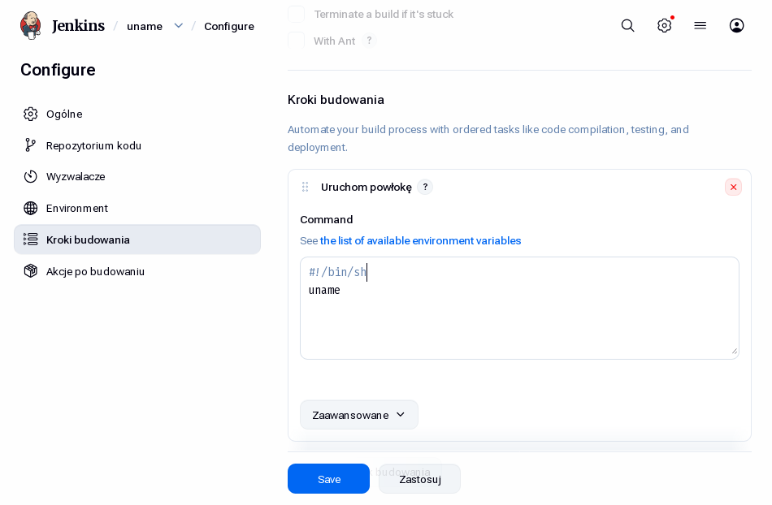

Pozostało uruchomić…

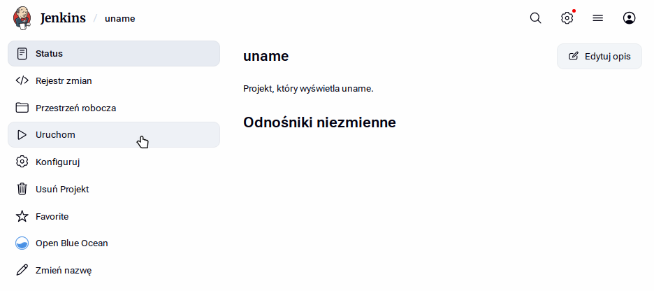

…i efektem tego (czas w UTC+00, więc -2h od czasu polskiego):

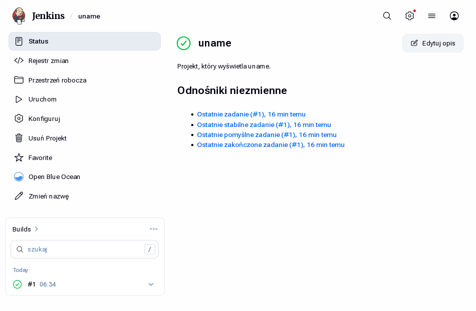

Wynik w konsoli (polecenie `uname`):

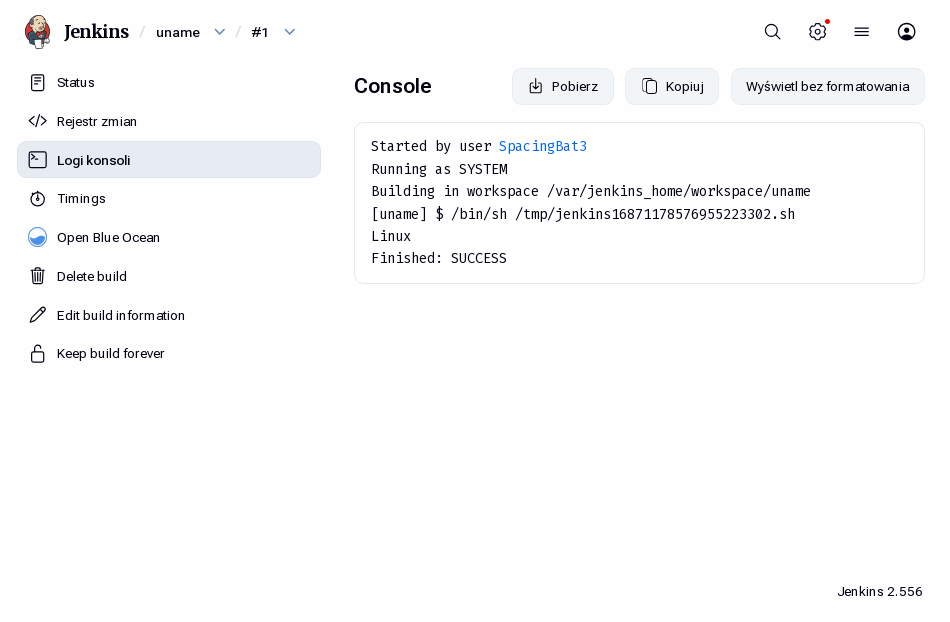

### Drugi projekt: parzystość godzin

Jako że proces jest podobny jak dla projektu pierwszego, przedstawiam jedynie skrypt:


Skrypt, jak widać, po prostu zwraca wynik modulo `2` dla aktualnej godziny na serwerze.

Wynik dla godziny parzystej (`08:XX`):

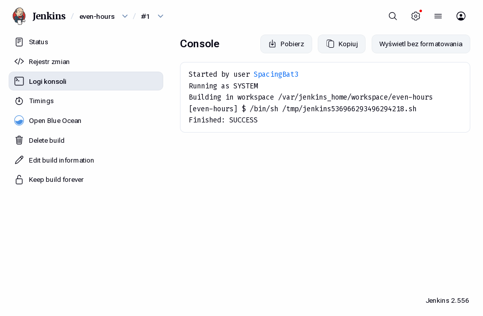

Wynik dla nieparzystych (`09:XX`):

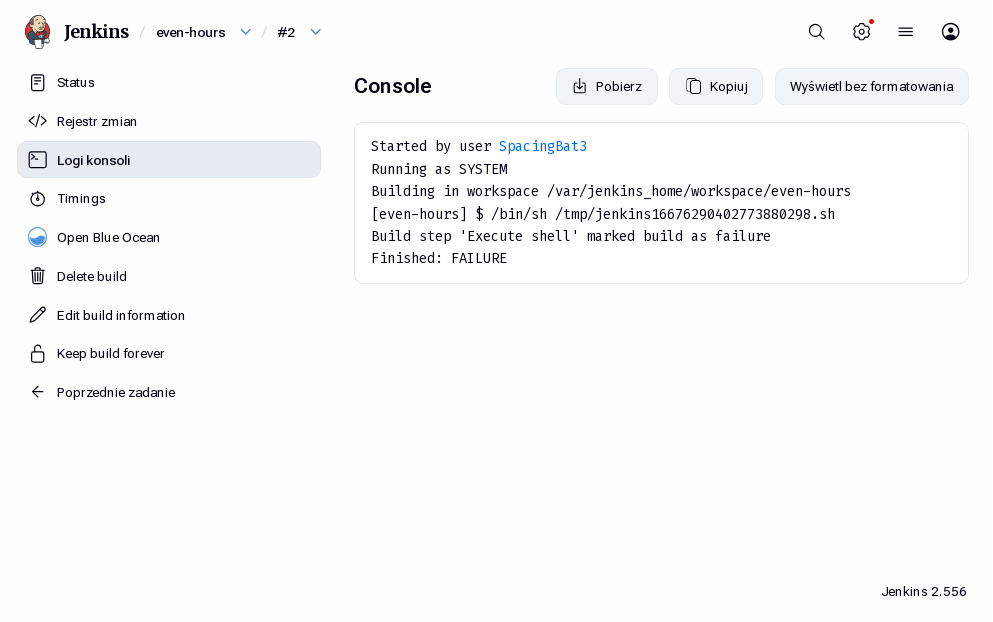

### Projekt *pipeline* (wtęp):

Tym razem wybieram typ projektu jako Pipeline:

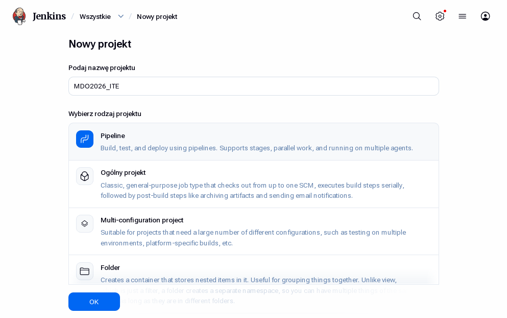

Implementacja skryptu pipeline położona jest w sekcji:

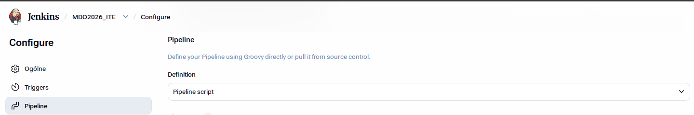

…jako kod:

```Jenkinsfile
pipeline {
    agent any

    stages {
        stage('checkout') {
            steps {
                git branch: 'DP423171',
                    url: 'https://github.com/InzynieriaOprogramowaniaAGH/MDO2026_ITE.git'
            }
        }
        stage('build') {
            stages {
                stage('build:main') {
                    steps {
                        script {
                            docker.build("build-env-main:latest", "ITe/5/DP423171/Sprawozdanie3/docker/main")
                        }
                    }
                }
                stage('build:test') {
                    steps {
                        script {
                            docker.build("build-env-test:latest", "ITe/5/DP423171/Sprawozdanie3/docker/test")
                        }
                    }
                }
            }
        }
    }
}
```

Końcowo wywołano cały pipeline, uzyskując w rezultacie:

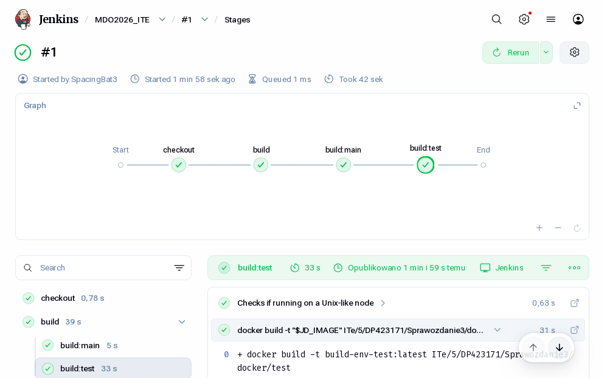

Logi z pipeline zdumpowano do [#1.txt](logs/pipeline/#1.txt).
Pipeline wywołano również jeszcze raz i zdumpowano do [#2.txt](logs/pipeline/#2.txt)

<!-- Linki: --->
<!-- [ex5]: ../../../../READMEs/05-Class.md "..." -->
[`Dockerfile`]: Dockerfile
