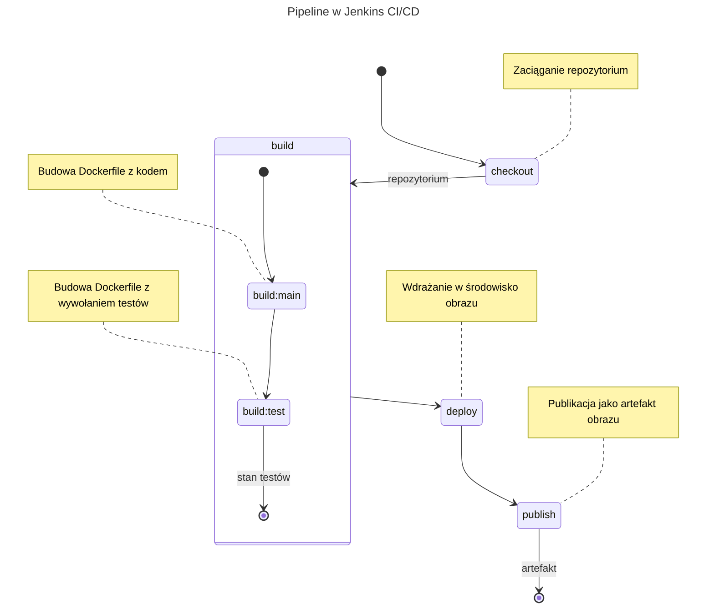
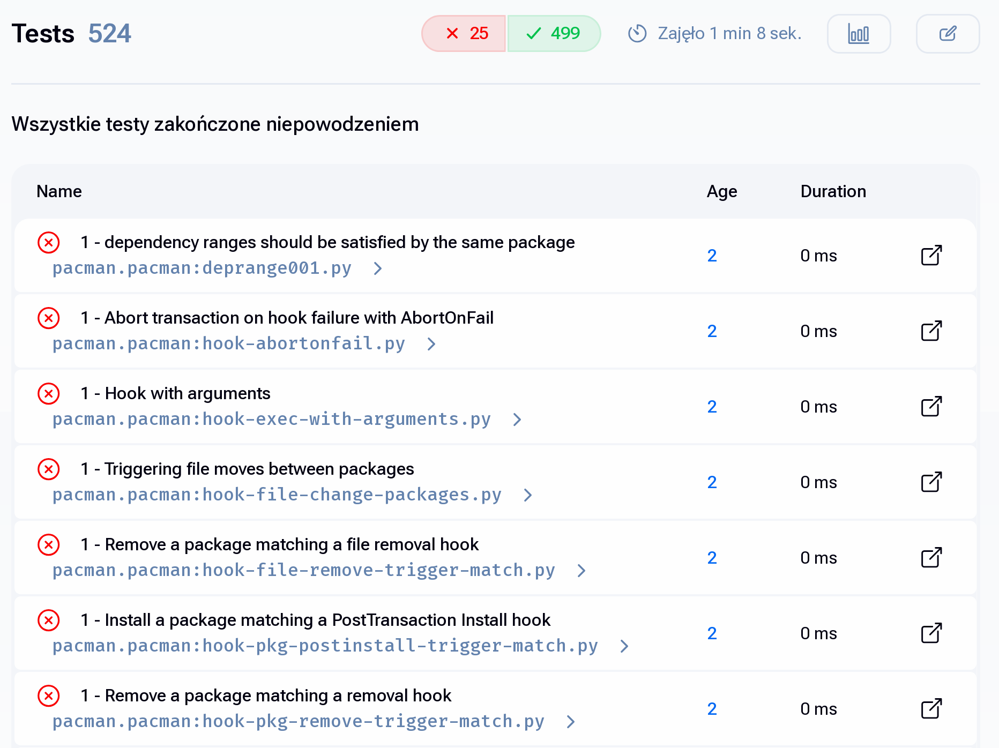
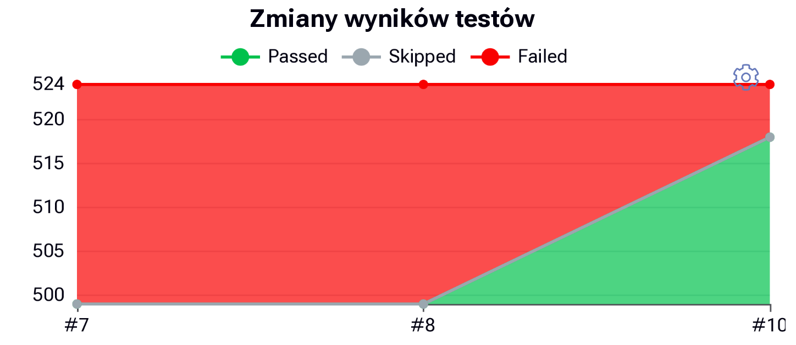
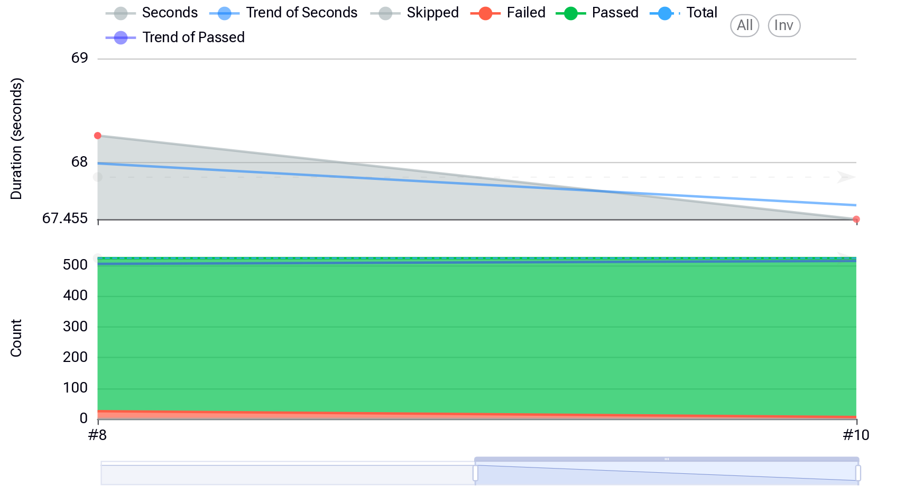
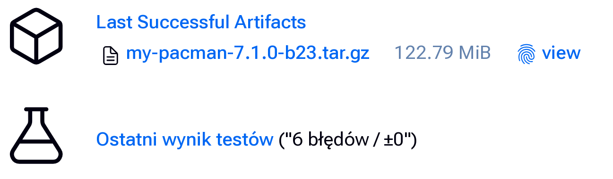
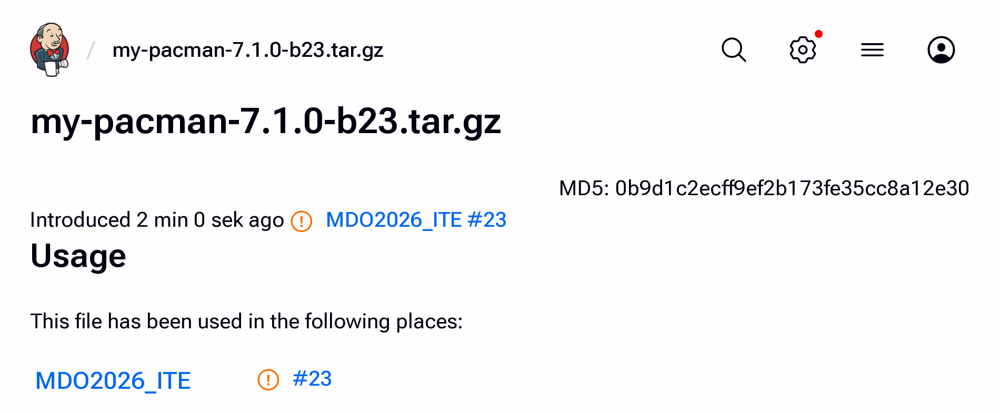

Sprawozdanie 6
==============

Sprawozdanie dla [ćwiczenia szóstego][ex6].

Cel ćwiczenia
-------------

Realizacja pełnego pipeline dla oprogramowania, osiągnięcie założeń
projektowych CI/CD dla wybranego projektu oprogramowania.

Projekt CI/CD
-------------

Przed rozpoczęciem zadania przedstawiono propozycję konstrukcji środowiska
CI/CD jako pipeline, opisując go przez diagram stanu:

<!-- Dla jasności: kod `mermaid` to właśnie diagram -->



### Cel projektu

Celem jest osiągnięcie wyeksportowanego obrazu Docker, który
pozwoli na administrację środowiskami pod warunkiem, że instancja
Dockera ma dostęp do root'a, lub użytkownik ma dostęp do systemu
plików (`pacman` wbrew pozorom pozwala zarządzać pakietami nie
tylko dla Linuksa, możliwe jest wykorzystanie `pacman` dla np.
aktualizacji czy instalacji środowisk MSYS2).

Przebieg ćwiczenia
------------------

> [!NOTE]
> Jestem świadomy, że koneneryzacja zwykle jest wykorzystywana
> inaczej w CI/CD na produkcji: obrazy stanowią bardziej jako
> środowisko dla budowy a kontenery starają się nawet osiągnąć
> większą transparentność i stanowią warstwę sandboxingu. W naszym
> wypadku podążałem za przebiegiem budowy z zadań poprzednich,
> tak więc wykorzystuję różne warianty obrazów, a ich budowa
> jest jednoznaczna z krokami oprogramowania. Zwykle ta warstwa
> krokowa jest zrzucana bezpośrednio na CI/CD, a nie definiowana
> Dockerem.

> [!TIP]
> Przedstawione diff'y stanowią opis, jak dokładnie dokonywano zmian
> w Jenkinsie. Sam proces pracy z Jenkinsem opisałem w sprawozdaniu
> poprzednim.

### Projekt *pipeline*: dodatkowe kroki

Wychodząc z konfiguracji `pipeline` z zadania 5:

```Jenkinsfile
pipeline {
    agent any

    stages {
        stage('checkout') {
            steps {
                git branch: 'DP423171',
                    url: 'https://github.com/InzynieriaOprogramowaniaAGH/MDO2026_ITE.git'
            }
        }
        stage('build') {
            stages {
                stage('build:main') {
                    steps {
                        script {
                            docker.build("build-env-main:latest", "ITe/5/DP423171/Sprawozdanie3/docker/main")
                        }
                    }
                }
                stage('build:test') {
                    steps {
                        script {
                            image = docker.build("build-env-test:latest", "ITe/5/DP423171/Sprawozdanie3/docker/test")
                            image.withRun { c ->
                                sh """
                                    mkdir -p meson-logs
                                    docker cp ${c.id}:/repo/build/meson-logs/testlog.junit.xml meson-logs/testlog.junit.xml
                                """
                            }
                        }
                    }
                    post {
                        always {
                            script {
                                junit 'meson-logs/testlog.junit.xml'
                            }
                        }
                    }
                }
            }
        }
    }
}
```

#### Udoskonalenie rejestracji testów

Rozważono czy możliwe jest zwracanie statusu testów bezpośrednio do Jenkins: zwykle
wymaga to eksportu do pewnego formatu testów. To z kolei spowodowało dysputę, czy
Meson pozwala na zwócenie jakiegokolwiek formatu wyniku testów, który umożliwia
na lepszą wizualizację stanu i dokładniejsze określenie wyniku dla pipeline.

Z uwagi na to, zapoznałem się z [dokumentacją Meson][meson#out], gdzie opisano, że dla
protokołu `tap` (jaki `pacman` wykorzystuje dla definicji testów – [przykład][pacman]),
dla którego `meson` właśnie generuje plik testów, zmieniono w następujący sposób
skrypt *pipeline*:

```diff
@@ -23 +23,14 @@
-                            docker.build("build-env-test:latest", "ITe/5/DP423171/Sprawozdanie3/docker/test")
+                            image = docker.build("build-env-test:latest", "ITe/5/DP423171/Sprawozdanie3/docker/test")
+                            image.withRun { c ->
+                                sh """
+                                    mkdir -p meson-logs
+                                    docker cp ${c.id}:/repo/build/meson-logs/testlog.junit.xml meson-logs/testlog.junit.xml
+                                """
+                            }
+                        }
+                    }
+                    post {
+                        always {
+                            script {
+                                junit 'meson-logs/testlog.junit.xml'
+                            }
```

Dzięki temu odpowiedni plik jest dumpowany z kontenera, a następnie archiwizowany
w ramach wyniku pracy, pozwalając na przejrzenie, jakie dokładnie testy jednostkowe
nie zostały spełnione:



Warto też zaznaczyć, że samo rozwiązanie CI/CD dostawcy oprogramowania nie dostarcza
na chwilę checklisty, co można zauważyć [na oficjalnym repozytorium](https://gitlab.archlinux.org/pacman/pacman/-/pipelines/158616/test_report),
w pewien więc sposób udało mi się wyprzedzić *upstream*, a także daje to możliwość
rozważenia przyszłej kontrybucji w CI/CD dostawcy, aby tą funkcję również dostarczyć.

Można też przyrównać testy względem statystyk (ogólnego trendu), co widoczne jest
w różnych miejscach UI:






#### Uzupełnienie CI/CD o realizację operacji `deploy` i `publish`

Zgodnie z rozważanym planem, operacja `deploy` ma *wdrażać* oprogramowanie w kontener.

Zdefiniowano odpowiedni wieloetapowy `Dockerfile`, który pozwoli na utworzenie czystego
obrazu bez niepotrzebnych warstw Docker oraz na bazie minimalnego obrazu z pakietami
produkcyjnymi (`base` to wariant bez grupy narzędzi deweloperski i dla kompilacji):

```Dockerfile
FROM build-env-main:latest AS devenv
RUN DESTDIR=/tarball meson install
WORKDIR /

# Bazuj na czystym obrazie Arch Linux (nie-deweloperskim)
# + porzucenie warstw przez multistage Dockerfile
FROM archlinux:base
COPY --from=devenv /tarball /

# Na tym etapie korzystaj tylko z zbudowanego pacman'a
# do zarządzania pakietami. Domyślnie wyświetlaj pomoc.
# Skonfiguruj pod opcję "-v [mount]:/sysroot" dla zarządzania
# pakietami w dystrybucji [mount] (funkcją obrazu jest recovery
# i działania sysadmin na środowiskach ALPM):
ENTRYPOINT [ "/usr/local/bin/pacman", "--sysroot", "/sysroot" ]
CMD [ "--help" ]
```

Tak zdefiniowany obraz na Jenkinsie stanie się artefaktem – zapewni to minimalne,
stabilne środowisko dla wywoływania `pacman` z zależnościami tak, jak na rzeczywistym
obrazie Arch Linux, świetne więc dla zarządzania pakietami poza samym Arch'em. Po
stronie `Jenkinsfile` pipeline należy dla tego efektu zdefiniować operacje `deploy`
i `publish`:

```diff
@@ -24 +24 @@
-                            image.withRun { c ->
+                            image.withRun { container ->
@@ -27 +27 @@
-                                    docker cp ${c.id}:/repo/build/meson-logs/testlog.junit.xml meson-logs/testlog.junit.xml
+                                    docker cp ${container.id}:/repo/build/meson-logs/testlog.junit.xml meson-logs/testlog.junit.xml
@@ -38,0 +39,21 @@
+                }
+            }
+        }
+        stage('deploy') {
+            steps {
+                script {
+                    image = docker.build("my-pacman:7.1.0-b${BUILD_ID}", "ITe/5/DP423171/Sprawozdanie6/docker/deploy")
+                    sh 'docker run -t --rm ${image.imageName()} --version'
+                }
+            }
+        }
+        stage('publish') {
+            steps {
+                script {
+                    sh 'docker save "my-pacman:7.1.0-b${BUILD_ID}" | gzip > my-pacman-7.1.0-b${BUILD_ID}.tar.gz'
+                }
+            }
+            post {
+                always {
+                    archiveArtifacts artifacts: 'my-pacman-7.1.0-b${BUILD_ID}.tar.gz',
+                        fingerprint: true
```

Końcowym rezultatem dla pipeline jest wynik testów oraz artefakt:



…gdzie jest on wersjonowany nazwą obrazu Docker'a, zgodnie z schematem:

```
my-{upstream_name}-{upstream_tag}-b{build-id}.tar.gz
```

- `upstream_name` – nazwa projektu upstream,
- `upstream_tag` – wykorzystama wersja programu upstream
  (schemat wersjonowania upstream),
- `build-id` – ID build'a Jenkins'a, jednoznaczny identyfikator
  dla stosowania wersjonowania wydań `continuous`.

Dodatkowo, w informacjach na temat budowy zauważyć się da występowanie
i *odcisk palca* dla artefaktu:



#### Dodatek: parametryzacja Dockerfile i ujednolicenie wersjonowania

Aby zarządzać wersją oprogramowania na upstream wykorzystano `ARG` dla
`Dockerfile`. Zmodyfikowano `Dockerfile` z ćwiczenia 3:

```diff
@@ -0,0 +1,2 @@
+ARG PACMAN_TAG
+
@@ -6 +8 @@ RUN pacman -Syu --asdeps --noconfirm git gpgme libarchive curl python fakechroot
-RUN git clone -b v7.1.0 https://gitlab.archlinux.org/pacman/pacman.git /repo
+RUN git clone -b v$PACMAN_TAG https://gitlab.archlinux.org/pacman/pacman.git /repo
```

Celem wykorzystania argumentu zmodyfikowano również sam skrypt pipeline:

```diff
@@ -3,0 +4,4 @@
+    environment {
+        PACMAN_VERSION = "7.1.0"
+    }
+
@@ -16 +20,2 @@
-                            docker.build("build-env-main:latest", "ITe/5/DP423171/Sprawozdanie3/docker/main")
+                            docker.build("build-env-main:latest",
+                                "--build-arg PACMAN_TAG=${PACMAN_VERSION} ITe/5/DP423171/Sprawozdanie3/docker/main")
@@ -45,2 +50,2 @@
-                    image = docker.build("my-pacman:7.1.0-b${BUILD_ID}", "ITe/5/DP423171/Sprawozdanie6/docker/deploy")
-                    sh 'docker run -t --rm ${image.imageName()} --version'
+                    image = docker.build("my-pacman:${PACMAN_VERSION}-b${BUILD_ID}", "ITe/5/DP423171/Sprawozdanie6/docker/deploy")
+                    sh "docker run -t --rm ${image.imageName()} --version"
@@ -53 +58 @@
-                    sh 'docker save "my-pacman:7.1.0-b${BUILD_ID}" | gzip > my-pacman-7.1.0-b${BUILD_ID}.tar.gz'
+                    sh "docker save 'my-pacman:${PACMAN_VERSION}-b${BUILD_ID}' | gzip > 'my-pacman-${PACMAN_VERSION}-b${BUILD_ID}.tar.gz'"
@@ -58 +63 @@
-                    archiveArtifacts artifacts: 'my-pacman-7.1.0-b${BUILD_ID}.tar.gz',
+                    archiveArtifacts artifacts: "my-pacman-${PACMAN_VERSION}-b${BUILD_ID}.tar.gz",
```

W skrypcie poprawiono też błąd, jako że skrypty Groove ignorują rozwiązywanie
`image.imageName()` dla pojedyńczych nawiasów, których zastosowanie dopiero zauważyłem.

Otrzymano w ten sposób końcową wersję Pipeline, realizującą założenia projektowe CI/CD.

Na etapie końcowym jeszcze sprawdzono działanie artefaktu poza Jenkinsem:


Logi zdumpowano do [`logs/Console.txt`](logs/Console.txt).


Końcowa check-lista dla pipeline:
---------------------------------

- [X] Aplikacja została wybrana.

- [X] Licencja potwierdza możliwość swobodnego obrotu kodem na potrzeby zadania.

- [X] Wybrany program buduje się.

- [X] Przechodzą dołączone do niego testy *(od których oczekiwało się przejścia)*.

> [!IMPORTANT]
> Testy, które nie przechodzą, oznaczone są jako *expected to fail*, jednakże
> Jenkins (co chociażby wynika z interfejsu graficznego) nie obsługuje tego
> typu wyjątków, także te testy klasyfikuje jako *failed*.
>
> Technicznie wszystkie oczekiwane dla przejścia testy przechodzą – mówią o tym logi:
>
> ```
> #5 7.035 Ok:                337 
> #5 7.035 Expected Fail:     6   
> #5 7.035 Fail:              0   
> ```

- [x] Zdecydowano, czy jest potrzebny fork własnej kopii repozytorium.

> [!NOTE]
> Własna kopia repozytorium nie była potrzebna, uznałem że nie muszę tego przedstawiać,
> a w *domyśle* mówiąc o oprogramowaniu, mówię też o jego oficjalnej dystrybucji kodu
> źródłowego, bez wszelakich poprawek i zmian od własnej strony.

- [X] Stworzono [diagram UML zawierający planowany pomysł na proces CI/CD](#projekt-cicd)

- [X] Wybrano kontener bazowy lub stworzono odpowiedni kontener wstepny (runtime dependencies).

- [X] *Build* został wykonany wewnątrz kontenera.

- [X] Testy zostały wykonane wewnątrz kontenera (kolejnego).

- [X] Kontener testowy jest oparty o kontener build.

- [X] Logi z procesu są odkładane jako numerowany artefakt, niekoniecznie jawnie.

> [!NOTE]
> W klasycznym tego rozumieniu logi w interfejsie Jenkinsa nie są artefaktem jako takim,
> są jednak rejestrowane i możliwe do zdumpowania poza Jenkinsa na żądanie. Dodatkowo
> (co jest częścią standardowej instalacji Jenkinsa w Dockerze) samo środowisko Jenkinsa
> jest odkładane na wolumin, co zapewnia trwałość logów i swobodny ich dostęp *za potrzebą*
> (Było to szczególnie przydatne, gdy aktualizowałem kontener Jenkins do nowszych wersji:
>  co w wolnym czasie zrobiłem aż dwukronie!).
>
> Dodatkowo dodałem retencję logów dla sprzątania – pozwala to na zachowanie tylko najświeższych
> logów.
>
> Innym dodatkiem, omówionym szczegółowo w przebiegu ćwiczenia, jest wyodrębnienie testów
> celem ich ciągłej rejestracji w ramach pracy pipeline.

- [X] Zdefiniowano kontener typu 'deploy' pełniący rolę kontenera, w którym zostanie
      uruchomiona aplikacja (niekoniecznie docelowo - może być tylko integracyjnie).

- [X] Uzasadniono czy kontener buildowy nadaje się do tej roli/opisano proces stworzenia nowego,
      specjalnie do tego przeznaczenia.

- [X] Wersjonowany kontener 'deploy' ze zbudowaną aplikacją jest wdrażany na instancję Dockera.

- [X] Następuje weryfikacja, że aplikacja pracuje poprawnie (*smoke test*) poprzez uruchomienie kontenera 'deploy'.

- [X] Zdefiniowano, jaki element ma być publikowany jako artefakt.

- [X] Uzasadniono wybór: kontener z programem, ~~plik binarny~~, ~~flatpak~~, archiwum tar.gz, ~~pakiet RPM/DEB~~.

- [X] Opisano proces wersjonowania artefaktu (można użyć *semantic versioning*).

- [X] Dostępność artefaktu: ~~publikacja do Rejestru online~~, artefakt załączony jako rezultat builda w Jenkinsie.

- [X] Przedstawiono sposób na zidentyfikowanie pochodzenia artefaktu.

> [!NOTE]
> Wybór wynika bezpośrednio z założeń / celów osobistych
> przy realizacji pipeline dla CI/CD.

- [X] Pliki Dockerfile i Jenkinsfile dostępne w sprawozdaniu w kopiowalnej postaci oraz obok sprawozdania, jako osobne pliki.

> [!NOTE]
> Używałem grupowania w katalogi tak, aby było to skalowalne i zorganizowane.
> Struktura katalogowa zoptymalizowana jest pod edytory tekstu, które potrafią
> upraszczać rekursywny podgląd na projekt.

- [X] Zweryfikowano potencjalną rozbieżność między zaplanowanym UML a otrzymanym efektem.

### Dodatkowe punkty dla checklisty:

- [X] W obraz `deploy` oprogramowanie jest wdrażane nieinwazyjnie, tzn. w oparciu o
      standardowy prefix `local`, przez co możliwe jest jego usunięcie bądź wyodrębnienie.
      (dla informacji: `/usr/local` [w standardowej nomenklaturze systemu Arch Linux][ArchWiki]
      jest ścieżką, z której pakiety korzystać nie powinny, dlatego jest świetna dla instalatorów
      i skryptów instalacyjnych, które nie śledzą zmian jako pakietów – dla jasności,
      moje wdrożenie nie jest przez pakiet, a `meson install`).

- [X] W obrazie zdefiniowano ścieżkę `/sysroot` jako wolumin wykorzystywany jako roboczy system
      plików (od którego oczekuje się pełnego środowiska pakietów Arch Linux, niekoniecznie systemu
      Arch Linux).

- [X] Pojedyńcze testy jednostkowe oraz integracyjne są rejestrowane w ramach
      pracy *pipeline*, pozwalając na ich badanie i statystykę.

<!-- Linki: --->
[ex6]: ../../../../READMEs/06-Class.md
[meson#out]: https://mesonbuild.com/Unit-tests.html#test-outputs
[meson#skip]: https://mesonbuild.com/Unit-tests.html#skipped-tests-and-hard-errors
[pacman]: https://gitlab.archlinux.org/pacman/pacman/-/blob/master/test/pacman/meson.build?ref_type=heads#L376
[ArchWiki]: https://wiki.archlinux.org/title/Arch_package_guidelines#Package_etiquette
