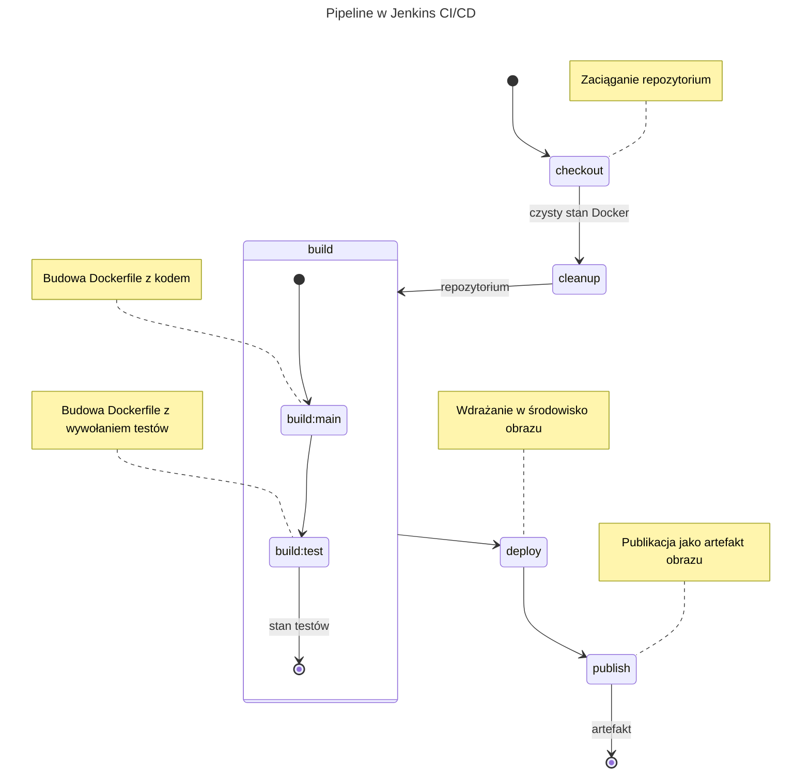
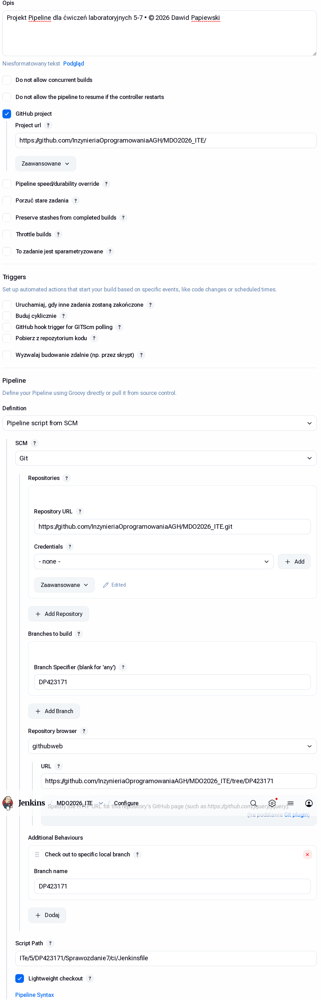
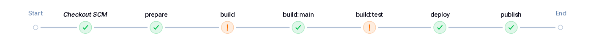

Sprawozdanie 7
==============

Sprawozdanie dla [ćwiczenia siódmego][ex7].

Cel ćwiczenia
-------------

Finalizacja pipeline, wykorzystanie zewnętrznego Jenkinsfile
dla realizacji pipeline.

Projekt CI/CD
-------------

Dokonano aktualizacji diagramu projektu, z uwagi na zmiany w
wymaganiach względem projektu CI/CD:

<!-- Dla jasności: kod `mermaid` to właśnie diagram -->



Diagram dalej jest w postaci ogólnej: checkout ma być osiągany przez samego
Jenkins'a, a kolejne kroki budowy zaciągane bezpośrednio z repozytorium
z odpowiedniego pliku Jenkinsfile.

### Cel projektu

Celem jest osiągnięcie wyeksportowanego obrazu Docker, który
pozwoli na administrację środowiskami pod warunkiem, że instancja
Dockera ma dostęp do root'a, lub użytkownik ma dostęp do systemu
plików (`pacman` wbrew pozorom pozwala zarządzać pakietami nie
tylko dla Linuksa, możliwe jest wykorzystanie `pacman` dla np.
aktualizacji czy instalacji środowisk MSYS2).

Przebieg ćwiczenia
------------------

> [!TIP]
> Przedstawione diff'y stanowią opis, jak dokładnie dokonywano zmian
> w Jenkinsie. Sprawozdanie stanowi kontynuację poprzedniego.

### Projekt *pipeline*: finalizacja

Wychodząc z konfiguracji `pipeline` z zadania 6:

```Groovy
pipeline {
    agent any

    stages {
        stage('checkout') {
            steps {
                git branch: 'DP423171',
                    url: 'https://github.com/InzynieriaOprogramowaniaAGH/MDO2026_ITE.git'
            }
        }
        stage('build') {
            stages {
                stage('build:main') {
                    steps {
                        script {
                            docker.build("build-env-main:latest", "ITe/5/DP423171/Sprawozdanie3/docker/main")
                        }
                    }
                }
                stage('build:test') {
                    steps {
                        script {
                            image = docker.build("build-env-test:latest", "ITe/5/DP423171/Sprawozdanie3/docker/test")
                            image.withRun { c ->
                                sh """
                                    mkdir -p meson-logs
                                    docker cp ${c.id}:/repo/build/meson-logs/testlog.junit.xml meson-logs/testlog.junit.xml
                                """
                            }
                        }
                    }
                    post {
                        always {
                            script {
                                junit 'meson-logs/testlog.junit.xml'
                            }
                        }
                    }
                }
            }
        }
    }
}
```

#### Wprowadzenie oczyszczania i przygotowywanie do zaciągania z zewnątrz

Aby budowa osiągana była za każdym razem "na czysto", wcześniej wykorzystywano
tymczasowość instalacji pomocnika DIND dla Jenkins'a: każde usunięcie kontenera
pozwalało na reset stanu. Rozwiązanie to, choć pozwalało sprawdzić czy środowisko
jest odtwarzalne, dalej wymagało drastycznej ingerencji w środowisko Jenkinsa z
zewnątrz.

Aby spełnić już wszystkie wymagania projektowe, usunięto checkout z definicji
skryptu, dodano oczyszczanie całego stanu dockera `system prune -a -f` i
na poszczególnych etapach budowy dodano wymuszenie budowania bez cache
(`--no-cache`) oraz dodatkowe czyszczenie zainstalowanych obrazów po budowie
bez tagowania (`docker builder prune -f`):

```diff
--- Sprawozdanie6/ci/final/Jenkinsfile	2026-04-14 09:03:56.058336097 +0200
+++ Sprawozdanie7/ci/Jenkinsfile	2026-04-21 08:21:45.433491543 +0200
@@ -9 +8 @@
-        stage('checkout') {
+        stage('prepare') {
@@ -11,2 +10,3 @@
-                git branch: 'DP423171',
-                    url: 'https://github.com/InzynieriaOprogramowaniaAGH/MDO2026_ITE.git'
+                script {
+                    sh "docker system prune -a -f"
+                }
@@ -21 +21 @@
-                                "--build-arg PACMAN_TAG=${PACMAN_VERSION} ITe/5/DP423171/Sprawozdanie3/docker/main")
+                                "--build-arg PACMAN_TAG=${PACMAN_VERSION} --no-cache ITe/5/DP423171/Sprawozdanie3/docker/main")
@@ -28 +28,2 @@
-                            image = docker.build("build-env-test:latest", "ITe/5/DP423171/Sprawozdanie3/docker/test")
+                            image = docker.build("build-env-test:latest",
+                                "--no-cache ITe/5/DP423171/Sprawozdanie3/docker/test")
@@ -45,0 +47,5 @@
+            post {
+                always {
+                    sh "docker builder prune -f"
+                }
+            }
@@ -50 +56,2 @@
-                    image = docker.build("my-pacman:${PACMAN_VERSION}-b${BUILD_ID}", "ITe/5/DP423171/Sprawozdanie6/docker/deploy")
+                    image = docker.build("my-pacman:${PACMAN_VERSION}-b${BUILD_ID}",
+                        "--no-cache ITe/5/DP423171/Sprawozdanie6/docker/deploy")
@@ -51,0 +59,5 @@
+                }
+            }
+            post {
+                always {
+                    sh "docker builder prune -f"
```

Po stronie konfiguracji Jenkinsa dokonano zmian, aby osiągnąć stan:



Końcowy pipeline wygląda tak, jak na diagramie:



Zwalidowano odtwarzalność względem porównania logów budowy:


Choć może to być częściowo niewidoczne, `difft` dla większości
przypadków wykrywa różnice właściwie przy samych czasach wykonania
poleceń, lecz nie zwracanym stanie poleceń czy wiadomościach – w
wielu wypadkach nawet mimo tego, że oznacza całe linie, między
liniami nie ma innych różnic jak w czasie wykonywania i niektórych
(ale nie wszystkich) hash'ach Dockera, wydaje się więc że postanowienia
projektu w kwestii odtwarzalności budowy (brak wpływu cache na budowę)
zostały osiągnięte.

Same logi zdumpowano do [1.txt](logs/1.txt) i [2.txt](logs/2.txt) dla
kolejnych sprawdzeń pipeline.

Lista kontrolna dla obecnego etapu ćwiczenia:
---------------------------------------------


- [X] Przepis dostarczany z SCM, a nie wklejony w Jenkinsa lub sprawozdanie (co załatwia nam `clone` )
- [X] Posprzątaliśmy i wiemy, że odbyło się to skutecznie - mamy pewność, że pracujemy na najnowszym (a nie *cache'owanym* kodzie)
- [X] Etap `Build` dysponuje repozytorium i plikami `Dockerfile`
- [X] Etap `Build` tworzy obraz buildowy, np. `BLDR`
- [X] Etap `Build` (krok w tym etapie) lub oddzielny etap (o innej nazwie), przygotowuje artefakt - **jeżeli docelowy kontener ma być odmienny**, tj. nie wywodzimy `Deploy` z obrazu `BLDR`
- [X] Etap `Test` przeprowadza testy
- [X] Etap `Deploy` przygotowuje **obraz lub artefakt** pod wdrożenie. W przypadku aplikacji pracującej jako kontener, powinien to być obraz z odpowiednim entrypointem. W przypadku buildu tworzącego artefakt niekoniecznie pracujący jako kontener (np. interaktywna aplikacja desktopowa), należy przesłać i uruchomić artefakt w środowisku docelowym.
- [X] Etap `Deploy` przeprowadza wdrożenie (start kontenera docelowego lub uruchomienie aplikacji na przeznaczonym do tego celu kontenerze sandboxowym)
- [X] Etap `Publish` ~~wysyła obraz docelowy do Rejestru i/lub~~ dodaje artefakt do historii builda
- [X] Ponowne uruchomienie naszego *pipeline'u* powinno zapewniać, że pracujemy na najnowszym (a nie *cache'owanym*) kodzie. Innymi słowy, *pipeline* musi zadziałać więcej niż jeden raz 😎

<!-- Linki: --->
[ex7]: ../../../../READMEs/07-Class.md
