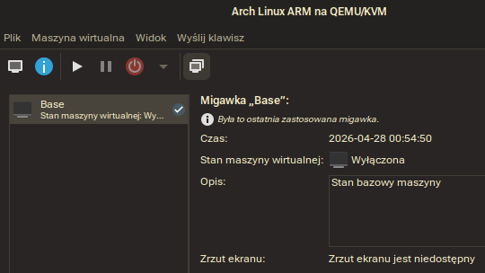

Sprawozdanie 7
==============

Sprawozdanie dla [ćwiczenia ósmego][ex8].

Cel ćwiczenia
-------------

Zapoznanie się z środowiskiem Ansible i wykorzystanie
Ansible do orchiestracji zadań.

Przebieg ćwiczenia
------------------

### Instalacja w sumie 3 maszyn wirtualnych:

Zainstalowano i skonfigurowano 3 maszyny wirtualne: `ansible`,
`ansible-target-x64` i `ansible-target-arm64`. Wykorzystano
2 różne architektury (kolejno Intel i ARM) dla sprawdzenia
kompatybilności multiarch.

Maszyny `x64` (`ansible`+`ansible-target-x64`) zainstalowano w
oparciu o oprogramowanie `pacstrap`, a same maszyny bootowane
są bezspośrednio z jądra i z montowanym `rootfs` w oparciu
o subvolumin `btrfs`:

```
btrfs subvolume create [ścieżka do rootfs maszyny]
pacstrap [ścieżka do rootfs maszyny]
```

Dzięki takiej konfiguracji, snapshoting ów obrazów maszyn
tworzony jest przez:

```
btrfs subvolume snapshot [ścieżka do rootfs maszyny] [katalog-snapshotów/]name
```

…a ich exportu dokonać można przez:

```
btrfs send [rootfs] -f [surowy stream subwoluminu]
```

Dla konfiguracji maszyn dokonano wielu kroków, najważniejsze z nich to:

#### 1. Konfiguracja `hostnamectl` na organizatorze:


Dodatkowo włączono usługę `systemd-resolved` dla zastosowania `mdns`:

```console
# resolvectl
Global
           Protocols: +LLMNR +mDNS DNSOverTLS=opportunistic
                      DNSSEC=no/unsupported
```

#### 2. Konfiguracja `hostnamectl` na hoście docelowym:


Warto zaznaczyć, że końcowo zdecydowałem się na konfigurację dodatkowego
hosta, a to wpłynęło na zmianę nazewnictwa: proces był jednak identyczny.
Poprawione nazwy hostów odzwierciedlać będą dalsze kroki.

#### 3. Publikacja kluczy na maszyny

Dla kontroli kulczy na głównej maszynie wykorzystano mechanizm fowardingu
agenta SSH (`FowardAgent Yes`), GPG ([/AgentForwarding](https://wiki.gnupg.org/AgentForwarding))
oraz fowardingu socketa Docker'a
(`RemoteForward /run/user/[remote-uid]/docker.sock /run/user/[local-uid]/docker.sock`)
celem udostępnienia infrastruktury deweloperskiej maszynie, ale nie jej trwałego
wdrożenia w maszynę (kwestie bezpieczeństwa / dobre praktyki).

Dla maszyn zdalnych docelowych dla Ansible:


#### 4. Snapshotting

Migawki maszyn `x64` utworzono dzięki `btrfs` (co opisano powyżej).

Migawki maszyn `arm64` utworzono bezpośrednio w oprogramowaniu `virt-manager`/`libvirt`:



#### 5. Instalacja Ansible

Na maszynie głównej:


### Test łączności przez ansible: ping wszystkich maszyn

Utworzono inwentarz hostów:

```
[control]
ansible.local

[managed]
ansible-target-arm64.local
ansible-target-x64.local

[managed_x64]
ansible-target-x64.local

[managed_arm64]
ansible-target-arm64.local

[managed_native]
ansible-target-x64.local
```

Wywołując odpowiednie polecenie, przez `ansible` sprawdzono
łączność maszyn:


### Pierwszy playbook: aktualizacja wszystkich maszyn

Dokonano aktualizacji wszystkich maszyn (zarówno `x64` jak
i `arm64`, niezależnie czy docelowej czy zarządcy) w oparciu
o `playbook`:

```yaml
- name: Maintenance of all systems
  hosts: all
  become: true
  become_method: su
  tasks:
   - name: Ping hosts
     ansible.builtin.ping:
   - name: Orchestrate updates
     community.general.pacman:
       update_cache: true
       upgrade: true
```

Wynik:


Udowodniono, że Ansible może pracować na tym samym zasobie
poleceń, niezależnie od architektury.

### Kolejny playbook: obraz docker

Z uwagi na to, że obraz uzyskany w ćwiczeniu poprzednim miał
tylko jedną architekturę docelową `x64`, postanowiłem posłużyć
się obrazem o znacznie większym zróżnicowaniu architektur:
`hello-world`. Celem tego zabiegu jest też sprawdzenie działania
`multiarch` w kontekście samego Dockera:


Na tym etapie niestety nastąpiły 2 problemy (co widać
po rezultacie polecenia):

1. Dla hosta `x64` miałem problemy z `overlayfs`. Choć moduł
   systemu plików w jądrze występuje, kwestią niezbadaną
   jest montowanie `overlayfs` na systemie `rootfs` w oparciu
   o system plików `virtiofs` – konfiguracja maszyny mogła
   uniemożliwić działanie Dockera i może istnieć potrzeba
   ręcznego wdrożenia pliku konfiguracyjnego dla zmiany
   systemu plików z `overlayfs` na `vfs`:
   ```
   [ERROR]: Task failed: Module failed: Error creating container: 500 Server Error for http+docker://localhost/v1.54/containers/create?name=hello: Internal Server Error (\"failed to mount /tmp/containerd-mount1979766496: mount source: \"overlay\", target: \"/tmp/containerd-mount1979766496\", fstype: overlay, flags: 0, data: \"workdir=/var/lib/containerd/io.containerd.snapshotter.v1.overlayfs/snapshots/2/work,upperdir=/var/lib/containerd/io.containerd.snapshotter.v1.overlayfs/snapshots/2/fs,lowerdir=/var/lib/containerd/io.containerd.snapshotter.v1.overlayfs/snapshots/1/fs,index=off\", err: invalid argument\")\u001b[0m\r\n\u001b[0;31mOrigin: /home/dp423171/MDO2026_ITE/ITe/5/DP423171/Sprawozdanie8/ansible/deploy.yml:22:6\u001b[0m\r\n\u001b[0;31m\u001b[0m\r\n\u001b[0;31m20        name: hello-world\u001b[0m\r\n\u001b[0;31m21        tag: latest\u001b[0m\r\n\u001b[0;31m22    - name: Run image\u001b[0m\r\n\u001b[0;31m        ^ column 6\u001b[0m\r\n\u001b[0;31m\u001b[0m\r\n\u001b[0;31mfatal: [ansible-target-x64.local]: FAILED! => {\"changed\": false, \"msg\": \"Error creating container: 500 Server Error for http+docker://localhost/v1.54/containers/create?name=hello: Internal Server Error (\\\"failed to mount /tmp/containerd-mount1979766496: mount source: \\\"overlay\\\", target: \\\"/tmp/containerd-mount1979766496\\\", fstype: overlay, flags: 0, data: \\\"workdir=/var/lib/containerd/io.containerd.snapshotter.v1.overlayfs/snapshots/2/work,upperdir=/var/lib/containerd/io.containerd.snapshotter.v1.overlayfs/snapshots/2/fs,lowerdir=/var/lib/containerd/io.containerd.snapshotter.v1.overlayfs/snapshots/1/fs,index=off\\\", err: invalid argument\\\")\"}
   ```

2. Dla hosta `arm64` docker nie uruchomił się w ogóle. Może
   to być kwestia emulatora QEMU (braki implementacyjne – wbrew
   pozorom natknąłem się na ograniczenia tego typu na LXC+QEMU)
   lub problemy z jądrem Arch Linux ARM, które jest budowane z
   większymi ograniczeniami niż standardowe jądro Arch Linux
   (choć przypuszczam, że na maszynie bare metal `docker` działa).
   Problem jest o tyle zaskakujący, że zasób oprogramowania
   zapewniony jest podobny.

Poza zajęciami spróbuję podejść do rozwiązania istniejących problemów.
Sam `docker pull` na chwilę obecną na maszynie `x64` w pełni działa.

### Naprawa błędów VM:

Błąd wynikający z `overlayfs` zidentyfikowano jako problem braku
odpowiednich `capabilities` nadawanych przez instancje `virtiofsd`
na hoście – zmiana `capabilities` nie jest jednak obsługiwana
przez libvirt, stąd implementacja hook'a wywołującego:

```sh
/usr/lib/virtiofsd \
    --socket-path="$SOCK" \
    --shared-dir="$SHARE" \
    --modcaps='+sys_admin' \
    --xattr &
```

Pozwoliło to na poprawny dostęp dla maszyny.

Dodatkowo, naprawiono też błędną konfigurację maszyny ARM64 po
aktualizacji systemu: dzięki czemu `docker` zaczął się uruchamiać,
jako że maszyna ma teraz poprawnie załadowane moduły jądra.

### Infrastruktura: `ansible-galaxy`

Utworzono infrastrukturę dla roli `deploy` (`tree roles`):

```
roles
└── deploy
    ├── meta
    │   └── main.yml
    └── tasks
        └── main.yml
```

Infrastruktura ta powstała przez wywołanie `ansible-galaxy roles init deploy`
i restrukturyzację tak, że `meta` zawiera metadane:

```yaml
galaxy_info:
  author: DPapiewski
  description: Docker hello world for testing multiarch
  license: custom
  min_ansible_version: 2.2
  galaxy_tags: []

dependencies: []
```

…a w `tasks` zawarto kod playbook'a `deploy.yml`:

```yaml
- name: Install Ansible dependencies
  community.general.pacman:
    update_cache: true
    name: python-requests
- name: Install Docker
  community.general.pacman:
    update_cache: true
    name: docker
- name: Start Docker service
  ansible.builtin.systemd_service:
    name: docker.service
    state: started
- name: Pull hello image
  community.docker.docker_image_pull:
    name: hello-world
    tag: latest
- name: Run image
  community.docker.docker_container:
    cleanup: true
    detach: false
    image: hello-world
    name: hello
```

Utworzono nowy playbook zależny od `deploy`:

```yaml
- name: Deploy application
  hosts: managed
  become: true
  become_method: su
  roles:
    - deploy
```

…i uruchomiono obydwie wersje, aby zweryfikować poprawność
już przy działającej infrastrukturze:


Udało się udowodnić, że przy tej samej konfiguracji, możliwe
jest wywołanie środowiska `multiarch`, co zapewnia testowanie
i budowanie oprogramowania dla zróżnicowanych architektur,
co jest bardzo przydatne dla produkcyjnych środowisk CI/CD.
