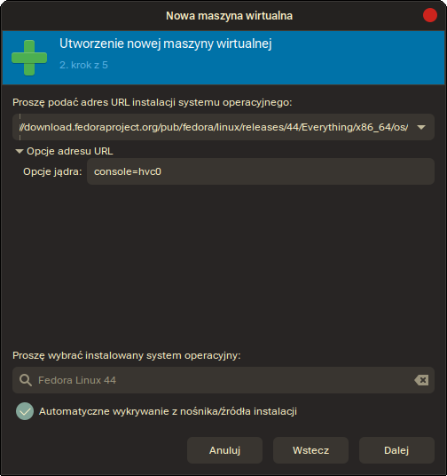
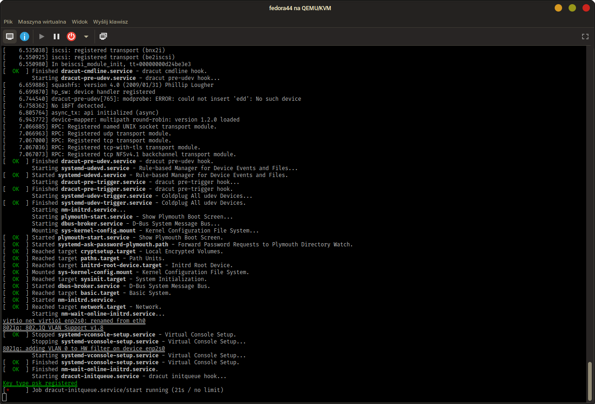
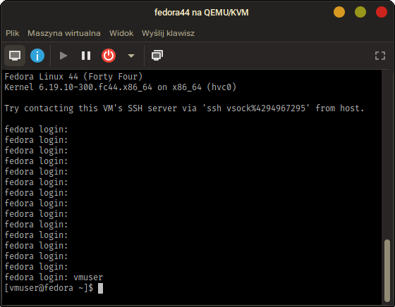
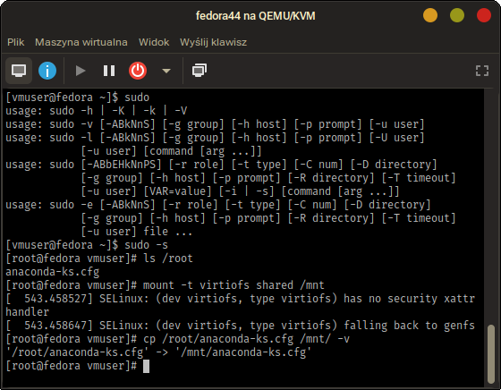
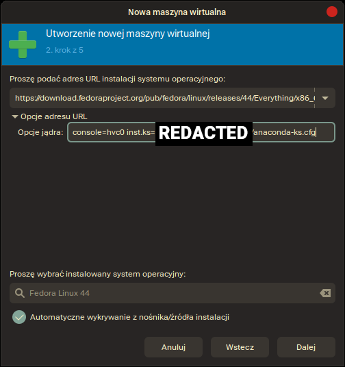
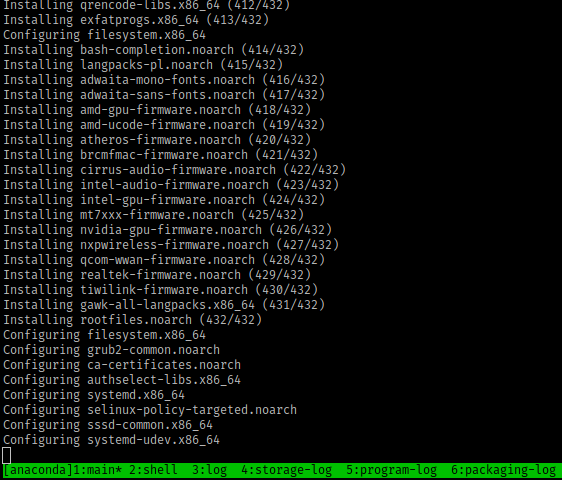
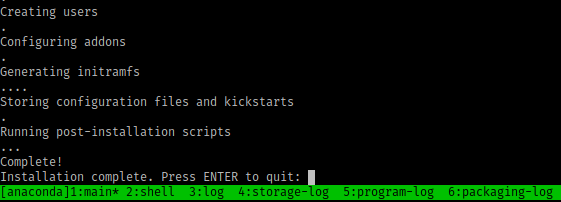
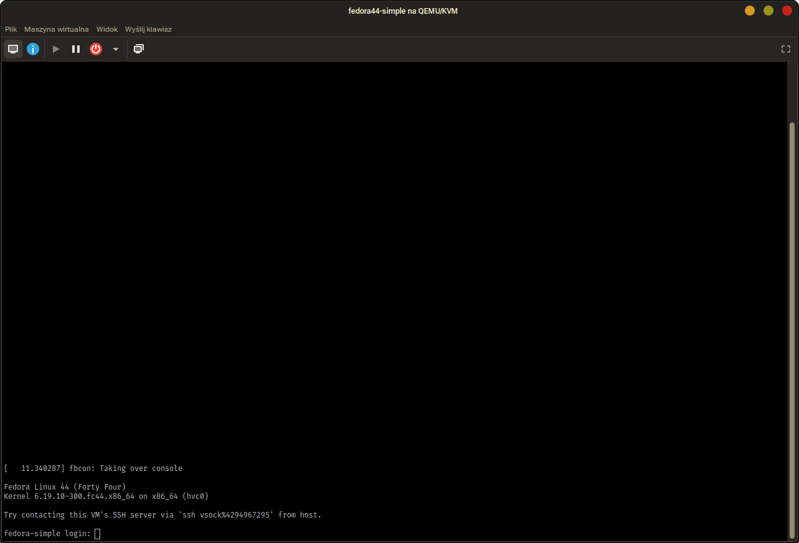

Sprawozdanie 9
==============

Sprawozdanie dla [ćwiczenia dziewiątego][ex9].

Cel ćwiczenia
-------------

Utworzyć źródło instalacji nienadzorowanej dla
systemu operacyjnego hostującego nasze
oprogramowanie. Przeprowadzić instalację systemu,
który po uruchomieniu rozpocznie hostowanie naszego
programu.

Przebieg ćwiczenia
------------------

### 1. Instalacja bazowa z sieci w `libvirt`

Dla początkowej instalacji wykorzystano oprogramowanie
`virt-manager` z ustawieniem na automatyczną instalację
sieciową w GUI, wykorzystując jako link
[drzewo systemu operacyjnego][tree], co wspierane jest
przez `libvirt` / `virt-install`. Ustawiono też flagę
jądra, by wskazać główne urządzenie dla wyjścia konsoli
jako konsola serialowa VirtIO:



> [!NOTE]
> Na dzień dzisiejszy (`20260505`), `fedora44` nie jest
> rozpoznawana w standardowej/stabilnej wersji `osinfo-db`,
> należy zbudować bazę danych z repozytorium `git` samodzielnie
> lub, gdy będzie to dostępne, zainstalować wersję bazy danych
> z repozytorium dystrybucji o wersji **nowszej** niż `20251212`.

Dokonano dalszej konfiguracji, uzyskując plik domeny
(pozwala on określać i odtwarzać konfiguracje sprzętu
dla maszyn wirtualnych):

```xml
<domain type="kvm">
  <name>fedora44</name>
  <uuid>[UUID]</uuid>
  <metadata>
    <libosinfo:libosinfo xmlns:libosinfo="http://libosinfo.org/xmlns/libvirt/domain/1.0">
      <libosinfo:os id="http://fedoraproject.org/fedora/44"/>
    </libosinfo:libosinfo>
  </metadata>
  <memory>4194304</memory>
  <currentMemory>4194304</currentMemory>
  <memoryBacking>
    <source type="memfd"/>
    <access mode="shared"/>
  </memoryBacking>
  <vcpu>4</vcpu>
  <os firmware="efi">
    <type arch="x86_64" machine="q35">hvm</type>
    <boot dev="hd"/>
  </os>
  <features>
    <acpi/>
    <apic/>
    <vmport state="off"/>
  </features>
  <cpu mode="host-passthrough"/>
  <clock offset="utc">
    <timer name="rtc" tickpolicy="catchup"/>
    <timer name="pit" tickpolicy="delay"/>
    <timer name="hpet" present="no"/>
  </clock>
  <pm>
    <suspend-to-mem enabled="no"/>
    <suspend-to-disk enabled="no"/>
  </pm>
  <devices>
    <emulator>/usr/bin/qemu-system-x86_64</emulator>
    <disk type="file" device="disk">
      <driver name="qemu" type="qcow2" discard="unmap"/>
      <source file="/var/lib/libvirt/images/fedora44.qcow2"/>
      <target dev="vda" bus="virtio"/>
    </disk>
    <controller type="usb" model="qemu-xhci" ports="15"/>
    <controller type="pci" model="pcie-root"/>
    <controller type="pci" model="pcie-root-port"/>
    <controller type="pci" model="pcie-root-port"/>
    <controller type="pci" model="pcie-root-port"/>
    <controller type="pci" model="pcie-root-port"/>
    <controller type="pci" model="pcie-root-port"/>
    <controller type="pci" model="pcie-root-port"/>
    <controller type="pci" model="pcie-root-port"/>
    <controller type="pci" model="pcie-root-port"/>
    <controller type="pci" model="pcie-root-port"/>
    <controller type="pci" model="pcie-root-port"/>
    <controller type="pci" model="pcie-root-port"/>
    <controller type="pci" model="pcie-root-port"/>
    <controller type="pci" model="pcie-root-port"/>
    <controller type="pci" model="pcie-root-port"/>
    <filesystem type="mount">
      <source dir="[shared-host]"/>
      <target dir="[shared-guest]"/>
      <driver type="virtiofs"/>
    </filesystem>
    <interface type="bridge">
      <source bridge="wifi0"/>
      <mac address="52:54:00:6d:e2:b0"/>
      <model type="virtio"/>
    </interface>
    <console type="pty">
      <target type="virtio"/>
    </console>
    <channel type="unix">
      <source mode="bind"/>
      <target type="virtio" name="org.qemu.guest_agent.0"/>
    </channel>
    <sound model="ich9"/>
    <memballoon model="virtio"/>
    <rng model="virtio">
      <backend model="random">/dev/urandom</backend>
    </rng>
    <vsock model="virtio">
      <cid auto="yes" address="3"/>
    </vsock>
  </devices>
</domain>
```

W konfiguracji domeny, `[shared-host]` oznaczono **ścieżkę** dla hostu,
który montowany jest do maszyny wirtualnej (działa podobnie
jak wolumin / `--bind` w Dockerze), a `[shared-guest]` oznacza
natomiast **tag**, przez który można zamontować katalog na maszynie
w oparciu o system plików `virtiofs`, przykładowo:

```console
# mount -t virtiofs [shared-guest] /mnt
```

Wartości te końcowo należy uzupełnić wedle uznania, ścieżek nie podaję
aby zataić wszelkie nietypowe lokalizacje na dane. `[UUID]` jest natomiast
wartością generowaną automatycznie i nie powinna być ustalana przez użytkownika.

### 2. Instalacja przez konsolę serialową

Po uruchomieniu maszyny i załadowaniu obrazu jądra oraz `initrd`, maszyna
uruchamia się przez firmware EFI, a w konsolce pokazuje się nam znajomy
styl logowania `/sbin/init`, jaki zapewnia i wyróżnia `systemd`:



Na tym momencie polecam zaparzyć kawę lub herbatkę: niestety może
chwilę potrwać zaciąganie obrazu fedory na etapie wykonywania usługi
`dracut-initqueue.service/start` w bazowym obrazie sieciowym fedory.

Po kompletnym uruchomieniu systemu, automatycznie powinnien uruchomić się
instalator `anaconda`. Instalację dokonano w sposób graficzny przez RDP, jako
że sama Fedora zaleca taki format instalacji dla łatwiejszego i
zaawansowanego partycjonowania dysku:

```
Please make a selection from the above ['c' to continue, 'q' to quit, 'r' to
refresh]: 1
================================================================================
================================================================================
RDP User name & Password

Please provide RDP user name & password.
You will have to type the password twice.

User name: fedora
Password: 
Password (confirm): 
22:24:03 Starting GNOME remote desktop in RDP mode...
22:24:04 GNOME remote desktop RDP: SSL certificates generated & set
22:24:04 GNOME remote desktop RDP: user name and password set
22:24:04 Starting GNOME remote desktop.
22:24:04 GNOME remote desktop is now running.
22:24:04 GNOME remote desktop RDP IP: [REDACTED]
22:24:04 GNOME remote desktop RDP host name: fedora
*** BUG ***
In pixman_region32_init_rect: Invalid rectangle passed
Set a breakpoint on '_pixman_log_error' to debug
```

Na tym etapie łączę się z adresem maszyny wirtualnej,
zamazanym przez pole `[REDACTED]` (tak jak z logów u góry):

```console
# xfreerdp3 /u:fedora /p:fedora /v:[REDACTED]
```

Konfiguruję w oknie instalatora Fedory przez RDP:

https://github.com/user-attachments/assets/e6cfabbe-14eb-419d-b4ea-f114a46e218a

Po uruchomieniu systemu ponownie, pokazuje się tym razem ekran logowania:



### 3. Konfiguracja skryptu dla autoinstalacji

Zgodnie z oczekiwaniami dostępny jest też plik `anaconda-ks.cfg`, wygenerowany
z instalacji systemu. Montuję więc katalog-wolumin[^1] z hosta i kopiuję na niego
plik konfiguracyjny, aby móc mieć do niego fizyczny dostęp:



Bazowy plik *kickstart* uzyskany w ten sposób:

```ini
# Generated by Anaconda 44.30
# Keyboard layouts
keyboard --vckeymap=pl --xlayouts='pl'
# System language
lang pl_PL.UTF-8

# Use network installation
url --url="https://download.fedoraproject.org/pub/fedora/linux/releases/44/Everything/x86_64/os/"

%packages
@^custom-environment
@guest-agents

%end

# Run the Setup Agent on first boot
firstboot --enable
# Do not configure the X Window System
skipx

# Generated using Blivet version 3.13.2
ignoredisk --only-use=vda
autopart
# Partition clearing information
clearpart --none --initlabel

# System timezone
timezone Europe/Warsaw --utc

#Root password
rootpw --lock
user --groups=wheel --name=vmuser
```

Celem uzyskania konfiguracji dla autonomicznych instalacji, dokonano zmian:

```diff
@@ -15,0 +16,3 @@
+cmdline
+network --hostname fedora-simple
+
@@ -17 +20 @@
-firstboot --enable
+firstboot --reconfig
@@ -25 +28 @@
-clearpart --none --initlabel
+clearpart --all --initlabel
@@ -32 +34,0 @@
-user --groups=wheel --name=vmuser
```

Wdrożenia *unattended* dokonano identycznie, jednakże zmieniono nazwę
maszyny dla rozpoznawalności i zastosowano plik konfiguracyjny przez
protokół HTTP. Po stronie hosta:
```console
$ darkhttpd conf/simple
darkhttpd/1.17, copyright (c) 2003-2025 Emil Mikulic.
listening on: http://0.0.0.0:8080/
```

Po stronie konfiguracji maszyny wystarczy podać jedynie lokalizację sieciową
dla pliku:



`REDACTED` celowo zasłania adres, aby nie leakować konfiguracji libvirt
dla stosu sieciowego, który jest przewidywalny (adres sieci jest niezmienny,
maszyny wirtualne oraz host mają stały adres IP, dla maszyn dodatkowo przydzielony
jest on automatycznie z danej puli).

To, że ta konfiguracja działa, widać będzie po logach serwera HTTP, który zarejestrował
żądanie maszyny do pliku *kickstart*:

```
$ darkhttpd conf/simple
darkhttpd/1.17, copyright (c) 2003-2025 Emil Mikulic.
listening on: http://0.0.0.0:8080/
[VM-ADDR-REDACTED] - - [05/May/2026:08:57:10 +0200] "GET /anaconda-ks.cfg HTTP/1.1" 200 894 "" "curl/8.18.0"
```

…a także podczas instalacji, która przebiegła w międzyczasie zbierania informacji do sprawozdania bez mojego
nadzoru:







Na tym etapie zrealizowano bazową ideę instalacji nienadzorowanej.

### 4. Dalsza konfiguracja pod instalacje *unattended*

Pomysł na konfigurację, aby przebiegało to generycznie, a końcowo
Fedora była wyposarzona w obraz, który utworzyłem, wygląda następująco.

1. Obrazy kontenerów Docker do wdrożenia z perspektywy `libvirt` będą
   na katalogu-woluminie[^1] `virtiofs`. W ten sposób zapewniam bardzo
   generyczne podejście w konfiguracji i wdrażaniu maszyn, a zapewniając
   dostęp *tylko do odczytu* do katalogu z wyeksportowanymi obrazami,
   mogę też dodatkowo zabezpieczyć obrazy przed nadpisaniem przez
   maszyny wirtualne. `virtiofs` pozwala mi też uniknąć wrzutu maszyny
   na rejest Docker, przez co moje dane są trzymane w mojej lokalnej
   przestrzenii, nie potrzebuję polegać na bezpieczeństwie i możliwościach
   jakiejkolwiek usługi sieciowej z zewnątrz, a idea zrzutu obrazu jest podobna.

2. Pozostałe oprogramowanie i sam obraz maszyny konfigurowany jest przez
   plik *kickstart*, zgodnie z założeniami zadania.

3. Dodatkowo celem masowego tworzenia maszyn wirtualnych, wykorzystam zamiast
   GUI `virt-manager`'a polecenie `virt-install`, które samo generuje plik
   domeny na podstawie odpowiednich flag CLI (odsyłam do `virt-install --help`
   dla dokumentacji, albo `man virt-install`, dostępnego również online).
   Dodatkowo, `virt-install` wrzuca plik *kickstart* na `initrd` oraz ustawia
   flagi dla ustawienia głównej konsoli (wspomniana wcześniej flaga `console=hvc0`)
   dla połączenia serialowego, a także wskazuje na lokalizację pliku *kickstart*
   dla instalacji *unattended*

4. Replikacja maszyn staje się banalnie prosta: skrypt, obok którego jest plik
   plik konfiguracyjny, uruchamia się `./setup-vm.sh nazwa-maszyny` (**ale nie hosta!**),
   a potem leci zaparzyć herbatkę, bo zaciągnięcie drzewa systemu operacyjnego
   i bazową konfigurację wraz z wdrożeniem aplikacji, następuje wraz z instalacją.

Efektem gotowym ma być konfiguracja systemu z pytaniem o dalsze kroki (utworzenie
konta administratora) z wdrożonym obrazem Docker'a. Jako że ideą obrazu jest
administracja Arch Linux, sama w sobie konfiguracja taka maszyny jest bezużyteczna,
jednakże podpięcie dowolnego `rootfs` wykorzystującego `pacman` jako menedżer pakietów,
pozwalać będzie na wykorzystanie obrazu dla administracji systemami operacyjnymi.
Jest to chyba najbardziej sensowna opcja, jeżeli konieczne jest wdrożenie mojego
obrazu z pipeline.

> ![NOTE]
> Dla uzasadnienia też, czemu na tym etapie użytkownik jest konfigurowany dodatkowo,
> po instalacji: celem ograniczenia wycieków kluczy/hasłeł między maszynami i dodatkowego
> zapewnienia warstwy zabezpieczeń przed zbyt zduplikowaną konfiguracją użytkowników,
> przez którą skompromitowanie 1 hosta powoduje również skompromitowanie całej sieci,
> moja konfiguracja żąda od administratorów ustawienie własnoręcznie konta użytkownika
> i hasła oczekując, że te nie będą powtarzały się między hostami. Jest to bardzo
> dobra praktyka dla bezpieczeństwa hostowania wielu maszyn o różnych funkcjach i łatwo
> pozwala na ograniczenie konsekwencji penetracji jednej maszyny i ataku dalszych, co
> najmniej dając dłuższy czas reakcji na atak zespołowi administracyjnemu.

Dokonuje także kolejnej już modyfikacji dla uzyskania docelowego pliku *kickstart*:

```diff
@@ -1 +1 @@
-# Generated by Anaconda 44.30
+### LOCALE ###
@@ -5,0 +6,2 @@
+# System timezone
+timezone Europe/Warsaw --utc
@@ -7 +9,2 @@
-# Use network installation
+### OS SOURCES ###
+# Network installation path
@@ -9,0 +13 @@
+### PACKAGES ###
@@ -10,0 +15 @@
+# This indicates minimal environment
@@ -11,0 +17,3 @@
+# ...also guest agents for various hypervisors,
+# including our beloved QEMU. This will improve
+# performance and memory allocation.
@@ -13 +21,5 @@
-
+# Initial Setup for initial user configuration
+initial-setup
+# Docker for integrating images
+docker-cli
+containerd
@@ -15,0 +28 @@
+### BOOT CONFIG ###
@@ -17,2 +29,0 @@
-network --hostname fedora-simple
-
@@ -24 +35,2 @@
-# Generated using Blivet version 3.13.2
+### DISK CONFIG ###
+# Force using VDA disk
@@ -25,0 +38 @@
+# ...and partition it automatically
@@ -30,3 +43 @@
-# System timezone
-timezone Europe/Warsaw --utc
-
+### USERS ###
@@ -34,0 +46,80 @@
+# Default user
+# NOTE: Unless --password is given, this
+# will create a locked account. Hence for
+# more production-ready env I decided to
+# use initial-setup package and interactive
+# post-installation configuration.
+# user --groups=wheel --name=pacman
+
+### SERVICES ###
+services --enabled=docker
+
+### NETWORK ###
+network --hostname fedora-pacman
+
+### POST-CONFIGURATION HOOKS ###
+%post --interpreter=/usr/bin/sh
+# Mount virtiofs volume, implies proper config
+# at VM configuration side...
+mount -t virtiofs containers /mnt
+# ...and copy all compressed images to /usr/local
+# (srry fedorians, I am Arch user there, so I use
+# Arch paths for installing stuff :P)
+install -dm755 /usr/local/share/docker-images-extra
+install -Dm644 -t /usr/local/share/docker-images-extra/ "$img" /mnt/*.tar.gz
+# Finally, unmount.
+umount /mnt
+# Note that with this config I assume images will be
+# imported manually – instructions tell `docker` cannot
+# really be used at this point, so this is the best
+# I can do without doing weird systemd services that are
+# really useless after the first boot (and self-removable
+# services are something uncommon in systemd world and
+# give me the nasty feeling of "playing with fire" at this
+# point). I really am a fan of KISS solutions, as a principle of
+# Arch Linux operating systems, therefore I'd love to leave it
+# as-it-is at this point.
+#
+# Also since the software is interactive, it cannot be "launched"
+# on boot, I mean I explained my docker image is to be used for
+# manual or scripted administrative purposes, the best I can do
+# is show version which isn't really that much useful.
+#
+# Still, to follow the exercise, I add this "mechanism" that has
+# no real purpose IMHO. It is there, so my work is satifactionary.
+# In reality, I would consider working on first-install scripts
+# that at best should not utilise "hand-written" systemd services
+# that are not being "properly" integrated as software into system.
+
+cat > /usr/local/bin/load-and-run-docker.sh << 'EOF'
+#!/bin/sh
+set -e
+for f in /usr/local/share/docker-images-extra/*.tar.gz; do
+    gunzip -c "$f" | docker load
+done
+docker run --rm my-pacman:7.1.0-b34 -V
+EOF
+
+chmod +x /usr/local/bin/load-and-run-docker.sh
+
+cat > /etc/systemd/system/my-pacman-launch.service << 'EOF'
+[Unit]
+Description=Dumb app launch with no real purpose
+After=docker.service
+Wants=docker.service
+
+[Service]
+Type=oneshot
+ExecStart=/usr/local/bin/load-and-run-docker.sh
+RemainAfterExit=no
+
+[Install]
+WantedBy=multi-user.target
+EOF
+
+systemctl enable my-pacman-launch.service
+
+%end
+
+# Auto reboot after install
+reboot
```
Komentarze są w języku angielskim, podążając za komentarzami domyślnego pliku
*kickstart*. Opisałem w nich swoją metodykę i jej uzasadnienie, a także już
skategoryzowałem poszczególne elementy konfiguracji.

Gotowy plik [dostarczono wraz z sprawozdaniem](conf/complex/anaconda-ks.cfg).

Dodatkowo, celem automatyzacji tworzenia maszyn wirtualnych, utworzyłem skrypt:

```sh
#!/bin/sh
LIBVIRT_VAR="${LIBVIRT_VAR:-/var/lib/libvirt}"
NAME="${1:-fedora44-pacman}"
virt-install \
	--connect qemu:///system \
	--location="https://download.fedoraproject.org/pub/fedora/linux/releases/44/Everything/x86_64/os/" \
	--initrd-inject=anaconda-ks.cfg \
	--extra-args="inst.ks=file:/anaconda-ks.cfg console=hvc0" \
	--name="$NAME" --osinfo fedora44 --network=network=default \
	--vcpus=4 --memory=4096 --memorybacking="access.mode=shared,source.type=memfd" \
	--console="type=pty,target.type=virtio" \
	--rng /dev/urandom \
	--memballoon model=virtio \
	--filesystem="$LIBVIRT_VAR/filesystems/containers,containers,readonly=true,driver.type=virtiofs" \
	--disk "$LIBVIRT_VAR/images/$NAME.qcow2,size=20" \
	--video none --sound none --graphics none \
	--boot uefi
```

Końcowo, instalacja przebiega następująco i wymaga jedynie konfiguracji użytkownika
– zabieg jest ten konieczny, aby sprywatyzować konfiguracje względem instancji, a tym
samym zapewnić skrypt, który jest bliższy kryteriom bezpieczeństwa oprogramowania
produkcyjnego:


Jak widać, udało mi się zapewnić pełną instalację nienadzorowaną, jedynie z konfiguracją
user'a z nadzorem, ale wdrożenie aplikacji, samej maszyny, jak i nawet uruchomienie
maszyny ponownie celem początkowej konfiguracji, osiągnięto już w pełni autonomicznie
jako element wdrażania maszyn wirtualnych w środowisko `libvirt` hosta.

[^1]: Używam tego określenia, bo w praktyce `virtiofs` powstało właśnie
by zapewnić alternatywę dla kontenerów opartą o pełną wirtualizację: miało
być i bezpiecznie, i wygodnie – ale niekoniecznie wydajnie, nie mówiąc o
quirkach, na które się można naciąć, stosując `virtiofs` za punkt montowania
katalogów systemowych, czy ogólniej mówiąc: katalogów, gdzie dokonywane jest
montowanie przez system plików `overlayfs`.

[ex9]: ../../../../READMEs/09-Class.md
[tree]: https://download.fedoraproject.org/pub/fedora/linux/releases/44/Everything/x86_64/os/
