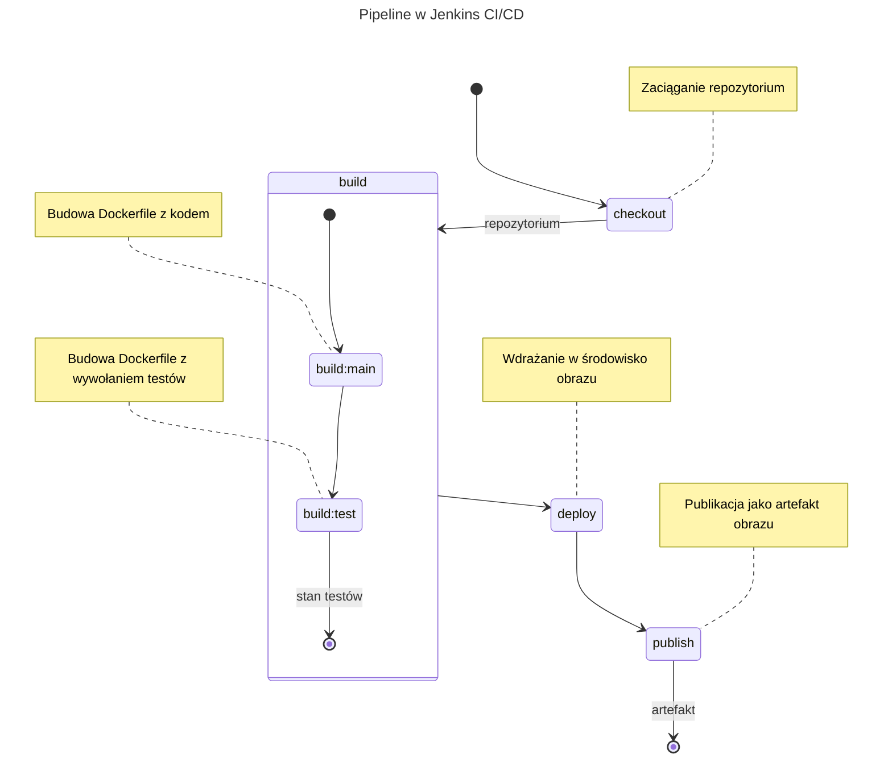
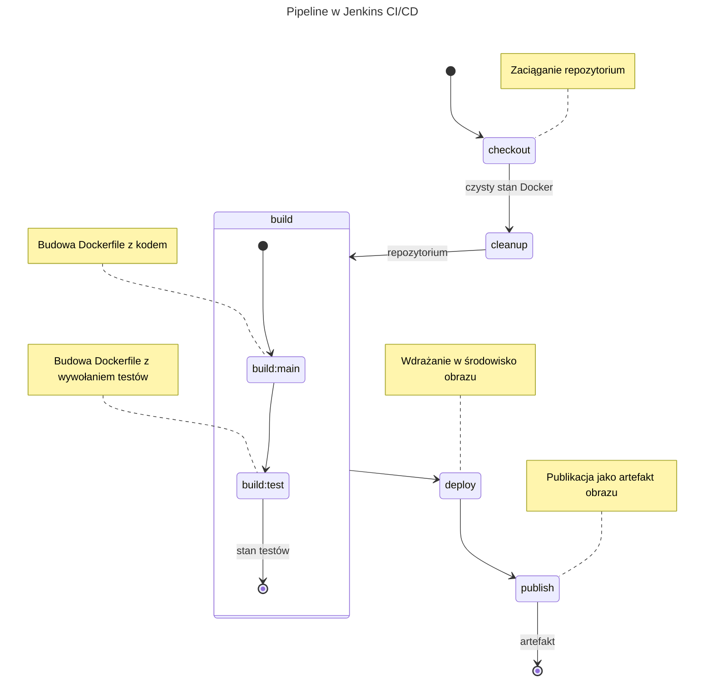

Zbiorcze sprawozdanie z ćwiczeń 5–7
===================================

Niniejszy dokument stanowi zbiorcze podsumowanie ćwiczeń 5, 6 i 7
realizowanych w ramach przedmiotu DevOps. Obejmuje on pełną ścieżkę
pracy z Jenkins CI/CD: od przygotowania środowiska i pierwszych zadań,
przez budowę kompletnego pipeline'u dla rzeczywistego projektu, po
finalizację rozwiązania w modelu definiowania pipeline jako kod z SCM
oraz walidację odtwarzalności.

W odróżnieniu od zbiorczego sprawozdania 1–4, którego ciężar był
rozłożony na podstawy Git/Docker i przygotowanie gruntu pod CI,
sprawozdanie 5–7 koncentruje się na inżynierii procesu CI/CD jako
spójnym, wersjonowanym i audytowalnym przepływie.

Cel i zakres serii ćwiczeń
--------------------------

Celem serii ćwiczeń było zaprojektowanie i uruchomienie pełnego procesu
CI/CD dla wybranego projektu open-source, z zachowaniem wymagań
dotyczących:

- separacji etapów (`build`, `test`, `deploy`, `publish`),
- wykonywania kroków w kontenerach,
- raportowania testów w CI,
- publikacji wersjonowanego artefaktu,
- przeniesienia definicji pipeline do repozytorium (SCM),
- powtarzalności uruchomień i ograniczenia wpływu cache.

### Zakres techniczny

Zakres obejmował zarówno konfigurację Jenkinsa, jak i przygotowanie
technicznej „treści" pipeline:

- `Jenkinsfile` (deklaratywny pipeline w Groovy),
- `Dockerfile` dla środowisk budowy/testów/deploy,
- mechanizm eksportu wyników testów do formatu JUnit,
- archiwizację artefaktów i fingerprinting,
- organizację wersjonowania artefaktów na podstawie wersji upstream
  i numeru builda CI.

Projekt realizowany w pipeline
------------------------------

Wybranym projektem był `pacman` (menedżer pakietów Arch Linux) budowany
z repozytorium upstream. Nie był to projekt demonstracyjny, lecz realny
kod źródłowy o rozpoznawalnym procesie kompilacji i testów.

### Charakter projektu i uzasadnienie wyboru

Projekt został dobrany tak, aby:

- posiadał otwarty kod źródłowy i transparentny proces budowy,
- umożliwiał uruchamianie testów automatycznych,
- dawał sensowny efekt końcowy w postaci narzędzia możliwego do
  osadzenia w kontenerze deploy,
- pozwalał pokazać praktyczne zagadnienia CI/CD (test report, artefakty,
  wersjonowanie, reprodukowalność).

Z uwagi na wymagania formalne ćwiczenia wybrano projekt open-source
z aktywnie utrzymywanym upstreamem, publicznie dostępnym kodem źródłowym
oraz możliwym do zautomatyzowania procesem budowy i testów. Projekt
`pacman` spełnia te warunki, a jednocześnie stanowi przykład narzędzia
systemowego o realnym zastosowaniu w administracji środowisk Linux.

### Zakładany produkt końcowy pipeline

Końcowym produktem nie był wyłącznie status poprawnego przejścia builda,
ale wersjonowany obraz z przygotowanym narzędziem, eksportowany jako
artefakt `tar.gz` i możliwy do uruchomienia poza Jenkinsem.

Formalnie artefakt końcowy stanowi skompresowane archiwum `tar.gz`
zawierające obraz Docker przygotowany w etapie `deploy`, gotowy do
załadowania i uruchomienia w docelowym środowisku z działającym Dockerem.
Wybór projektu `pacman` powoduje, że artefakt ma praktyczny charakter:
może być użyty jako narzędzie wspierające administrację systemami Linux
w scenariuszach utrzymaniowych i recovery.

#### Rozbicie obrazu na stany build/production

W ćwiczeniach 6–7 zastosowano podejście wieloetapowe, w którym obraz
budowy i obraz produkcyjny są rozdzielone funkcjonalnie.

W stanie `build` utrzymywane są narzędzia kompilacyjne i zależności
deweloperskie potrzebne do zbudowania projektu oraz uruchomienia testów.
Ten stan pozostaje elastyczny i podatny na zmiany, dzięki czemu łatwo
rozwijać proces budowy bez wpływu na minimalizm obrazu końcowego.

W stanie `production` umieszczany jest wyłącznie rezultat potrzebny do
uruchomienia narzędzia docelowego. Takie rozdzielenie ogranicza rozmiar
obrazu końcowego, redukuje zbędne rozwarstwienie obrazu, a jednocześnie
zachowuje dobry caching w etapach buildowych podczas iteracyjnej pracy
nad pipeline.

Dla obrazu docelowego ustawiono entrypoint oparty o `pacman` z opcją
`--sysroot`, co od razu narzuciło potrzebę:

- osobnego etapu `deploy`,
- oddzielenia obrazu buildowego od docelowego runtime,
- smoke testu uruchomieniowego,
- publikacji gotowego obrazu jako artefaktu.

Przebieg ćwiczenia 5 (start CI i pierwszy pipeline)
---------------------------------------------------

Ćwiczenie 5 miało charakter uruchomieniowo-fundamentowy: celem było
postawienie działającej instancji Jenkins i wejście w praktykę
automatyzacji przez pierwsze zadania oraz pipeline.

W ćwiczeniu 5 uzyskałem działający szkielet pipeline i zbudowane
podstawowe obrazy środowiskowe. Nie zdefiniowałem integracji
raportowania testów z Jenkinsem oraz wdrażania / publikacji
wyniku pipeline.

### Przygotowanie środowiska Jenkins

Wykonałem instalację i konfigurację Jenkinsa (w tym obraz oparty o
własny `Dockerfile` z interfejsem Blue Ocean). Uzupełniłem konfigurację
o elementy organizacyjne i bezpieczeństwa:

- konto administratora,
- retencję logów,
- podstawową politykę dostępu.

### Zadania wprowadzające

Przygotowałem dwa proste projekty typu freestyle:

- projekt uruchamiający `uname`,
- projekt sprawdzający parzystość aktualnej godziny.

Ich rola była diagnostyczna: szybkie potwierdzenie
poprawności mechaniki konfiguracja → uruchomienie → log,
a także zapoznanie się z prostą automatyzacją przez
Jenkins.

### Pierwsza wersja pipeline

Następnie uruchomiłem pierwszy pipeline dla właściwego repozytorium:

- etap `checkout` (pobranie kodu),
- etap `build` z dwoma krokami:
  - `build:main`,
  - `build:test`.

W ten sposób otrzymałem prosty etap CI/CD sprawdzający ciągłość budowy
oprogramowania i stan testów.

Przebieg ćwiczenia 6 (pełny cykl build-test-deploy-publish)
-----------------------------------------------------------

Ćwiczenie 6 było kluczowe merytorycznie: pipeline został domknięty
do pełnego cyklu CI/CD.

### Rozszerzenie etapu testów o raportowanie JUnit

W trakcie budowy/testów wykorzystałem mechanizm:

- uruchomienie kontenera testowego,
- skopiowanie pliku `testlog.junit.xml` z kontenera do workspace,
- publikacja raportu przez `junit` w Jenkinsie.

To usprawnia diagnostykę regresji i przybliża pipeline do praktyki
produkcyjnej, gdzie możliwa ocena jest jakości oprogramowania przez
analizę trendów i statystyk testów.

### Dodanie etapu `deploy`

Wprowadziłem osobny obraz deploy oparty o podejście wieloetapowe
(`multi-stage Dockerfile`):

- etap pośredni instalował zbudowany artefakt do tymczasowego rootfs,

- finalny obraz (`archlinux:base`) otrzymywał wyłącznie potrzebne dane.

To pozwoliło na efektywne ograniczenie wielkości rezultatu budowy.

#### Smoke test etapu deploy

Po zbudowaniu obrazu wykonywałem uruchomienie kontrolne (np. `--version`),
co potwierdzało, że obraz jest nie tylko zbudowany, ale i używalny.

### Dodanie etapu `publish`

Etap publikacji realizował eksport obrazu do artefaktu, wraz z *odciskiem palca*
i informacją o wystąpieniu artefaktu. Przyjąłem spójny schemat nazewnictwa:

```
my-{upstream_name}-{upstream_tag}-b{build-id}.tar.gz
```

Przykładowo: dla budowy `#43` artefaktem będzie `my-pacman-7.1.0-b43.tar.gz`.

### Parametryzacja wersji upstream

Aby uniknąć *hard-codingu* w kwestii doboru wersji dla oprogramowania,
zdefiniowałem argument `PACMAN_TAG` w `Dockerfile`. Dla definicji
wersji na przestrzeni pipeline, zdefiniowałem zmienną środowiskową
`PACMAN_VERSION`. Zapewniło to jedną oś wersjonowania dla
build/test/deploy/publish i ułatwiło aktualizację wersji w pipeline.

#### Efekt po ćwiczeniu 6

Po ćwiczeniu 6 pipeline był funkcjonalnie kompletny:



Przebieg ćwiczenia 7 (finalizacja i pipeline z SCM)
---------------------------------------------------

Ćwiczenie 7 zakończyło realizację wymagań organizacyjno-procesowych i
skupiło się na odtwarzalności oraz formalnym sposobie dostarczania przepisu pipeline.

### Przeniesienie źródła pipeline do repozytorium

Pipeline przestał być utrzymywany jako ręcznie wklejony skrypt w UI.
Definicja została dostarczana z repozytorium (`Jenkinsfile` z SCM),
co oznacza:

- wersjonowanie zmian pipeline razem z kodem,
- łatwiejsze review,
- pełniejszy audyt historii modyfikacji procesu.

### Etap przygotowania i czyszczenie środowiska

Dodałem etap `prepare` oraz operacje czyszczące:

- `docker system prune -a -f`,
- budowanie z `--no-cache`,
- `docker builder prune -f` po etapach budujących.

Celem było ograniczenie wpływu lokalnych pozostałości i cache na wynik
pipeline.

#### Uwagi praktyczne

Tak agresywne czyszczenie ma koszt czasowy, ale pozwala na demonstrację
odtwarzalności i pracy na aktualnym stanie. W praktyce produkcyjnej
często stosowany jest caching zależności, a nawet samej kompilacji
i budowy, celem optymalizacji czasu i kosztu budowy.

### Walidacja odtwarzalności

Porównałem logi z kolejnych uruchomień. Różnice dotyczyły głównie czasu
wykonania i technicznych identyfikatorów warstw, natomiast logika kroków
i stany końcowe pozostawały zgodne.

To potwierdziło, że pipeline działa powtarzalnie i nie zależy od
przypadkowego stanu wcześniejszych przebiegów.

### Architektura finalnego pipeline

Finalny przepływ można opisać następująco:

1. Pobranie definicji i kodu z SCM.
2. Przygotowanie środowiska (`prepare`, czyszczenie Dockera).
3. Budowa obrazu głównego (`build:main`).
4. Budowa obrazu testowego (`build:test`) i uruchomienie testów.
5. Ekstrakcja oraz publikacja raportu JUnit.
6. Budowa obrazu deploy (docelowego runtime).
7. Smoke test uruchomieniowy obrazu deploy.
8. Eksport obrazu do archiwum `tar.gz`.
9. Archiwizacja artefaktu i fingerprint w Jenkinsie.

Przedstawia to poniższy diagram:



Pipeline w finalnej postaci realizuje:

- separację odpowiedzialności etapów,
- śledzalność wyników testów,
- identyfikowalność artefaktów,
- wersjonowalność samego procesu CI/CD,
- powtarzalność uruchomień bez zależności od stanu poprzedniego,
- **oczyszczanie stanu budowy** (widoczna różnica między diagramami).

Kluczowe problemy i decyzje inżynierskie
----------------------------------------

### Problem: testy `expected fail` a interpretacja CI

Część testów była klasyfikowana jako `expected fail` po stronie projektu,
ale interfejs CI mógł pokazywać je po stronie niepowodzeń. Wymagało to
świadomej interpretacji metryk i logów, zamiast bezrefleksyjnego
traktowania każdego statusu `failed` jako regresji funkcjonalnej.

### Decyzja: artefakt jako obraz kontenerowy eksportowany do tar.gz

Nie publikowałem obrazu do zewnętrznego rejestru — zamiast tego
archiwizowałem go w Jenkinsie. Jest to kompromis poprawny dla laboratorium:
zachowałem możliwość pobrania i uruchomienia artefaktu przy mniejszej
złożoności operacyjnej i zachowaniu prywatności w publikacji obrazu:
obraz nie opuszcza prywatnego środowiska i jest hostowany lokalnie
jako artefakt Jenkinsa.

Wnioski końcowe
---------------

1. Seria ćwiczeń 5–7 skutecznie przeprowadziła proces od uruchomienia
   Jenkinsa do dojrzałego pipeline'u utrzymywanego jako kod w SCM.

2. Sama budowa stanowi słabe sprawdzenie jakości oprogramowania: warto
   też realizować testy i analizować ich statystykę (pokrycie i/lub
   listę kontrolną – w moim przypadku zbierałem listę kontrolną
   przejścia testów wraz z analizą ich czasu wykonania, który stanowi
   również ocenę wydajnościową oprogramowania, zwłaszcza dla testów
   wydajnościowych).

3. Integracja raportów JUnit istotnie poprawiła analizę jakości i
   umożliwiła monitorowanie trendu testów między buildami.

4. Rozdzielenie obrazu build i deploy oraz zastosowanie multi-stage
   potwierdziło sens separacji środowisk i redukcji zbędnych warstw.

5. Wersjonowanie artefaktów oparte na wersji upstream i numerze builda
   zapewniło czytelną identyfikowalność pochodzenia rezultatów.

6. Przeniesienie `Jenkinsfile` do SCM należy traktować jako warunek
   konieczny dla utrzymania procesu CI/CD w realnym zespole.

---

Podsumowując, ćwiczenia 5–7 zrealizowały kompletny i technicznie
spójny przypadek użycia Jenkins CI/CD dla rzeczywistego projektu
open-source, z naciskiem na reprodukowalność, przejrzystość testów
i praktyczne zarządzanie artefaktami.

