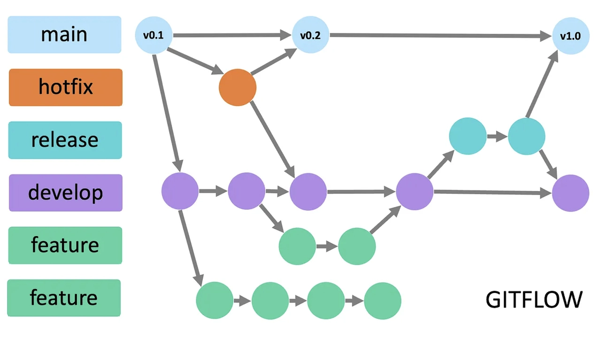
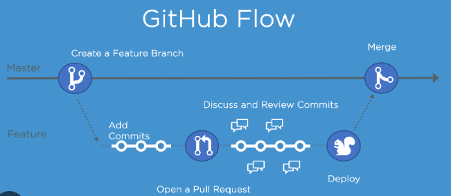

# Sprawozdanie zbiorcze z lab1-4
# Hypervisor - zarządza VM'ami
### Po co?
* Tworzenie **wielu** VM'ów na jednym serwerze
* Dynamiczne skalowanie zasobów w zależności od ruchu
* Tworzenie kopii zapasowej VM'ów

### Wyrózniamy 2 typy
* **Natywne** (HyperV, Proxmox) - bezpośrednio na sprzęcie, brak pośredniczącego systemu. 
* **Hosted** (VirtualBox, VMware) - działa jak zwykła aplikacja na systemie glównym. Mniej wydajne, ale wygodniejsze.

# GIT

### SSH
* **klucz prywatny** - klucz. Zostaje na komputerze, super tajny.
* **klucz publiczny** - kłódka. Wysyłana na serwer. Podczas komunikacji serwer sprawdzi czy "klucz pasuje do kłódki"

#### Schemat połączenia
1. Zainstalowanie i uruchomienie serwera SSH
```sh
sudo apt install openssh-server
sudo systemctl start ssh
sudo systemctl enable ssh
```
2. Wygenerowanie kluczy
To utworzy dwa pliki w `~/.ssh/`. `id_ed25519`(klucz prywatny) i id_ed25519.pub(klucz publiczny)
```
ssh-keygen -t ed25519 -C "email"
```

3. Przesłanie klucza publicznego na serwer
Istotne aby na serwerze klucz publiczny trafił do `~/.ssh/authorized_keys`
```sh
ssh-copy-id user@serwer
```
#### Jak to faktycznie działa?
* Przy każdy `ssh user@serwer` zachodzi Three-way-handshake.
* `ssh-agent` to demon działąjacy w tle. Trzyma klucz prywatny w RAMIE i podpisuje nim wiadomość przed wysłaniem na serwer **klucz prywatny nigdy nie opuszcza komputera**
```sh
eval "$(ssh-agent -s)"      # uruchom agenta
ssh-add ~/.ssh/id_ed25519   # przekaż my klucz prywatny
```

### GIT worflow - Ujednolica strukturę i przepływ kodu w projekcie. Każdy wie o co chodzi i zespół nie wchodzi sobie w drogę.
* **Git Flow** Sztywny podział na gałęzie (master, develop, feature, hotfix). Dobry do dużych projektów z rzadkimi wydaniami.



* **Github Flow** - Prostszy model. Tylko main i krótkie feature-branches. 



### Najważniejsze techniki
* **Rebase** -  "Przepisanie" historii commitów tak, aby wyglądała na liniową. Służy do zachowania czystości w logach.
* **Cherry-pick** -  Wybranie jednego, konkretnego commita z innej gałęzi i naniesienie go na obecną.
* **Squash** - Połączenie wielu małych commitów w jeden duży przed mergem (żeby nie śmiecić w historii).
* **Stash** - "Schowanie" niedokończonych zmian do tymczasowego schowka, aby móc szybko zmienić brancha bez robienia commita.
* **git revert** - Tworzy nowy commit, który jest "odwrotnością" poprzedniego. Bezpieczny dla zespołu, bo nie niszczy historii, tylko dodaje poprawkę.
* **git reflog** - ostatnia deska ratunku przy przypadkowym skasowaniu czegoś.

### GIT hooks
* **Lokalne** skrypty, które automatycznie uruchamiają się przed określonym działaniem (commitem lub pushem)
* Można stworzyc pipeline testów zapewnijący przed wysłaniem na githuba, że kod działa i jest poprawny.
* Do automatyzacji po stronie serwerowej (np. co ma się stać po PR) lepiej wykorzystać **Github actions**

# Docker
### Po co?
* **Przewidywalność i Powtarzalność** - rozwiązanie problemu "u mnie działa"
* **Izolacja na poziomie procesu**
* **Lekkość i szybkość**
* **Skalowanie w zależności od ruchu** - Szybkie tworzenie/usuwanie dodatkowych kontenerów

## Filozofie Dockera
1. Jeden kontener=jeden proces - każdy kontener robi jedną rzecz
2. Efmeryczność - Kontener powinien dać się zniszyć i odtworzyć w dowolnej chwili bez utraty danych
3. Obrazy powinny być jak najmniejsze = lżejsze, szybsze, bezpieczniejsze

## Kontener to tak naprawdę specyficzny PROCES
* Iluza izolacji. Jądro systemu ograniczyło uprawnienia, odcięło widok na resztę systemu (Kontener "widzi" siebie jako PID 1, podczas gdy na hoście jest np. PID 7831.) 
* Proces ten ma przydzielone konkretne zasoby o określonym limicie.
* Kontener dostaje swój własny interfejs sieciowy
* Kontener dostaje wydzieloną przestrzeń na pliki

## Warstwowe działanie Dockera 
Przy budowaniu obrazu, każda instrukcja (FROM, RUN, COPY...) dokłada jedną warstwę na wierzch poprzedniej.
Te warstwy są READ-ONLY. Jeśli mam 50 kontenerów opartych na ubuntu:22.04, ta warstwa bazowa istnieje na dysku dokładnie raz. Docker trzyma je w lokalnym cache i nigdy nie duplikuje.

Przy uruchomieniu kontenera korzysta się z dwóch warstw:
* lowerdir - wszystkie READ-ONLY warstwy obrazu, wszystko co przyniósł ze sobą obraz.
* upperdir - jedna cienka indywidualna warstwa.

Kontener widzi warstwę lowerdir, ale gdy próbuje coś do niej zapisać jądro kopiuje to coś do upperdir i tam zapisuje zmianę. Oryginał zostaje nienaruszony.

### Konsekwencje
* **Efmeryczność** - Kontener można zniszyć i odtworzyć w dowolnej chwili bez utraty danych
* Tworzenie i usuwanie kontenerów jest błyskawiczne i nie marnuje miejsca.
* Gdy aplikacja coś zepsuje, to niszczy tylko uppedir, lowerdir zostaje nienaruszony

## Stawianie dockera
Najlepiej skorzystać z gotowej wersji z repo danego systemu
```sh
# np. dla ubuntu:
sudo apt install docker.io
```
Pobieranie wersji Community Edition to długi, skomplikowany proces - niezalecane, chyba że potrzebna najnowsza wersja.

## Dockerfile 
Plik tekstowy zawierający listę instrukcji (krok po kroku), które Docker musi wykonać, aby automatycznie zbudować obraz.
### Po co? Automatyzacja i powtarzalność
```Dockerfile
FROM        # wykorzystanie obrazu bazowego 
WORKDIR     # Ustala folder, w którym będzie cała nasza aplikacja i gdzie będą wykonywane wszystkie komendy
COPY        # Kopiowanie plików z hosta
RUN         # Wykona się raz podczas budowania kontenera
CMD         # Wykona się za każdym uruchomieniem kontenera
USER        # Zmiana użytkownika, który wykonuje instrukcje (domyślnie root)
ENV         # zmienne środowiskowe (TYLKO TE BEZPIECZNE, BEZ SEKRETÓW)
```

## Typowe komendy
```sh
# ----- OBRAZY ------
docker pull <nazwa>                 # Pobiera obraz bazowy z DockerHub
docker build -t <nazwa> ./folder    # Buduje obraz na podstawie Dockerfile w obecnym folderze (./folder) i nadaje mu tag (-t).
docker images                       # Pokazuje wszystkie pobrane/zbudowane obrazy
docker rmi <id/nazwa>               # Usuwa obraz z dysku
# ---- KONTENERY ----
docker run <obraz>                  # Uruchuchamia kontener
docker ps                           # Pokazuje uruchomione konenery
docker stop <id/nazwa>              # Zatrzymuje kontener
docker rm <id/nazwa>                # Usuwa kontener
docer exec -it <nazwa>              # Wchodzi do uruchomionego kontenera
# ---- INNE ---------
docker network create <nazwa_sieci> # Tworzy sieć
docker volume create <nazwa_sieci>  # Tworzy wolumin
docker system prune                 # Czyści wszystko co nieużywane
docker logs <id/nazwa>              # Pokazuje to co kontener wypisuje na konsole
docker inspect <id/nazwa>           # Szczegółowe informacje o kontenerze
docker stats                        # Zużycie zasobów (RAM/CPU)
```

## Flagi dla `docker run`
```sh
-d                      # Uruchamia kontener w tle
-it                     # Uruchamia domyślny CMD z obrazu i podłącza do niego terminal odrazu po uruchomieniu
-it sh                  # NIE uruchamia domyślnego CMD. Tylko otwiera terminal w kontenerze odrazu po uruchomieniu.
--rm                    # Automatycznie usuwa kontener po jego zatrzymaniu
# -------------------
-p <host>:<kontener>    # Przekierowanie portów
--name <nazwa>          # Nazwanie kontenera
--network <nazwa_sieci> # Przypisanie kontenera do konkretnej sieci
# -------------------
-e <KLUCZ=WARTOŚĆ>      # Zmienne środowiskowe
--env-file <plik>
-v <host>:<kontener>    # Podpięcie voluminu
```

## WOLUMENY
Niezależne miejsce na dane w przestrzeni Dockera. Przetrwają po usunięciu kontenera.
## 1. Bind-Mounty
* kontener widzi wskazany folder hosta
* zmieniając plik na hoście, kontener tez widzi zmiane natychmiastowo
* po zamknięciu kontenera bind czyli ta "relacja" znika automatycznie
* **tylko w fazie developmentu** - najczesciej do hot reloadu kodu/plikow konfiguracyjnych
```sh
docker run -v ./folder-na-hoscie:/folder-w-kontenerze   nazwa_obrazu
```

## 2. Named Volumes
```sh
docker volume create nazwa_woluminu
```
## Po co nam one?
### A) Przekazanie coś do wolumenu zanim kontener wogole rozpocznie prace (**rzadko**)
* stosowane tylko jesli nie chcemy czegos umieszczac bezposrednio w obrazie przez COPY 
* lub nie chcemy pobierac dodatkowych narzedzi do kontenera np.gita zeby pobrac kod
* **WAŻNE**: najczesciej wykorzystuje sie do tego pomocniczy kontener, ktorego jedynym zadaniem jest wrzucic cos do woluminu
```sh
docker run -v nazwa_woluminu:/data nazwa_obrazu [dowolna komenda ktora umiesci to co chcemy w folderze /data]
# np. docker run -v wolumin:/data alpine:git git clone github.com/xdxdxd /data
```

### B) Zapis pracy kontenera (problem ulotności) (**zdecydowanie najczęściej**)
* persystencja danych z bazy (każdy silnik bazy danych zapisuje je w jakims pliku w konkrentym formacie. Wie jak odczytac i interpretowac te dane)
```sh
docker run -v pgdata:/var/lib/postgresql/data postgres
```
* współdzielenie danych między kontenerami. Dwa kontenery mogą naraz być podpięte do jednego woluminu

## Multi-stage build
```Dockerfile
# ----- Etap 1: Budowanie aplikacji -----
FROM node:lts-alpine as builder
...
RUN npm run build

# ----- Etap 2: Serwowanie zbudowanych plików -----
FROM nginx:alpine
COPY --from=builder /app/dist /usr/share/nginx/html
CMD ["nginx", "-g", "daemon off;"]
```

### Dzielimy Dockerfile na dwie (lub więcej) fazy:
1. Faza budowania (builder)
   W tej sekcji używamy obrazu zawierającego kompilator i potrzebne narzędzia
2. Faza produkcyjna (runtime)
   Tutaj korzystamy z lekkiego obrazu bazowego i kopiujemy tylko skompilowany plik
   binarny

### Po co?
Docker tworzy obraz tylko z ostatniego stage'a,

Dzięki temu w końcowym obrazie umieszczamy tylko to, co niezbędne do
uruchomienia aplikacji – bez kompilatora i nadmiarowych plików. **Obraz staje się
mniejszy, bardziej przejrzysty i bezpieczniejszy.**


# Docker Compose
Służy do zarządzania wieloma kontenerami jednocześnie za pomocą jednego pliku konfiguracyjnego
## Po co?
* Uruchamianie całych systemów jedną komendą: Zamiast wpisywać w terminalu pięć długich komend docker run (dla bazy, backendu, frontendu, redis’a itd.), wpisujesz po prostu `docker-compose up`.
* Definiowanie relacji: W jednym pliku opisujesz, że aplikacja potrzebuje bazy danych, jakie mają mieć hasła i jak mają być połączone.
* Automatyczna sieć: Compose sam tworzy wirtualną sieć, dzięki której kontenery widzą się nawzajem po nazwach (np. backend łączy się z bazą po nazwie db, a nie po adresie IP).
* Porządek w konfiguracji: Wszystkie porty, wolumeny i zmienne środowiskowe masz zapisane w jednym pliku, a nie rozproszone w historii terminala.

## Przykładowy Docker-compose
```yml
services:
  # Serwis 1: Aplikacja
  web-app:
    build: .          # Zbuduj obraz na podstawie Dockerfile w tym folderze
    ports:
      - "8080:5000"   # Przekieruj port 8080 hosta na port 5000 kontenera
    environment:
      - DB_HOST=db    # Zmienna środowiskowa
    depends_on:
      - db            # Uruchom bazę danych przed aplikacją

  # Serwis 2: Baza danych
  db:
    image: postgres:15-alpine  # Gotowy obraz z Docker Hub
    volumes:
      - postgres_data:/var/lib/postgresql/data  # Trwałe przechowywanie danych

# Definicja wolumenu (żeby dane bazy nie zniknęły po wyłączeniu kontenerów)
volumes:
  postgres_data:
```
### UWAGA NA ŚCIEŻKI
* `context: ./backend` **POPRAWNIE**: szuka tam gdzie uruchamia sie polecenie docker compose
* `context: /backend` **BŁĘDNIE**: szuka w katalogu głównym systemu

## Jak dziala override w docker-compose
`docker-compose.override.yml` to specjalny plik, który może nadpisywać, rozszerzać lub modyfikować konfiguracje w `docker-compose.yml`

Zalozmy ze mamy dwa pliki:
1. docker-compose.yaml - konfiguracja produkcyjna
2. docker-compose.override.yml - konfiguracja developerska

#### Przy domyslnym uruchomieniu `docker compose up` odpalą się **oba** pliki

#### Aby uruchomic tylko plik bazowy używamy `docker-compose -f docker-compose.yml up`

```yml
// docker-compose.yml
services:
  web:
    image: myapp:latest
    ports:
      - "80:80"
    environment:
      - NODE_ENV=production

// docker-compose.override.yml
services:
  web:
    environment:
      - NODE_ENV=development
    volumes:
      - ./src:/app
```

# Sieci w dockerze
* W domyślnej sieci kontenery komunikują się tylko po IP
* We własnej sieci kontenery mogą komunikować się po nazwie kontenera 
* izolacja = bezpieczenstwo. Odpowiednio grupujemy kontenery wedlug tych ktore musza sie ze soba komunikowac
* w sieci typu **bridge** kontener dostaje własny interfejs sieciowy, a w sieci typu **host** używa interfejsu hosta (bridge jest domyślny i używa się go w 99%)