# Sprawozdanie LAB10
### Jakub Padło, 422018

# Instalacja klastra Kubernetes
## Czym jest minikube?
Jest to lekki Kubernetes spakowany do jednego kontenera/VM'a. Idealny do nauki i lokalnego testowania, ale nie nadaje się na produkcję

**DISCLAIMER**: Prawdziwy Kubernetes to zespół wielu serwerów tworzących potężny organizm. Wyróżnia się wtedy węzły sterujące i węzły robocze. Wielowęzłowść zapewnia High Availibilty i Load Balancing.

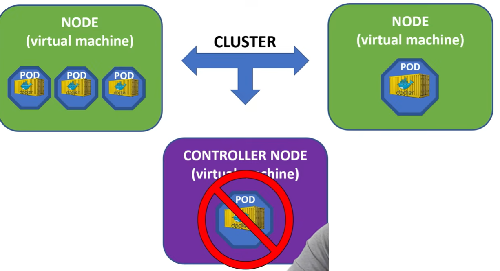

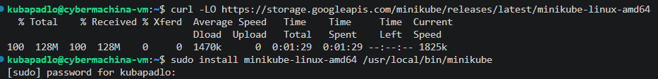

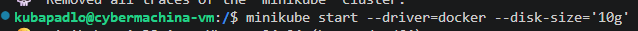

## `get nodes` i `get pods`

`get nodes` - pokazuje listę maszyn tworzących klaster

`get pods -A` - pokazuje wszystkie pody systemowe konieczne dla działania Kubernetesa
* **kube-apiserver-minikube**: Główny punkt kontaktu. To on odbiera komendy `kubectl`
* **etcd-minikube**: Baza danych klastra.
* **kube-scheduler-minikube**: "Planista". Decyduje, na którym węźle uruchomić nowy kontener
* **kube-controller-manager-minikube**: Pilnuje, aby stan faktyczny zgadzał się z pożądanym 
* **coredns**: Odpowiada za nazewnictwo wewnątrz klastra. Dzięki niemu kontenery mogą komunikować się ze sobą po nazwach
* **kube-proxy**: Odpowiada za sieć. To on kieruje ruch do odpowiednich kontenerów.
* **storage-provisioner**: Dodatek od Minikube, który pozwala łatwo tworzyć wirtualne dyski (wolumeny) dla danych.

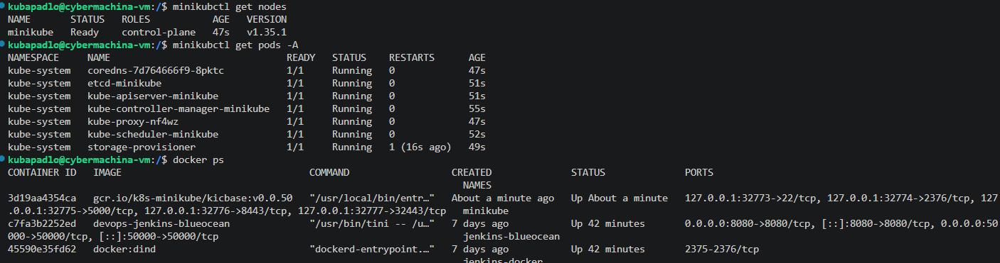

## dashboard
`minikube dashobard` odpala specjalny dodatek dla minikube.
W przeglądarce otwiera się graficzny interfejs do zarządzania klastrem.


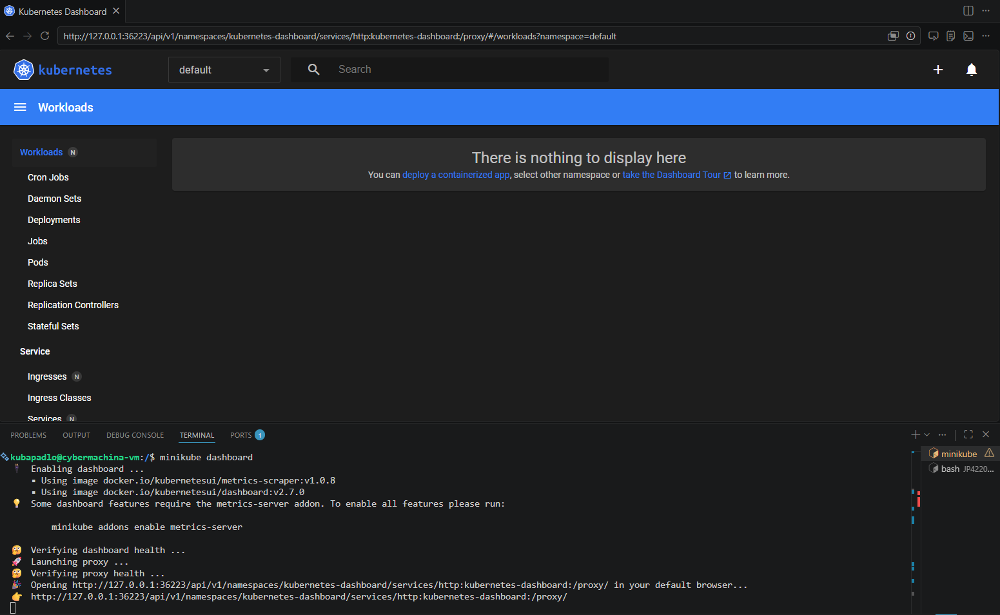

# Analiza posiadanego kontenera

## Stworzenie deploymentu, który sam zadba o utworzenie poda i pobranie wskazanego obrazu dockera
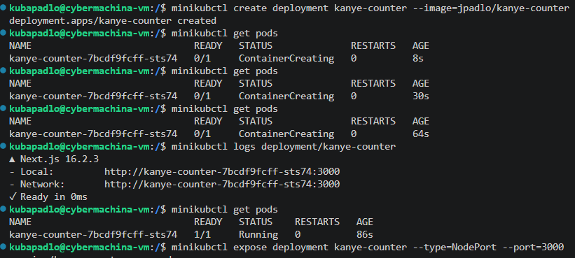

## Sprawdzenie, że kontener wstał
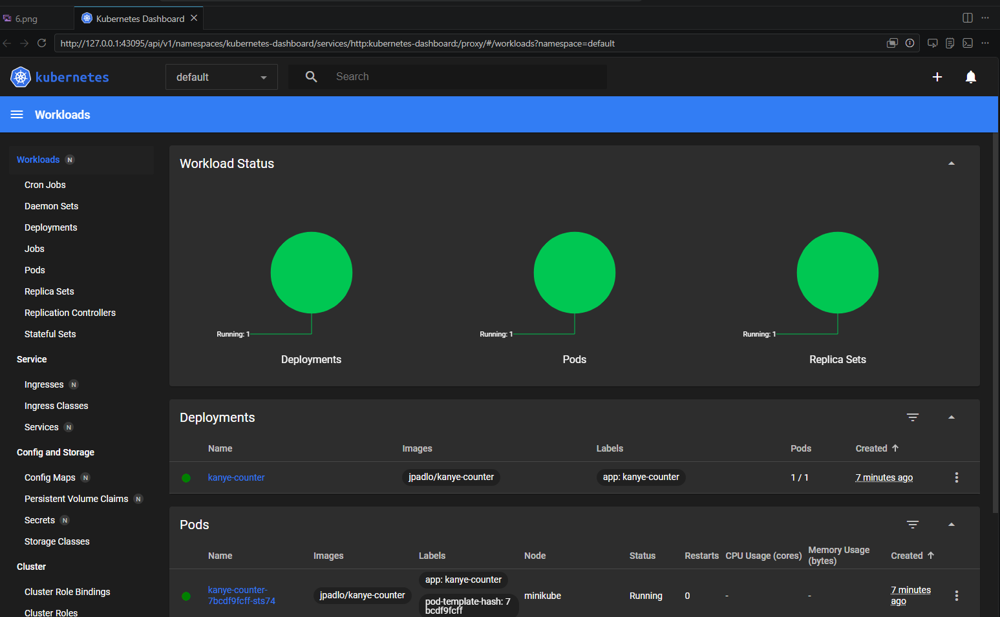

## Zweryfikowanie łączności
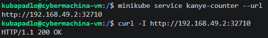

# Uruchamianie oprogramowania

## WAŻNE: Pod vs Deployment

### Pod (`kubectl run`)
* Pojedynczy kontener
* Po wywaleniu znika na zawsze
* Tylko do szybkich testów

### Deployment (`kubectl create deployment`)
* Zarządca, który tworzy pody
* Pilnuje zdefiniowanego stanu - po wywaleniu poda stawia nowy na jego miejsce
* Łatwe skalowanie
* W prawdziej pracy w 99% używa się deployment

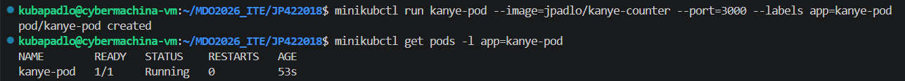

## Zweryfikowanie że pod wstał i działa

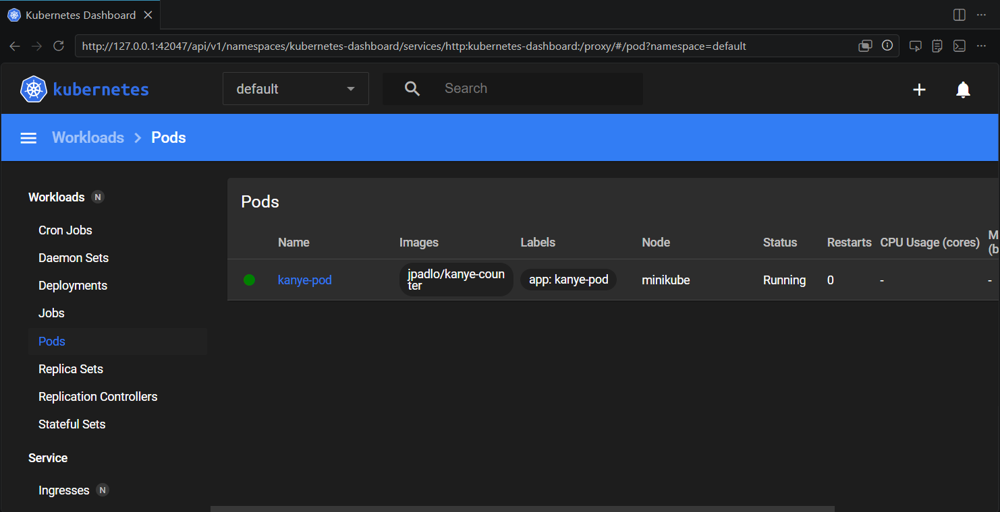

## Łączenie się po prywatnym IP klastra

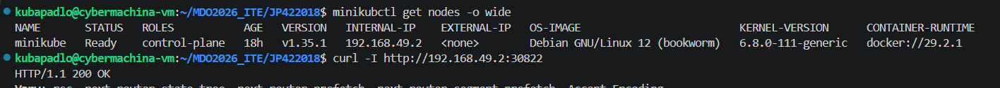

## Wystawienie poda 'na świat' i połączenie się do oprogramowania przez IP hosta.

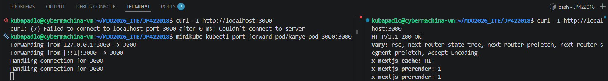


# Przekucie wdrożenia manualnego w plik wdrożenia

```yml
apiVersion: apps/v1      
kind: Deployment         # Typ obiektu
metadata:
  name: nginx-deployment # Unikalna nazwa
  labels:
    app: nginx           
spec:
  replicas: 4            # Deklaracja pożądanego stanu: Kubernetes ma zawsze utrzymywać 4 działające pody
  selector:
    matchLabels:
      app: nginx        
  template:              # Szablon, z którego powstaną nowe Pody 
    metadata:
      labels:
        app: nginx       # MUSI pasować do pola matchLabels powyżej!
    spec:
      containers:        # Definicja kontenerów, które będą działać wewnątrz każdego Poda
      - name: nginx     
        image: nginx:1.25 # Obraz kontenera pobierany z Docker Hub 
        ports:
        - containerPort: 80 
```
## Utworzenie pojedynczej instancji
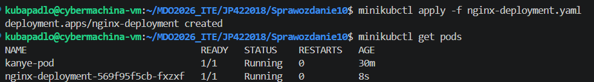

## Zmieniając jedną cyferkę w kodzie możemy momentalnie postawić kolejne 3 instancje
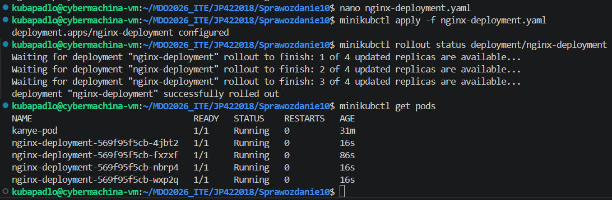

## Wystawienie portu poda z zamkniętej sieci wewnętrznej do sieci hosta
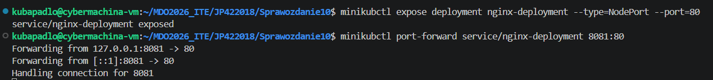
