# Przygotowanie nowych obrazów

### Posiadam dwie wersje obrazu
* jpadlo/kanye-counter:1.0.20
* jpadlo/kanye-counter:1.0.18

### Stworzenie nowego obrazu, który po uruchomieniu wywali błąd
`CMD` w Dockerfile definiuje komendę, która domyślnie zostanie wykonana przy każdym `docker run`
```dockerfile
# PRZED
CMD ["node", "server.js"]  

# PO
# Taki plik nie istnieje co spowoduje błąd
CMD ["node", "wymus-blad.js"]   
```

Wypchnąłem zepsutą wersję obrazu do dockerhub za pomocą `docker push`

# Plik wdrożeniowy
```yml
apiVersion: apps/v1
kind: Deployment
metadata:
  name: nextjs-app
  labels:
    app: nextjs
spec:
  replicas: 4
  selector:
    matchLabels:
      app: nextjs
  strategy:
    type: RollingUpdate
    rollingUpdate:
      maxSurge: 1
      maxUnavailable: 1
  template:
    metadata:
      labels:
        app: nextjs
    spec:
      containers:
      - name: nextjs-container
        image: jpadlo/kanye-counter:1.0.20
        imagePullPolicy: IfNotPresent
        ports:
        - containerPort: 3000
```

## 1. Modyfikacja ilości replik instancji
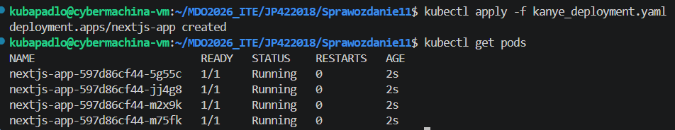

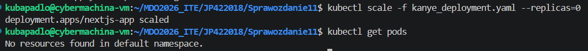

## 2. Modyfikacja wersji obrazu

### Zmiana wersji obrazu

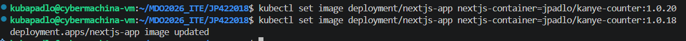

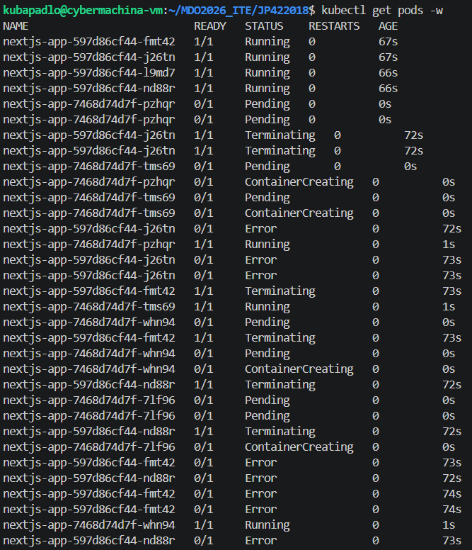

Z sukcesem podmieniono pody

### Zastosowanie wadliwego obrazu

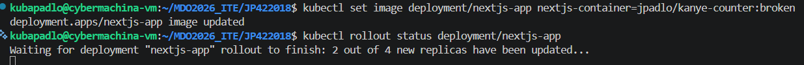

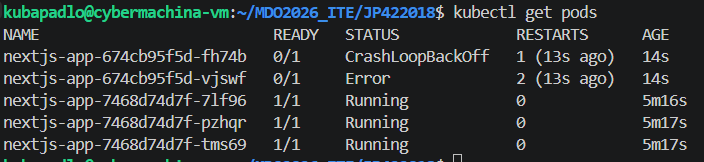

Dzięki RollingUpdate z `maxUnavailable: 1` kubernetes zauważył, że kontener jest wadliwy i pozwolił ubić tylko jeden.
      
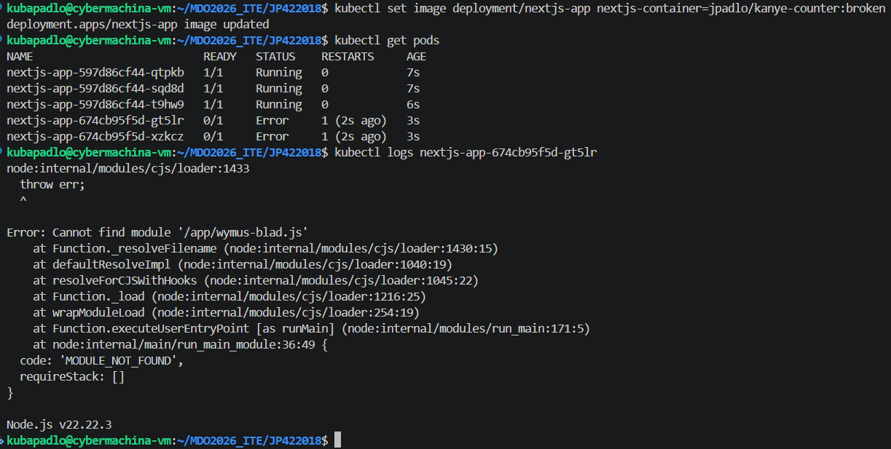

Dzięki `kubectl logs` możemy podejrzeć jaka była przyczyna błędu.

## 3. `kubectl rollout history` i `kubectl rollout undo`

### Z sukcesem przywrócono działającą wersję co zweryfikowano sprawdzeniem aktualnej wersji obrazu
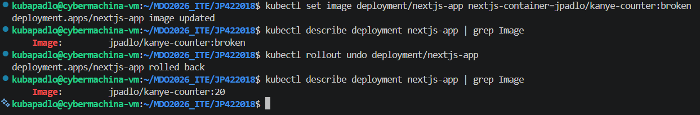

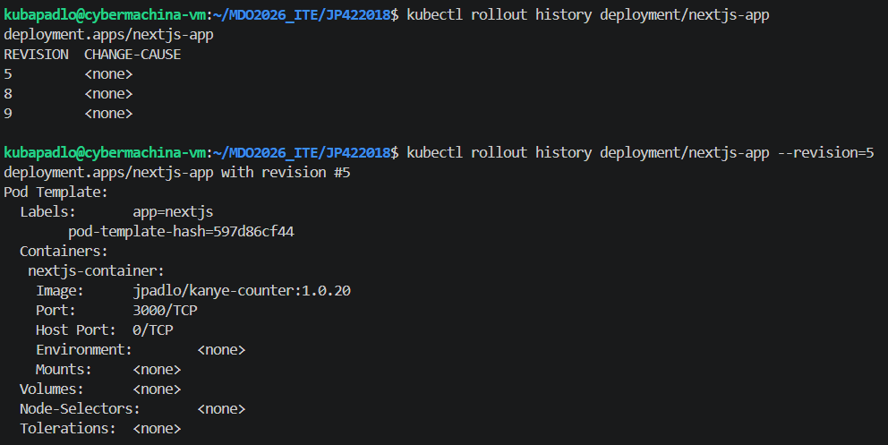

`kubectl rollout history <nazwa_wdrożenia>` - wyświetla listę zachowanych wersji wdrożenia.

`kubectl rollout history <nazwa_wdrożenia> --revision=5` - zagląda do wnętrza konkretnej wersji 

`kubectl rollout undo <nazwa_wdrożenia>` - błyskawiczny rollback. Bez parametru cofa do poprzedniej stabilnej wersji.

`kubectl describe <typ_zasobu> <nazwa_zasobu>` - szczegółowe informacje o zasobie. Najlepsze do debugowania. W sekcji **events** widać powody błędów.

## 4. Skrypt weryfikacyjny

```sh
#!/bin/bash

DEPLOYMENT_NAME="nextjs-app"
TIMEOUT="60s"

kubectl() {
  minikube kubectl -- "$@"
}

echo "Oczekiwanie na wdrożenie $DEPLOYMENT_NAME (limit $TIMEOUT)..."

if kubectl rollout status deployment/$DEPLOYMENT_NAME --timeout=$TIMEOUT; then
    echo "SUKCES: Wdrożenie zakończone pomyślnie w ciągu 60 sekund."
    exit 0
else
    echo "BŁĄD: Wdrożenie nie powiodło się lub przekroczyło czas 60 sekund."
    
    echo "Ostatnie zdarzenia:"
    kubectl get events --sort-by='.lastTimestamp' | tail -n 3
    exit 1
fi
```
`kubectl rollout status <nazwa_wdrozenia>` - Na bieżąco monitoruje postęp aktualizacji wdrożenia. Do sprawdzania czy nowa wersja weszła z powodzeniem. **Zwraca kod 0 jeśli sukces, lub inny jeśli timeout/błąd**

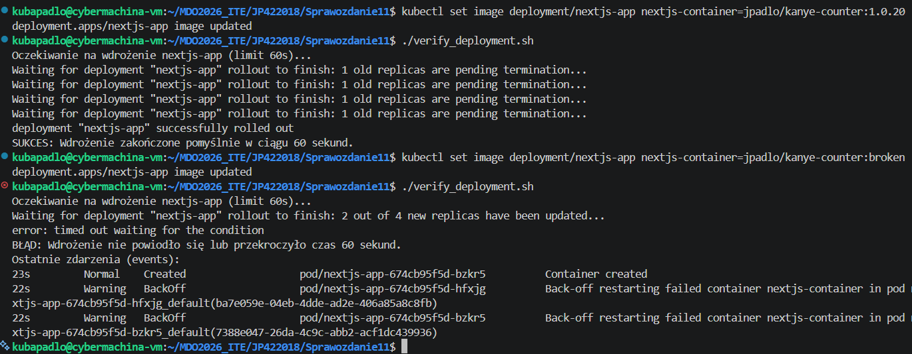

# Strategie wdrożenia


## 1. Recreate
Kubernetes najpierw wyłącza i usuwa wszystkie stare pody, a dopiero gdy znikną, zaczyna tworzyć nowe. Powoduje downtime. Stosuje się gdy nowa wersja jest niekompatybilna ze starą.
```yml
spec:
  replicas: 4
  strategy:
    type: Recreate 
  selector:
    matchLabels:
      app: nextjs
      strategy: recreate
  template:
    metadata:
      labels:
        app: nextjs
        strategy: recreate
```
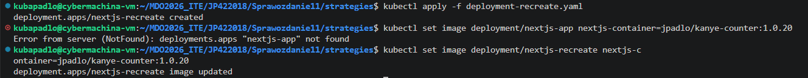

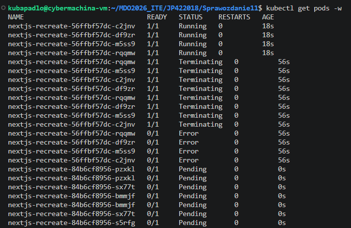

## 2. Rolling Update
Standard. Stopniowo podmienia pody małymi partiami. Tworzy nowy pod, a gdy ten jest gotowy, usuwa jeden stary. Zero downtime.
```yml
spec:
  replicas: 5
  strategy:
    type: RollingUpdate
    rollingUpdate:
      maxSurge: 30%       
      maxUnavailable: 2   
```
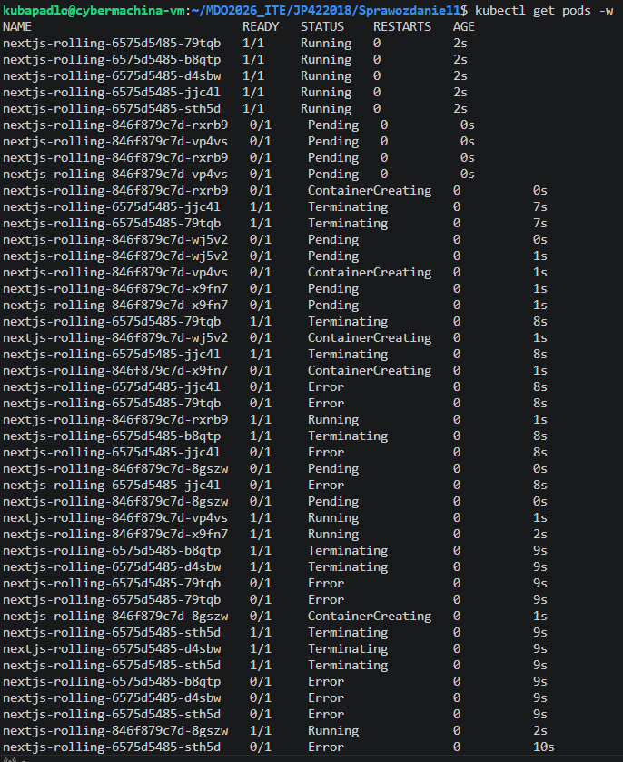

**maxSurge** - Pody dodawane i usuwane są w stosunku 1:1. MaxSurge mówi ile więcej podów ponad zadeklarowaną liczbę Kubernetes może tymczasowo utworzyć podczas aktualizacji. Większy maxSurge przyspiesza wdrożenie, ale wymaga więcej wolnego miejsca (CPU/RAM) w klastrze.

**maxUnavailable** - Ile podów z zadelarowanej ilości może być niedostępnych podczas aktualizacji. Większy maxUnavailable przyspiesza podmianę, ale tymczasowo zmniejsza wydajność aplikacji 

### Analiza
1. Stan początkowy: 5 replik
2. Rozpoczęcie tworzenie 2 dodatkowych podów. 
3. Zanim nowe pody stały się gotowe, zabito 2 stare pody. To pokazuje działanie parametru maxUnavailable: 2. Klaster uznał, że może pozwolić sobie na tymczasowy brak 2 podów.
4. Podmiana: Tworzenie nowych podów i usuwanie starych partiami. Stare dają stan error - wynik gwałtownego zamknięcia procesu Node.js


## 3. Canary
Bezpiecznego testowania nowej wersji na żywym ruchu.
Oba Deploymenty mają wspólną etykietę app: nextjs-canary. Dzięki temu serwis widzi wszystkie 4 pody jako jedną aplikację.
* Stable (3 repliki): Przejmuje 75% zapytań (bezpieczna, stara wersja).
* Canary (1 replika): Przejmuje 25% zapytań (nowa, testowa wersja).

```yml
apiVersion: apps/v1
kind: Deployment
metadata:
  name: nextjs-stable
spec:
  replicas: 3
  selector:
    matchLabels:
      app: nextjs-canary
      version: stable
  template:
    metadata:
      labels:
        app: nextjs-canary
        version: stable
    spec:
      containers:
      - name: nextjs-container
        image: jpadlo/kanye-counter:1.0.18  # Bazowa wersja
---
# WERSJA KANARKOWA 
apiVersion: apps/v1
kind: Deployment
metadata:
  name: nextjs-canary
spec:
  replicas: 1 
  selector:
    matchLabels:
      app: nextjs-canary
      version: canary
  template:
    metadata:
      labels:
        app: nextjs-canary
        version: canary
    spec:
      containers:
      - name: nextjs-container
        image: jpadlo/kanye-counter:broken # Testowana wersja
```

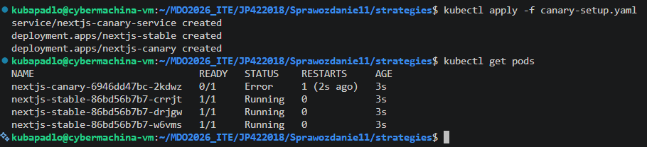

## Porównanie

| Cecha | Recreate | Rolling Update | Canary Deployment |
| :--- | :--- | :--- | :--- |
| **Dostępność** | Przerwa w działaniu (Downtime). | Pełna dostępność. | Pełna dostępność. |
| **Ryzyko** | Niskie (brak mieszania wersji). | Średnie (nowe pody mogą psuć sesje). | Najniższe (test na małej grupie). |
| **Zachowanie podów** | Najpierw usuwa wszystkie stare, potem tworzy nowe. | Tworzy nowe pody "obok" starych i stopniowo je podmienia. | Dwie wersje działają obok siebie w osobnych Deploymentach. |
| **Przeznaczenie** | Aplikacje, które nie mogą działać w dwóch wersjach na raz (np. migracje bazy). | Standardowe aplikacje webowe. | Testowanie nowych funkcji na żywych użytkownikach. |