# Sprawozdanie LAB 12
### Jakub Padło, 422018

# Przygotowanie kontenera
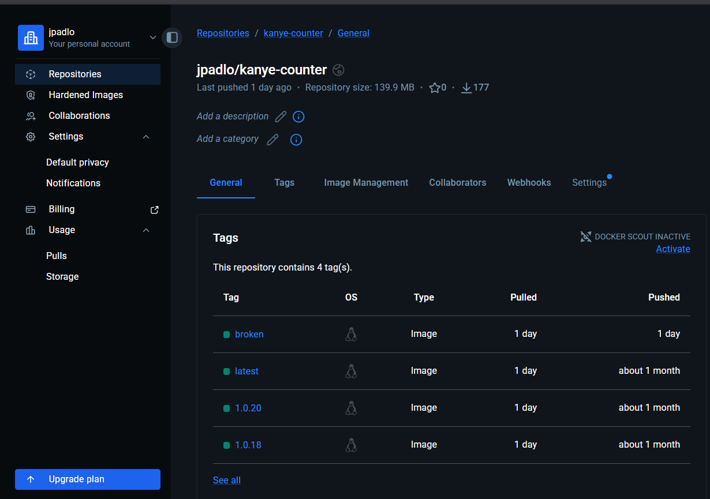

### Opisac czym jest moj obraz, co to za appka

# Zapoznanie z platformą

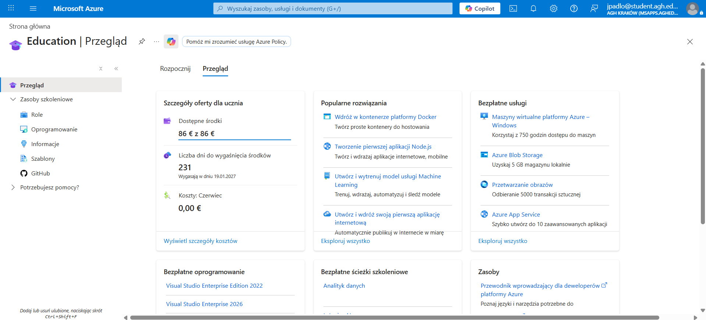

## Azure Cloud Shell

### Rejestracja usługi i połączenie z powłoką

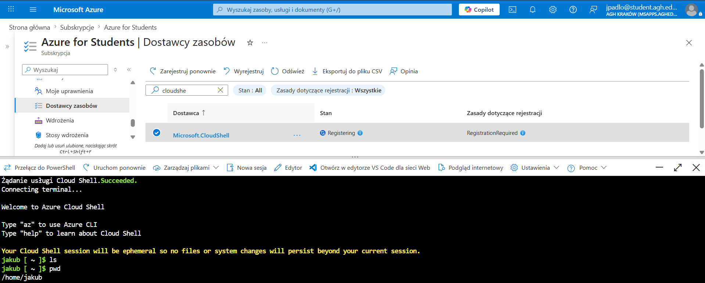

* Terminal pozwalający zarządzać zasobami Azure
* Gotowe do pracy bezpośrednio w przeglądarce w portalu Azure. Nie trzeba instalować dodatkowego CLI
* Zawiera aktualne popularne narzędzie takie jak git, docker, ansible itd...
* Możliwość pracy na bashu lub Powershellu
* Pod maską uruchamiany jest tymczasowy kontener udostępniający terminal
* **WAŻNE** - Aby zmiany i nowe pliki zostały zachowane po zamknięciu terminala koniecznie jest podpięcie do Azure Storage Account (może pobierać kredyty)

### Azure CLI vs Azure Powershell

#### Azure CLI
* Zwraca wyniki jako czysty tekst
* Dostępne tylko w trybie bash
* Przykład: `az vm create --name MojaVM --resource-group MojaGrupa`

#### Azure Powershell
* Zwraca obiekty .NET, co oznacza, że łatwo można wyciągać konkretne właściwości np. `$status.IpAddress` oraz przekazywać je dalej za pomocą potoku `|` np. `Get-Process | Sort-Object -Property WorkingSet -Descending | Select-Object -First 5`
* Dostępne zarówno w trybie bash jak i powershell
* Przykład: `New-AzVM -Name "MojaVM" -ResourceGroupName "MojaGrupa"`

# Zadanie do wykonania

## 1. Utworzenie Resource Group
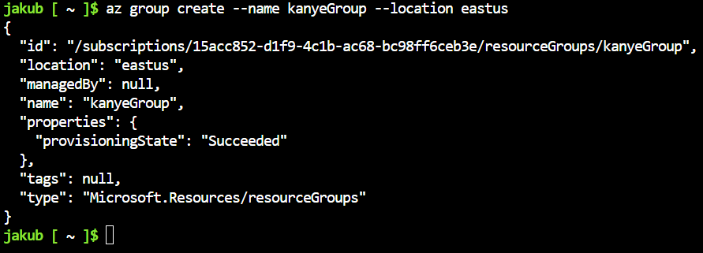

## 2. Wdrożenie kontenera z DockerHub
### Aktywowanie usługi odpowiedzialnej za kontenery

#### **DISCLAIMER:** Rejestracja usług to włączanie "wtyczek" w Azure. Na starcie Azure rejestruje tylko wymagane minimum. API działa szybciej, gdy nie musi ładować setek niepotrzebnych funkcji na raz. Dodatkowo zapewnia to ochronę, aby przypadkowo nie uruchomić kosztownych usług.

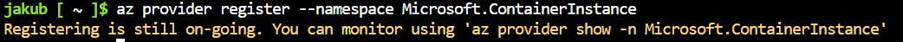

### Uruchomienie kontenera

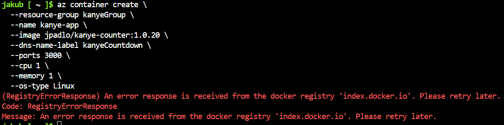

Próba pobrania obrazu bezpośrednio z DockerHub kończyła się za każdym razem błędem ze stronu rejestru. Zmieniłem podejście na skorzystanie z **Azure Container Registry**.

### Azure Container Registry - prywatny odpowiedni DockerHub zintegrowany z ekosystemem Azure

### 1. Utworzenie rejestru na obrazy Dockera
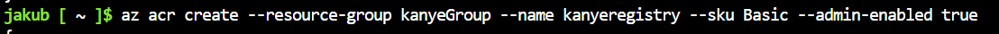

* **--sku Basic** - określa plan cenowy
* **--admin-enabled true** – włącza konto administratora i generuje prostą parę login/hasło.

### 2. Zaimportowania istniejącego obrazu kontenera z zewnętrznego rejestru bezpośrednio do rejestru Azure

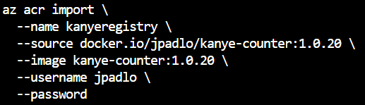

```
az acr credential show --name kanyeregistry
```
Sprawdzenie loginu i hasła jaki został wygenerowany podczas tworzenia rejestru. Bedą potrzebne do pózniejszego pobierania obrazów z rejestru.

### 3. Utworzenie kontenera

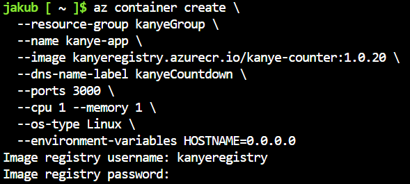

* **--name kanye-app** – nazwa kontenera.
* **--image kanyeregistry.azurecr.io/kanye-counter:1.0.20** – pełna ścieżka do obrazu w Twoim rejestrze ACR
* **--dns-name-label kanyeCountdown** – nadaje kontenerowi publiczną nazwę DNS. Dzięki temu Twoja aplikacja będzie dostępna w internecie pod adresem: kanyeCountdown.[region-azure].azurecontainer.io.
* **--ports 3000** – otwiera port 3000 kontenera dla ruchu przychodzącego z internetu
* **--cpu 1 --memory 1** – definiuje zasoby sprzętowe przydzielone dla tego kontenera
* **--os-type Linux** – informuje Azure, że kontener wymaga środowiska Linux do działania.
* **--environment-variables HOSTNAME=0.0.0.0** - 0.0.0.0 oznacza "słuchaj na wszystkich interfejsach" - bez tego Next.js próbuje bindować się tylko do nazwy hosta kontenera, która jest nieosiągalna z zewnątrz.
* Rejestr Azure Container Registry jest prywatny i zabezpieczony, więc aby pobrać z niego obrazu trzeba się uwierzytelnić.

### Wnioski 
`az container create` reprezentuje wysoki poziom abstrakcji. Jednym parametrem konfiguruje publiczną domenę Microsoft i rejestruje DNS, aby wystawić kontener "na świat". Dodatkowo działa w modelu Serverless.

### **Serverless** - model działania w chmurze, w którym nie musisz kupować, konfigurować ani zarządzać żadnymi serwerami. Wszystkim zajmuje się dostawca chmury.
* Brak zarządzania infrastrukturą
* Automatyczne skalowanie w zależności od ruchu
* Płatność tylko za faktyczne użycie


### Sprawdzenie stanu wdrożenia
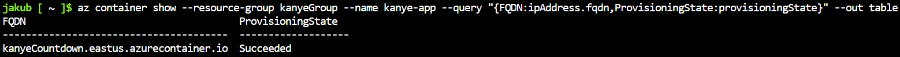

### Wykazanie działania 

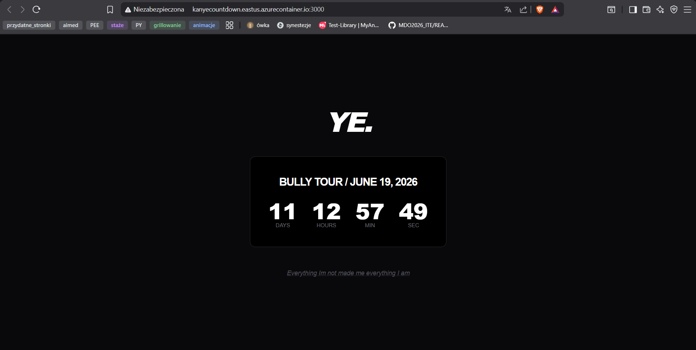

### Pobranie logów kontenera
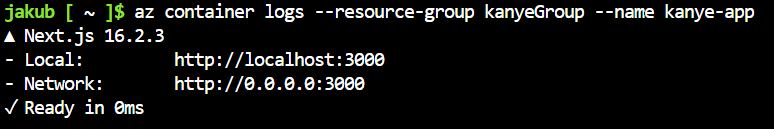

## 3. Usunięcie kontenera i grupy zasobów

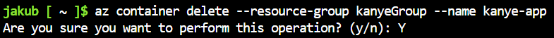

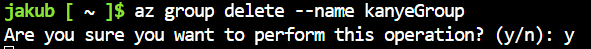

Usunięcie grupy zasobów działa kaskadowo - Azure usunie wszystko, co się w niej znajdowało.