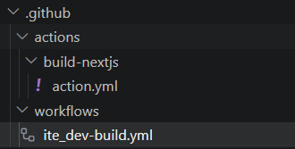
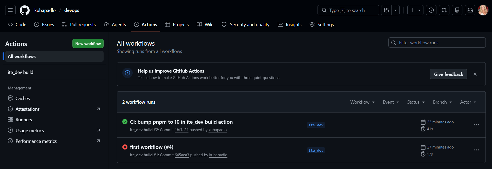
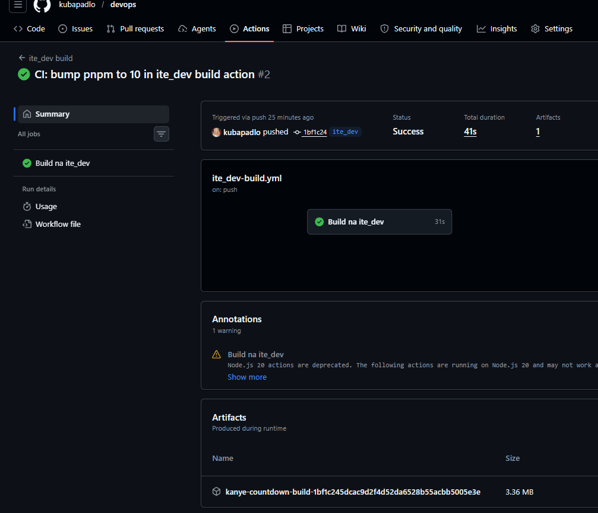
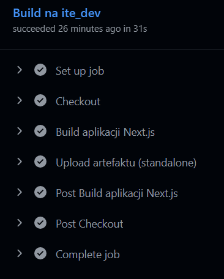

# Sprawozdanie LAB 12
### Jakub Padło, 422018

# Github Actions
GitHub Actions to wbudowana w platformę GitHub platforma do automatyzacji procesów programistycznych. Pozwala ona na tworzenie workflowów, które są wyzwalane przez zdarzenia w repozytorium.

W praktyce GitHub Actions działa jak wirtualny komputer, na którym można uruchamiać skrypty, testy, budować aplikacje i wdrażać je na serwery, całkowicie automatyzując żmudne, powtarzalne czynności.

Workflowy definiuje się w plikach YAML umieszczonych w katalogu .github/workflows/.

# Typowe zastosowania w praktyce
### 1. Automatyczne testowanie
Uruchomienie testów przy każdej kontrybucji do repo pozwala wykryć błędy jak najszybciej i zapobiega wysłaniu błędnego kodu dalej w procesie.

### 2. Automatyczne wdrażanie 
Zamiast ręcznie logować się na serwer przez SSH i kopiować pliki, można skonfigurować workflow, który sam to zrobi. 
Np. Po pushu na maina GitHub Actions automatycznie zbuduje aplikację i prześle ją na serwer lub do chmury.

### 3. Automatyzacja zarządzania repozytorium
Możena zautomatyzować zarządzanie Issues, Pull Requestami, wysyłać powiadomienia do zewnętrznych usług itd...

Korzyść: Oszczędność czasu na porządkowaniu projektu i wymuszaniu dobrych praktyk.

### 4. Sprawdzanie czy kod, który trafia do repozytorium, spełnia standardy firmy/jest wysokiej jakości.
Przy każdym pushu można uruchomić linter, który przeprowadzi statyczną analizę kodu sprawdzającą czy kod jest czytelny i bezpieczny.

# Stworzenie własnej akcji przeprowadzającej build

### Wersja minimalna
```yml
name: "Build Next.js"
description: "Instaluje zależności i buduje aplikację Next.js."
runs:
  using: "composite"
  steps:
    - uses: pnpm/action-setup@v4
      with:
        version: 10
    - uses: actions/setup-node@v4
      with:
        node-version: 22
        cache: pnpm
    - shell: bash
      run: pnpm install --frozen-lockfile
    - shell: bash
      run: pnpm run build
```

## WAŻNE
W plikach akcji trzeba jawnie określić runs.using, aby wskazać silnik wykonawczy. Mamy do wyboru `composite` lub `docker`

```yml
using: "composite"
```
Wykonuje Twoje kroki bezpośrednio na maszynie, na której działa workflow. Jest bardzo szybki, ponieważ nie traci czasu na uruchamianie izolowanego środowiska. Idealny do łączenia kilku prostych komend w jedną akcję.

Druga opcją jest `using: "docker"`. Przed wykonaniem zadań GitHub musi pobrać obraz, uruchomić kontener, a po zakończeniu go zamknąć. Jest wolniejszy przez narzut startowy, ale zapewnia pełną izolację - masz pewność, że wszystkie biblioteki systemowe i wersje narzędzi są dokładnie takie, jakie zdefiniowałeś w Dockerfile.


```yml
  steps:
    - uses: pnpm/action-setup@v4
    - uses: actions/setup-node@v4
    - shell: bash
      run: pnpm install --frozen-lockfile
    - shell: bash
      run: pnpm run build
```

**Kolejne kroki:** Przygotowanie pnpm(menedżer pakietów) -> Przygotowanie node -> Instalacja zależności -> Budowanie

```yml
with:
    cache: pnpm
```
Zapamiętanie zależności, jeśli następnym razem się nie zmienią to github nie będzie pobierał ich na nowo tylko skorzysta z cache


### Wersja rozszerzona z dobrymi praktykami
```yml
name: "Build Next.js (kanye-countdown)"
description: "Custom composite action: instaluje zależności pnpm, lintuje, testuje i buduje aplikację Next.js."

inputs:
  node-version:
    description: "Wersja Node.js"
    required: false
    default: "22"
  pnpm-version:
    description: "Wersja pnpm"
    required: false
    default: "10"
  run-lint:
    description: "Czy uruchomić lint (true/false)"
    required: false
    default: "true"
  run-tests:
    description: "Czy uruchomić testy (true/false)"
    required: false
    default: "true"

outputs:
  artifact-path:
    description: "Ścieżka do katalogu z artefaktem standalone"
    value: ".next/standalone"

runs:
  using: "composite"
  steps:
    - name: Setup pnpm
      uses: pnpm/action-setup@v4
      with:
        version: ${{ inputs.pnpm-version }}

    - name: Setup Node.js
      uses: actions/setup-node@v4
      with:
        node-version: ${{ inputs.node-version }}
        cache: "pnpm"

    - name: Install dependencies
      shell: bash
      run: pnpm install --frozen-lockfile

    - name: Lint
      if: ${{ inputs.run-lint == 'true' }}
      shell: bash
      run: pnpm run lint

    - name: Test
      if: ${{ inputs.run-tests == 'true' }}
      shell: bash
      run: pnpm run test

    - name: Build
      shell: bash
      run: pnpm run build
```

## Testowanie i lint
Zanim obraz zostanie zbudowany przeprowadza się testy. Jeśli, któryś etap rzuci błąd to workflow zostaje przerywany co jest sensowne bo po co budować wadliwy kod.

## Parametryzacja i warunkowość
Wersje narzędzi nie są zhardcodowane - łatwo je zmieniać przekazując odpowiedni parametr w workflow.

Dodatkowo niektóre opcjonalne kroki wykonają się w zależności od parametru podanego w workflow. Wprowadza to elastyczność i pozwala optymalizować procesy.


# Utworzenie akcji reagującej na kontrybucję do gałęzi `ite_dev`

Workflow to orkiestrator wywołujący w odpowiednim momencie wcześniej zdefiniowaną akcję.

### Wersja minimalna
```yml
name: ite_dev build
on:
  push:
    branches: [ite_dev]

jobs:
  build:
    runs-on: ubuntu-latest
    steps:
      - uses: actions/checkout@v4
      - uses: ./.github/actions/build-nextjs
      - uses: actions/upload-artifact@v4
        with:
          name: kanye-countdown-build
          path: |
            .next/standalone
            .next/static
            public
```

* workflow uruchomi się przy każdym pushu na gałąź ite_dev
* wszystko wydarzy się na VM z ubuntu

```yml
steps:
  - uses: actions/checkout@v4            # Pobiera kodu źródłowego z repo na VM. Bez tego workflow nie miałby dostępu do plików.
  - uses: ./.github/actions/build-nextjs # Wywołanie wcześniej zdefinowanej composite action
  - uses: actions/upload-artifact@v4     # Domyślnie VM'ka i wszystkie jej pliki są usuwane na końcu workflow. `upload-artifact` bierze wynik budowania i zapisuje go na serwerach GitHuba.
```


### Wersja rozszerzona
```yml
name: ite_dev build

on:
  push:
    branches:
      - ite_dev
  pull_request:
    branches:
      - ite_dev
  workflow_dispatch:    

permissions:
  contents: read

concurrency:
  group: ite_dev-build-${{ github.ref }}
  cancel-in-progress: true

jobs:
  build:
    name: Build na ite_dev
    runs-on: ubuntu-latest

    steps:
      - name: Checkout
        uses: actions/checkout@v4

      - name: Build aplikacji Next.js
        id: build
        uses: ./.github/actions/build-nextjs
        with:
          node-version: "22"
          pnpm-version: "10"

      - name: Upload artefaktu (standalone)
        uses: actions/upload-artifact@v4
        with:
          name: kanye-countdown-build-${{ github.sha }}
          path: |
            .next/standalone
            .next/static
            public
          if-no-files-found: error
          retention-days: 7
```

```yml
workflow_dispatch:
```
Dodaje przycisk "Run workflow" w interfejsie GitHuba. Można ręcznie uruchomić build bez konieczności robienia push


```yml
permissions:
  contents: read
```
Ograniczenie uprawnień GH tylko do czytania kodu. Jeśli ktoś przejmie kontrolę nad workflow, nie będzie mógł nadpisać repo.

```yml
concurrency:
  group: ite_dev-build-${{ github.ref }}
  cancel-in-progress: true
```
Jeśli wyślesz trzy commity w krótkim odstępie czasu, GitHub Actions anuluje dwa poprzednie (które już są nieaktualne) i skupi się tylko na tym najnowszym. Nie marnujesz czasu runnerów na budowanie wersji, która za chwilę zostanie nadpisana.


```yml
${{ github.sha }}
```
Dynamiczna nazwa - Każdy build ma unikalną nazwę opartą na identyfikatorze commita


```yml
retention-days: 7
```
Po tygodniu stare artefakty są automatycznie usuwane.

## Struktura w projekcie




## Zakładka Github Actions



## Po pushu na gałąź ite_dev build przeszedł i zapisał artefakt 


