# Stawianie dockera
1. Utwórz katalog na klucze GPG
2. Pobierz i zapisz klucz GPG Dockera
3. Daj wszystkim prawo odczytu klucza
4. Dodaj repozytorium Dockera do źródeł apt
5. Odśwież listę pakietów

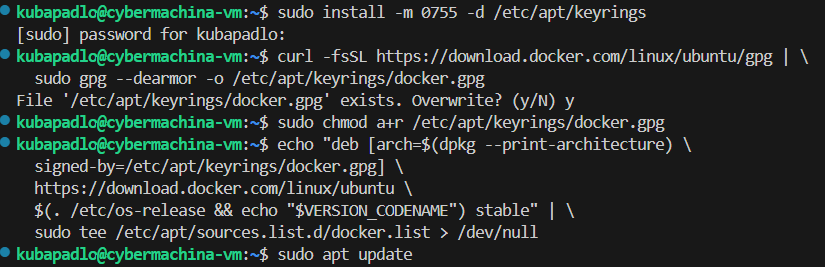

### Zainstaloawnie sładników Dockera: silnik, narzędzie poleceń i narzędzia do obsługi obrazów
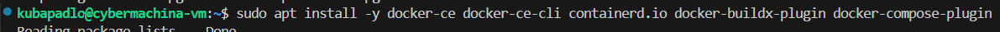

# Zapoznanie się z obrazami sprawdzając kod wyjścia
### 1. Hello World
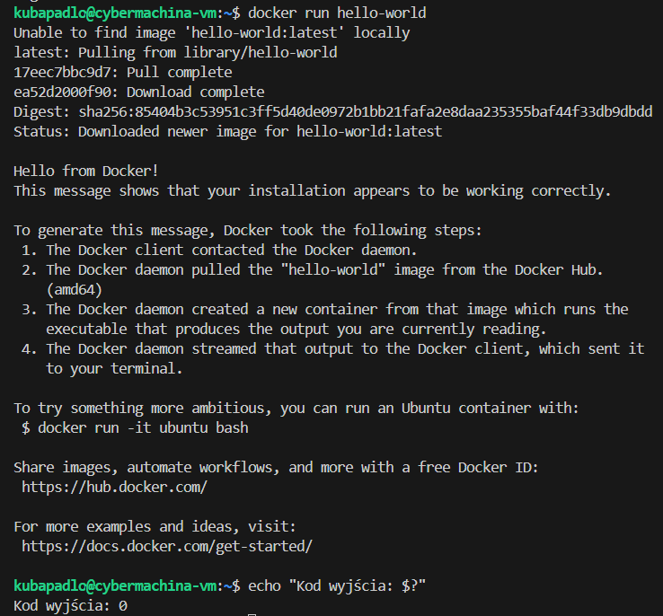

### 2. Busybox
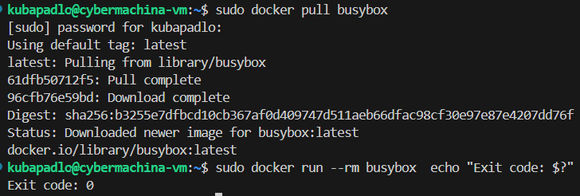

### 3. aspnet
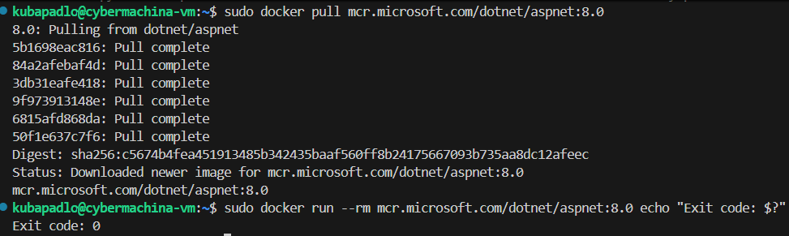

### Sprawdzenie rozmiarów powyższych obrazów
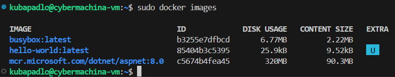

# Uruchomienie kontenera z obrazu busybox, podłączenie interaktywne i sprawdzenie wersji
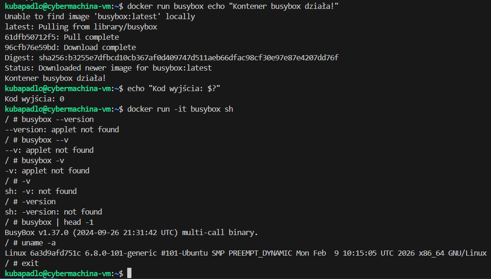

# System w kontenerze
### 1. Uruchomienie ubuntu w kontenerze i sprawdzenie PIDU wewnatrz kontenera 
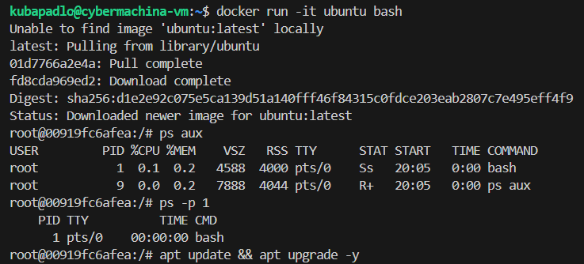

### 2. Sprawdzenie PID'u tego samego kontenera na hoście
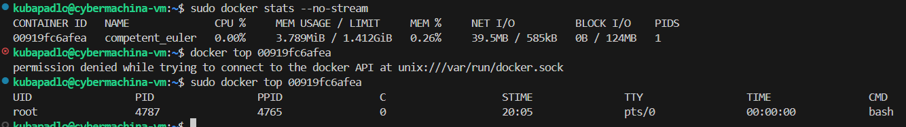

### Wniosek
* Kontener to tylko izolowany proces na hoście. Myśli, że jego PID to 1, ale w rzeczywistości na hoście ma zwykły wysoki PID
* oba środowiska współdzielą ten sam kernel

# Stworzenie własnego obrazu
### 1. Własnoręcznie napisany Dockerfile i zbudowanie obrazu
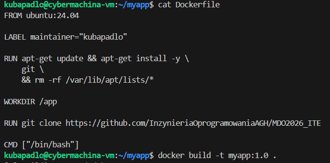

Dobre praktyki w Dockerfile:
* ubuntu:24.04 zamiast ubuntu:latest - przewidywalność buildów
* Jeden RUN dla update + install - mniej warstw w obrazie
* rm -rf /var/lib/apt/lists/* - czyszczenie cache apt, mniejszy rozmiar obrazu
* WORKDIR zamiast cd w RUN - czytelność i bezpieczeństwo
* LABEL z metadanymi - dobra praktyka dokumentacyjna
* CMD zamiast ENTRYPOINT dla interaktywnego użycia

### 2. Interaktywne uruchomienie i przetestowanie kontenera
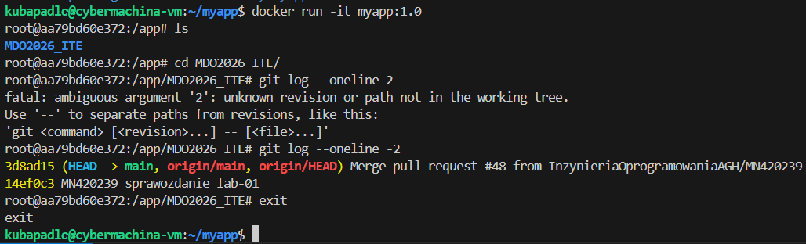

# Sprzątanie
### 1. Sprawdzenie uruchomionych kontenerów, a potem ich usunięcie
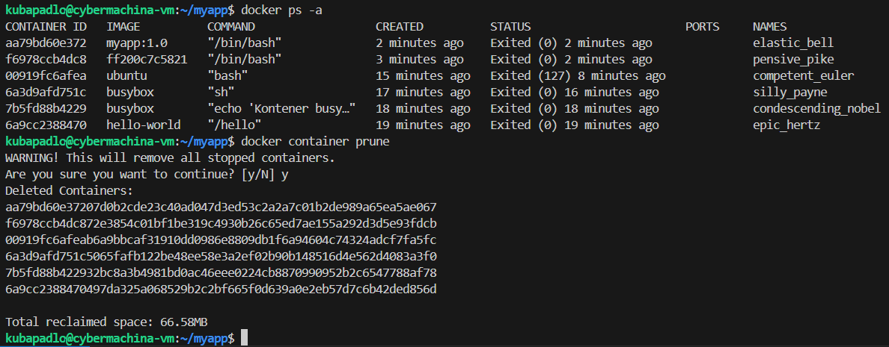

### 2. Usunięcie wszystkich obrazów
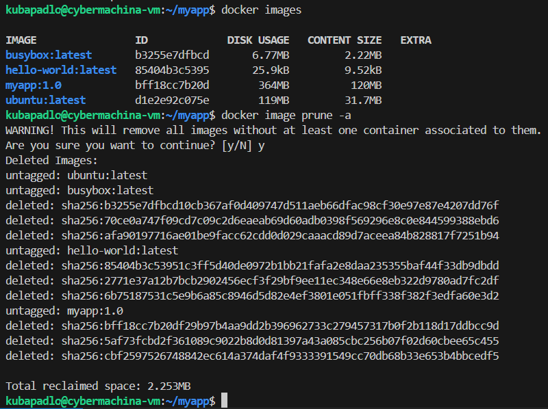