# Interaktywne budowanie i testowanie w kontenerze
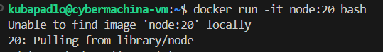

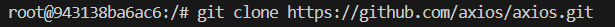

### Instalacja zależności
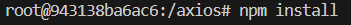

### `npm run build` bierze źródłowy kod axios z lib/ i kompiluje go do kilku formatów dystrybucyjnych w katalogu dist/.
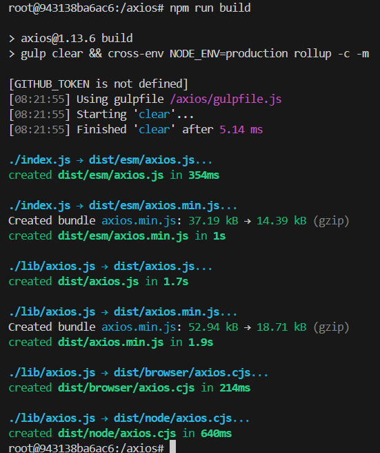

### Uruchomienie testów
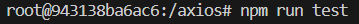

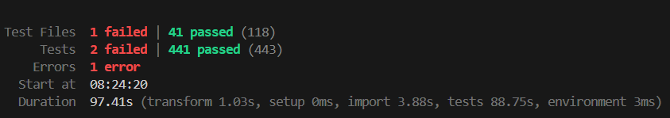

# Automatyzacja przez Dockerfile
### Dzięki temu zamiast ręcznie wpisywać komendy w interaktywnym TTY, mamy powtarzalny, zautomatyzowany proces. Każdy docker build odtwarza dokładnie te same kroki na każdej maszynie, bez potrzeby ręcznej interwencji.
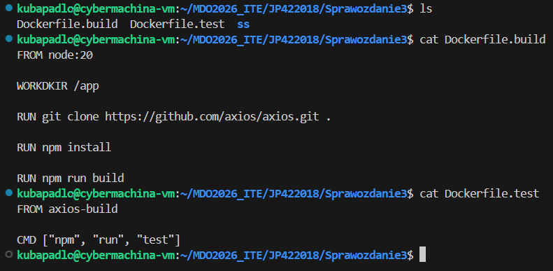

## !UWAGA!
```bash
# CMD
docker build -f Dockerfile.build -t **XYZ**     # Nadanie nazwy obrazowi podczas budowania
```
```yml
# Dockerfile.test
FROM **XYZ**    # Aby inny kontener bazował na poprzednim to w Dockerfile korzystamy z tej nazwy
```
### Docker szuka obrazu o tej nazwie lokalnie. Dlatego kolejność ma znaczenie. Najpierw trzeba zbudować axios-build, a dopiero potem axios-test. `depends_on` w Docker Compose właśnie to wymusza.
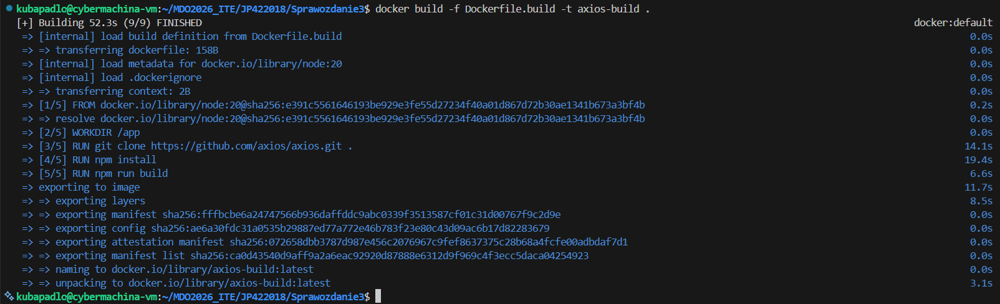

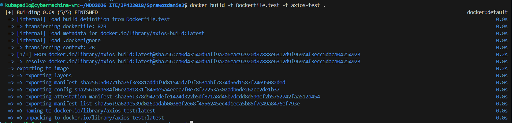

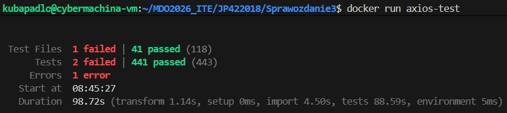

# Sprawdzenie działajacych kontenerów i istniejących obrazów
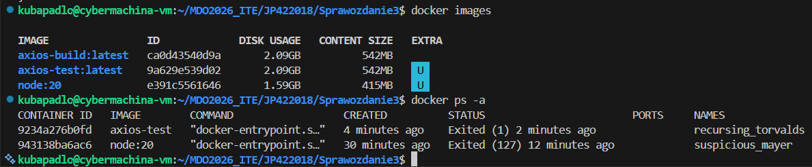

# Docker-compose
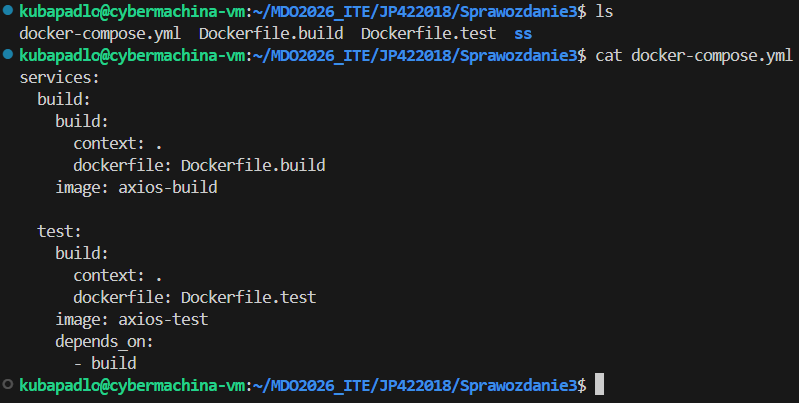

### Kolejny poziom automatyzacji - Zamiast ręcznie wydawać dwie osobne komendy docker build w odpowiedniej kolejności, jedna komenda `docker compose up --build` buduje oba obrazy we właściwej kolejności i zarządza zależnością między nimi.

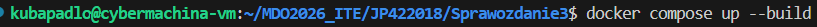

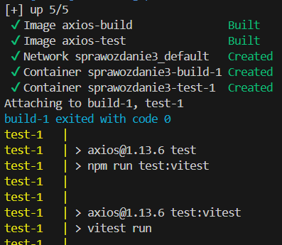

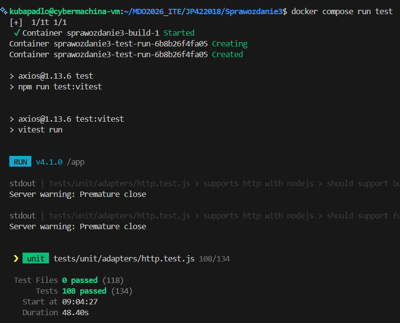

# Dyskusja
## Czy axios nadaje się do wdrożenia jako kontener?

Nie. Axios to biblioteka JavaScript, nie samodzielna aplikacja - nie ma procesu i nie nasłuchuje na portach.
Kontener służy tu wyłącznie jako środowisko do buildu i testów, nie jako finalny artefakt.

## Finalny artefakt

Dla biblioteki npm artefaktem jest paczka `.tgz` z katalogu `dist/`,
publikowana do rejestru `npmjs.com` przez `npm publish`.
Użytkownicy instalują ją standardowo przez `npm install axios`.

## Podział odpowiedzialności między Dockerfile'ami
* `Dockerfile.build`- instalacja zależności + kompilacja
* `Dockerfile.test` - uruchomienie testów (bazuje na build)
* `Dockerfile.publish` - publikacja do npm (bazuje na build, wymaga `NPM_TOKEN`)

Test i publish to niezależne ścieżki - obie bazują na tym samym obrazie buildowym.

## Multi-stage build (dla aplikacji, nie bibliotek)

Przy wdrażaniu aplikacji jako kontener stosuje się multi-stage build: pierwszy etap
kompiluje kod z pełnym zestawem narzędzi deweloperskich, drugi etap kopiuje tylko
gotowe artefakty do czystego obrazu. Efekt: mniejszy obraz, mniejsza powierzchnia ataku.

**Dla axios nie ma to zastosowania - nie wdrażamy kontenera, wdrażamy paczkę npm**