# LAB 4
# Zachowywanie stanu między kontenerami
## 1. Przygotowanie wolumenów
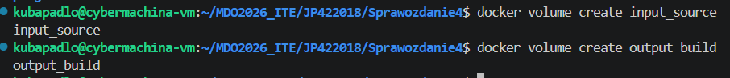

## 2A. Klonowanie repo bez gita w kontenerze
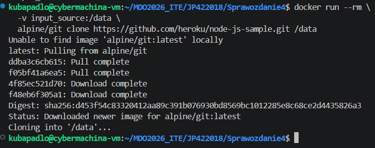

#### Użyłem kontenera pomocniczego, który służy wyłącznie do pobrania kodu i zapisania go na wolumenie input_source.
#### **Dlaczego tak?**
* Izolacja: Kontener bazowy pozostaje czysty. Nie musimy instalować w nim Gita, co zmniejsza rozmiar obrazu i zwiększa bezpieczeństwo
* Automatyzacja: Nie musimy ręcznie kopiować plików z hosta ani polegać na tym, czy host ma zainstalowanego Gita. Cały proces jest powtarzalny na dowolnej maszynie z Dockerem.
* Persystencja: Dane trafiają bezpośrednio do wolumenu zarządzanego przez Dockera, co jest wydajniejsze niż Bind Mount na niektórych systemach.

### 3. Uruchomienie kontenera, podłączyenie obu wolumenów i wykonanie builda
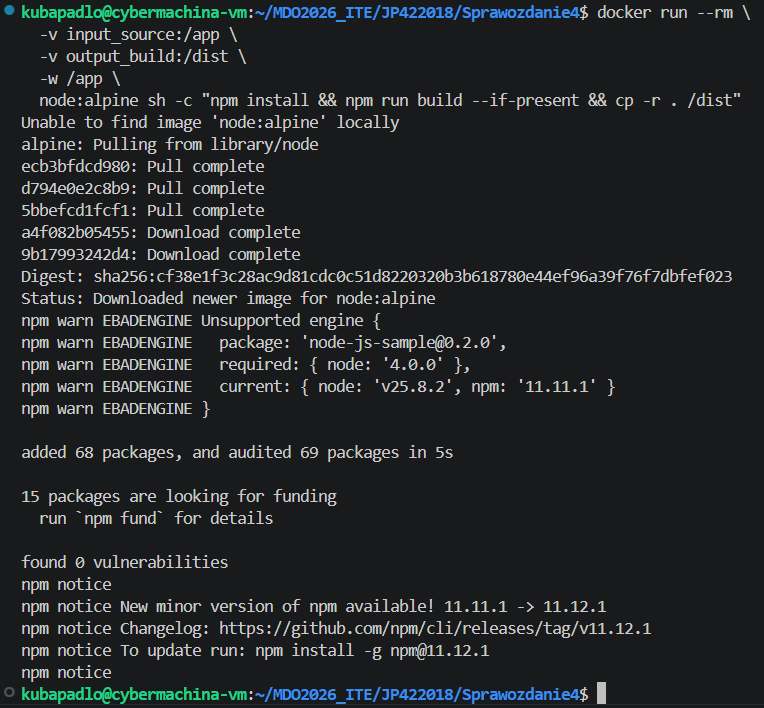

### 4. Weryfikacja plików na wolumenie wyjściowym
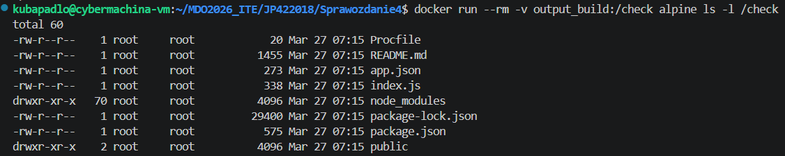

## 2B. Klonowanie repo z gitem w kontenerze
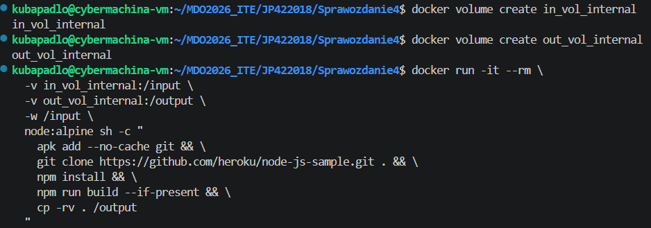

# Eksponowanie portu i łączność między kontenerami

## 1. Przygotowanie obrazu i łączność w sieci domyślnej
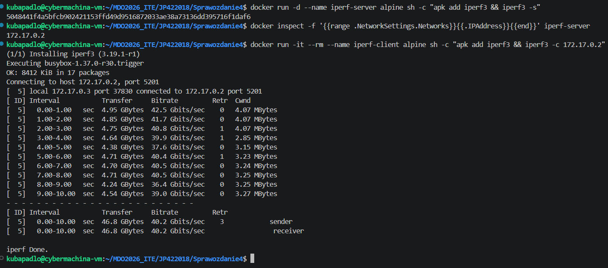

## 2. Utworzenie kontenerów we własnej sieci
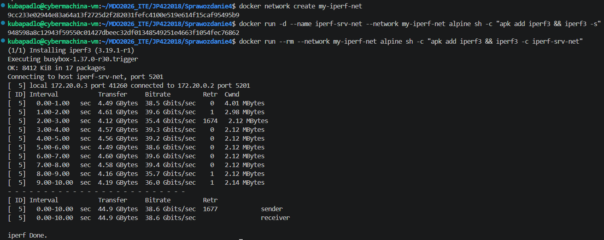

## 3A. Połączenie się spoza kontenera z hosta
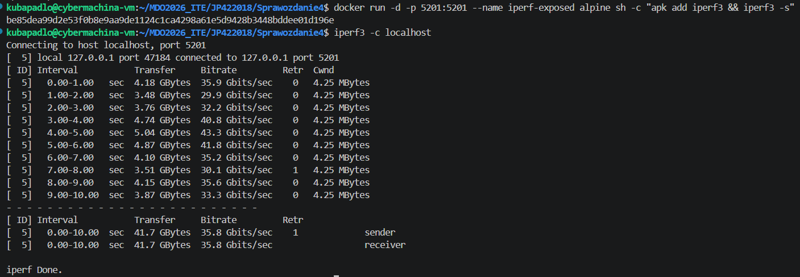

## 3B. Połączenie się spoza kontenera spoza hosta
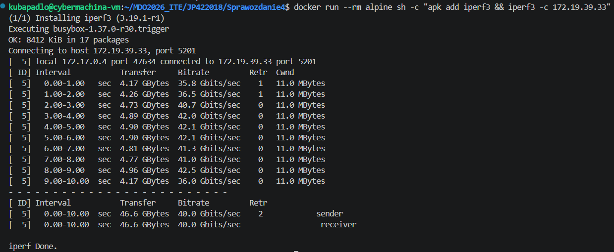

## 4. Wyciągniecie logów z kontenera
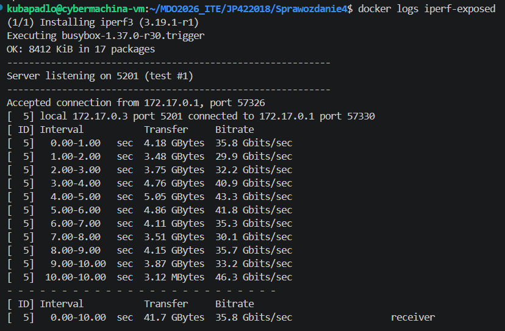

# Usługi w rozumieniu systemu, kontenera i klastra

## 1. Budowa kontenera
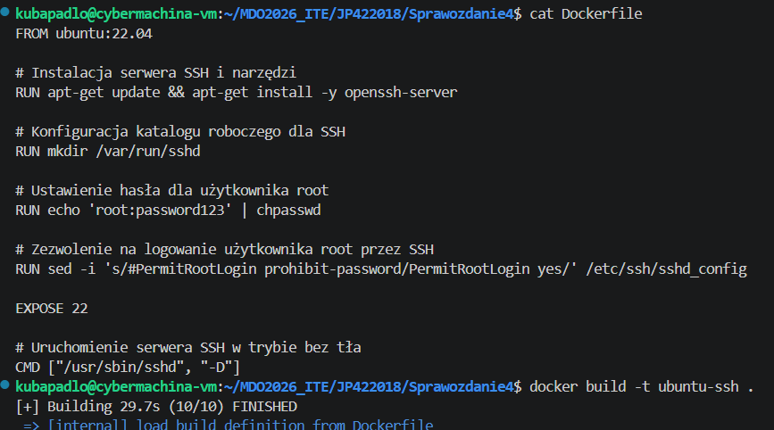

## 2. Uruchomienie kontenera i połączenie się z nim przez ssh
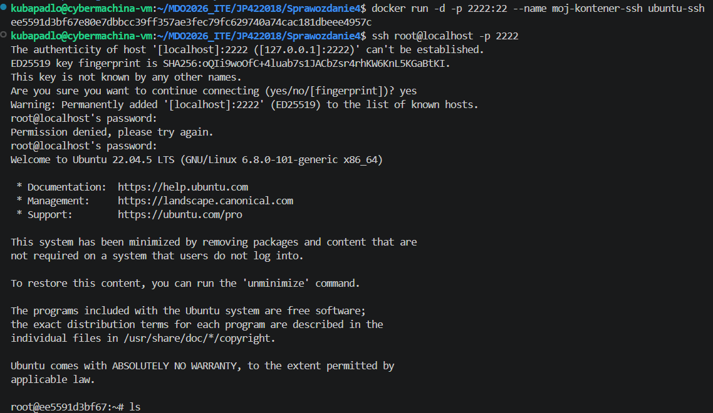

### Zalety
- Szyfrowana komunikacja
- Powszechnie znane narzędzie
- Pełny shell + SCP/SFTP + tunelowanie portów

### Wady
- Narusza zasadę "jeden proces na kontener"
- Zwiększa powierzchnię ataku
- `docker exec` / `kubectl exec` robią to samo prościej
- Trudne w środowiskach efemerycznych

### Kiedy używać
- Kontenery działające jak VM-y (np. środowiska dev)
- Brak dostępu do hosta Docker/K8s
- Legacy tooling wymagający SSH
- Gdy `exec` jest celowo zablokowany

# Jenkins

## 1. Utworzenie sieci mostkowej I uruchomienie pomocnika Docker 
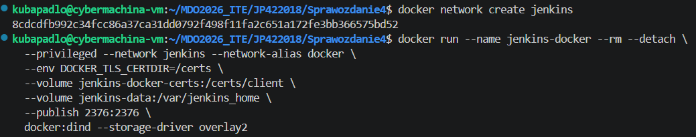

## 2. Uruchomienie kontenera Jenkinsa
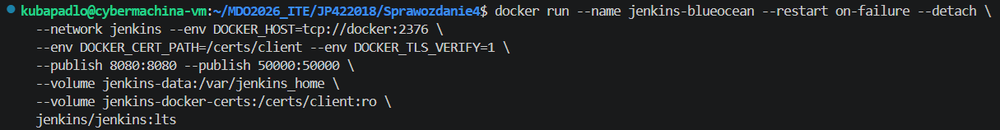

## 3. Sprawdzenie czy kontenery działają poprawnie
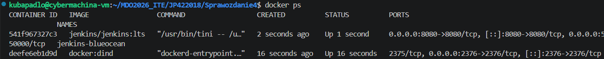

## 4. Logowanie do Jenkinsa przez `adres_maszyny:8080`
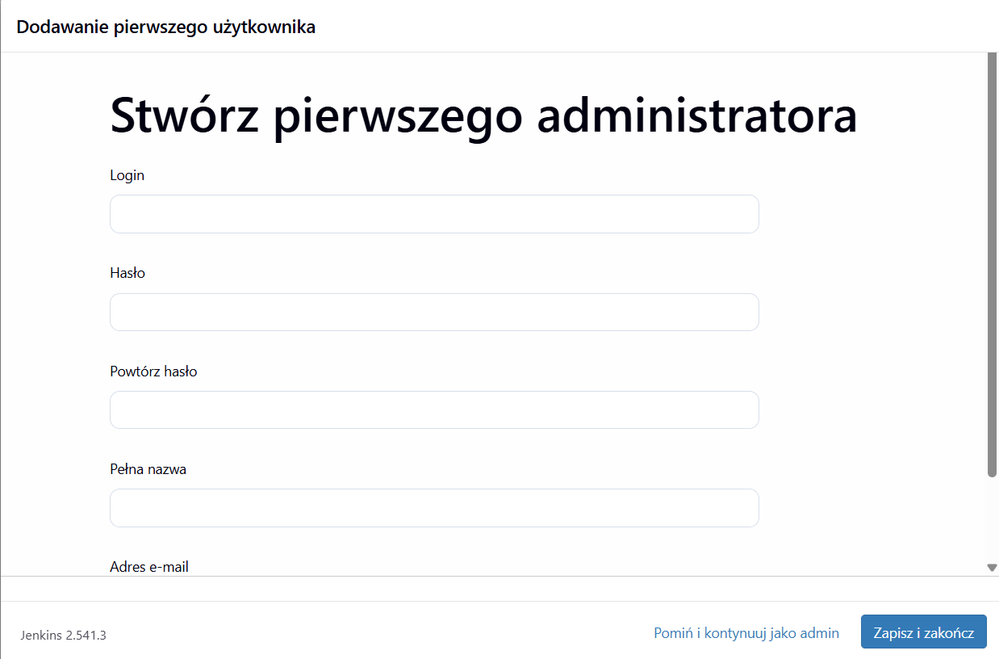

