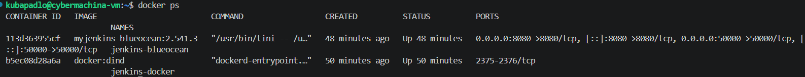
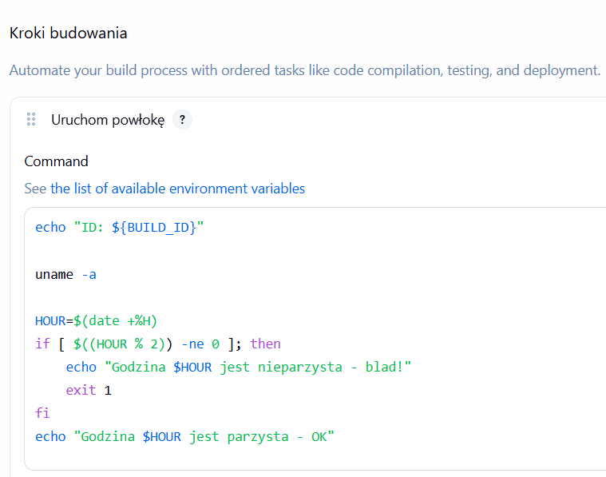
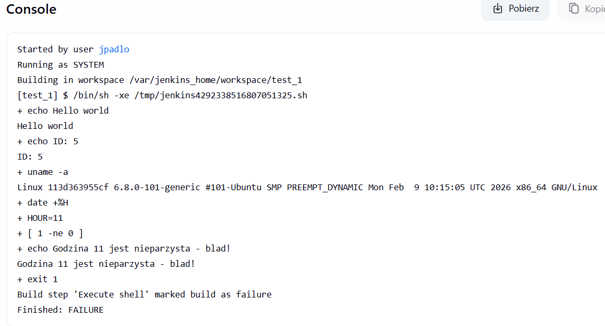
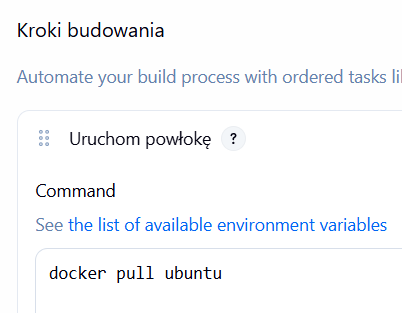
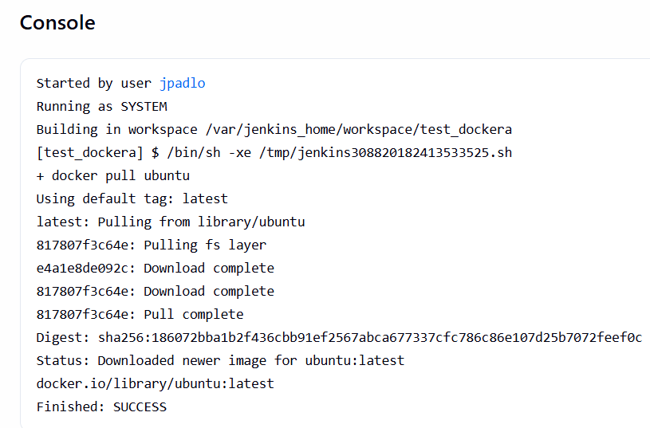
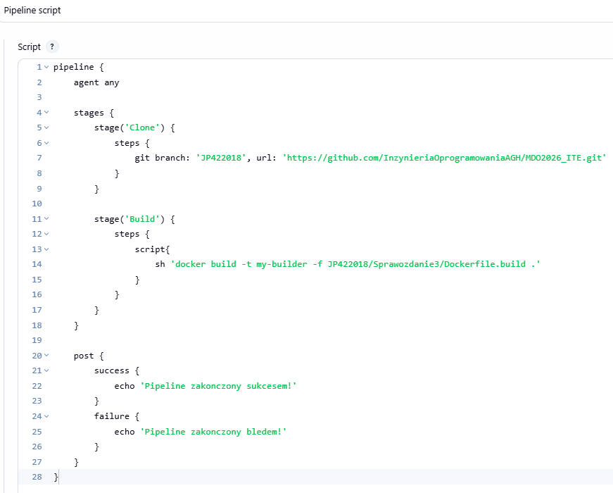
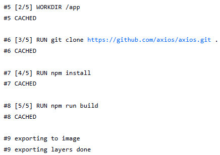
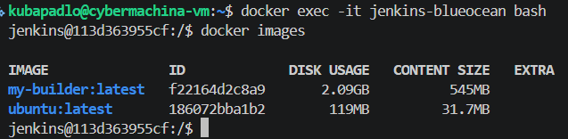
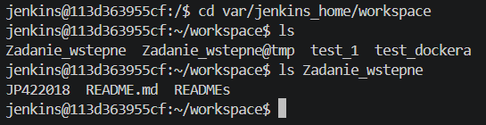

# Sprawozdanie lab5

# Dlaczego przy zmianie obrazu nie tracimy danych?
1. **Warstwowe działanie Dockera** (upperdir i lowerdir). Warstwa obrazu jest READ-ONLY. To taki engine.
2. **Wolumeny** - wszystkie projekty, konfiguracja i historia trzymane są w osobnym miejscu zdala od obrazu.

# Pluginy
### 1. blueocean
Wtyczka, która sprawia, że Jenkins przestaje wyglądać jak program z lat 90. i staje się czytelnym, nowoczesnym narzędziem.

### 2. docker-workflow
Sprawia, że praca z Dockerem jest przyjemniejsza bo daje wygodniejszą składnię i automatyzuje obsługę obrazów. Dodatkowo zapewnia automatyczne sprzątanie.
Nie jest konieczna, ale w nowoczensych pipelinach CI/CD to standard, aby nie pisać suchych komend `docker run moja-apka`...

### Można je zainstalować na dwa sposoby
1. Przez GUI Jenkinsa
2. Przez Dockerfile `RUN jenkins-plugin-cli --plugins "<nazwa_pluginu>"`

# Kod do instalacji Jenkinsa
```Dockerfile
# Dockerfile
# Obraz bazowy Jenkinsa
FROM jenkins/jenkins:2.541.3-jdk17

# Domyslnie jest user jenkins, ktory nie ma uprawnien do pobierania programow
USER root

# pobranie dockera CE-cli
RUN curl -fsSLo /usr/share/keyrings/docker-archive-keyring.asc \
  https://download.docker.com/linux/debian/gpg
RUN echo "deb [arch=$(dpkg --print-architecture) \
  signed-by=/usr/share/keyrings/docker-archive-keyring.asc] \
  https://download.docker.com/linux/debian \
  $(lsb_release -cs) stable" > /etc/apt/sources.list.d/docker.list
RUN apt-get update && apt-get install -y docker-ce-cli

# Powrot do bezpiecznego usera
USER jenkins

# Instalacja pluginow
RUN jenkins-plugin-cli --plugins "blueocean docker-workflow json-path-api"
``` 
**Disclaimer**: Nie instalujemy docker.io bo jest to ciężkie daemon. Potrzebujemy tylko klienta (docker-ce-cli) który bedzię wysyłać komendy do hosta. (komendy `docker ...` wywoływane w pipeline Jenkinsa)

```sh
# Zbudowanie obrazu
docker build -t myjenkins-blueocean:2.541.3 .
```

```sh
# Utworzenie sieci
docker network create jenkins
```

```sh
# Uruchomienie kontenera DinD
docker run --name jenkins-docker --restart=on-failure --detach \
  --privileged \                                                    # daje kontenerowi pełny dostęp do kernela hosta
  --network jenkins \
  --network-alias docker \
  --env DOCKER_TLS_CERTDIR=/certs \
  --volume jenkins-docker-certs:/certs/client \
  --volume jenkins-data:/var/jenkins_home \
  docker:dind
```

```sh
# Uruchomienie kontenera Jenkins
docker run --name jenkins-blueocean --restart=on-failure --detach \     
  --network jenkins                                                     # Podpiecie sieci
  --env DOCKER_HOST=tcp://docker:2376 \              
  --env DOCKER_CERT_PATH=/certs/client 
  --env DOCKER_TLS_VERIFY=1 \      
  --publish 8080:8080 --publish 50000:50000 \                           # Wystawienie interfejsu graficznego i portu 50000 dla agentów
  --volume jenkins-data:/var/jenkins_home \                             # Wolumen na pliki jenkinsa
  --volume jenkins-docker-certs:/certs/client:ro \                      # Wolumen Read-only z certyfikatami bezpieczeństwa
  myjenkins-blueocean:2.541.3                                           # Odpalamy wcześniej zbudowany obraz
```


# Sprawdzenie czy Jenkins i DinD działa


# Utworzenie projektu typy Freestyle
### Cechy Freestyle Projects
* **Konfiguracja TYLKO przez GUI**: Wszystko wyklikwalne w GUI Jenkinsa. Nie trzeba znać składnie, ale tworzy to problem z wersjonowaniem.
* **Liniowość**: Zadania wykonują się jedno po drugim. Trudno w nich stworzyć skomplikowane, rozgałęzione procesy.
* **Zastosowanie**: Idealne do bardzo prostych, powtarzalnych zadań.



## UWAGA: Rzucaniem kodami wyjścia jest kluczowe w automatyzacji CI/CD. Jeśli godzina będzie parzysta program wywali exitcode 1 i kod niżej się NIE WYKONA
 


# Sprawdzenie czy docker działa




# Utworzenie pipeline'u
Pipeline to nowoczesny standard Jenkinsa, w którym cały proces CI/CD jest opisany jako kod (zazwyczaj w pliku tekstowym o nazwie Jenkinsfile).
### Cechy tego podejścia
* **Kod zamiast klikania** - Całą instrukcję budowania, testowania i wdrażania trzymasz w jednym pliku tekstowym. Ten plik wrzucasz do Gita razem z kodem swojej aplikacji. Dzięki temu widzisz, kto i kiedy zmienił coś w procesie.
* **Podział na etapy** - Proces jest podzielony na logiczne kroki (np. Build -> Test -> Deploy). Od razu wiesz, na którym etapie "wywalił się" proces.
* **Trwałość** - Jeśli serwer Jenkinsa zrestartuje się w trakcie działania Pipeline'u, proces potrafi zostać wznowiony dokładnie w tym samym miejscu.
* **Złożona logika** - W przeciwieństwie do projektów Freestyle, tutaj możesz używać instrukcji warunkowych, pętli czy uruchamiać kilka zadań jednocześnie, co znacznie przyspiesza pracę.

### Budowanie podzielone zostało na dwa etapy:
1. Klonowanie repozytorium:
Checkout wykonywany na branchu `JP422018` z repozytorium przedmiotowego.

2. Budowanie Dockerfile:
Wykonanie skryptu budującego plik na ścieżce brancha.



### Za pierwszym razem pipeline wykonywał się prawie 10minut.



### Za drugim razem pipeline wykonał się w kilka sekund. Postęp został zapisany w pamięci cache i przywołany podczas wykonania, co znacznie skróciło czas budowania.

# Zweryfikowanie zbudowania obrazu


# Zweryfikowanie w wolumenie sclonowania repo 


