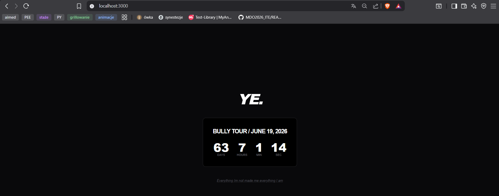
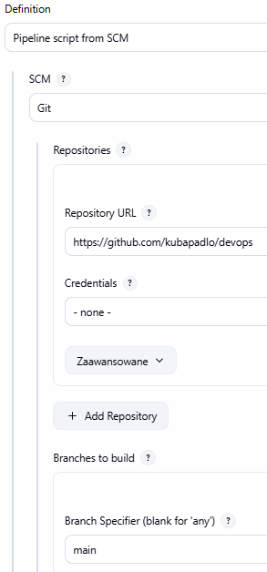
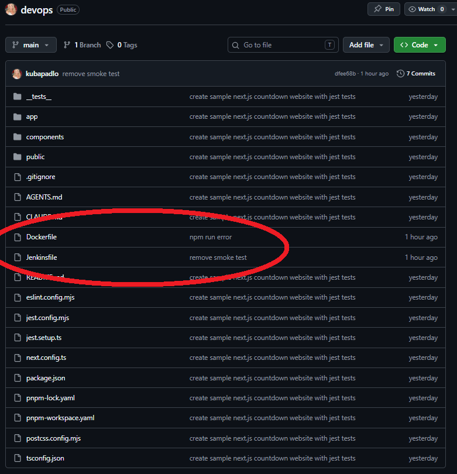
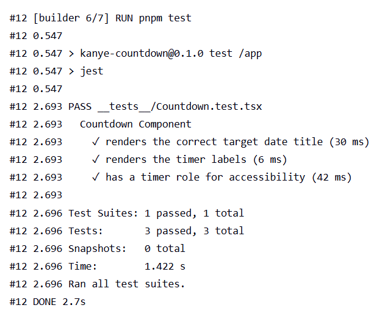
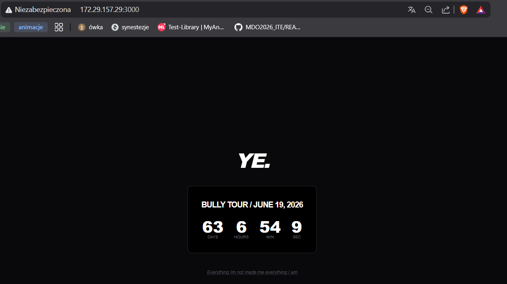
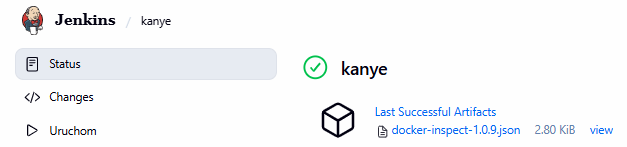

# LAB6, Jakub Padło

# Intro
Na potrzeby zadania stworzyłem własną prostą aplikację w Next.JS. Zawiera ona proste testy napisane z biblioteką Jest.
```json
// package.json
  "scripts": {
    "dev": "next dev",
    "build": "next build",
    "start": "next start",
    "test": "jest",
  },
```


# Zdefiniowanie Pipeline'u Script from SCM
Od zwykłego pipeline'u różni się tym, że definicja procesu budowania zapisana jest w pliku i umieszczona bezpośrednio w repozytorium projektu.
### Zalety
* **Pipeline-as-Code**: Proces CI/CD jest traktowany jak kod źródłowy.
* **Wersjonowanie**: Każda zmiana w procesie budowania ma swoją historię w Git.
* **Automatyzacja**: Jenkins pobiera skrypt z repozytorium przy każdym uruchomieniu, co gwarantuje spójność z daną wersją aplikacji.
* **Bezpieczeństwo**: Nawet po awarii Jenkinsa, Twoja konfiguracja wdrażania jest bezpieczna w repozytorium.




## Struktura na github 


# Dockerfile
```dockerfile
# ETAP 1: Instalacja zależności
FROM node:20-alpine AS deps
RUN corepack enable && corepack prepare pnpm@latest --activate
WORKDIR /app
COPY package.json pnpm-lock.yaml* ./
RUN pnpm install --frozen-lockfile

# ETAP 2: Testy i Budowanie
FROM node:20-alpine AS builder
RUN corepack enable && corepack prepare pnpm@latest --activate
WORKDIR /app
COPY --from=deps /app/node_modules ./node_modules
COPY . .

RUN pnpm test

RUN pnpm build

# ETAP 3: Runner
FROM node:20-alpine AS runner
WORKDIR /app

ENV NODE_ENV=production

# Metadane
ARG GIT_COMMIT=unknown
ARG BUILD_NUMBER=unknown
ARG BUILD_DATE=unknown
LABEL org.opencontainers.image.revision="${GIT_COMMIT}" \
      org.opencontainers.image.created="${BUILD_DATE}" \
      ci.build.number="${BUILD_NUMBER}"

# Kopiujemy tylko to, co jest niezbędne do działania aplikacji
COPY --from=builder /app/public ./public
COPY --from=builder /app/.next ./.next
COPY --from=builder /app/node_modules ./node_modules
COPY --from=builder /app/package.json ./package.json

EXPOSE 3000

CMD ["./node_modules/.bin/next", "start", "-H", "0.0.0.0"]
```
## Analiza Dockerfile
Wykorzystuje mechanizm Multi-stage Build, dzięki czemu w końcowym obrazie umieszczamy tylko to, co niezbędne do uruchomienia aplikacji. **Obraz staje się mniejszy, bardziej przejrzysty i bezpieczniejszy.**

### Krok1: Instalacja zależności
- Uruchamiam pnpm, który jest wydajniejszy niż npm
- Kopiuje pliki package.json oraz pnpm-lock.yaml. Dzięki temu, jeśli zależności się nie zmieniły, Docker użyje cache'u przy kolejnych próbach budowania.

### Krok2: Testy i Budowanie
- Kopiowanie zależności zainstalowanych w poprzednim kroku oraz kopiowanie kodu
- Wykonywane jest polecenie `pnpm test`. **Jeśli jakikolwiek test jednostkowy zakończy się błędem, proces budowania zostanie przerwany.**
- Polecenie `pnpm build` buduje zoptymalizowaną wersję produkcyjną

### Krok3: Runner
- Przenosimy tylko artefakty (wyniki budowania) z etapu builder. **WAŻNE: NIE KOPIUJEMY TUTAJ KODU**
- Dzięki instrukcjom `ARG` i `LABEL`, obraz zostaje "podpisany" metadanymi z CI/CD (numer buildu, hash commita, data). Pozwala to na łatwą identyfikację wersji kodu na produkcji.
- Aplikacja zostaje uruchomiona

# Jenkinsfile
```jenkinsfile
pipeline {
    agent any

    environment {
        IMAGE_NAME = "kanye-counter-local"
        VERSION    = "1.0.${BUILD_NUMBER}"  // Wbudowana zmienna
    }

    stages {
        stage('Clone') {
            steps {
                checkout scm
            }
        }

        stage('Build & Test') {
            steps {
                sh """
                    docker build \
                    --build-arg GIT_COMMIT=\$(git rev-parse --short HEAD) \
                    --build-arg BUILD_NUMBER=${BUILD_NUMBER} \
                    --build-arg BUILD_DATE=\$(date -u +%Y-%m-%dT%H:%M:%SZ) \
                    -t ${IMAGE_NAME} .
                """
            }
        }

        stage('Publish (Local)') {
            steps {
                sh "docker tag ${IMAGE_NAME} ${IMAGE_NAME}:${VERSION}"
                sh "docker tag ${IMAGE_NAME} ${IMAGE_NAME}:latest"
                echo "Obraz otagowany jako ${IMAGE_NAME}:${VERSION} i :latest"
            }
        }

        stage('Deploy') {
            steps {
                script {
                    // adres VM 
                    def vmIp = sh(script: "hostname -I | awk '{print \$1}'", returnStdout: true).trim()
                    
                    sh "docker rm -f kanye-web-container || true"
                    sh "docker run -d --name kanye-web-container -p 3000:3000 ${IMAGE_NAME}:${VERSION}"
                    
                    echo "Running smoke test on IP: ${vmIp}"
                    sh """
                        sleep 5
                        curl -f http://${vmIp}:3000 || (echo 'Smoke test FAILED' && docker logs kanye-web-container && exit 1)
                    """
                }
                echo "Aplikacja dostępna pod http://\${vmIp}:3000"
            }
}
    }
    post {
        always {
            script {
                sh "docker inspect ${IMAGE_NAME}:${VERSION} > docker-inspect-${VERSION}.json || true"
            }
            archiveArtifacts artifacts: "docker-inspect-${VERSION}.json", allowEmptyArchive: true
        }
    }
}
```

## Analiza Jenkinsfile

### Stage1: Clone
- `checkout scm` pobiera najnowszą wersję kodu z repozytorium Git zdefiniowanego w zadaniu Jenkinsa.

### Stage2: Build & Test
- buduje obraz
- uruchamia testy (jeśli któryś się wywali to cały pipeline zostanie przerwany).

### Stage3: Publish (Local)
- Nadaje nowo zbudowanemu obrazowi dwa tagi: unikalny numer wersji (np. 1.0.12) oraz znacznik latest. Pozwala to na łatwe wycofanie zmian do konkretnej wersji w przyszłości.

### Stage4: Deploy
- Dynamicznie pobiera adres IP maszyny wirtualnej.
- Usuwa stary kontener i uruchamia nowy na porcie 3000.
- **Smoke Test**: Wykonuje próbne zapytanie curl do aplikacji. Jeśli aplikacja nie odpowie, etap kończy się niepowodzeniem.

### Post
- Niezależnie od wyniku, generuje plik JSON ze szczegółową inspekcją obrazu Docker (`docker inspect`) i zapisuje go jako artefakt w Jenkinsie. Jest to kluczowe do debugowania.

# Potwierdzenie działania

## Testy się uruchamiają i przechodzą pomyślnie


## Wpisując adresy VM w przeglądarce na hoście widzimy piękną stronę



## Pipeline Jenkinsa również przeszedł poprawnie i "wypluł" plik .json z logami



