# Jakub Padło, LAB7
### Przydatne komendy, których nauczyłem się przy okazji czyszczenia kontenera Jenkinsa
* `du -h --max-depth=1 | sort -hr` - Lista **rozmiaru** plików/folderów. Posortowane malejąco.
* `docker system df -v` - czytelne podsumowania ile miejsca zajmują obrazy, kontenery i wolumeny
* `docker stats <nazwa_kontnera>` - zużycie RAMu i CPU przez kontenery

# Większość podpunktów łącznie z obsługą pipeline'u SCM zrealizowałem i wyjasniłem już na poprzednich laboratoriach.

# Wprowadzone poprawki

## 1. Wydzielenie testowania do osobnego stage'a
### PRZED - testowanie odbywało się w fazie budowania obrazu w Dockerfile
```Dockerfile
FROM node:20-alpine AS builder
COPY --from=deps /app/node_modules ./node_modules
COPY . .

RUN pnpm test  # <------ USUNIĘCIE TESTOWANIA Z OBRAZU

RUN pnpm build
```

```
stage('Build & Test') {
    steps {
        sh """
            docker build \
            --build-arg GIT_COMMIT=\$(git rev-parse --short HEAD) \
            --build-arg BUILD_NUMBER=${BUILD_NUMBER} \
            --build-arg BUILD_DATE=\$(date -u +%Y-%m-%dT%H:%M:%SZ) \
            -t ${IMAGE_NAME} .
        """
    }
}
```

### PO
```
stage('Build') {
    steps {
        sh """
            docker build \
            --build-arg GIT_COMMIT=\$(git rev-parse --short HEAD) \
            --build-arg BUILD_NUMBER=${BUILD_NUMBER} \
            --build-arg BUILD_DATE=\$(date -u +%Y-%m-%dT%H:%M:%SZ) \
             -t ${IMAGE_NAME}:${VERSION} \
            -t ${IMAGE_NAME}:latest .
        """
    }
}

stage('Test') {
    steps {
        script {
            // Wykorzystujemy fazę 'builder' gdyż w niej jest dostępny pnpm oraz pliki projektu
            sh "docker build --target builder -t ${IMAGE_NAME}-test ."            
            sh "docker run --rm ${IMAGE_NAME}-test pnpm test"
        }
    }
}
```

### Zalety
* **Widoczność w pipeline'ie.** - Wiadomo od razu czy build padł przez błąd kompilacji czy przez failujący test.
* **Raporty testów** - Wyniki można wyciągnąć z kontenera i zarchiwizować w Jenkinsie:
* **Dockerfile robi jedno**. Opisuje jak zbudować obraz, nie jak testować kod.
* **Elastyczność** - CI może uruchamiać różne rodzaje testów w osobnych stage'ach z różnymi konfiguracjami, bez modyfikacji Dockerfile.

## 2. Wysyłanie obrazu do rejestru
W poprzednij wersji obraz zostawał tylko na maszynie, a teraz jest wysyłany do ogólnodostępnego zewnętrznego rejestru.
### PRZED
```
stage('Publish (Local)') {
    steps {
        sh "docker tag ${IMAGE_NAME} ${IMAGE_NAME}:${VERSION}"
        sh "docker tag ${IMAGE_NAME} ${IMAGE_NAME}:latest"
        echo "Obraz otagowany jako ${IMAGE_NAME}:${VERSION} i :latest"
    }
}
```

### PO
```
environment {
    IMAGE_NAME    = "kanye-counter"
    REGISTRY_USER = "jpadlo"
    REGISTRY_IMAGE = "${REGISTRY_USER}/${IMAGE_NAME}"
    VERSION       = "1.0.${BUILD_NUMBER}"
}

stage('Publish') {
    steps {
        withCredentials([usernamePassword(
            credentialsId: 'dockerhub-credentials',
            usernameVariable: 'DOCKER_USER',
            passwordVariable: 'DOCKER_PASS'
        )]) {
            sh "echo ${DOCKER_PASS} | docker login -u ${DOCKER_USER} --password-stdin"
            sh "docker tag ${IMAGE_NAME}:${VERSION} ${REGISTRY_IMAGE}:${VERSION}"
            sh "docker tag ${IMAGE_NAME}:latest ${REGISTRY_IMAGE}:latest"
            sh "docker push ${REGISTRY_IMAGE}:${VERSION}"
            sh "docker push ${REGISTRY_IMAGE}:latest"
            echo "Opublikowano ${REGISTRY_IMAGE}:${VERSION} i :latest"
        }
    }
}
```
#### 1. Utworzenie konta na dockerhub i stworzenie repozytorium

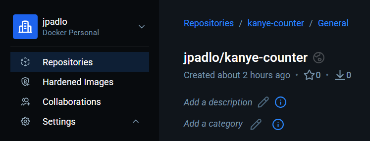

#### 2. Wygenerowanie Personal Access Token w DockerHub

#### 3. Dodanie poufnych danych w sekretach Jenkinsa ("Zarządzaj Jenkinsem" > "Bezpieczeństwo" > "Credentials")

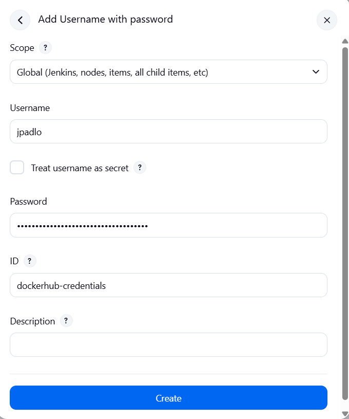

### Obraz dodany z sukcesesm do rejestru

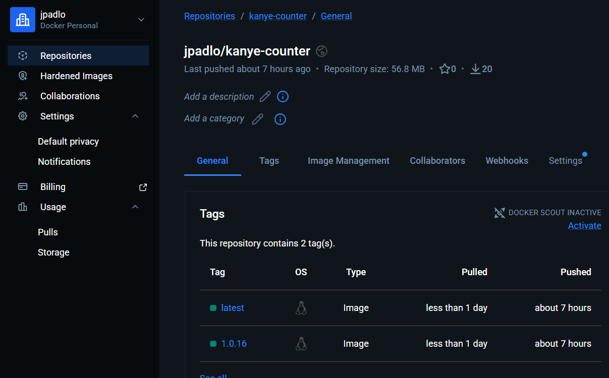

## Pozostałe wymagania ścieżki krytycznej
### 1. Obraz BLDR
Pipeline uruchamia jedno docker build, ale Dockerfile realizuje multi-stage build z osobnym etapem **builder**. Docker buduje go pośrednio, nie eksponując jako osobnego tagu

### 2. Artefakt produkcyjny
Etap **runner** w Dockerfile kopiuje wyłącznie wynik buildu czyli skompilowany .next/, node_modules i package.json. Do finalnego obrazu nie trafia kod źródłowy, narzędzia deweloperskie ani pnpm

### 3. Wielokrotne uruchomienie 
BUILD_NUMBER jest unikalną zmienną wbudowaną w Jenkinsa - rośnie z każdym przebiegiem. Każdy build tworzy unikalnie otagowany obraz, `docker rm -f || true` usuwa stary kontener przed startem nowego. Pipeline zadziała wielokrotnie bez ręcznej ingerencji.

# "Definition of done"

### Udało się uruchomić zkonteneryzowaną aplikację na hoście na windowsie.

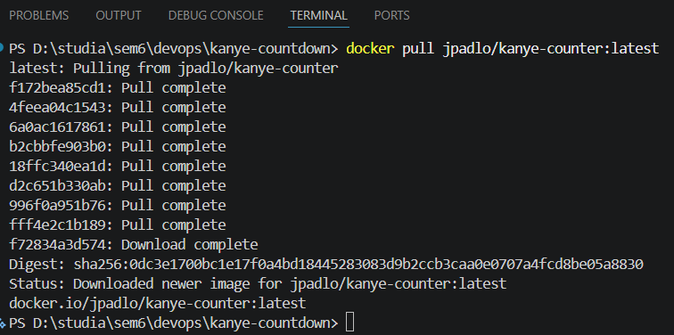

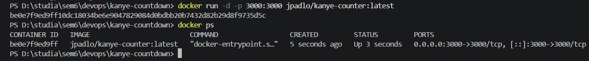

### Nie trzeba już wpisywać adresu maszyny, strona działa na `localhost:3000`

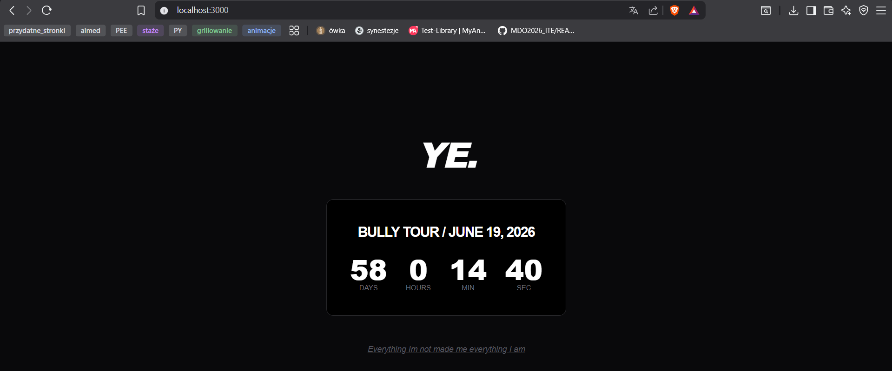

# Przygotowanie maszyny na Ansible

## 1. Zainstlowanie systemu Ubuntu Server w wersji **minimized**

## 2. Zweryfikowanie obecności programu tar, serwera SSH oraz odpowiednieg nazewnictwa serwera i usera

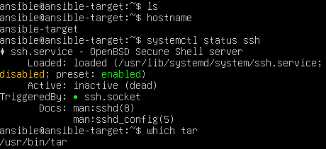

## 3. Stworzenie migawki maszyny
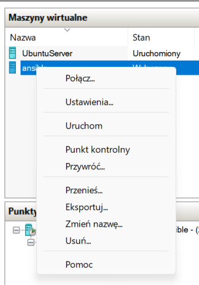

## 4. Instalacja ansbile na głównej maszynie
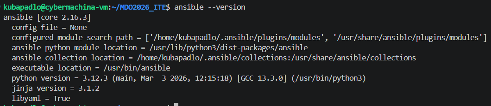

## 5. Wymiana kluczy SSH
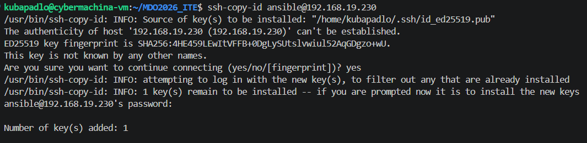

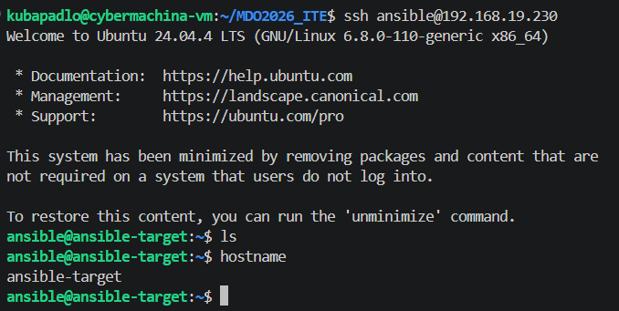

## 6. Test działania

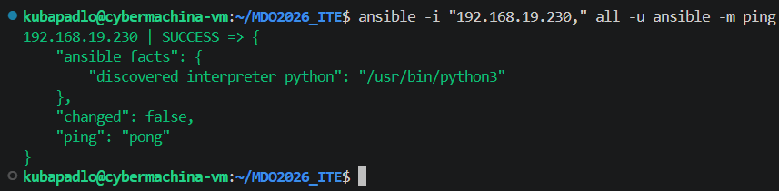