# LAB 8
### Jakub Padło, 422018

# Ansible to bezagentowe narzędzie do automatyzacji, które pozwala w sposób powtarzalny i spójny zarządzać konfiguracją wielu maszyn naraz za pomocą prostych plików tekstowych.

# Po co to komu?
* **Automatyzacja powtarzalnych zadań** - zamiast wpisywać te same komendy na 100 serwerach (np. aktualizacja systemu), robisz to jednym poleceniem z maszyny sterującej.

* **Idempotentność** - Ansible gwarantuje, że system będzie w dokładnie takim stanie, jaki zdefiniowałeś. Jeśli uruchomisz ten sam skrypt drugi raz, Ansible nie zepsuje niczego, co już działa, a jedynie naprawi to, co się zmieniło.

* **Zarządzanie infrastrukturą jako kod (IaC)** - cała Twoja konfiguracja serwerów jest zapisana w plikach tekstowych (YAML). Możesz je trzymać w systemie kontroli wersji (np. Git), śledzić zmiany i łatwo odtworzyć serwer od zera w razie awarii.

* **Brak agentów**- nie musisz instalować żadnego dodatkowego oprogramowania na maszynach, którymi zarządzasz. Wystarczy dostęp przez SSH i zainstalowany Python.

* **Orkiestracja złożonych procesów** - Ansible pozwala na układanie zadań w logiczne ciągi, np.: najpierw wyłącz serwer z load-balancera, potem zaktualizuj bazę danych, a na końcu zrestartuj aplikację i włącz ją z powrotem do ruchu.

* **Uproszczone wdrażanie aplikacji (Deployment)** - automatyzuje proces pobierania kodu z repozytorium, ustawiania uprawnień, instalowania zależności i restartowania usług.

* **Obsługa wielu platform** - jednym narzędziem zarządzasz systemami Linux, Windows, urządzeniami sieciowymi (Cisco, Juniper), a także chmurami (AWS, Azure, GCP) czy kontenerami (Docker, Kubernetes).


# Zmiana hostname oraz pliku /etc/hosts na obu maszynach
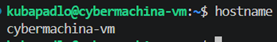
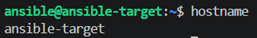

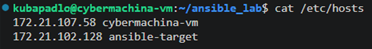

# Sprawdzenie działania ssh, które zostało skonfigurowane na poprzednich zajęciach
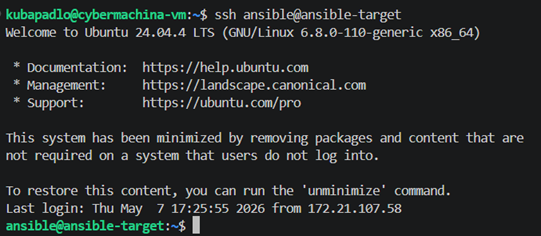

# Zdefiniowanie hostow i sprawdzenie poprawności komunikacji z nimi

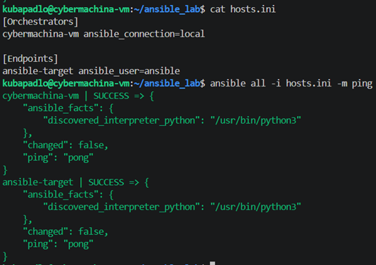

### Status SUCCESS oznacza:

* **DNS działa**: Ansible znalazł adres IP dla ansible-target
* **SSH DZIAŁA:** Połączenie nastąpiło bez hasła (lub z automatycznym użyciem klucza), co jest niezbędne do płynnej automatyzacji.
* **Python jest dostępny**: Ansible poprawnie wykrył interpreter Pythona (/usr/bin/python3).

# DISCLAIMER: Po co ansible python?
### Jest to jego **silnik wykonawczy**. Większość modułów Ansible jest napisana w Pythonie; Ansible przesyła je na serwer, a Python je tam uruchamia.

# Pierwszy playbook konfiguracyjny

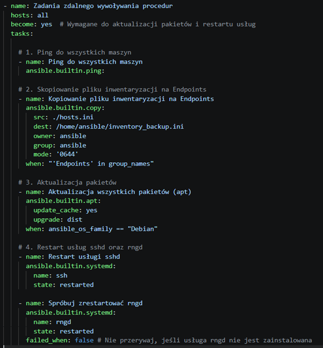

## Analiza
### Nagłówek 
* `hosts: all`: Playbook zostanie uruchomiony na wszystkich maszynach zdefiniowanych w pliku hosts.ini (zarówno na maszynie głównej, jak i na endpointach).
* `become: yes`: Zmiana na roota.
### Etap 1: Ping do wszystkich maszyn
**Po co?** Sprawdzenie żywotności i poprawnie skonfigurowanej komunikacji.

### Etap 2: Kopiowanie pliku inwentaryzacji na Endpoints
`when: "'Endpoints' in group_names"`:  Wybranie gdzie plik ma się skopiować

`owner/group/mode:` Ustawia bezpieczne uprawnienia - dobra praktyka bezpieczeństwa.

### Etap 3: Aktualizacja wszystkich pakietów (apt)
**Po co?** Utrzymanie bezpieczeństwa i stabilności systemu. Odświeża listę dostępnych pakietów i instaluje najnowsze wersje

`when: ansible_os_family == "Debian"`: Sprawdzenie systemu bo `apt` nie działa wszędzie

### Etap 4: Restart usługi sshd
**Po co?** Aby ewentualne zmiany weszły w życie
Ważne: W Ansible restart SSH zazwyczaj nie zrywa bieżącego połączenia, pod którym "idzie" playbook, ponieważ systemy operacyjne obsługują to w sposób ciągły

### Etap 5: Spróbuj zrestartować rngd
**Po co?** Obsługa usług opcjonalnych 

`failed_when: false`: "Jeśli nie znajdziesz tej usługi lub wystąpi błąd podczas restartu, **zignoruj i idź dalej**". Dzięki temu jedna brakująca, mało istotna usługa nie przerywa całego procesu automatyzacji dla danej maszyny.

## Kolory w ansible
* **Zielony (OK):** Zadanie wykonane pomyślnie, ale nie wprowadzono żadnych zmian. Stan systemu był już zgodny z tym, co zapisałeś w playbooku.
* **Żółty (CHANGED):** Zadanie wykonane pomyślnie i wprowadzono zmiany. Ansible zmodyfikował system
* **Czerwony (FAILED / FATAL):** Wystąpił błąd. Zadanie nie zostało wykonane, a dalsze kroki dla tej maszyny zostają przerwane.
* **Błękitny / Cyjan (SKIPPED):** Zadanie zostało pominięte, ponieważ nie został spełniony warunek
* **Fioletowy (WARNING / DEPRECATION):** Ostrzeżenie. Coś w konfiguracji jest niepoprawne lub używasz przestarzałej funkcji, która wkrótce zostanie usunięta. Playbook działa dalej.
* **Ciemnoczerwony / Różowy (UNREACHABLE):** Błąd połączenia. Ansible nie mógł połączyć się z serwerem przez SSH

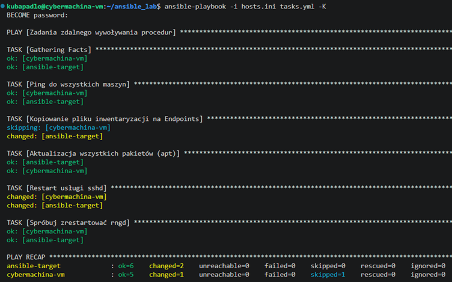

# Ponowne uruchomienie 

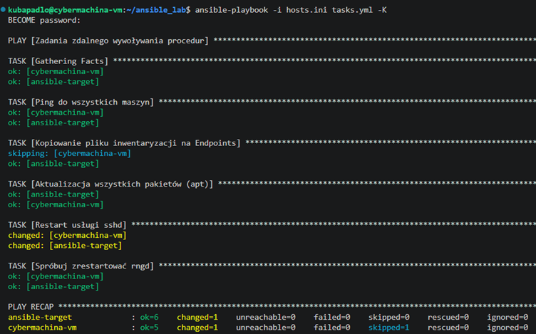

### Można zauważyć, że etap kopiowania pliku za pierwszym razem był żółty, a teraz jest zielony ponieważ plik jest już w docelowym miejscu

## **WAŻNE** Idempotentność - wielokrotne uruchomienie tego samego zadania nie zmienia stanu systemu po jego pierwszej poprawnej konfiguracji.

# Proba uruchomienia playbooka po wyłączeniu ssh na jednej z maszyn

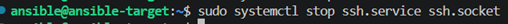

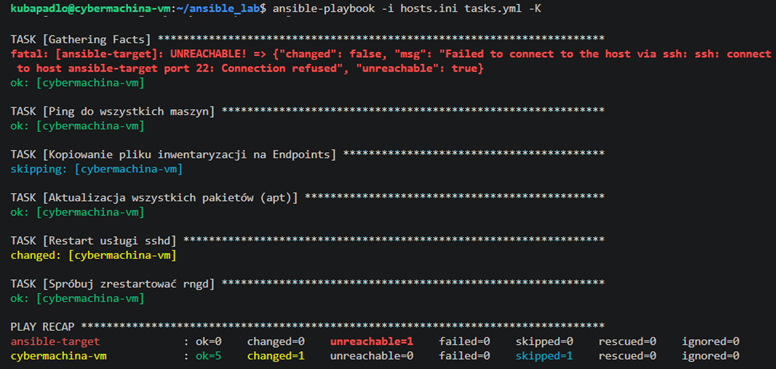

### Zadanie zatrzyma się już na Gathering Facts, ponieważ Ansible nie może nawet wejść na maszynę, by sprawdzić jej parametry.

# Zarządzanie stworzonym artefaktem
```yml
---
- name: Zarządzanie kontenerem i instalacja Dockera
  hosts: Endpoints
  become: yes
  vars:
    container_name: "kanye-counter-app"
    image_name: "jpadlo/kanye-counter"

  tasks:
    # --- SEKCJA 1: SANITY CHECK ---
    - name: Sanity Check - Sprawdzenie wolnego miejsca na dysku
      ansible.builtin.shell: "df -h / | tail -1 | awk '{print $4}'"
      register: disk_free
      ignore_errors: yes

    - name: Wyświetl informację o systemie (Sanity Check)
      ansible.builtin.debug:
        msg: "System: {{ ansible_distribution }}, Wolne miejsce: {{ disk_free.stdout }}"

    - name: Sprawdź czy system to Debian/Ubuntu
      ansible.builtin.assert:
        that:
          - ansible_os_family == "Debian"
        fail_msg: "Ten playbook wspiera tylko systemy z rodziny Debian!"
      ignore_errors: yes

    # --- SEKCJA 2: INSTALACJA DOCKERA ---
    - name: Instalacja Dockera z repozytoriów systemu
      ansible.builtin.apt:
        name: 
          - docker.io
          - python3-docker
        state: present
        update_cache: yes

    - name: Upewnij się, że Docker działa
      ansible.builtin.systemd:
        name: docker
        state: started
        enabled: yes

    # --- SEKCJA 3: DEPLOY KONTENERA ---
    - name: Pobierz obraz i uruchom kontener
      community.docker.docker_container:
        name: "{{ container_name }}"
        image: "{{ image_name }}"
        state: started
        restart_policy: always
        published_ports:
          - "8080:3000"

    - name: Czekaj chwilę na uruchomienie aplikacji
      ansible.builtin.pause:
        seconds: 5

    # --- SEKCJA 4: WERYFIKACJA ---
    - name: Zweryfikuj łączność z kontenerem (HTTP GET)
      ansible.builtin.uri:
        url: "http://localhost:8080"
        status_code: 200
      register: result
      ignore_errors: yes

    - name: Wyświetl wynik weryfikacji
      ansible.builtin.debug:
        msg: "Kontener odpowiedział poprawnie!"
      when: result.status == 200

    # --- SEKCJA 5: SPRZĄTANIE ---
    - name: Zatrzymaj i usuń kontener
      community.docker.docker_container:
        name: "{{ container_name }}"
        state: absent

    - name: Usuń obraz z dysku 
      community.docker.docker_image:
        name: "{{ image_name }}"
        state: absent
        force_tag: yes

```

# Analiza

## Konfiguracja wstępna
`hosts: Endpoints:` Wykonanie playbooka tylko na określonych maszynach
`become: yes:` - Nadanie roota
`vars: ` - Zmienne globalne

## Sekcja 1: Sanity Check (Sprawdzenie "zdrowia" systemu)
* **Sprawdzenie wolnego miejsca** 
* **Wyświetl informację o systemie** 
* **Sprawdź czy system to Debian/Ubuntu** 

## Sekcja 2: Instalacja Dockera
* Instalacja dokcer.io z repo oraz python3-docker, dzięki któremu Ansible może "rozmawiać" z silnikiem Dockera.
* Upewnienie się że Docker działa

## Sekcja 3: Deploy kontenera
* Pobierz i uruchom kontener: Najważniejszy krok. Ansible sprawdza, czy obraz jpadlo/kanye-counter jest na dysku (jeśli nie, pobiera go), a następnie uruchamia kontener o nazwie kanye-counter-app.
`published_ports:` - przekierowanie portów
`ansible.builtin.pause` - wstrzymanie działania na określony czas

## Sekcja 4: Weryfikacja (Test działania)
* **Weryfikacja działania** - Wysyła zapytanie pod adres strony. Jeśli serwer odpowie kodem 200 OK, test kończy się sukcesem.

## Sekcja 5: Sprzątanie
* **Zatrzymaj i usuń kontener:**
* **Usuń obraz z dysku:** - obrazy zajmują dużo miejsca

# Ubranie w rolę za pomoca ansible galaxy
```sh
ansible-galaxy role init docker_deploy_app
```

## Struktura projektu

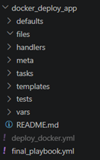


```yml
# /defaults/main.yml
container_name: "kanye-counter-app"
image_name: "jpadlo/kanye-counter"
host_port: 8080
container_port: 3000
```

```yml
# /tasks/main.yml
- name: Sanity Check - Wolne miejsce
  ansible.builtin.shell: "df -h / | tail -1 | awk '{print $4}'"
  register: disk_free

- name: Sprawdź czy system to Debian/Ubuntu
  ansible.builtin.assert:
    that:
      - ansible_os_family == "Debian"
    fail_msg: "Rola wspiera tylko systemy z rodziny Debian!"

- name: Instalacja Dockera i zależności
  ansible.builtin.apt:
    name:
      - docker.io
      - python3-docker
    state: present
    update_cache: yes

- name: Upewnij się, że Docker działa
  ansible.builtin.systemd:
    name: docker
    state: started
    enabled: yes

- name: Pobierz obraz i uruchom kontener
  community.docker.docker_container:
    name: "{{ container_name }}"
    image: "{{ image_name }}"
    state: started
    restart_policy: always
    published_ports:
      - "{{ host_port }}:{{ container_port }}"

- name: Czekaj na uruchomienie aplikacji
  ansible.builtin.pause:
    seconds: 5

- name: Zweryfikuj łączność z kontenerem
  ansible.builtin.uri:
    url: "http://localhost:{{ host_port }}"
    status_code: 200
  register: result
  ignore_errors: yes

- name: Zatrzymaj i usuń kontener
  community.docker.docker_container:
    name: "{{ container_name }}"
    state: absent
```

```yml
# meta/main.yml
---
# meta/main.yml
galaxy_info:
  author: Jakub Padlo
  description: Rola instalująca Dockera i wdrażająca kontener Kanye-Counter
  company: AGH
  license: MIT
  min_ansible_version: "2.1"

  platforms:
    - name: Ubuntu
      versions:
        - jammy
        - focal
    - name: Debian
      versions:
        - bullseye

  galaxy_tags:
    - docker
    - deployment
    - education

dependencies: [] 
```

```yml
# final_playbook.yml
- name: Wdrożenie aplikacji za pomocą roli
  hosts: Endpoints
  become: yes
  roles:
    - docker_deploy_app
```

## Korzyści ról

1. **Czystość**: Główny playbook ma tylko 6 linijek. Cała "brudna" robota jest ukryta w roli.
2. **Modularność**: Jeśli będziesz miał inny projekt wymagający Dockera, możesz po prostu skopiować folder docker_deploy_app.
3. **Wersjonowanie**: Możesz trzymać tę rolę w osobnym repozytorium Git i dołączać ją do różnych projektów.
4. **Zmienne**: Dzięki defaults/main.yml łatwo zmienić np. port, nie dotykając logiki.

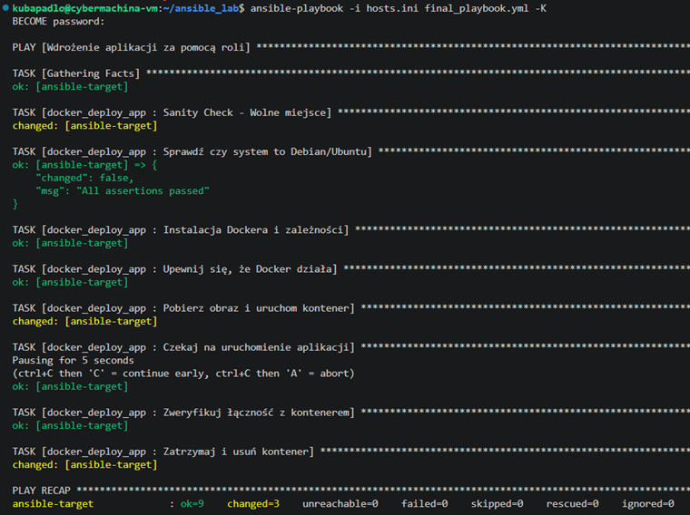

