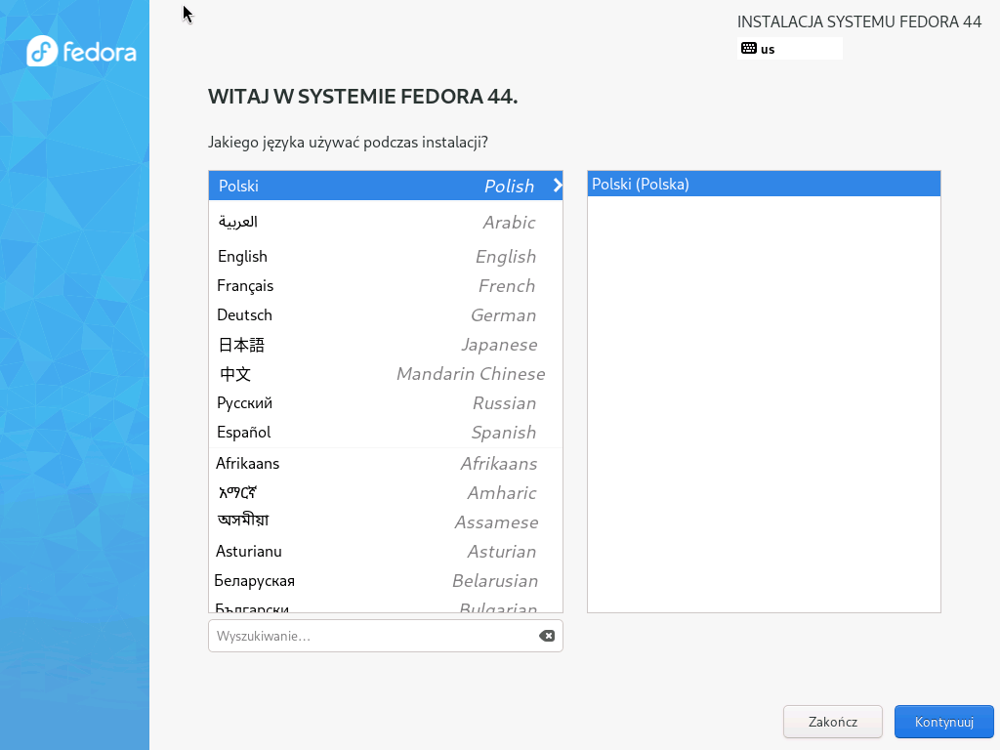
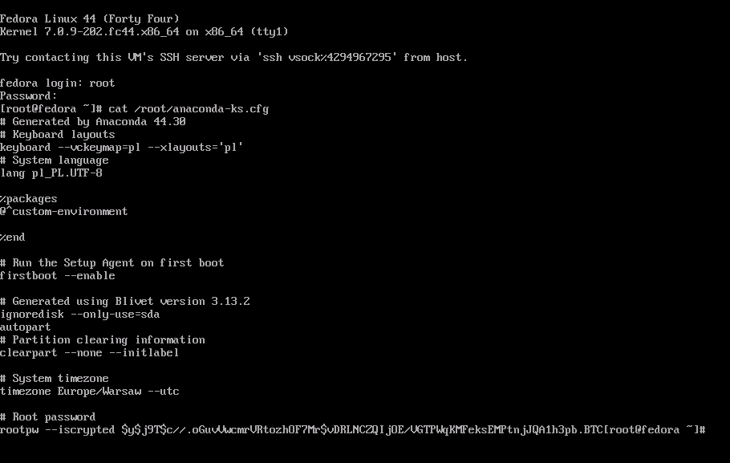
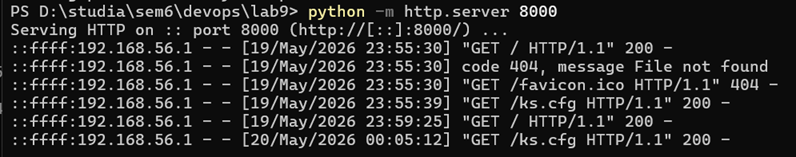
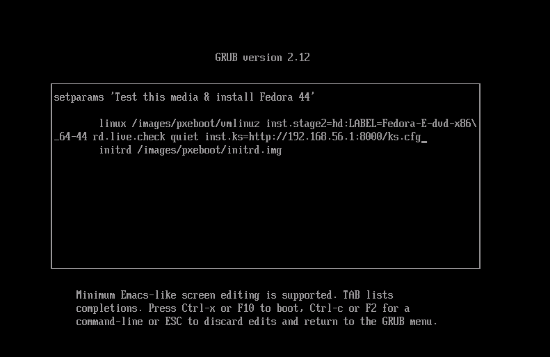
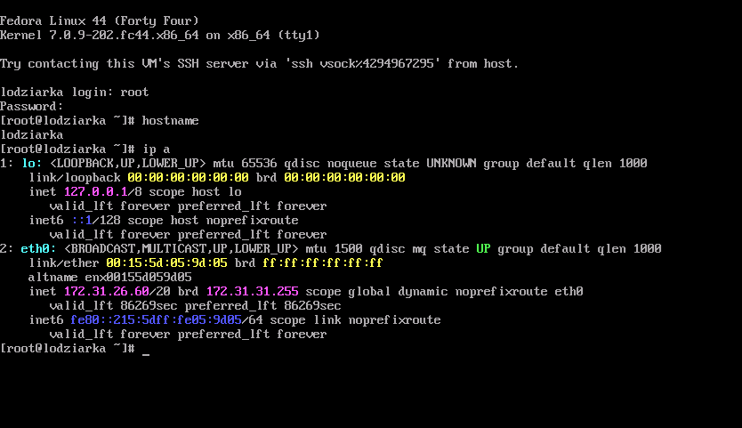
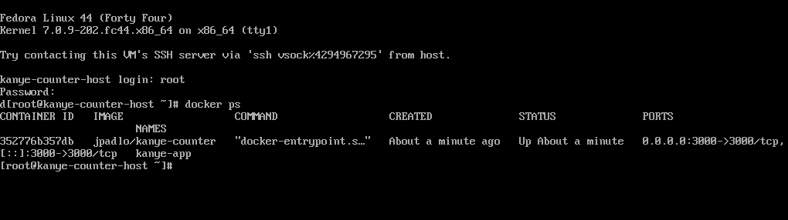
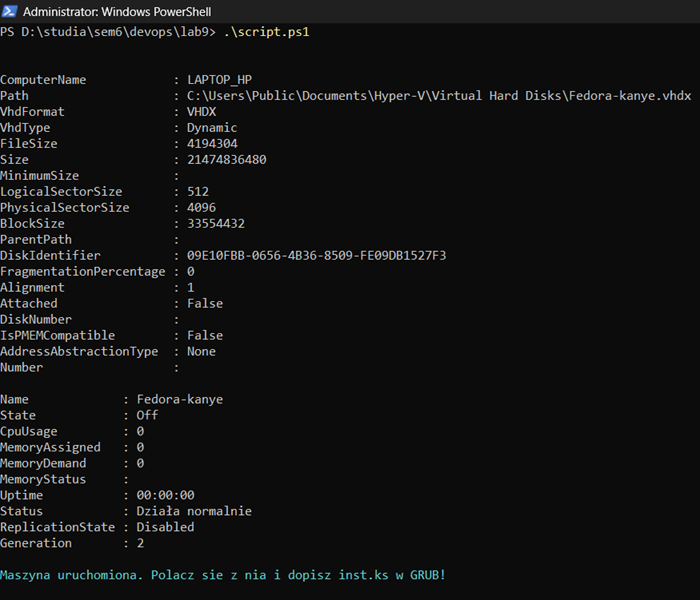
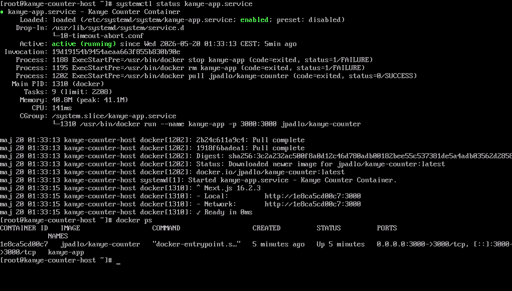

# Sprawozdanie LAB 9
### Jakub Padło, 422018

## Instalacja nienadzorowana systemu
Instalacja, który nie wymaga interakcji użytkownika. Zamiast osoby przeklikującej GUI to wszystko jest dostarczane systemowi w formie pliku konfiguracyjnego.
### Zalety
* **Automatyzacja**
* **Powtarzalność**
* **Oszczędność czasu**

## Kickstart 
Metoda instalacji nienadzorowanej dla Linuxów bazujących na RPM. Polega na podaniu instalatorowi pliku tekstowego .cfg

### Co zawiera?
* **Opcje systemowe**: Język, strefa czasowa, układ klawiatury, hasło roota.
* **Źródło instalacji**: Czy system ma być pobrany z płyty CD, z serwera HTTP, FTP czy NFS.
* **Partycjonowanie**: Jak podzielić dysk
* **Sieć**: Konfiguracja adresów IP
* **Pakiety (%packages)**: Lista oprogramowania, które ma zostać zainstalowane 
* **Skrypty (%post)**: Polecenia, które wykonają się automatycznie zaraz po zakończeniu instalacji

# 1. Pozyskanie szablonu
Przy każdej instalacji systemu w folderze `/root` tworzony jest plik na podstawie, którego powstał system. Aby uzyskać szablon pliku odpowedzi przeprowadziłem testową instalację ręcznie przez GUI.





# 2. Dostosowanie pliku pod własne potrzeby

```cfg
# Repozytoria
url --mirrorlist=http://mirrors.fedoraproject.org/mirrorlist?repo=fedora-44&arch=x86_64
repo --name=update --mirrorlist=http://mirrors.fedoraproject.org/mirrorlist?repo=updates-released-f44&arch=x86_64

# Klawiatura i język
keyboard --vckeymap=pl --xlayouts='pl'
lang pl_PL.UTF-8

# Sieć i Hostname
network --bootproto=dhcp --device=link --hostname=lodziarka --activate

# Pakiety
%packages
@core
%end

firstboot --enable
ignoredisk --only-use=sda
autopart

# Partycjonowanie
clearpart --all --initlabel

# Strefa czasowa
timezone Europe/Warsaw --utc

# Hasło roota
rootpw --plaintext toor
reboot
```

# 3. Problem przekazania pliku instalatarowi
Trzeba dostarczyć ten plik zanim system wogóle istnieje - przez to mamy mocno ograniczone opcje.

Można to zrobić przez fizyczny nośnik (np. pendrive), ale wtedy przy 100 maszynach trzeba przepinać pendrive do każdego komputera.

Rozwiązanie: Postawienie serwera HTTP z plikiem startowym

### Skąd "goły" system ma dostęp do sieci?
Gdy instalator widzi w parametrach startowych przedrostek `http://`, automatycznie uruchamia procedurę "Early Networking", która wysyła zapytanie DHCP na wszystkich dostępnych kartach sieciowycha aby przypisać sobie **tymczasowy** adres IP.



## UWAGA: W menu startowym (GRUB), dopisuje się ręcznie `inst.ks=http://<ip>/ks.cfg` aby instalator wiedział skąd pobrać plik.



## Bez ingerencji usera udało się postawić system, który ma skonfigurowanego roota, nadaną nazwę i przypisane IP.




# PART2: Rozszerzenie pliku, aby po starcie odrazu był gotowy i uruchamiał kontener dockera z moją aplikacją

### Słowniczek
* usługa(daemon) - program, który działa w tle, bez konieczności interakcji z userem.
* systemd - „menedżerem wszystkiego" - pierwszy proces, który rusza po włączeniu komputera i to on odpowiada za uruchamianie innych programów
* systemctl - konsolowy interfejs do zarządzania systemd

```
# 1. Repozytoria systemowe i Docker
url --mirrorlist=http://mirrors.fedoraproject.org/mirrorlist?repo=fedora-44&arch=x86_64
repo --name=update --mirrorlist=http://mirrors.fedoraproject.org/mirrorlist?repo=updates-released-f44&arch=x86_64
# Dodajemy oficjalne repozytorium Dockera
repo --name=docker-ce --baseurl=https://download.docker.com/linux/fedora/44/x86_64/stable/

# 2. Ustawienia regionalne i sieciowe
keyboard --vckeymap=pl --xlayouts='pl'
lang pl_PL.UTF-8
network --bootproto=dhcp --device=link --hostname=kanye-counter-host --activate

# 3. Instalacja oprogramowania
%packages
@core
docker-ce
docker-ce-cli
containerd.io
curl
%end

# 4. Partycjonowanie
clearpart --all --initlabel
autopart
ignoredisk --only-use=sda
firstboot --enable

timezone Europe/Warsaw --utc

# 5. Hasło i restart
rootpw --plaintext toor
reboot

# 6. Sekcja POST - Tu dzieje się magia wdrażania programu
%post --log=/root/ks-post.log

# Włączamy usługę Dockera
systemctl enable docker

# Tworzymy plik usługi systemd, która uruchomi Twój kontener przy starcie systemu
cat <<EOF > /etc/systemd/system/kanye-app.service
[Unit]
Description=Uruchomienie kontenera Kanye Counter
After=docker.service
Requires=docker.service

[Service]
TimeoutStartSec=0
Restart=always
# Pobranie obrazu przed startem
ExecStartPre=-/usr/bin/docker stop kanye-app
ExecStartPre=-/usr/bin/docker rm kanye-app
ExecStartPre=/usr/bin/docker pull jpadlo/kanye-counter
# Uruchomienie kontenera
ExecStart=/usr/bin/docker run --name kanye-app -p 3000:3000 jpadlo/kanye-counter

[Install]
WantedBy=multi-user.target
EOF

# Aktywujemy stworzoną usługę
systemctl enable kanye-app.service

%end
```

### DISCLAIMER: `systemctl enable docker` nie uruchamia odrazu dockera, ale mówi systemowi, że po każdym następnum uruchomieniu ma włączać usługę dockera.

## Tworzenie własnej usługi, która uruchomi kontener po każdym starcie systemu
Dokładne opisy w komentarzach
```
# Rozpoczyna zapisywanie tekstu do pliku usługi (aż napotka słowo EOF)
cat <<EOF > /etc/systemd/system/kanye-app.service

# Sekcja definiująca podstawowe informacje o jednostce (usłudze)
[Unit]

# Krótki opis usługi widoczny np. w statusie systemu
Description=Uruchomienie kontenera Kanye Counter

# Uruchom tę usługę dopiero wtedy, gdy Docker będzie już działał
After=docker.service

# Ta usługa wymaga do działania sprawnego procesu Dockera
Requires=docker.service

# Sekcja definiująca, jak usługa ma się zachowywać i co uruchamiać
[Service]

# Wyłącza limit czasu na uruchomienie (ważne, gdy wolno pobiera się obraz)
TimeoutStartSec=0

# Jeśli aplikacja się wyłączy lub wystąpi błąd, system uruchomi ją ponownie
Restart=always

# Polecenie przedstartowe: Zatrzymaj kontener o tej nazwie, jeśli już istnieje (minus ignoruje błędy)
ExecStartPre=-/usr/bin/docker stop kanye-app

# Polecenie przedstartowe: Usuń stary kontener, aby uniknąć konfliktów nazw (minus ignoruje błędy)
ExecStartPre=-/usr/bin/docker rm kanye-app

# Polecenie przedstartowe: Pobierz najnowszą wersję obrazu z serwera (Docker Hub)
ExecStartPre=/usr/bin/docker pull jpadlo/kanye-counter

# Główne polecenie: Uruchom kontener, nadaj mu nazwę i wystaw port 3000 na zewnątrz
ExecStart=/usr/bin/docker run --name kanye-app -p 3000:3000 jpadlo/kanye-counter

# Sekcja określająca, kiedy usługa ma być aktywna
[Install]

# Pozwala na automatyczny start usługi w standardowym trybie pracy systemu
WantedBy=multi-user.target

# Zamyka proces wpisywania tekstu do pliku
EOF
```


# Zakres rozszerzony
## 1. Automatyzacja procesu tworzenia i uruchomienia maszyny
```
# Parametry
$vmName = "Fedora-kanye"
$vhdPath = "C:\Users\Public\Documents\Hyper-V\Virtual Hard Disks\$vmName.vhdx"
$isoPath = "C:\Users\kubar\Downloads\Fedora-Everything-netinst-x86_64-44-1.7.iso"
$switchName = "Default Switch"

# 1. Tworzenie dysku twardego
New-VHD -Path $vhdPath -SizeBytes 20GB -Dynamic

# 2. Tworzenie Maszyny Wirtualnej 
New-VM -Name $vmName -MemoryStartupBytes 2GB -Generation 2 -Path "C:\Users\Public\Documents\Hyper-V" -SwitchName $switchName

# 3. Podpięcie dysku i ISO
Add-VMHardDiskDrive -VMName $vmName -Path $vhdPath
Add-VMDvdDrive -VMName $vmName -Path $isoPath

# 4. Wyłączenie Secure Boot
Set-VMFirmware -VMName $vmName -EnableSecureBoot Off

# 5. Uruchomienie maszyny
Start-VM -Name $vmName

Write-Host "Maszyna uruchomiona. Polacz sie z nia i dopisz inst.ks w GRUB!" -ForegroundColor Cyan
```


## 2. Sekcja zapewniająca wypisywanie na konsolę podczas instalacji - informuje usera co się teraz dzieje

```
%post --log=/root/ks-post.log
# Przekierowanie wyjścia na konsolę, aby było widać postępy na ekranie
exec < /dev/console > /dev/console

echo "------------------------------------------------------"
echo " KONFIGURACJA POST-INSTALL: INSTALACJA KANYE-COUNTER "
echo "------------------------------------------------------"

# Włączenie Dockera
echo ">>> Aktywacja usługi Docker..."
systemctl enable docker

# Tworzenie usługi dla kontenera
echo ">>> Tworzenie usługi systemd dla aplikacji..."
cat <<EOF > /etc/systemd/system/kanye-app.service
[Unit]
Description=Kanye Counter Container
After=docker.service
Requires=docker.service

[Service]
TimeoutStartSec=0
Restart=always
ExecStartPre=-/usr/bin/docker stop kanye-app
ExecStartPre=-/usr/bin/docker rm kanye-app
ExecStartPre=/usr/bin/docker pull jpadlo/kanye-counter
ExecStart=/usr/bin/docker run --name kanye-app -p 3000:3000 jpadlo/kanye-counter

[Install]
WantedBy=multi-user.target
EOF

echo ">>> Aktywacja usługi aplikacji..."
systemctl enable kanye-app.service

echo "------------------------------------------------------"
echo " INSTALACJA ZAKONCZONA. RESTART ZA 5 SEKUND... "
echo "------------------------------------------------------"
sleep 5
%end
```
## 3. System zainstalował się, usługa wystartowała z sukcesem i wewnątrz pracuje odpowiedni program

