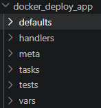

# Sprawodzanie zbiorcze lab 8-12
### Jakub Padło, 422018

# LAB 8 - ANSIBLE

# Ansible to **bezagentowe** narzędzie do automatyzacji, które pozwala w sposób powtarzalny i spójny konfigurować **wiele maszyn naraz** za pomocą prostych plików tekstowych.

## Ansible przejmuje pałeczkę konfiguracji gdy provisioner (np. Terraform) fizycznie postawi maszynę oraz zostanie jej nadane IP oraz skonfigutowane SSH. Jego zadaniem jest "umeblowanie" tej nowej, pustej maszyny.

# Wymagania
### Host
* system UNIXowy
* zaintalowany ansible
* zainstalowany python

### Maszyna
* dostęp przez SSH
* zainstalowany python
* **nie trzeba instalować ansible deamon**


# Najczęstsze zastosowanie
* **Konfiguracja serwerów** - automatyczne „umeblowanie" świeżych maszyn: instalacja pakietów, tworzenie userów, ustawianie firewalla, montowanie dysków.
* **Wdrażanie aplikacji** - pobranie kodu z repo, instalacja zależności, build, restart usług. Ansible bywa „ostatnim krokiem" pipeline'u, który faktycznie wypycha apkę na środowisko.
* **Patching i zarządzanie aktualizacjami** - masowe aktualizacje pakietów i łatki bezpieczeństwa na setkach hostów

# Cechy
* **Obsługa całej floty serwerów na raz** - zamiast wpisywać te same komendy na 100 serwerach, robisz to jednym poleceniem z maszyny sterującej.

* **Idempotentność** - Ansible gwarantuje, że system będzie w dokładnie takim stanie, jaki zdefiniowałeś. Jeśli uruchomisz ten sam skrypt drugi raz, Ansible nie zepsuje niczego, co już działa, a jedynie naprawi to, co się zmieniło.

* **IaC** - Konfiguracja zdefiniowana w kodzie. Ułatwia to śledzenie i wersjonowanie.

* **Złożnoość procesów** - Ansible pozwala na układanie zadań w logiczne ciągi

# Pliki
### hosts.ini
To plik tekstowy który jest listą serwerów. Pozwala je logicznie grupować. Dzięki temu w skryptach nie trzeba wpisywać adresów IP.

```ini
[webservers]
serwer_www1 ansible_host=192.168.1.50
serwer_www2 ansible_host=192.168.1.51
```

### playbook.yml
To plik w formacie YAML, w którym zappisuje się instrukcje krok po kroku.

```yml
- name: Pierwszy test polaczenia
  hosts: webservers
  tasks:
    - name: Sprawdz czy serwery odpowiadają
      ansible.builtin.ping:   
```

### `ansible.builtin.ping`
W Ansible nie pisze się skryptów od zera - oferuje ono setki gotowych, modułów do praktycznie każdego zadania systemowego. Trzeba jedynie wybrać odpowiedni "klocek" i podać odpowiednie parametry.

### Uruchomienie
```sh
ansible-playbook -i hosts.ini playbook.yml
```

# Role
Role w Ansible to sposób na organizowanie i dzielenie kodu na mniejsze, samowystarczalne i wielokrotnego użytku "paczki". Zamiast pisać jeden wielki, nieczytelny playbook na tysiąc linijek, dzielisz całą konfigurację na logiczne komponenty.

```sh
ansible-galaxy role init docker_deploy_app
```



```yml
# playbook.yml
- name: Wdrożenie aplikacji za pomocą roli
  hosts: Endpoints
  roles:
    - docker_deploy_app
```

# Weryfikacja 

```sh
ansible-playbook playbook.yml --check --diff
```
Sprawdzenie na sucho co dokładnie zmieni skrypt przed wdrożeniem go na produkcję.

# Handlers
Handlers to specjalne zadania, które nie wykonują się same z siebie. Uruchamiają się tylko wtedy, gdy inne zadanie je o to poprosi i tylko pod warunkiem, że tamto zadanie faktycznie dokonało jakiejś zmiany. Do wywoływania handlerów służy słowo kluczowe `notify`. Handlery wywołują się na samym końcu playbooka.

```yml
tasks:
  - name: Kopiuj nową konfigurację Nginx
    ansible.builtin.copy:
      src: nginx.conf
      dest: /etc/nginx/nginx.conf
    notify: restart_nginx        # NAZWA HANDLERA

handlers:
  - name: restart_nginx          # NAZWA HANDLERA
    ansible.builtin.service:
      name: nginx
      state: restarted
```

# Warunkowość (when)
```yml
- name: Sprawdz status uslugi
  ansible.builtin.command: systemctl is-active nginx
  register: nginx_status        # ZAPISANIE WYNIKU DLA NASTĘPNEGO ZADANIA

- name: Zareaguj gdy nginx padl
  ansible.builtin.debug:
    msg: "Nginx nie dziala!"
  when: nginx_status.rc != 0
```

---


# LAB 9 - Instalacja nienadzorowana systemu

# Instalacja, który nie wymaga interakcji użytkownika. Zamiast osoby przeklikującej GUI to wszystko jest dostarczane systemowi w formie pliku konfiguracyjnego.
### Zalety
* **Automatyzacja**
* **Powtarzalność**
* **Oszczędność czasu**

## Kickstart 
Metoda instalacji nienadzorowanej dla Linuxów bazujących na RPM. Polega na podaniu instalatorowi pliku tekstowego .cfg

### Co zawiera?
* **Opcje systemowe**: Język, strefa czasowa, układ klawiatury, hasło roota.
* **Źródło instalacji**: Czy system ma być pobrany z płyty CD, z serwera HTTP, FTP czy NFS.
* **Partycjonowanie**: Jak podzielić dysk
* **Sieć**: Konfiguracja adresów IP
* **Pakiety (%packages)**: Lista oprogramowania, które ma zostać zainstalowane 
* **Skrypty (%post)**: Polecenia, które wykonają się automatycznie zaraz po zakończeniu instalacji

## Typowe zastosowanie
1. **Bare metal / serwery fizyczne**
Najczęstszy realny przypadek. Nowe serwery w serwerowni instaluje się masowo przez PXE boot + Kickstart: maszyna startuje z sieci, pobiera ks.cfg, sama się partycjonuje i instaluje. Bez tego ktoś musiałby chodzić od serwera do serwera z pendrive'em.

2. **Budowanie szablonów**
Kickstart tworzy bazowy template, który potem Provisioner (np. Terraform) mnoży. Kickstart odpowiada na pytania instalatora, a na końcu powstaje zapieczony template. Robione raz, potem instancje lecą z gotowca.

## !UWAGA! - W codziennej pracy(szczególnie w chmurze) często nie stawia się systemu od zera, a korzysta się z gotowych szablonów

## Usługi systemowe
Definiujemy początkowy stan usług systemowych (programów, który działają w tle). To czy mają być włączone czy wyłączone.

```sh
services --enabled="sshd" --disabled="bluetooth"
```

## Sekcja post
### Skrypt uruchamiany na końcu instalacji, gdy system jest już zainstalowany na dysku, ale jeszcze przed pierwszym właściwym bootem.

### **UWAGA**: %post kusi, żeby wrzucić tam całą konfigurację serwera - BŁĄD!!!. Skrypt ten jest jednorazowy, nieidempotentny i trudny do debugowania. Dobra praktyka to w %post dać absolutne minimum do bootstrapu - sieć, SSH, klucz, a całą resztę oddać **Ansible**, który robi to idempotentnie i powtarzalnie przez całe życie maszyny. Innymi słowy **%post ma doprowadzić maszynę do stanu „da się na nią wejść i przejąć ją automatyzacją", nic więcej.**

## Przykładowy kickstart
```sh
# Repozytoria - mówią skąd pobrać pakiety w trakcie instalacji
url --mirrorlist=http://mirrors.fedoraproject.org/mirrorlist?repo=fedora-44&arch=x86_64

# --- Lokalizacja ---
lang en_US.UTF-8
keyboard pl
timezone Europe/Warsaw --utc

# --- Sieć (DHCP + nazwa hosta) ---
network --bootproto=dhcp --device=link --activate --hostname=serwer01

# --- Konto root ----
rootpw --lock

# --- User admin - to konto przejmie pozniej Ansible ----
user --name=admin --groups=wheel --iscrypted --password=...

# --- Partycjonowanie ----
ignoredisk --only-use=sda
clearpart --all --initlabel        # wyczysc caly dysk
autopart --type=lvm                # automatyczny uklad na LVM

# --- Uslugi: stan startowy ---
services --enabled=sshd,chronyd --disabled=cups,bluetooth

# --- Zapora ---
firewall --enabled --service=ssh

# --- Restart po instalacji ---
reboot

#  Pakiety
%packages
@core
docker-ce
docker-ce-cli
containerd.io
curl
%end

#  %post - minimalny bootstrap z logowaniem do pliku, zeby dalo sie debugowac.
%post --log=/root/ks-post.log

# Dodanie klucza SSH
mkdir -p /home/admin/.ssh
echo "ssh-ed25519 <klucz32> ansible@ctrl" > /home/admin/.ssh/authorized_keys
chmod 700 /home/admin/.ssh
chmod 600 /home/admin/.ssh/authorized_keys
chown -R admin:admin /home/admin/.ssh

%end
```

# LAB 10,11 - Kubernetes

## Problemy, które rozwiązuje Kubernetes
* **Brak automatycznego skalowania:** Ręczne zarządzanie zasobami utrudnia dynamiczne uruchamianie kontenerów, co prowadzi do błędów przy braku pamięci (OOM) lub niedostępności usług w szczycie ruchu.

* **Brak samonaprawy:** Kontenery nie są automatycznie restartowane po awarii, co wydłuża przestoje i wymaga każdorazowej interwencji administratora.

* **Pojedynczy punkt awarii:** Brak rozproszenia usług między wieloma hostami oznacza, że awaria jednej maszyny fizycznej trwale wyłącza wszystkie działające na niej aplikacje.

## Klastrowość
Klaster Kubernetes to grupa serwerów połączonych w jeden, wspólnie zarządzany zasób obliczeniowy. Dzięki temu aplikacje działają niezależnie od konkretnej maszyny – jeśli jeden serwer padnie, klaster automatycznie uruchamia kontenery na pozostałych.

Do nauki i testów lokalnych służy **Minikube**, który pozwala uruchomić cały taki klaster na pojedynczym komputerze.

## Słowniczek
### pod
* Najmniejsza abstrakcja w k8s.
* Pudełko na kontener. W k8s nie da sie uruchomic suchego kontnera, zawsze musi on byc zamkniety w podzie. 
* Pody mają zmienne IP

### deployment
* Nadzorca programu uruchomionego w klastrze
* Pilnuje zdefiniowanego stanu (po wywaleniu poda stawia nowy na jego miejsce)

### node
Pojedyncza maszyna robocza - może to być fizyczny serwer lub maszyna wirtualna.

#### Control node
Orkiestrator, zarządza całym klastrem. Nie stawia się na nim podów
* **etcd** - Baza danych typu klucz-wartość, która przechowuje całą konfigurację oraz aktualny stan klastra.
* **Scheduler** - Komponent decydujący o tym, na którym konkretnym węźle powinien zostać uruchomiony nowo utworzony pod, biorąc pod uwagę dostępne zasoby.
* **Controller Manager** - Pilnuje porzadku globalnie na całym klastrze. Zauważa niezgodności z planem i zleca dalej ich naprawę

#### Worker node
Siła robocza, maszyny na których uruchamiane są pody
* **kubelet**: Kierownik węzła, który odbiera polecenia z Control Plane'a i wydaje polecenia
* **containerd**: Bezpośrednio obsługuje kontenery (np. docker run) 

### service 
* Routing między podami
* Udostępnia pody na świat
* Działa jak gatway z internetu. Nadaje **stałe, jedno** IP zbiorowi podów, które mają zmienne IP.

## Popularne komendy
**kubectl**: CLI do komunikacji z klastrem Kubernetes 

1. `kubectl get pods/nodes/all` - Sprawdzanie stanu
2. `kubectl apply/delete -f nazwa_pliku.yaml` - Tworzenie/usuwanie zasobów zdefiniowanych w pliku
3. `kubectl describe <typ_zasobu> <nazwa_zasobu>` - Szczegółowe informacje o zasobie. Najlepsze do debugowania. W sekcji events widać powody błędów.
4. `kubectl logs` - Wyświetla logi
4. `kubectl exec -it <nazwa_poda> -- bash` - Otwiera terminal wewnatrze kontenera
5. `kubectl port-forward <nazwa_poda> port_na_localhoscie:port_wenatrz_kontenera` - Tunelowanei z hosta do konkretnego Poda w klastrze. Do testów, działa tylko tak długo, jak masz włączony terminal.
6. `kubectl cp <lokalny_plik> <pod>:<sciezka>` - kopiowanie plików między kontenerem a hostem
7. `kubectl rollout status deployment/<nazwa>` - Czeka aż wdrożenie się zakończy i w zależności od wyniku zwraca odpowiedni kod wyjścia.
8. `kubectl rollout history <nazwa_wdrożenia>` - Wyświetla listę zachowanych wersji wdrożenia.
9. `kubectl rollout undo <nazwa_wdrożenia>` - błyskawiczny rollback. Bez parametru cofa do poprzedniej stabilnej wersji.

## Strategie wdrożenia

### 1. Recreate
v1 -> Wszystkie pody v1 ubijane na raz -> downtime -> wszystkie pod v2 tworzone na raz -> v2

Stosowane gdy w tym samym czasie może działać tylko jedna wersja aplikacji ze względu na np. kompatybilność z bazą danych.

### 2. Rolling update
Dynamicznie podmienia pody. Zero downtime, ale na raz istnieją dwie wersji aplikacji.

* **maxSurge** - ile nadmiarowych podów może powstać. Nadmiarowe pody powstają, aby utrzymać wydajność systemu podczas aktualizacji.
Przyspiesza wdrożenie, ale wymaga dodatkowych zasobów
* **maxUnavailable** - ile podów może być niedostępnych podczas podmianki, czyli jak bardzo może spaść wydajność systemu.

### 3. Blue/Green
* Zamiast podmieniać pody, tworzymy ich drugi zestaw.
* Wymaga 2x zasobów
* Zero-downtime i natychmiastowe zmiany między wersjami

### 4. Canary deployment
* Niewielka część podów zostaje kanarkami eksperymentalnymi i otrzymuje nową, testową wersję aplikacji.
* Pozwala testować na produkcji
* W przypadku problemów tylko niewiele żądań jest nimi dotknięta i przywracamy poprzednią wersję


## Przykładowy plik wdrożeniowy
```yml
apiVersion: apps/v1
kind: Deployment
metadata:
  name: nextjs-rolling
spec:
  replicas: 5
  strategy:
    type: RollingUpdate
    rollingUpdate:
      maxSurge: 30%
      maxUnavailable: 2
  selector:
    matchLabels:
      app: nextjs
      strategy: rolling
  template:
    metadata:
      labels:
        app: nextjs
        strategy: rolling
    spec:
      containers:
      - name: nextjs-container
        image: jpadlo/kanye-counter:1.0.18
        ports:
        - containerPort: 3000
---
apiVersion: v1
kind: Service
metadata:
  name: nextjs-service
spec:
  selector:
    app: nextjs
    strategy: rolling
  ports:
    - protocol: TCP
      port: 80          # Port, na którym Service słucha wewnątrz klastra
      targetPort: 3000  # Port, na którym aplikacja nasłuchuje w kontenerze
```

# LAB 12 - Wdrożenie kontenera na Azure
 
## Azure Cloud Shell
 
Terminal do zarządzania zasobami Azure, gotowy do pracy bezpośrednio w przeglądarce - bez instalowania lokalnego CLI. Zawiera popularne narzędzia (git, docker, ansible), działa w trybie bash lub PowerShell. Pod maską uruchamiany jest tymczasowy kontener udostępniający powłokę.
 
**Ważne:** aby zachować pliki po zamknięciu terminala, konieczne jest podpięcie **Azure Storage Account**.
 
## Azure CLI vs Azure PowerShell
 
| | Azure CLI | Azure PowerShell |
|---|---|---|
| **Wynik** | czysty tekst | obiekty .NET (łatwe wyciąganie właściwości, np. `$status.IpAddress`, i potok `\|`) |
| **Tryb** | tylko bash | bash i PowerShell |
| **Przykład** | `az vm create --name MojaVM --resource-group MojaGrupa` | `New-AzVM -Name "MojaVM" -ResourceGroupName "MojaGrupa"` |
 
---
 
### Resource Group
 
Logiczny kontener grupujący powiązane zasoby Azure.
 
###  Utworzenie kontenera
 
```sh
az container create \
  --name kanye-app \
  --image jpadlo/kanye-counter:1.0.20 \
  --dns-name-label kanyeCountdown \
  --ports 3000 \
  --cpu 1 --memory 1 \
  --os-type Linux \
```
 
Najważniejsze parametry:
* `--image` - pełna ścieżka do obrazu w prywatnym rejestrze ACR (pobranie wymaga uwierzytelnienia).
* `--dns-name-label` - nadaje publiczną nazwę DNS; aplikacja jest dostępna pod `kanyeCountdown.[region].azurecontainer.io`.
* `--ports 3000` - otwiera port dla ruchu przychodzącego z internetu.
* `--cpu` / `--memory` - przydzielone zasoby sprzętowe.
---
 
# Wnioski
 
`az container create` reprezentuje **wysoki poziom abstrakcji** - jednym poleceniem konfiguruje publiczną domenę, rejestruje DNS i wystawia kontener „na świat", działając w modelu **Serverless**.
 
**Serverless** - model, w którym nie kupuje się ani nie zarządza serwerami; robi to dostawca chmury:
* brak zarządzania infrastrukturą,
* automatyczne skalowanie w zależności od ruchu,
* płatność tylko za faktyczne użycie.