# Sprawozdanie z pierwszego laboratorium z DevOps

### Wykonano początkowe kroki (przygotowanie do laboratorium)
- wlaczenie HyperV
- zainstalowanie ubuntu server
- skonfigurowanie odpowiednie

### Nastepnie przystąpiono do realizacji samych laboratoriow.
- zainstalowano odpowiednie pakiety (git, ssh)  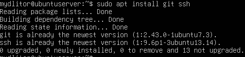
- sklonowano repo za pomocą https
- wlaczono usluge ssh   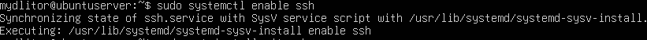
- wygenerowano klucze ssh  
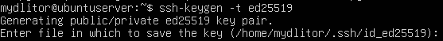
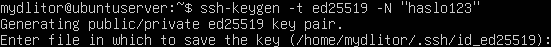
- sprawdzono adres ip w celu polaczenia przez ssh  
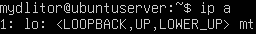
- polaczono przez ssh   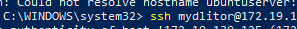
- wypisano klucz publiczny  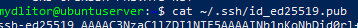
- dodano klucz publiczny do github   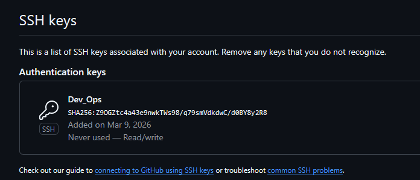
- usuniecie katalogu  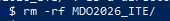
- zklonowanie repo z uzyciem ssh  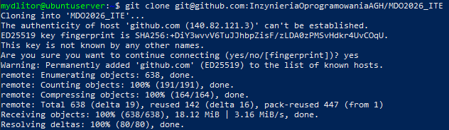
- dodanie 2FA do github   
- polaczenie przez ssh za pomoca vscode   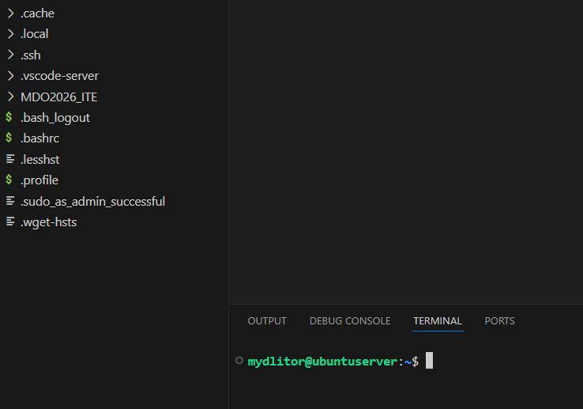
- polaczenie ftp za pomoca winscp  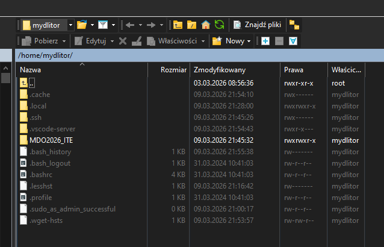
- git status  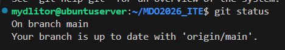
- checkout grupa5   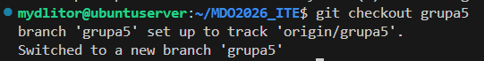
- checkout wlasny branch  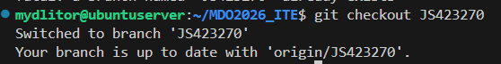
- stworzenie skryptu   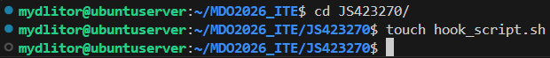
- przeniesienie pliku   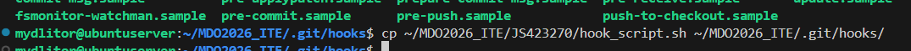
- zmiana nazwy pliku   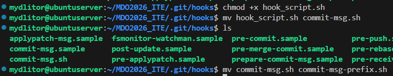
- otwarcie pull requesta   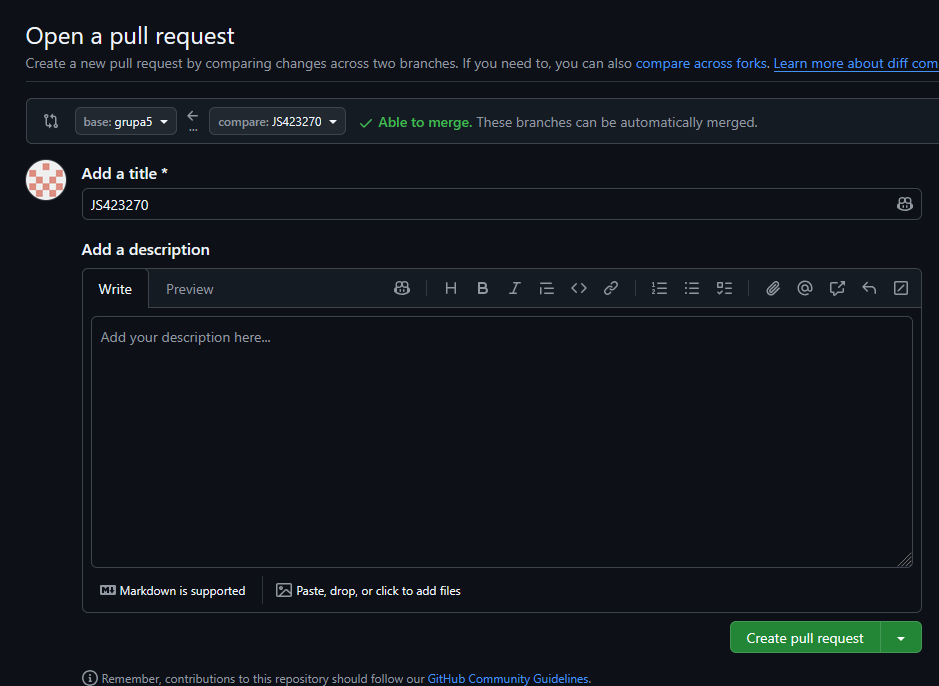

### Zawartość skryptu:
    #!/bin/bash
    sed -i '1 { /^JS423270/! s/^/JS423270 / }' "$1"

Dzialanie skryptu jest proste, dzialamy za pomocą narzedzia sed, konsolowego edytora tekstu.
Jezeli na początku pierwszej linii (na wypadek kilku linijkowego commita) nie znajdziemy odpowiedniego prefixu, jest on dopisywany
Jako argument github dodaje nam plik COMMIT_MSG, w ktorym znajduje sie wersja wiadomosci, którą bedziemy edytowac

### Historia poleceń (z visual code):

        mydlitor@ubuntuserver:~/MDO2026_ITE/JS423270$ history
        1  ls
        2  cd MDO2026_ITE/
        3  git
        4  git status
        5  git branch
        6  git checkout JS423270
        7  git checkout grupa 5
        8  git checkout grupa5
        9  git checkout -b JS423270
        10  git checkout JS423270
        11  mkdir grupa5/JS423270
        12  ls
        13  mkdir JS423270
        14  ls
        15  cd JS423270/
        16  touch hook_script.sh
        17  status
        18  cd ..
        19  ls
        20  ls -a
        21  cd .git
        22  ls
        23  cd hooks
        24  ls
        25  cp ~/MDO2026_ITE/JS423270/hook_script.sh ~/MDO2026_ITE/.git/hooks/
        26  ls
        27  chmod +x hook_script.sh 
        28  mv hook_script.sh commit-msg.sh
        29  ls
        30  mv commit-msg.sh commit-msg-prefix.sh
        31  git add .
        32  ls ..
        33  cd ..
        34  ls
        35  cd JS423270/
        36  git add .
        37  git commit -m"test hooka"
        38  git push origin JS423270
        39  git pull
        40  cd ..
        41  ls
        42  cd .git/
        43  ls
        44  cd hooks/
        45  ls
        46  mv commit-msg-prefix.sh commit-msg-prefix
        47  ls
        48  cd ../..
        49  cd JS423270/
        50  ls
        51  git add .
        52  git commit -m"test prefix"
        53  touch pliktest
        54  git commit -m"test prefix"
        55  git add .
        56  git commit -m"test prefix"
        57  git push
        58  git log
        59  git reflog
        60  cd ..
        61  ls .git/
        62  cd .git/
        63  cd hooks/
        64  ls -l commit-msg-prefix 
        65  ls
        66  mv commit-msg-prefix commit-msg
        67  ls
        68  cd ../..
        69  cd JS423270/
        70  ls
        71  rm pliktest 
        72  git add .
        73  git commit -m"fix: change script filename"
        74  git push
        75  history