# Sprawozdanie: Laboratorium 10 - Wdrażanie na  Kubernetes

### 1. Pobieranie niezbędnych narzędzi

Proces rozpoczęto od pobrania wymaganych plików wykonywalnych za pomocą narzędzia `curl`.

- W konsoli wykonano polecenie `sudo curl -LO` pobierające najnowszą wersję `minikube-linux-amd64` z oficjalnego repozytorium Google APIs. Pobieranie zakończyło się pomyślnie, ze statusem 100% dla pliku o rozmiarze 128M.
    

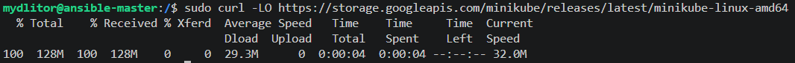

- Następnie w ten sam sposób pobrano plik wykonywalny `kubectl` w wersji stabilnej dla architektury amd64/linux z domeny `dl.k8s.io`.
    

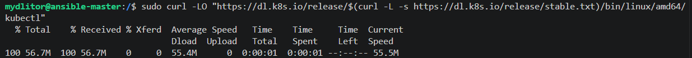

### 2. Przygotowanie środowiska maszyny wirtualnej i czyszczenie obrazów

- Zweryfikowano parametry sprzętowe maszyny wirtualnej o nazwie `UbuntuServer` w menedżerze Hyper-V na systemie Windows. Zakładka "Procesor" wskazuje przypisanie 2 procesorów wirtualnych, a zakładka "Pamięć" widoczna po lewej stronie wskazuje 4096 MB RAM. Co nie jest ukazane na zrzucie ekranu, ze względu na problemy z odpaleniem kubectl zwiększono RAM do 8GB.
    

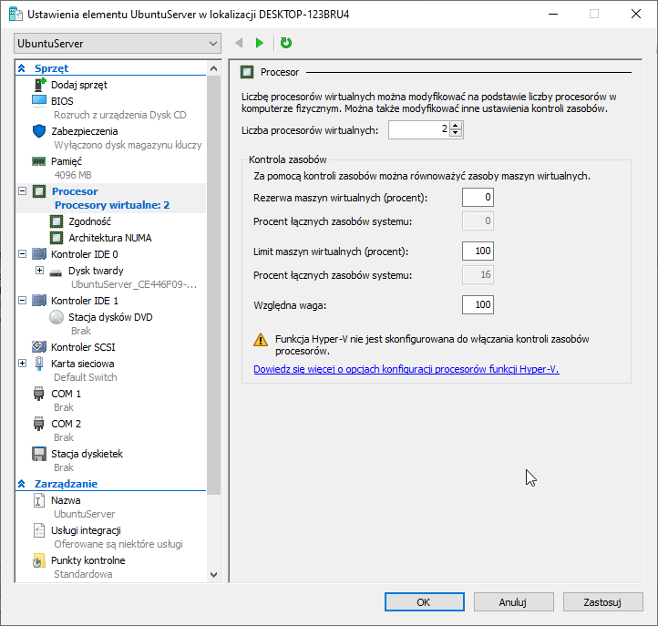

- W systemie Linux oczyszczono środowisko Dockera poprzez wykonanie komendy `sudo docker rmi $(docker images -a -q) -f`, w celu wyczyszczenia miejsca w Dockerze.
    

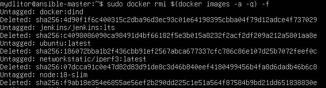

### 3. Uruchomienie klastra i weryfikacja

- Wykonano polecenie `minikube start --driver=docker`. W logach widać, że klaster w wersji v1.38.1 pomyślnie się uruchomił używając sterownika docker i tworząc kontener z limitami: CPUs=2, Memory=3072MB. Następnie wpisano `kubectl get nodes`, co zwróciło jeden węzeł o nazwie `minikube` w statusie `Ready` i roli `control-plane`.
    

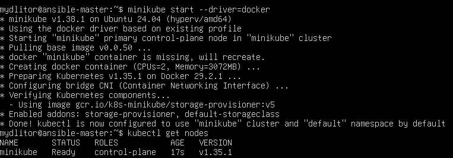

### 4. Uruchomienie interfejsu graficznego (Dashboard)

- W konsoli widać wykonanie komendy proxy, a następnie komendę `minikube dashboard --url &` uruchomioną w tle (identyfikator zadania `[2] 4451`). Zwrócone logi informują o uruchomieniu dashboardu z wykorzystaniem obrazów `kubernetesui/dashboard:v2.7.0` oraz podają lokalny link proxy.
    

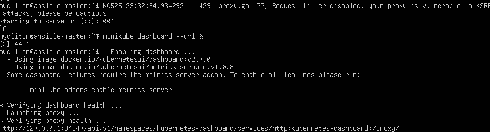

- Na zrzucie ekranu z przeglądarki widać, że udało się nawiązać łączność z Kubernetes Dashboard przez adres `http://172.27.185.58:8001/api/v1/namespaces/kubernetes-dashboard...`. 
    

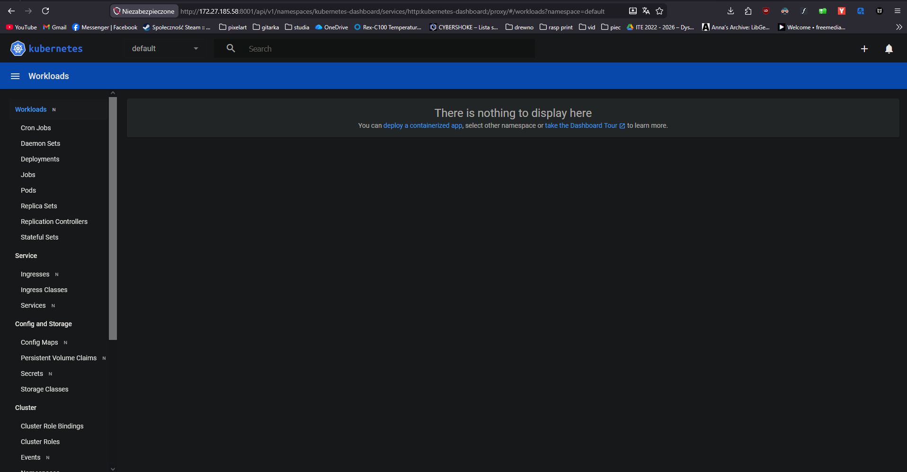

### 5. Manualne wdrożenie Poda i ekspozycja w przeglądarce

- Za pomocą polecenia `kubectl run lab10app --image=nginx:alpine --port=80 --labels app=lab10app` utworzono pojedynczego Poda. Weryfikacja poleceniem `kubectl get pods` ukazała Poda o nazwie `lab10app` w statusie `Running` .
    

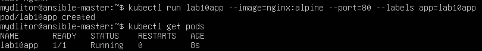

- Ukazano okno przeglądarki (Firefox) z adresem `http://172.27.185.58:8080`, na którym prawidłowo wyświetla się domyślna strona powitalna serwera WWW: "Welcome to nginx!".
    

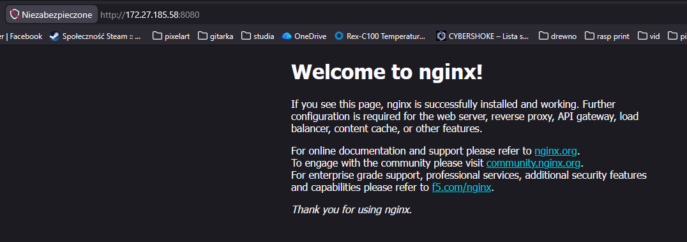

### 6. Wdrożenie deklaratywne z pliku YAML i skalowanie

- Otwarto plik `deploy.yml`. Plik definiuje obiekt typu `Deployment` o nazwie `lab10dep`, w którym ustawiono parametr `replicas: 1` oraz zdefiniowano kontener na bazie obrazu `nginx:alpine`.
    

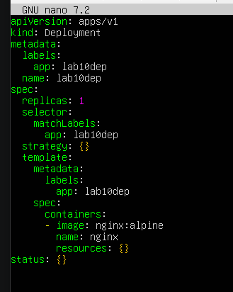

- Następnie zmodyfikowano wspomniany plik, zmieniając wartość parametru `replicas` z `1` na `4`.
    

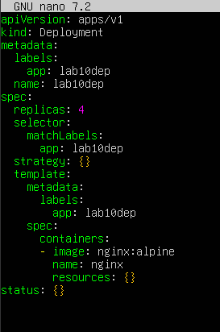

### 7. Zastosowanie Deploymentu i Serwisu

Nastepnie wykonano deployment:

1. `kubectl apply -f deploy.yml` — zwróciło komunikat `deployment.apps/lab10dep created`.
    
2. `kubectl rollout status deployment/lab10dep` — zwróciło potwierdzenie `deployment "lab10dep" successfully rolled out`.
    
3. `kubectl expose deployment lab10dep --type=ClusterIP --port=80 --target-port=80 --name=app-service` — utworzyło serwis o nazwie `app-service`.
    
4. `kubectl port-forward svc/app-service 8081:80 --address 0.0.0.0 &` — uruchomiło w tle przekierowanie portu z maszyny z systemem Linux (port 8081) do serwisu K8s na port 80. Na ekranie widać log `Handling connection for 8081`.
    

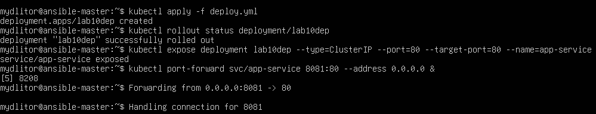

- Ostatnim krokiem jest zrzut ekranu z przeglądarki, prezentujący stronę pod adresem `http://172.27.185.58:8081`. Tak jak wcześniej, widoczna jest strona "Welcome to nginx!", co potwierdza poprawne udostępnienie uruchomionych 4 replik kontenera na zewnątrz klastra poprzez skonfigurowany serwis.
    

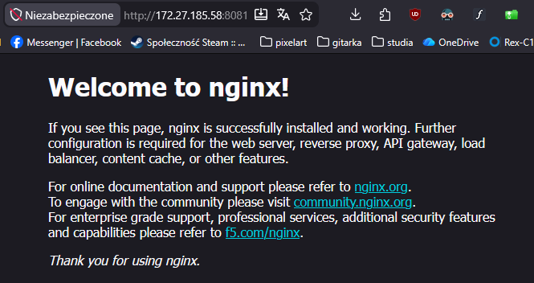
