# Sprawozdanie: Laboratorium 11 - Wdrażanie na zarządzalne kontenery: Kubernetes (2)

### 1. Przygotowanie nowych obrazów aplikacji

Proces rozpoczęto od lokalnego zbudowania trzech wariantów obrazu opartego na bazowym obrazie `nginx:alpine`. Wykorzystano do tego polecenie `docker build`.

- W pierwszym kroku utworzono obraz oznaczony tagiem `lab11-app:v1`. Zmodyfikowano w nim domyślną stronę serwera, nadpisując plik `index.html` wartością "Wersja 1 - Jakub". Proces budowy zakończył się sukcesem.
    

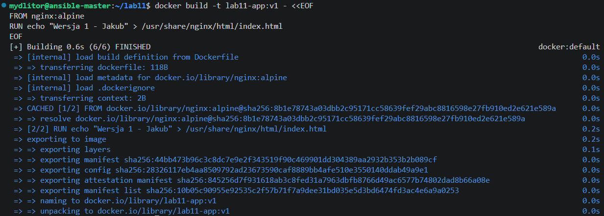

- Analogicznie przygotowano drugą wersję obrazu z tagiem `lab11-app:v2`. W tym przypadku zawartość pliku `index.html` zmieniono na "Wersja 2 - Jakub".
    

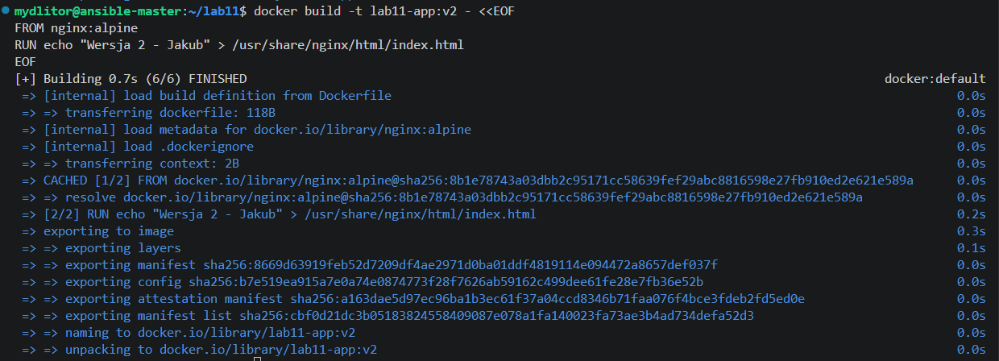

- Zgodnie z instrukcją, przygotowano również trzecią, celowo wadliwą wersję obrazu o nazwie `lab11-app:broken`. Użyto w niej polecenia `CMD`, które przy próbie uruchomienia kontenera wypisuje komunikat "Krytyczny blad!" i natychmiast kończy działanie z kodem błędu 1 (`exit 1`).
    

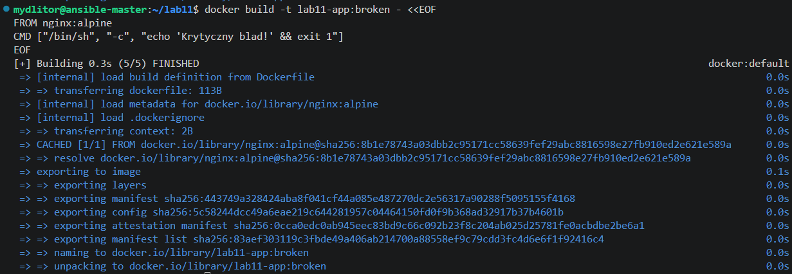

- Ponieważ obrazy zostały zbudowane w lokalnym środowisku, wgrano je bezpośrednio do rejestru klastra Minikube za pomocą polecenia `minikube image load`, przekazując nazwy wszystkich trzech przygotowanych wariantów.
    

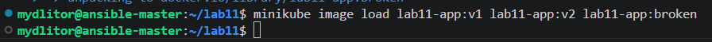

### 2. Początkowe wdrożenie deklaratywne i testowanie skalowania

- W edytorze tekstu utworzono plik konfiguracyjny `deploy.yml`. Zdefiniowano w nim obiekt typu `Deployment` o nazwie `lab11-deployment`, docelowo uruchamiający 4 repliki aplikacji z obrazu `lab11-app:v1` (wymuszono strategię `imagePullPolicy: Never`).
    

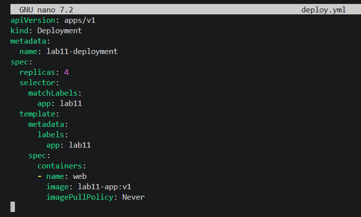

- Zaaplikowano konfigurację poleceniem `kubectl apply -f deploy.yml`.
    

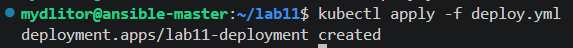

- Weryfikacja stanu klastra poleceniem `kubectl get pods` potwierdziła, że wszystkie 4 żądane repliki zostały pomyślnie utworzone i posiadają status `Running`.
    

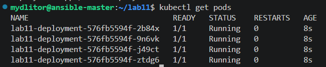

- Przy użyciu narzędzia `sed` zmodyfikowano plik `deploy.yml`, zwiększając docelową liczbę replik do 8. Po ponownym zaaplikowaniu konfiguracji zaobserwowano proces tworzenia nowych Podów (statusy `Pending` oraz `ContainerCreating`).
    

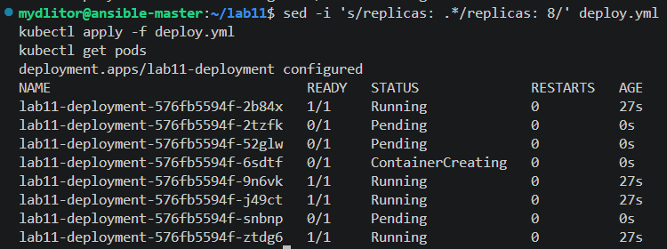

- Następnie przetestowano drastyczne skalowanie w dół, redukując liczbę replik do 1. System poprawnie zredukował liczbę działających instancji.
    

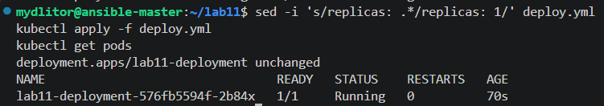

- Zmniejszono liczbę replik do 0. Pody zostały przeniesione w stan `Terminating`, po czym środowisko zostało całkowicie opróżnione z instancji działającej aplikacji, co potwierdził komunikat `No resources found`.
    

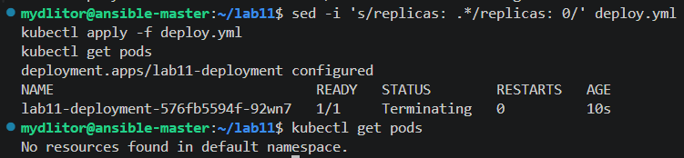

### 3. Aktualizacje obrazów we wdrożeniu (Rolling Updates)

- Ponownie przeskalowano wdrożenie w górę, ustalając liczbę replik na 4, co zainicjowało proces przywracania Podów.
    

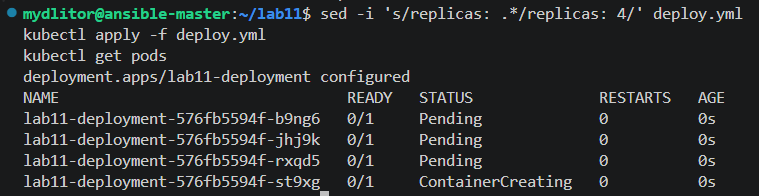

- Dokonano aktualizacji wdrażanej aplikacji, podmieniając w pliku manifestu obraz na wersję `lab11-app:v2`. Po zaaplikowaniu zmian zaobserwowano domyślną strategię aktualizacji – wyłączanie starych Podów i uruchamianie nowych w sposób płynny.
    

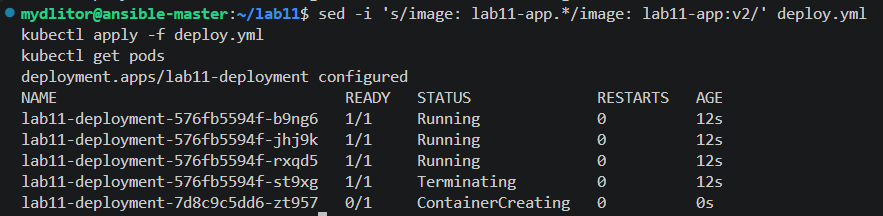

- W kolejnym kroku przeprowadzono "downgrade", przywracając starszą wersję obrazu (`v1`). System poprawnie wdrożył zadaną konfigurację.
    

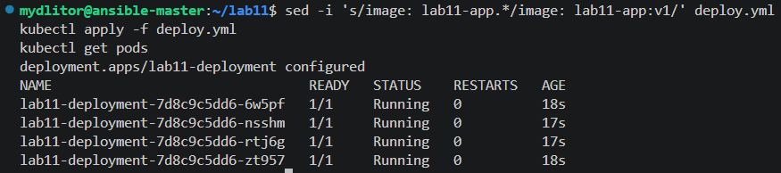

- Przetestowano zachowanie klastra w przypadku zastosowania wadliwego obrazu `lab11-app:broken`. Wynik polecenia `kubectl get pods` ukazał, że nowe Pody napotykają na krytyczny problem (status `Error`), co skutkuje pętlą restartów (CrashLoopBackOff). Dzięki domyślnym mechanizmom ochrony, klaster wstrzymał zamykanie wszystkich starych, poprawnie działających replik.
    

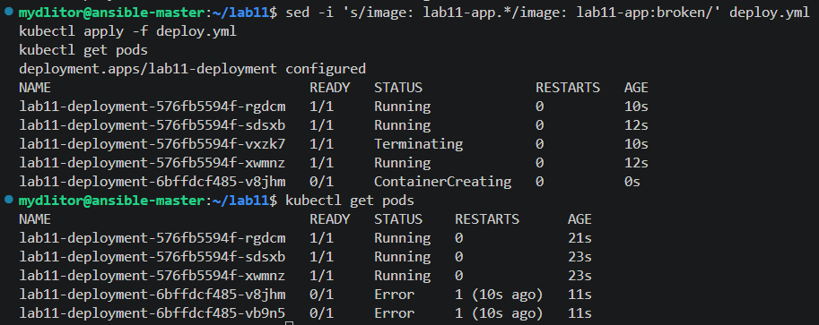

### 4. Kontrola historii wdrożenia i skrypt weryfikujący

- Sprawdzono historię zmian konfiguracji za pomocą polecenia `kubectl rollout history`. Następnie, z uwagi na wadliwe wdrożenie obrazu `broken`, wymuszono powrót do ostatniej stabilnej wersji za pomocą komendy `kubectl rollout undo`. Pody poprawnie ustabilizowały się w statusie `Running`.
    

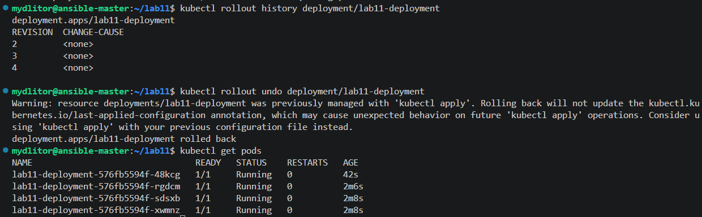

- Zgodnie z instrukcją, przygotowano skrypt Bash o nazwie `check_deploy.sh`. Jego zadaniem jest zmiana obrazu na wersję `v2` w aktywnym deploymencie oraz monitorowanie statusu przy użyciu flagi `--timeout=60s`.
    

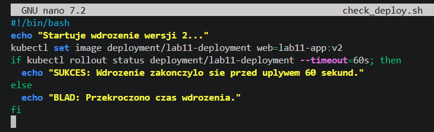

- Nadano uprawnienia do wykonywania skryptu i uruchomiono go. W terminalu widoczny jest proces stopniowego podmieniania replik (rollout). Cała operacja zakończyła się sukcesem przed upływem 60 sekund, co wyzwoliło poprawny komunikat wyjściowy skryptu.
    

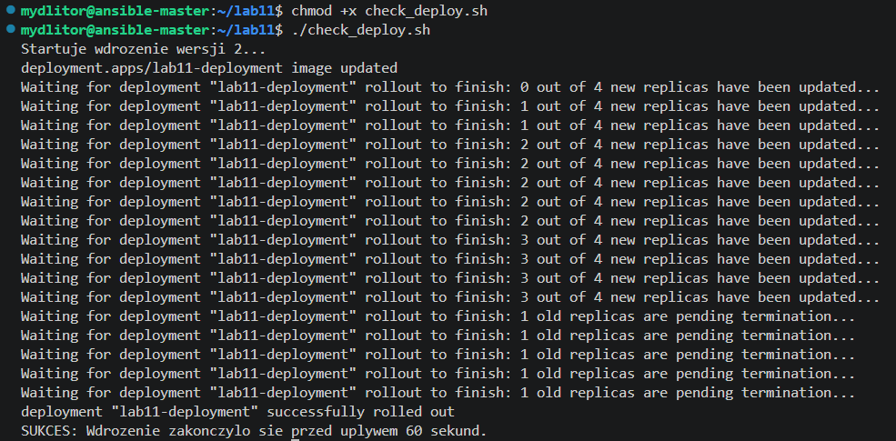

- Przed przystąpieniem do analizy kolejnych strategii, usunięto dotychczasowe wdrożenie poleceniem `kubectl delete deployment`.
    

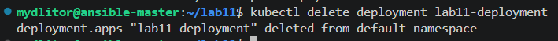

### 5. Strategie wdrożenia: Recreate, Rolling Update, Canary

- **Strategia Recreate:** Utworzono plik `deploy-recreate.yml` z poleceniem uruchomienia 3 replik. W pliku jawnie wskazano w parametrze `strategy` typ `Recreate`, który powoduje całkowite zatrzymanie starych instancji przed uruchomieniem nowych.
    

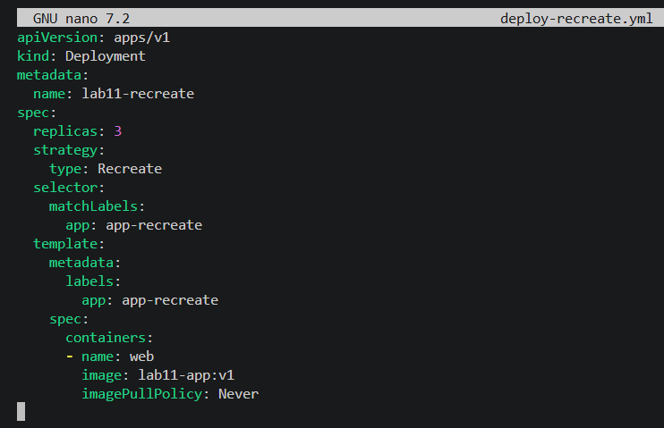

- Powyższy manifest wdrożono w klastrze.
    

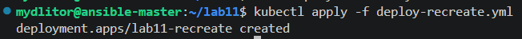

- **Strategia Rolling Update (niestandardowa):** Utworzono plik `deploy-rolling.yml` dla 5 replik, w którym precyzyjnie skonfigurowano parametry aktualizacji płynnej. Parametr `maxUnavailable: 1` określa, że maksymalnie 1 pod może być niedostępny podczas aktualizacji, natomiast `maxSurge: 20%` zezwala na krótkotrwałe przekroczenie żądanej liczby replik o 20%.
    

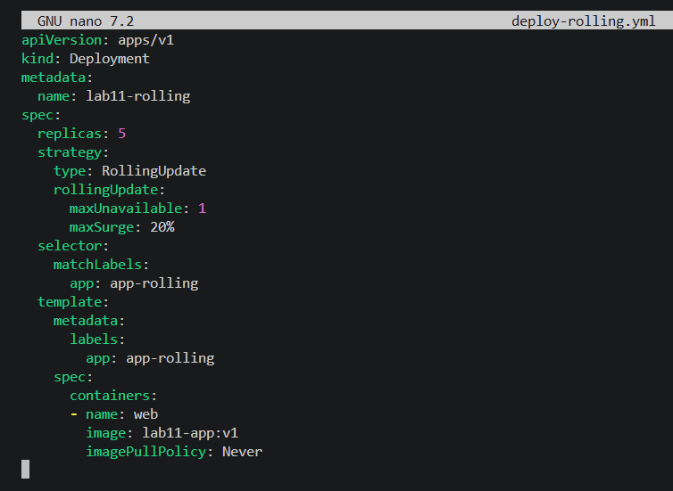

- Zaaplikowano nowe wdrożenie.
    

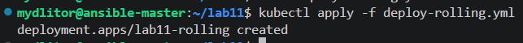

- **Strategia Canary Deployment:** Wdrożenie metody kanarkowej zrealizowano przy pomocy jednego pliku `canary.yml`. Zdefiniowano w nim wspólny zasób typu `Service` przekierowujący ruch na port 80 do podów z etykietą `app: canary-app`. Podzielono aplikację na dwa Deploymenty: `app-stable` (3 repliki w wersji stabilnej `v1`) oraz `app-canary` (1 replika w wersji testowej `v2`), dzięki czemu zaledwie część ruchu kierowana jest do nowej wersji aplikacji.
    

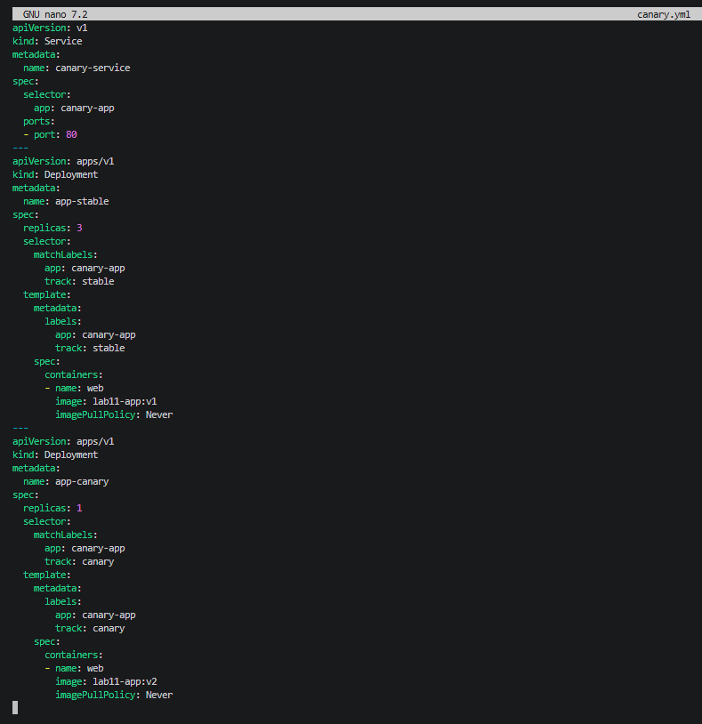

- Wdrożono przygotowany plik serwisowy oraz deploymenty kanarkowe.
    

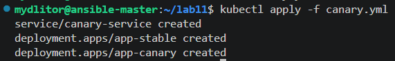

- Wykonano polecenie `kubectl get pods --show-labels` celem weryfikacji etykiet. Zrzut ekranu precyzyjnie ukazuje Pody zgrupowane dla różnych strategii, z uwzględnieniem podziału na `track=stable` i `track=canary` w przypadku wdrożenia wariantu kanarkowego. Wspólna etykieta `app=canary-app` zapewnia poprawne zbieranie ruchu z utworzonego wcześniej Serwisu.
    

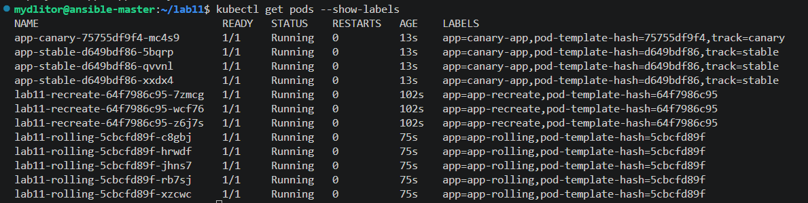

### Zaobserwowane różnice w strategiach wdrożeń

Na podstawie przeprowadzonych testów zaobserwowano zasadnicze różnice w sposobie aktualizacji i dystrybucji ruchu dla poszczególnych strategii:

- **Recreate:** Podczas aktualizacji wszystkie istniejące Pody (stara wersja) są najpierw całkowicie usuwane, a dopiero po ich terminacji uruchamiane są Pody z nową wersją. Zaletą tego rozwiązania jest brak jednoczesnego działania dwóch różnych wersji aplikacji (co eliminuje ewentualne konflikty np. w schemacie bazy danych). Skutkuje to jednak całkowitą przerwą w dostępności usługi (downtime) na czas pobierania obrazu i startu nowych kontenerów.
    
- **Rolling Update:** Zgodnie ze zdefiniowanymi parametrami (`maxUnavailable: 1`, `maxSurge: 20%`), aktualizacja przebiegała etapowo. Klaster utrzymywał ciągłość działania aplikacji, wygaszając i uruchamiając Pody w małych partiach. Wdrożenie to eliminuje przerwę w dostępności (zero-downtime), lecz wiąże się z przejściowym okresem, w którym ruch sieciowy jest rozkładany równolegle na dwie różne wersje aplikacji.
    
- **Canary Deployment:** W odróżnieniu od poprzednich metod, wdrożenie kanarkowe opiera się na celowym utrzymywaniu dwóch niezależnych obiektów `Deployment`, które są podpięte pod ten sam wspólny `Service` za pomocą odpowiednich etykiet. Zaobserwowano, że mniejszość żądań (1 nowa replika na 3 stabilne, co stanowi 25% ruchu) trafiała do nowej wersji. Strategia ta pozwala na najbezpieczniejsze testowanie nowej wersji na ułamku rzeczywistego ruchu, z możliwością natychmiastowego wycofania w przypadku wykrycia błędów, nie zaburzając pracy większości użytkowników.