# Sprawozdanie: Laboratorium 12 - Wdrażanie na zarządzalne kontenery w chmurze (Azure)

### 1. Przygotowanie aplikacji i obrazu kontenera

Proces rozpoczęto od przygotowania prostego kodu aplikacji w środowisku Node.js. Utworzono plik `index.js`, w którym zdefiniowano serwer HTTP nasłuchujący na porcie 3000. Aby zapewnić dostępność usługi z zewnątrz kontenera, jako adres nasłuchiwania wskazano `0.0.0.0`.

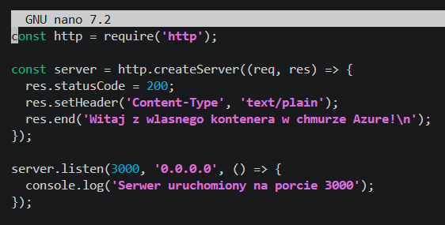

Następnie przygotowano plik `Dockerfile` bazujący na lekkim obrazie `node:18-alpine`. Skonfigurowano w nim katalog roboczy, skopiowano pliki aplikacji, wyeksponowano port 3000 oraz zdefiniowano bezpośrednie uruchomienie pliku `index.js` za pomocą środowiska Node.

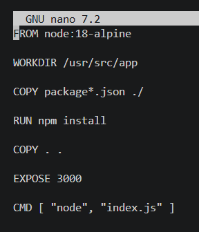

Po zdefiniowaniu środowiska uruchomieniowego, zalogowano się do lokalnego klienta Docker za pomocą polecenia `docker login`. Po uwierzytelnieniu obraz został zbudowany i wypchnięty (push) do publicznego rejestru Docker Hub.

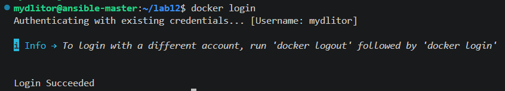

### 2. Zapoznanie z platformą Azure i konfiguracja środowiska

Zalogowano się do platformy Azure przy użyciu konta studenckiego (Azure for Students). Następnie uruchomiono narzędzie Azure Cloud Shell, w którym uwierzytelniono sesję za pomocą polecenia `az login`.

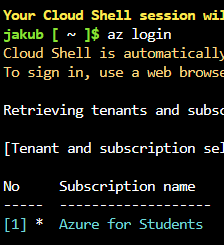

Przystąpiono do utworzenia nowej grupy zasobów (Resource Group) o nazwie `lab12-rg`. Początkowo wybrano lokalizację `polandcentral`. Utworzenie grupy zakończyło się statusem `Succeeded`.

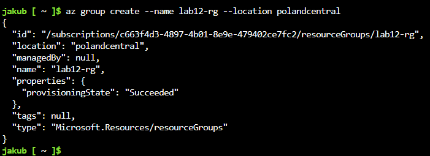

### 3. Rozwiązywanie problemów z politykami regionalnymi

Podczas pierwszej próby wdrożenia kontenera do nowo utworzonej grupy zasobów wystąpił krytyczny błąd `RequestDisallowedByAzure`. Platforma zablokowała operację ze względu na przypisane do konta studenckiego polityki optymalizacji kosztów i wydajności, które ograniczają dostępność niektórych regionów.

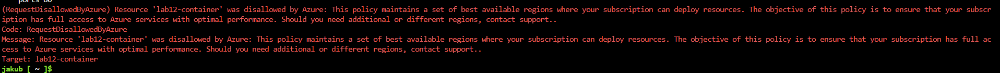

W celu weryfikacji problemu przejrzano ustawienia subskrypcji w panelu Azure. Parametr `Allowed locations` jednoznacznie wskazał listę dozwolonych regionów, w której nie znajdował się `polandcentral` (dostępne były m.in. `francecentral`, `spaincentral`, `swedencentral`).

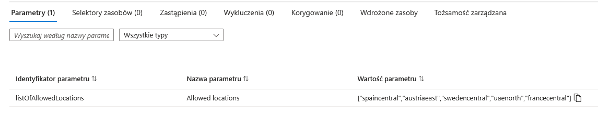

Zgodnie z dobrymi praktykami zarządzania chmurą, usunięto dotychczasową, zablokowaną grupę zasobów poleceniem `az group delete`. Następnie utworzono ją ponownie, tym razem we właściwej, dozwolonej lokalizacji `francecentral`.

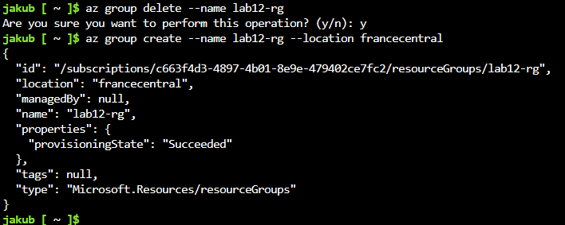

### 4. Wdrożenie kontenera w usłudze Azure Container Instances

Mając poprawnie skonfigurowaną grupę zasobów, przystąpiono do wdrożenia kontenera poleceniem `az container create`. Aby uniknąć błędów infrastrukturalnych, jawnie zdefiniowano system operacyjny (`--os-type Linux`), przekierowanie portu na `3000` oraz przydzielono niezbędne zasoby obliczeniowe (`--cpu 1`, `--memory 1`). Wdrożenie zakończyło się sukcesem.

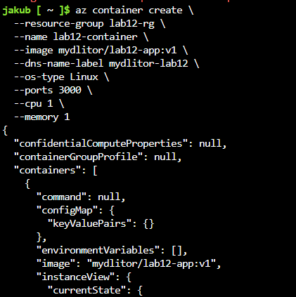

### 5. Kontrola wdrożenia i weryfikacja działania aplikacji

W celu potwierdzenia statusu usługi oraz uzyskania pełnego adresu internetowego wykonano zapytanie za pomocą komendy `az container show`. Status usługi wzkazywał `Succeeded`, a serwerowi przypisano adres FQDN: `mydlitor-lab12.francecentral.azurecontainer.io`.

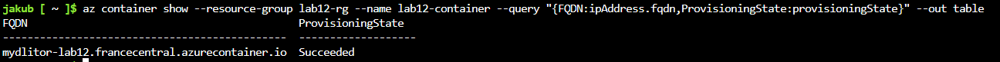

Następnie pobrano logi z działającego kontenera używając komendy `az container logs`. W konsoli wyświetlił się poprawny komunikat zaimplementowany wcześniej w kodzie aplikacji ("Serwer uruchomiony na porcie 3000"), co potwierdziło udany start procesu Node.js.

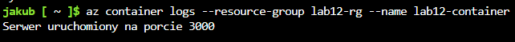

W ostatnim kroku weryfikacyjnym wprowadzono otrzymany adres FQDN wraz ze zdefiniowanym portem (`:3000`) do przeglądarki internetowej. Aplikacja poprawnie obsłużyła zapytanie HTTP, serwując tekst powitalny z chmury Azure.

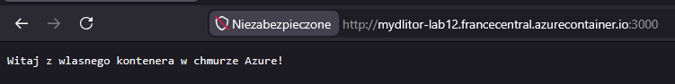

### 6. Czyszczenie środowiska

Zgodnie z wymaganiami instrukcji oraz w celu zapobiegania niepotrzebnemu zużyciu studenckich kredytów obliczeniowych, po zakończeniu weryfikacji powołana Grupa Zasobów (`lab12-rg`) wraz ze znajdującym się w niej kontenerem została trwale usunięta.