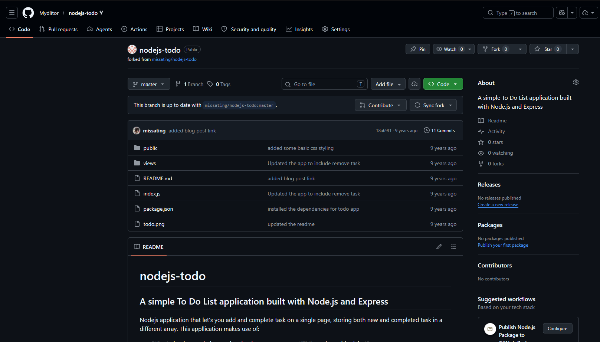
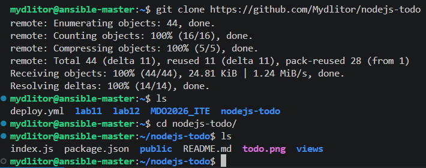
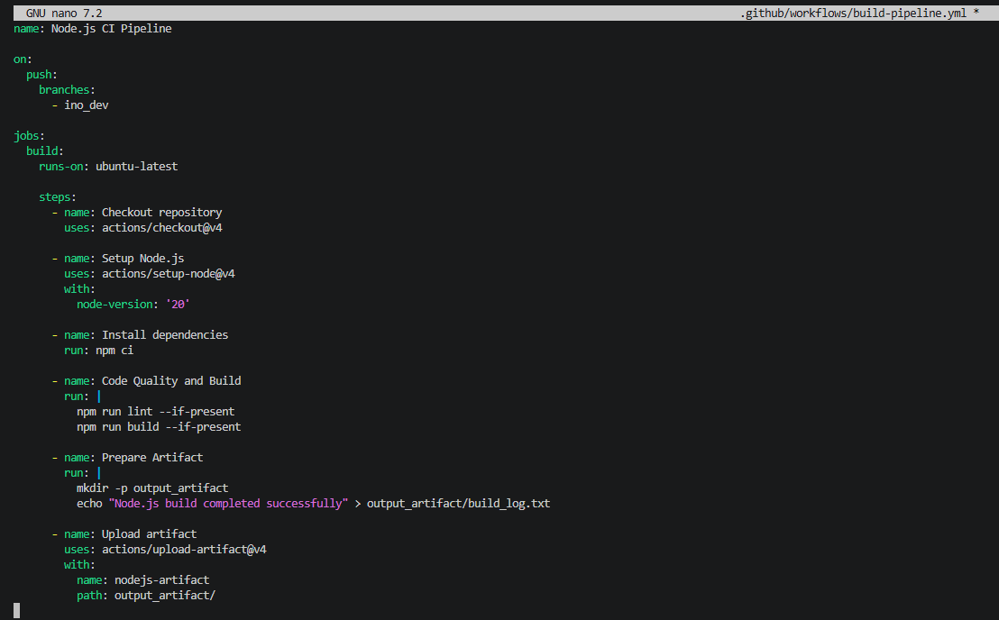
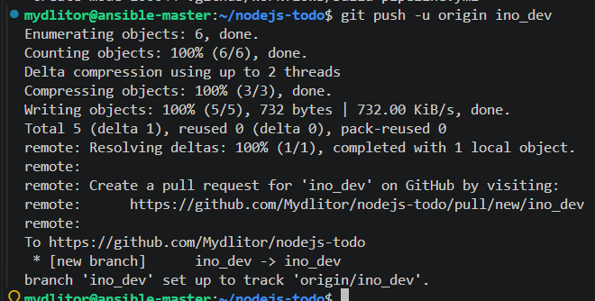
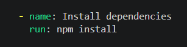

# # Sprawozdanie: Laboratorium 13 - Shift-left – GitHub Actions

## 1. Przygotowanie repozytorium (Fork)

Zadanie rozpoczęto od znalezienia odpowiedniego repozytorium zawierającego aplikację napisaną w środowisku Node.js (`missating/nodejs-todo`). Następnie wykonano fork tego projektu na własne konto na platformie GitHub, aby móc bezpiecznie pracować nad konfiguracją CI/CD bez ingerowania w główny projekt.

## 2. Pobranie kodu na środowisko lokalne

Po utworzeniu forka, sklonowano repozytorium na maszynę wirtualną za pomocą polecenia `git clone`. Następnie zweryfikowano strukturę pobranych plików, upewniając się, że w projekcie znajdują się wymagane pliki, takie jak `package.json`.

## 3. Konfiguracja nowej akcji (Workflow)

Utworzono dedykowaną gałąź `ino_dev` oraz wyczyszczono stare konfiguracje. Następnie w katalogu `.github/workflows/` stworzono plik `build-pipeline.yml`. Zdefiniowano w nim nową akcję (Node.js CI Pipeline), która uruchamia się na zdarzenie `push` dla gałęzi `ino_dev`. Akcja zawiera kroki odpowiadające za pobranie kodu, konfigurację środowiska Node.js (wersja 20), instalację zależności, sprawdzenie jakości kodu, budowanie oraz przygotowanie artefaktu.

## 4. Wypchnięcie zmian do repozytorium

Zmiany zawierające nowy plik konfiguracyjny GitHub Actions zostały dodane do stage'a, zatwierdzone commitem i wysłane na zdalne repozytorium do gałęzi `ino_dev` za pomocą polecenia `git push -u origin ino_dev`.

## 5. Rozwiązywanie problemów

Pierwsze uruchomienie akcji zakończyło się błędem ze względu na brak pliku `package-lock.json` w wybranym repozytorium, co uniemożliwiało wykonanie komendy `npm ci`. Zmodyfikowano plik pipeline'u, zmieniając krok instalacji zależności na użycie standardowej komendy `npm install`.

Po wysłaniu poprawki na serwer, GitHub Actions uruchomiło kolejny przebieg (run), który tym razem zakończył się pełnym sukcesem.
