# Sprawozdanie z drugiego laboratorium z DevOps

### Realizacja laboratorium
- instalacja Docker na linux   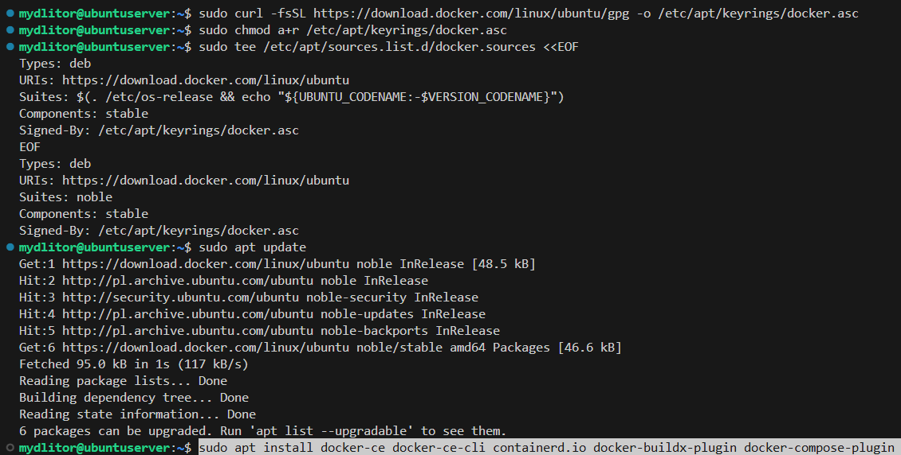
- sprawdzenie dzialania Dockera   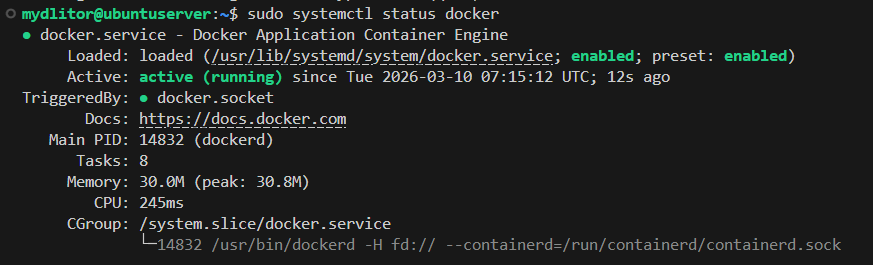
- pull odpowiednich obrazów   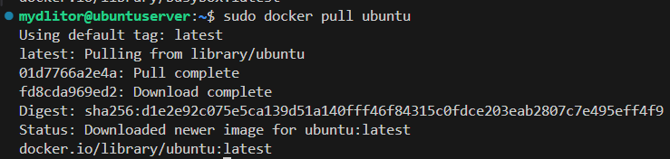
- build obrazów   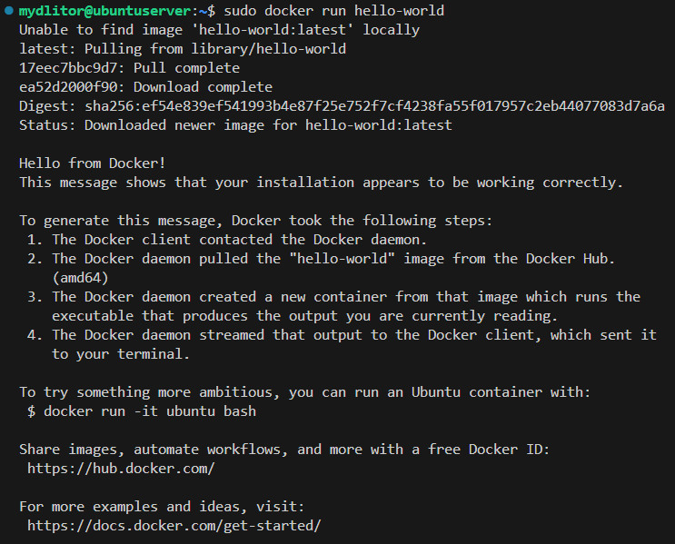
- sprawdzenie działania obrazów   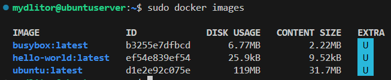
- sprawdzenie kodu wyjścia   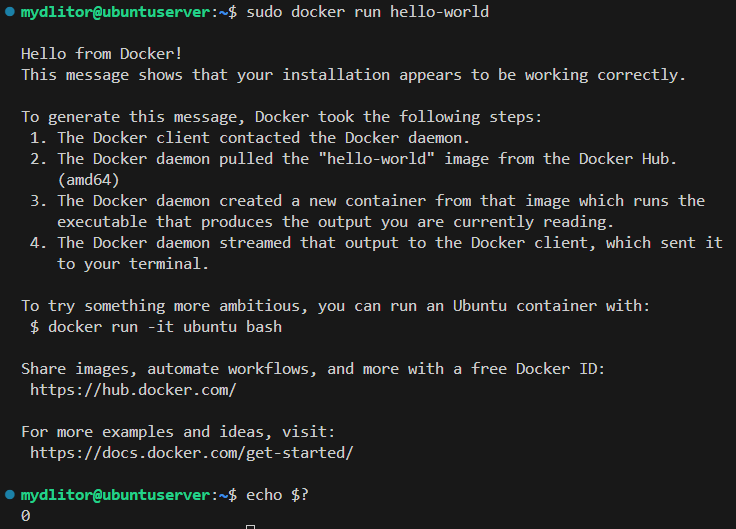
  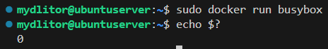
  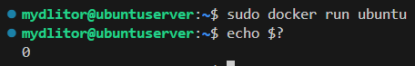
- uruchomienie w trybie interaktywnym i sprawdzenie wersji   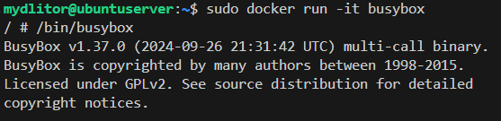
- sprawdzenie PID w kontenerze   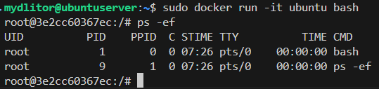
- sprawdzenie PID na maszynie   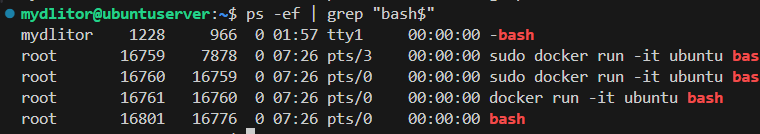

#### Jak można i należy zauważyć, PID sprawdzone w kontenerze znacząco różni się od PID sprawdzonego na maszynie.

- apt update oraz upgrade   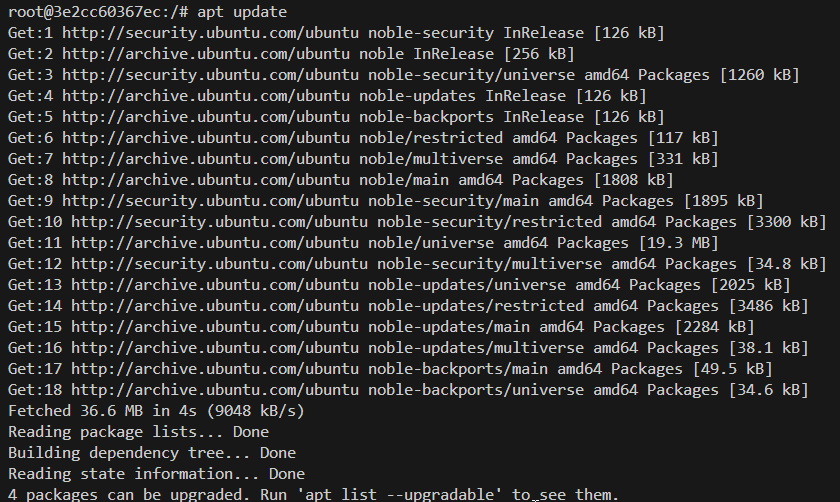
  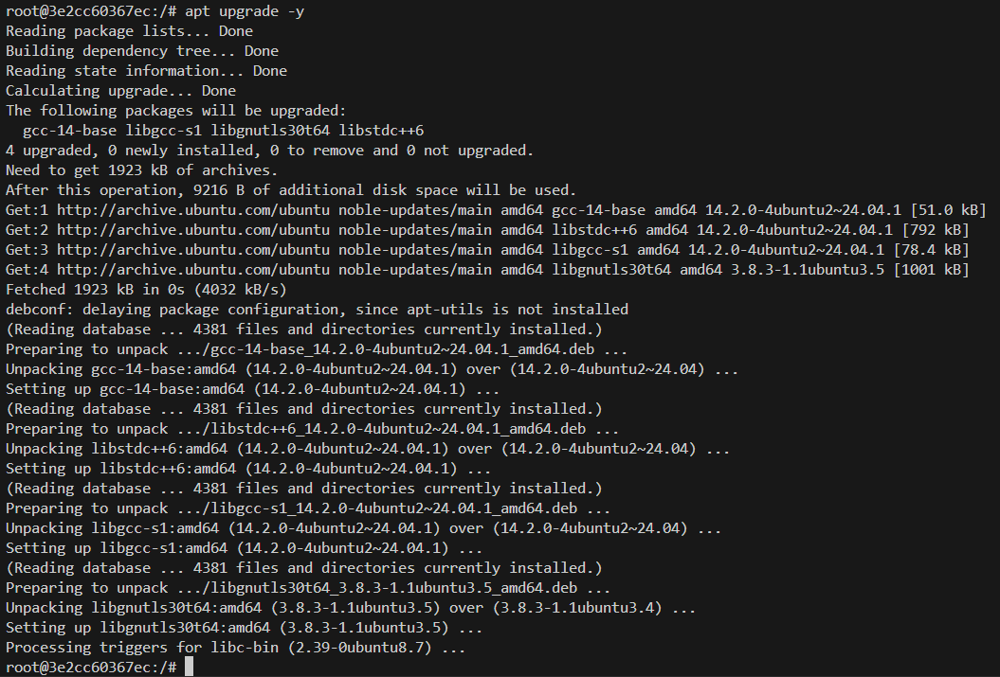
- uruchomienie w trybie interaktywnym, oraz sprawdzenie wersji git   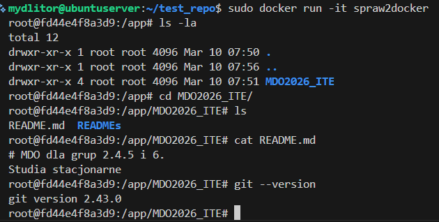
- jak widać na zrzucie ekranu, repozytorium zostało pomyślnie sklonowane i git znajduje się zainstalowany w kontenerze
- uruchomione kontenery   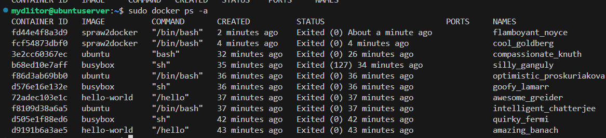
- wyczyszczenie zakończonych kontenerów   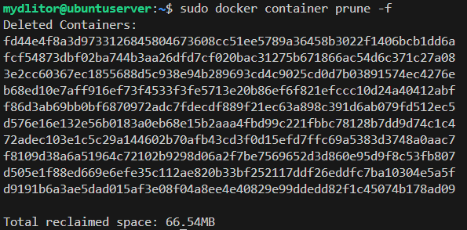
- wyczyszczenie lokalnych obrazów   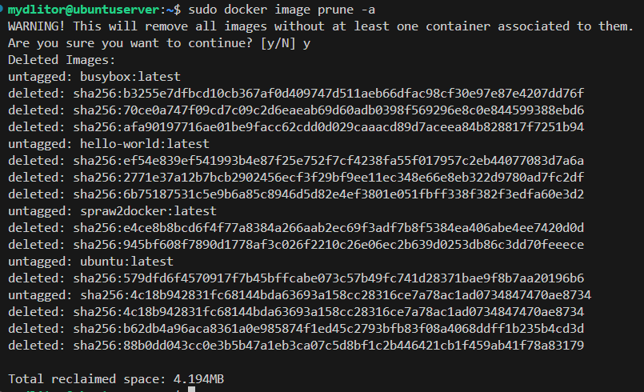