# Sprawozdanie z czwartego laboratorium z DevOps

## 1. Przechowywanie danych i klonowanie
Wykorzystano obraz `node:18-slim`. Repozytorium `calculator.git` sklonowano bezpośrednio w kontenerze (`calc-builder-git`) do katalogu `/app`, a następnie skopiowano wynik do woluminu `/app-output` (mapowanego na hosta). 
* **Wniosek:** Wybrano klonowanie wewnątrz kontenera (z instalacją `git` przez `apt`), co pozwala na pełną izolację procesu budowania, choć zwiększa rozmiar obrazu tymczasowego. Alternatywą jest `RUN --mount=type=bind`, która pozwala na dostęp do plików hosta bez ich trwałego kopiowania do warstw obrazu.

   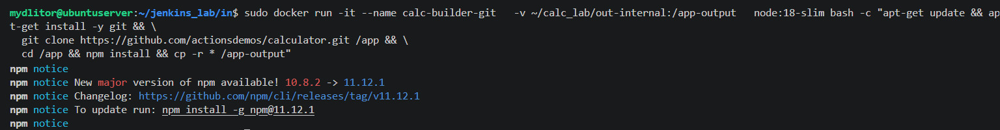

## 2. Sieci i wydajność (iperf3)
Stworzono izolowaną sieć `iperf-net`. Połączono klienta (`172.18.0.3`) z serwerem (`172.18.0.2`) po nazwie kontenera. 
* **Wynik:** Uzyskano przepustowość rzędu **29.3 Gbits/sec**. Komunikacja przebiegała wewnątrz mostka Dockerowego (bridge), co ogranicza narzut sieciowy hosta.

   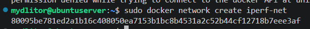
   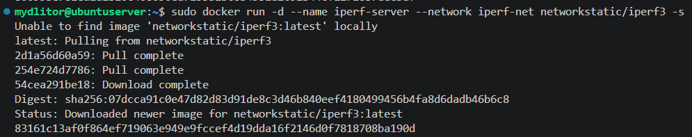
   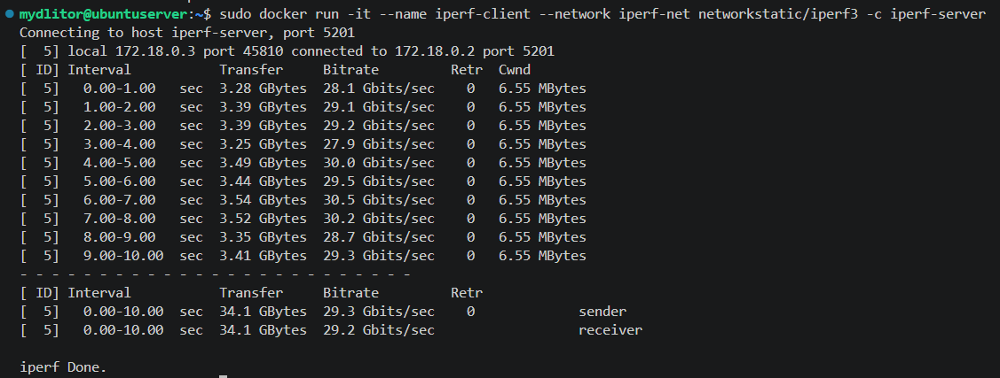

## 3. Usługa SSHD w kontenerze
Uruchomiono kontener `ubuntu-ssh` na bazie **Ubuntu 24.04.4 LTS**. Po odpowiedniej modyfikacji konfiguracji (hasło dla roota: `password`), uzyskano dostęp przez port **2222**. 
* **Analiza:** SSH w kontenerze jest przydatne do debugowania, ale uznawane za *anti-pattern* (bezpieczeństwo, rozmiar). Lepiej stosować `docker exec`.

   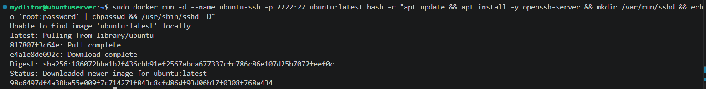
   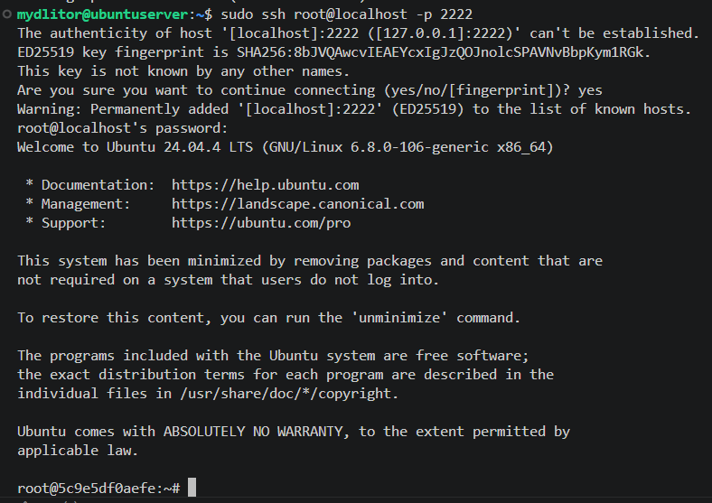

## 4. Architektura Jenkins (Docker-in-Docker)
Zestawiono dwie usługi: `jenkins-docker` (obraz `docker:dind`) oraz `jenkins-server` (`jenkins/jenkins:lts`).
* **Inicjalizacja:** Odblokowano Jenkinsa hasłem z `/var/jenkins_home/secrets/initialAdminPassword`.
* **Logi:** Potwierdzono status `Jenkins is fully up and running` o godzinie 19:59:38.

   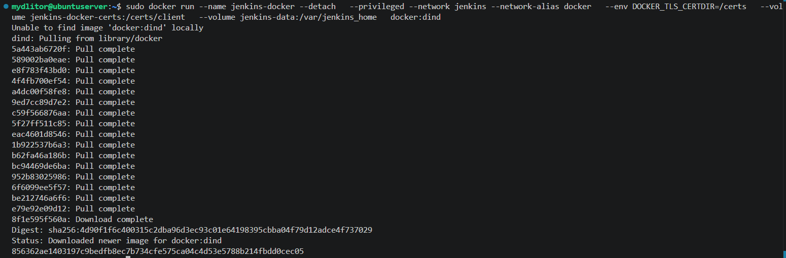
   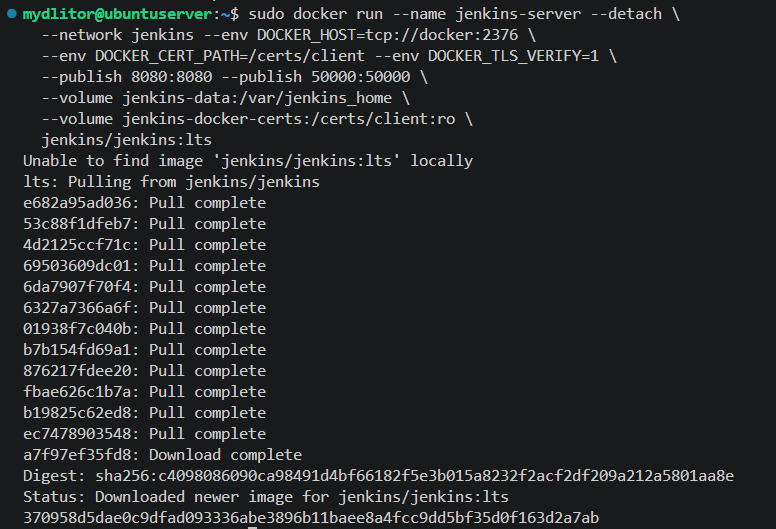
   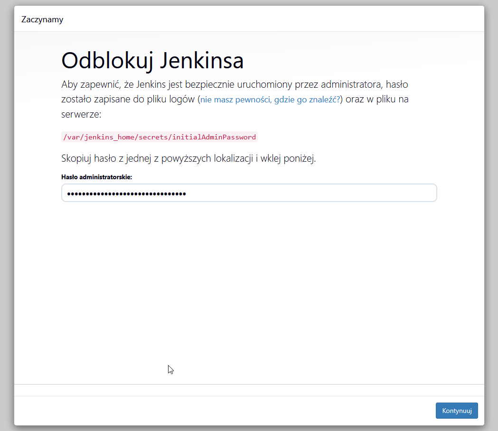
   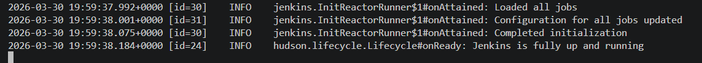

## 5. Weryfikacja kontenerów i Pipeline
Na hoście działają równolegle 4 kluczowe kontenery. Testowy Pipeline `test-docker` poprawnie wykrył silnik Dockera:
* **Klient:** 26.1.5  
* **Serwer (Engine):** 29.3.1  
Oznacza to, że Jenkins poprawnie komunikuje się z pomocnikiem DinD przez sieć `jenkins`.

   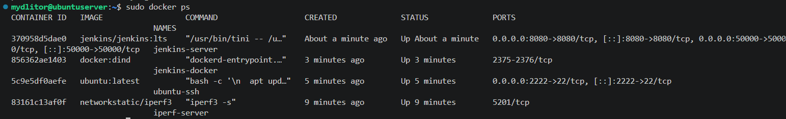
   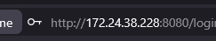
   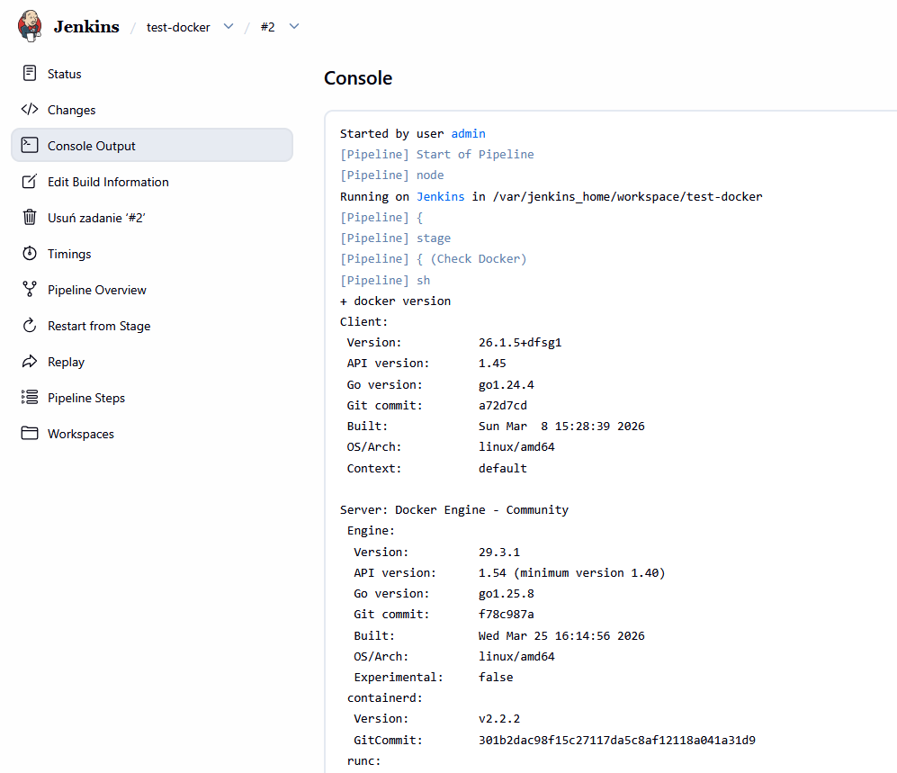