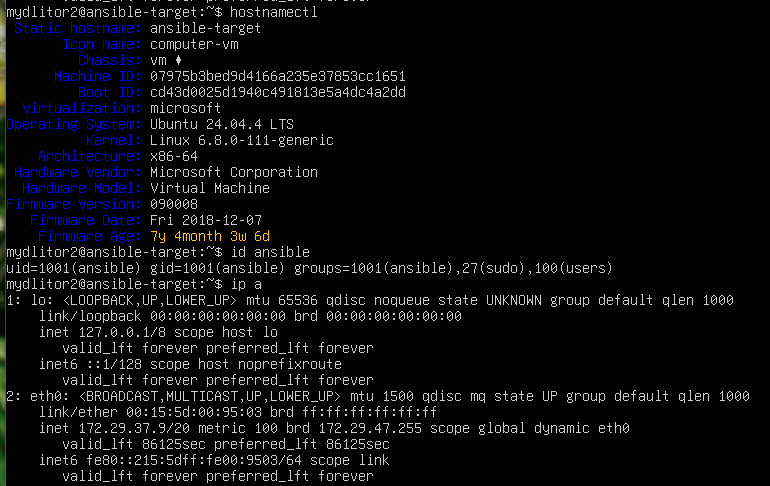
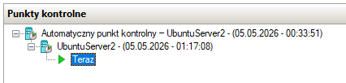
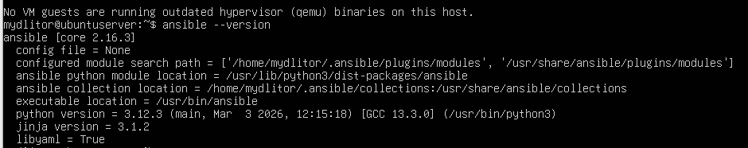
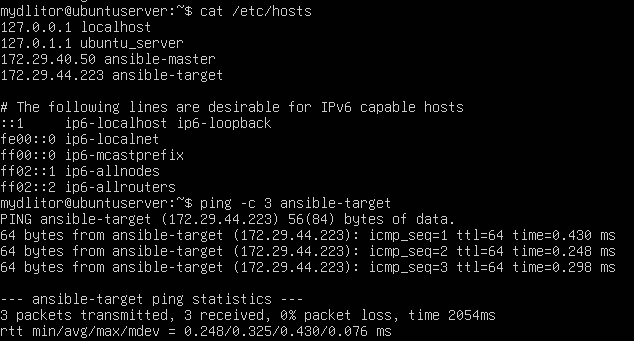
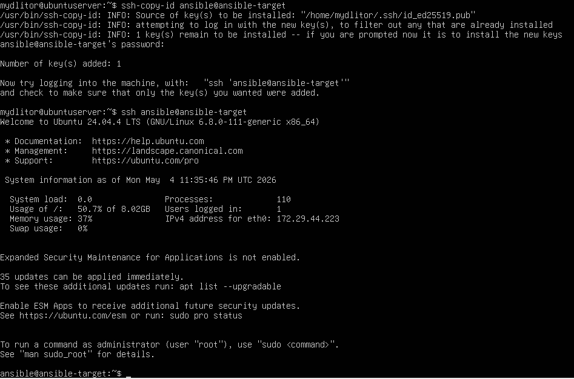
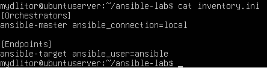
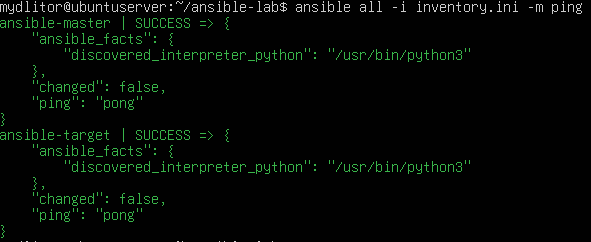
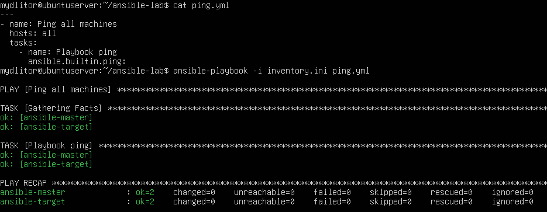

# Sprawozdanie z laboratorium: Instalacja i konfiguracja zarządcy Ansible

## 1. Konfiguracja maszyny docelowej (ansible-target)
Pierwszym krokiem było przygotowanie nowej maszyny wirtualnej z systemem Ubuntu Server. Zweryfikowano obecność niezbędnego oprogramowania (`tar` oraz `sshd`). Następnie nadano maszynie odpowiednią nazwę hosta oraz utworzono dedykowanego użytkownika `ansible`.

```bash
sudo hostnamectl set-hostname ansible-target
sudo adduser ansible
sudo usermod -aG sudo ansible
ip a
```



## 2. Utworzenie punktu kontrolnego w Hyper-V
Po wstępnej konfiguracji maszyny docelowej, w Menedżerze funkcji Hyper-V utworzono jej punkt kontrolny, aby umożliwić ewentualny powrót do czystego stanu instalacji.



## 3. Konfiguracja węzła zarządzającego i instalacja Ansible
Na głównej maszynie wirtualnej zmieniono nazwę hosta na `ansible-master`, a następnie zaktualizowano repozytoria i zainstalowano pakiet `ansible`.

```bash
sudo hostnamectl set-hostname ansible-master
sudo apt update
sudo apt install ansible -y
ansible --version
```



## 4. Inwentaryzacja i konfiguracja rozwiązywania nazw
Aby uniknąć konieczności posługiwania się adresami IP, na obu maszynach wirtualnych skonfigurowano plik `/etc/hosts`, dodając odpowiednie wpisy dla `ansible-master` oraz `ansible-target`. Poprawność rozwiązania zweryfikowano za pomocą polecenia `ping`.

```text
172.29.40.50 ansible-master
172.29.37.9 ansible-target
```



## 5. Wymiana kluczy SSH
Wygenerowano parę kluczy SSH na maszynie głównej za pomocą algorytmu ed25519, a następnie skopiowano klucz publiczny na maszynę docelową do użytkownika `ansible`. Wymagało to uprzedniego odblokowania logowania hasłem w pliku konfiguracyjnym serwera SSH (`sshd_config`) na maszynie docelowej.

```bash
ssh-keygen -t ed25519
ssh-copy-id ansible@ansible-target
ssh ansible@ansible-target
```



## 6. Tworzenie pliku inwentaryzacji
Na maszynie głównej, w utworzonym katalogu roboczym, wygenerowano plik inwentaryzacji `inventory.ini`. Podzielono w nim maszyny na dwie logiczne grupy: `Orchestrators` (dla zarządcy z połączeniem lokalnym) oraz `Endpoints` (dla węzłów zarządzanych).

```ini
[Orchestrators]
ansible-master ansible_connection=local

[Endpoints]
ansible-target ansible_user=ansible
```



## 7. Weryfikacja łączności - Polecenie Ad-hoc
Po skonfigurowaniu inwentaryzacji przetestowano łączność z hostami przy użyciu wbudowanego modułu `ping` wywoływanego jako polecenie ad-hoc.

```bash
ansible all -i inventory.ini -m ping
```



## 8. Weryfikacja łączności - Ansible Playbook
Ostatnim etapem było przygotowanie prostej deklaracji w języku YAML i wykonanie tego samego zadania (ping) za pomocą playbooka Ansible.

```yaml
---
- name: Ping all machines
  hosts: all
  tasks:
    - name: Sprawdzanie lacznosci
      ansible.builtin.ping:
```

```bash
ansible-playbook -i inventory.ini ping.yml
```


