# Sprawozdanie 5 - Pipeline, Jenkins, izolacja etapów

## 1. Przygotowanie - Instancja Jenkins

### Budowanie obrazu BlueOcean

Przygotowano niestandardowy obraz Jenkinsa rozszerzony o wtyczkę BlueOcean oraz Docker CLI, co umożliwia wykonywanie komend `docker` bezpośrednio z poziomu pipeline'u.

**Dockerfile.jenkins:** 
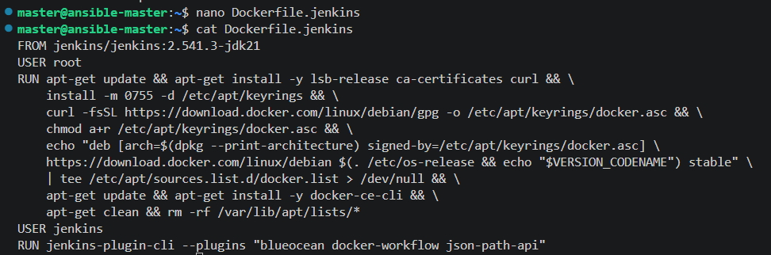

**Proces budowania obrazu:** 
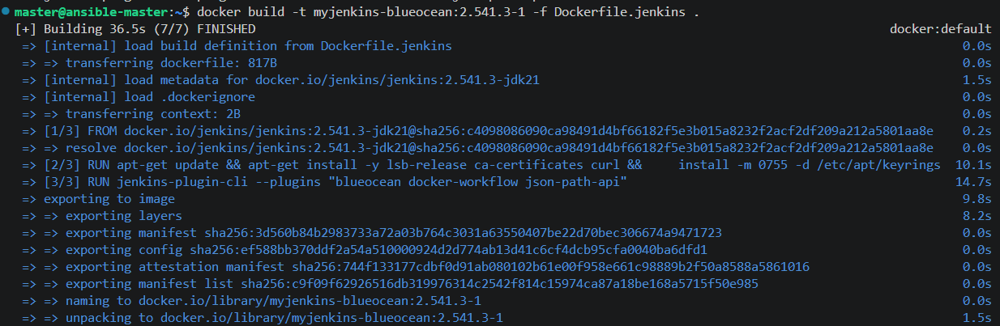

### Uruchomienie DIND i Jenkins BlueOcean

Uruchomiono kontenery wspierające architekturę Docker-in-Docker (DIND) oraz główną instancję Jenkinsa.

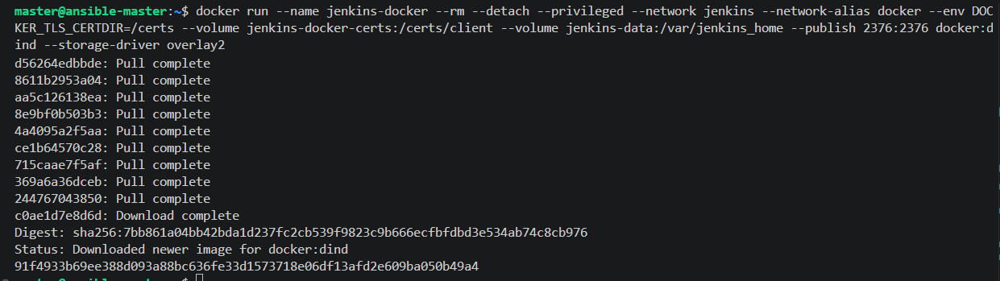 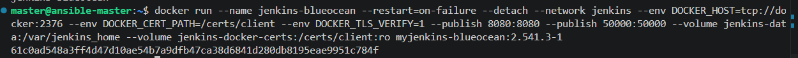

### Archiwizacja logów

Po konfiguracji instancji, logi systemu zostały zarchiwizowane dla celów audytowych: 
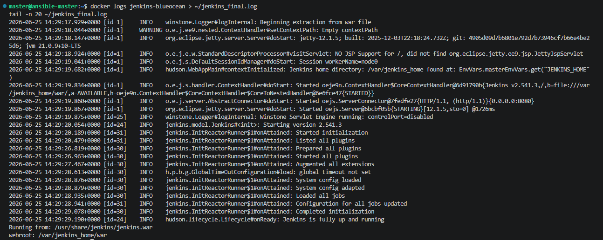

## 2. Zadania wstępne: Uruchomienie

Weryfikacja działania środowiska poprzez trzy zadania testowe:

1. **Projekt `uname`**: Weryfikacja działania systemu operacyjnego w kontenerze.  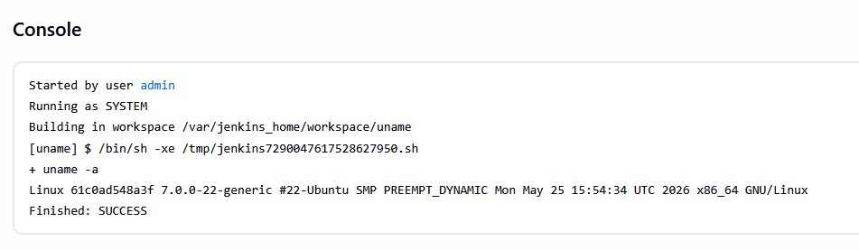
    
2. **Projekt `odd-hour`**: Skrypt weryfikujący logikę czasu (zwraca błąd, gdy godzina jest nieparzysta).
	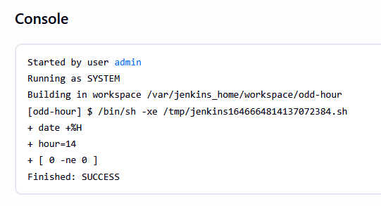
    
3. **Projekt `docker pull`**: Weryfikacja możliwości pobierania obrazów z Docker Hub. 
	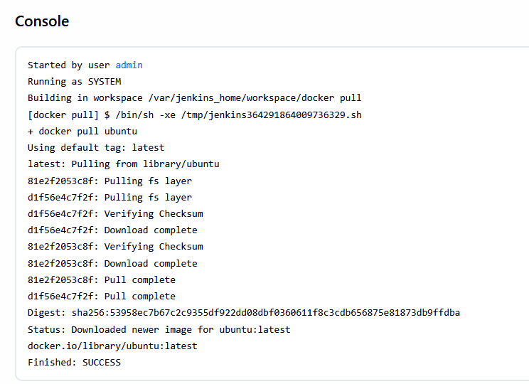
    

## 3. Obiekt typu Pipeline

Utworzono projekt typu `Pipeline` (`lab5-pipeline`), który automatyzuje proces budowania oprogramowania w izolowanym środowisku.

**Konfiguracja Pipeline Script:** 
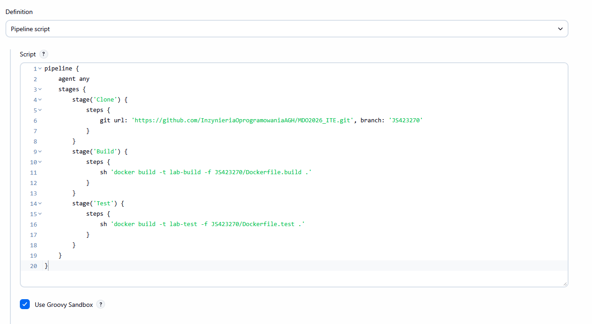

**Wyniki uruchomień:** Uruchomienia `#2` oraz `#3` potwierdziły poprawność działania pipeline'u. W uruchomieniu `#3` zaobserwowano "Brak zmian", co potwierdza poprawną integrację z repozytorium Git.

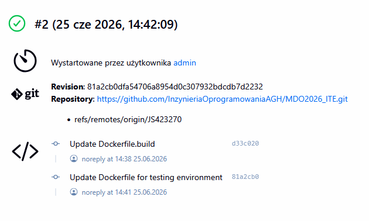 
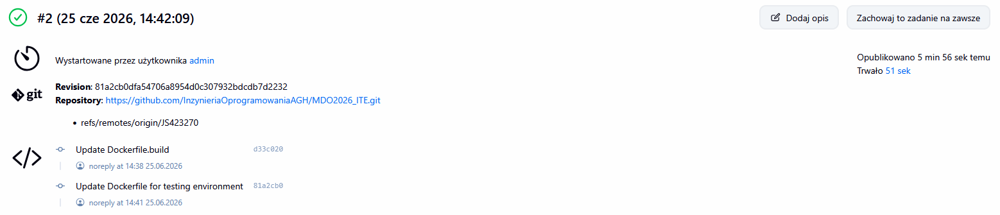 
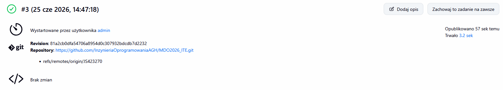

## 4. Dyskusja i wnioski

### Różnice: Node vs Node-slim

Obraz `node` (standardowy) zawiera pełne środowisko wraz z narzędziami budowania i bibliotekami, co jest wygodne podczas developmentu, ale tworzy duże obrazy. Wersja `node-slim` bazuje na minimalnym obrazie Debian (Debian-slim), zawiera tylko niezbędne zależności runtime, co znacząco redukuje rozmiar obrazu końcowego i poprawia bezpieczeństwo (mniejsza powierzchnia ataku).

### Izolacja: DIND vs Bezpośrednio

- **Bezpośrednio na kontenerze CI**: Budowanie wewnątrz głównego kontenera Jenkinsa jest mniej bezpieczne i często wymaga nadawania kontenerowi Jenkinsa uprawnień do gniazda Dockera hosta (`/var/run/docker.sock`).
    
- **DIND (Docker-in-Docker)**: Zapewnia pełną izolację. Jenkins posiada własnego "daemona" Dockera wewnątrz swojego środowiska. Jest to bezpieczniejsze, ale wymaga uruchomienia kontenera w trybie `--privileged`, co wiąże się z większym narzutem na system hosta.
    

# Sprawozdanie 6 - Pipeline: lista kontrolna

## 1. Ścieżka krytyczna

|**Krok**|**Status**|
|---|---|
|commit|✅|
|clone|✅|
|build|✅|
|test|✅|
|deploy|✅|
|publish|✅|

## 2. Pełna lista kontrolna

### Aplikacja i licencja

Wybrano framework **Express.js** (repozytorium: `expressjs/express`). Licencja **MIT** potwierdza możliwość swobodnego obrotu kodem na potrzeby zadania.

### Proces CI/CD

Program buduje się poprawnie (`npm install`), a dołączone testy przechodzą pomyślnie. Nie zdecydowano się na fork repozytorium; proces oparto na bezpośrednim klonowaniu oficjalnego kodu wewnątrz kontenera budującego.

#### Diagram aktywności

```
[Start] -> [Clone] -> [Build] -> [Test] -> [Deploy] -> [Smoke Test] -> [Publish] -> [Koniec]
```

#### Diagram wdrożeniowy

```
[Host DIND] -- [Jenkins BlueOcean]
    |
    |-- [lab-build] (Kontener budujący i deploymentu)
    |-- [lab-test]  (Kontener testowy)
    |-- [express-deploy] (Kontener aplikacji)
```

### Implementacja etapów

- **Build/Test**: Wykorzystano dwa pliki Dockerfile. Kontener testowy bazuje na obrazie zbudowanym w etapie Build.
    
- **Deploy**: Zaimplementowano w etapie `Deploy` pipeline'u, gdzie aplikacja uruchamiana jest na porcie 3000.
    
- **Smoke Test**: Weryfikacja działania aplikacji odbywa się poprzez `curl` wewnątrz kontenera `express-deploy`.
    
    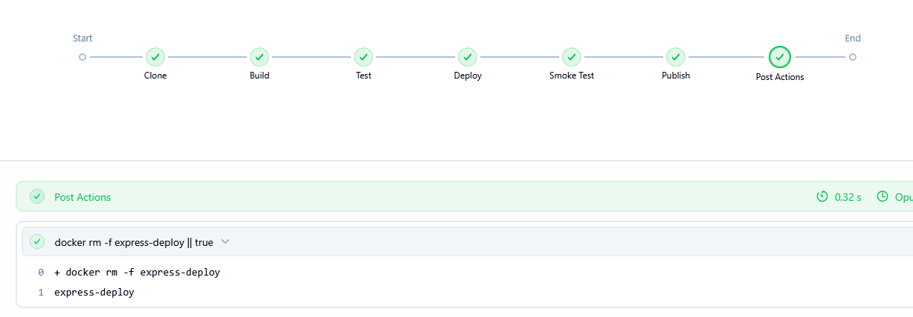
    

### Publikacja i wersjonowanie

- **Artefakt**: Wybrano archiwum `.tar.gz`, zawierające pełny kod oraz zależności `node_modules`. Jest to najprostsza forma redystrybucji aplikacji Node.js niewymagająca skomplikowanych instalatorów systemowych.
    
- **Wersjonowanie**: Artefakt zidentyfikowano jako `express-1.0.0.tar.gz`.
    
- **Dostępność**: Artefakt jest załączony jako rezultat "przejścia" pipeline'u w Jenkinsie.
    
    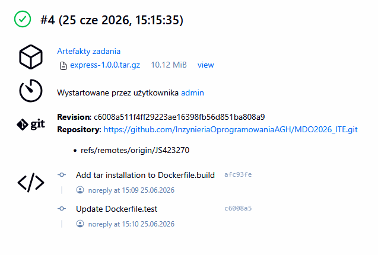
    

### Definicje plików


**Jenkinsfile:**

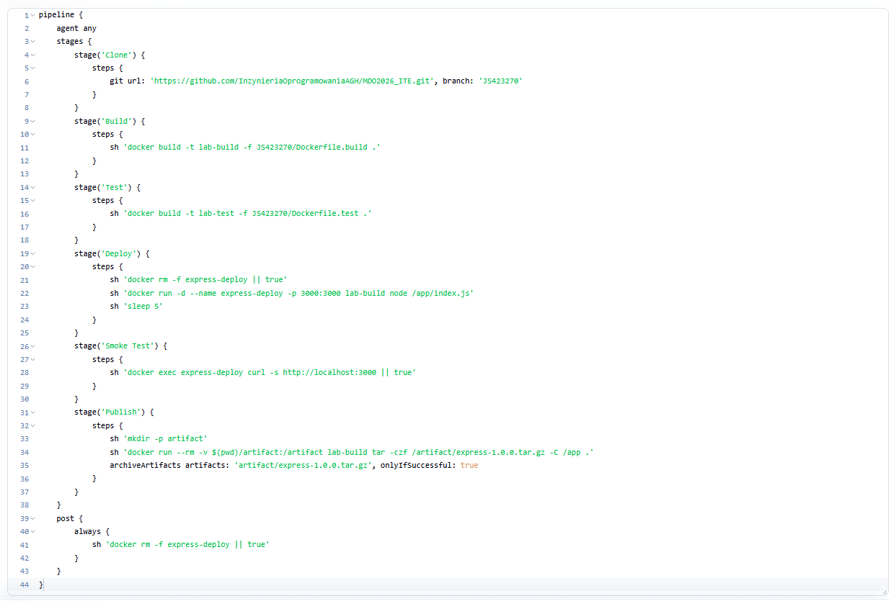

**Dockerfile.build:**

Dockerfile

```
FROM node:latest
WORKDIR /app
RUN git clone --depth 1 https://github.com/expressjs/express.git .
RUN npm install
RUN apt-get update && apt-get install -y tar
```

**Dockerfile.test:**

Dockerfile

```
FROM lab-build:latest
WORKDIR /app
RUN npm test
```

## 3. Podsumowanie i wnioski

Pipeline pomyślnie zrealizował pełną ścieżkę krytyczną. Każdy etap (Clone, Build, Test, Deploy, Smoke Test, Publish) kończy się sukcesem, co potwierdza wizualizacja w Jenkins BlueOcean:

Wdrożenie w kontenerze `express-deploy` zostało zweryfikowane testem dymnym, a finalny artefakt został zarchiwizowany. Wybrana architektura (osobne Dockerfile dla builda i testów) zapewnia wysoką powtarzalność i łatwość utrzymania środowiska przez przyszłych maintainerów.

Weryfikacja rozbieżności między planem a wykonaniem: brak rozbieżności – zrealizowano wszystkie założenia z diagramu aktywności.


# Sprawozdanie 7 - Jenkinsfile: lista kontrolna

## 1. Kroki Jenkinsfile i weryfikacja SCM

### SCM

Zgodnie z wymaganiami, pipeline nie jest już wklejany ręcznie do Jenkinsa. Obiekt typu `Pipeline` został skonfigurowany jako **Pipeline script from SCM**, co zapewnia, że infrastruktura budowania jest wersjonowana razem z kodem.

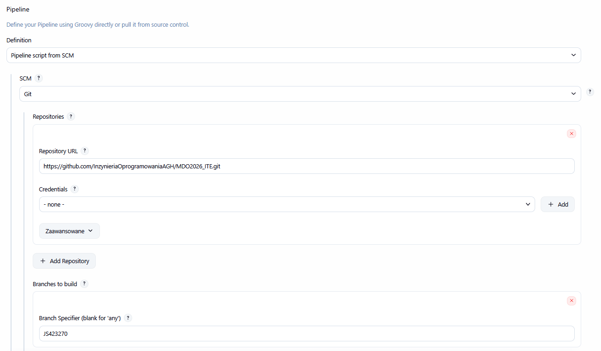

### Posprzątanie środowiska i powtarzalność

Na początku każdego uruchomienia pipeline'u wykonywany jest etap `Cleanup`. Usuwa on kontenery oraz obrazy z poprzednich przebiegów, co wymusza pełny proces budowania (`rebuild`) i eliminuje ryzyko pracy na starych, cache'owanych warstwach Docker. Skuteczność podejścia potwierdza pomyślne przejście pipeline'u w wielu kolejnych iteracjach.

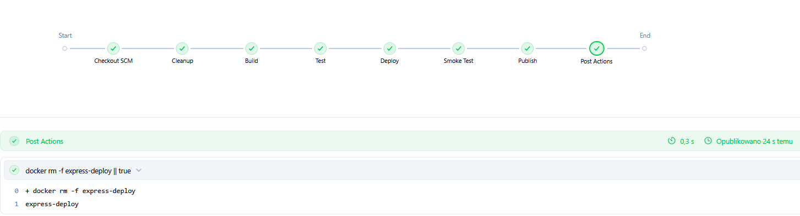

## 2. Realizacja ścieżki krytycznej

Pipeline w pliku `Jenkinsfile` realizuje pełną ścieżkę: **Cleanup → Clone → Build → Test → Deploy → Smoke Test → Publish**.

- **Build**: Tworzony jest obraz `lab-build`, który służy jako baza do testów oraz źródło artefaktów.
    
- **Test**: Etap wykorzystuje dedykowany obraz `lab-test`, który uruchamia testy jednostkowe aplikacji Express.
    
- **Deploy**: Przygotowywany jest obraz `express-deploy-img` z odpowiednim `ENTRYPOINT`/`CMD`, co zapewnia, że kontener docelowy jest gotowy do pracy bez dodatkowej konfiguracji.
    
- **Publish**: Artefakt `express-1.0.0.tar.gz` jest archiwizowany i dostępny w historii builda Jenkinsa.
    

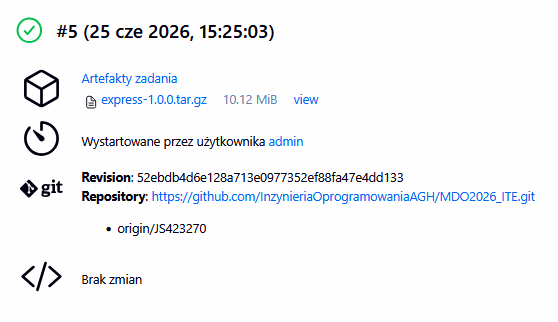

## 3. Definition of Done

- **Czy opublikowany obraz jest gotowy do wdrożenia?** Tak, obraz `express-deploy-img` posiada wbudowaną instrukcję `CMD ["node", "/app/index.js"]`. Może on zostać pobrany z rejestru i uruchomiony na dowolnym hoście z zainstalowanym Dockerem bez konieczności przekazywania skomplikowanych parametrów startowych.
    
- **Czy artefakt (tar.gz) zadziała od razu?** Tak, artefakt zawiera skompilowany kod źródłowy wraz z folderem `node_modules`. Na maszynie docelowej posiadającej zainstalowane środowisko Node.js wystarczy rozpakować archiwum i wywołać aplikację, co czyni proces dystrybucji szybkim i powtarzalnym.
    

## 4. Podsumowanie

W ramach zajęć przekształcono konfigurację Jenkinsa na postać deklaratywną (Jenkinsfile w SCM). Dzięki temu proces CI/CD stał się w pełni automatyczny, weryfikowalny i łatwy w utrzymaniu. Każda zmiana w procesie budowania jest teraz częścią historii repozytorium Git, co pozwala na pełną ścieżkę audytu.


# Wnioski
Przeprowadzone prace nad budową automatycznego pipeline’u CI/CD pozwalają na sformułowanie następujących wniosków końcowych:

- **Infrastruktura jako kod (IaC):** Przejście od konfiguracji klikalnej (manualnej w GUI) do podejścia deklaratywnego (`Jenkinsfile` w SCM) jest kluczowe dla profesjonalnego zarządzania cyklem życia oprogramowania. Zapewnia to pełną wersjonowalność procesu budowania oraz ułatwia audyt wprowadzanych zmian przez zespół programistów.
    
- **Izolacja i powtarzalność środowiska:** Zastosowanie kontenerów Docker do każdego etapu budowania (Build-Test-Deploy) eliminuje problem typu "u mnie działa". Dzięki izolacji, proces CI/CD jest niezależny od konfiguracji hosta, co czyni go w pełni przenośnym między różnymi systemami i środowiskami uruchomieniowymi.
    
- **Znaczenie automatycznego czyszczenia (Cleanup):** Wprowadzenie etapu czyszczenia środowiska przed każdym przebiegiem pipeline’u jest niezbędne dla zapewnienia powtarzalności wyników. Eliminuje to ryzyko występowania tzw. "zombie-kontenerów" oraz korzystania z nieaktualnych warstw obrazów (cache), co często jest przyczyną błędów w długotrwałych procesach CI.
    
- **Wydajność vs Bezpieczeństwo:** Wybór między budowaniem bezpośrednio w kontenerze Jenkinsa a użyciem architektury DIND (Docker-in-Docker) stanowi kompromis między wydajnością a bezpieczeństwem. W środowiskach akademickich i testowych DIND oferuje lepszą izolację i czystość, podczas gdy w rozwiązaniach produkcyjnych warto rozważyć użycie zewnętrznych daemonów dockera (np. przez `docker.sock`), aby uniknąć narzutów związanych z trybem `--privileged`.
    
- **Wdrożeniowa dojrzałość artefaktów:** Przygotowanie "deployable" artefaktów (takich jak `tar.gz` z `node_modules` czy gotowy obraz z `CMD`) jest końcowym i najważniejszym elementem procesu _Definition of Done_. Skuteczny pipeline nie tylko sprawdza poprawność kodu, ale przede wszystkim dostarcza w pełni przygotowany produkt, który po pobraniu z rejestru lub archiwum może zostać natychmiast uruchomiony w docelowej infrastrukturze.
    
