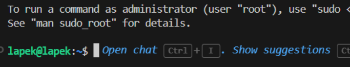
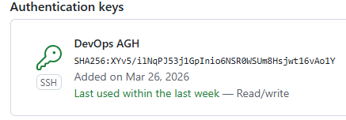
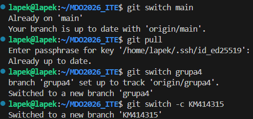
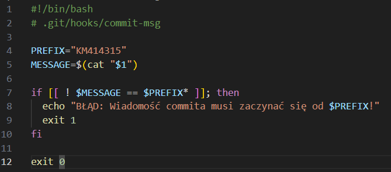
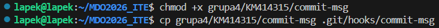
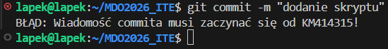
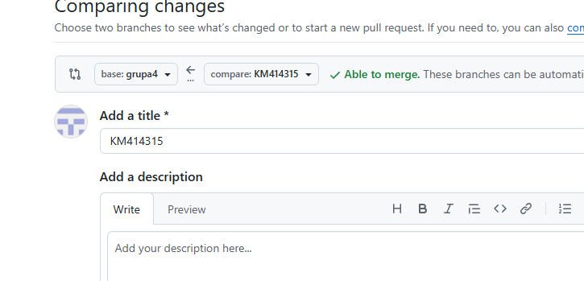

# Sprawozdanie 1
## Krzysztof Mamcarz

## Środowisko

Ćwiczenie wykonano w następującym środowisku:

- System hosta: Windows 11 Education
- Maszyna wirtualna: Ubuntu Server 24.04
- Hypervisor: Hyper V
- Dostęp do maszyny: SSH
- Edytor: Microsoft VS code
- Klient Git: Git 2.43.0

## Zalogowanie do maszyny przes VS code

## Połączenie SSH z gitem 

## Tworzenie własnej gąłęzi i git hooka

## Działanie hooka

## pull request

