# Sprawozdanie 2
## Krzysztof Mamcarz

## Środowisko

Ćwiczenie wykonano w następującym środowisku:

- System hosta: Windows 11 Education
- Maszyna wirtualna: Ubuntu Server 24.04
- Hypervisor: Hyper V
- Dostęp do maszyny: SSH
- Edytor: Microsoft VS code
- Klient Git: Git 2.43.0

## Instalacja Dockera i dawanie uprawnień

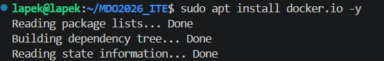

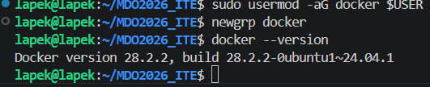

## Logowanie na docker.hub i logowanie do dockera z tokenem

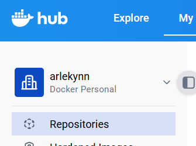

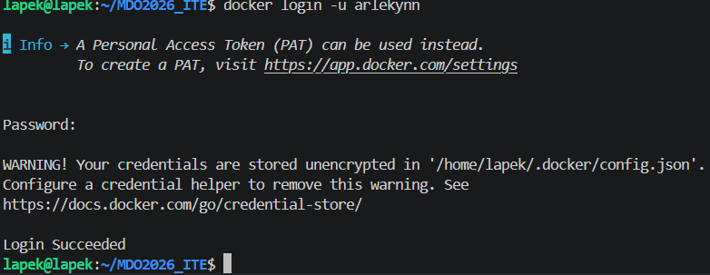

## Testowanie obrazów
### Uruchamianie obrazów
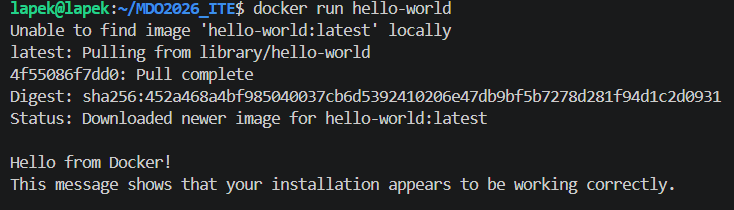
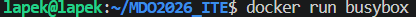
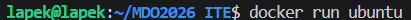
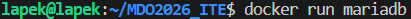
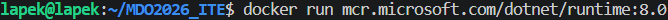
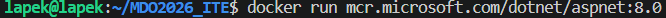
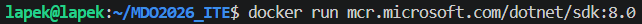

### Tabela z rozmiarami obrazów

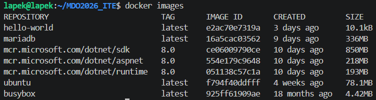

### Kody wyjścia 

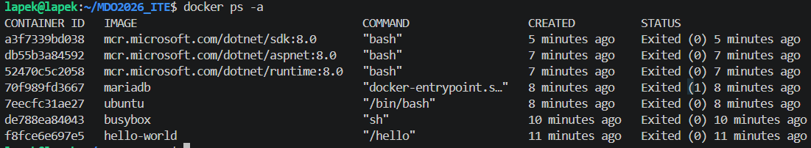

## Interaktywne wejście do busyboxa i jego wersja 

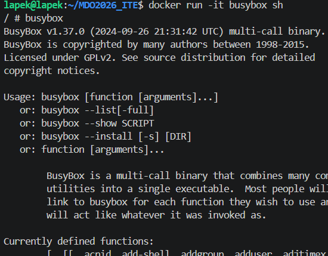

## atak na ubuntu w ubuntu
### PID 1 w kontenerze i oglądanie procesów z zewnątrz 
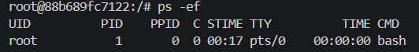
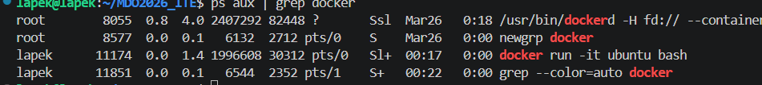

### Aktualizacja Pakietów 

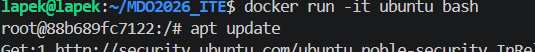

## Dockerfile 

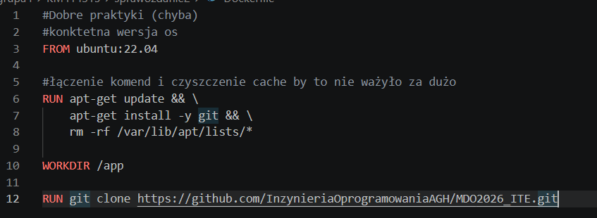

## Uruchamianie kontenera
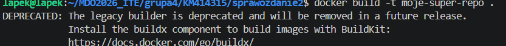
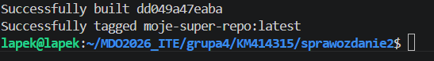

## Tryb interaktywny pokazujący istniejące repozytorium 

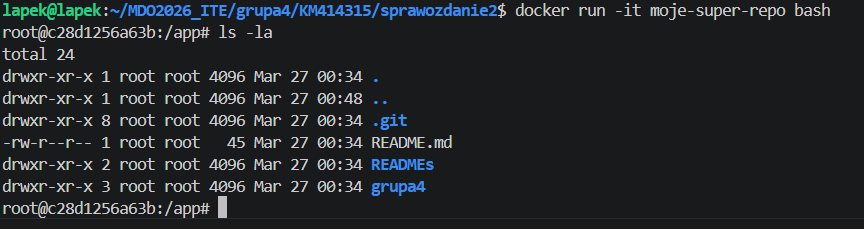

## Wszytkie kontenery i ich czyszczenie 

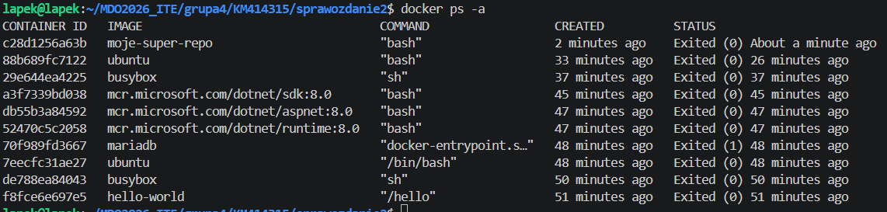

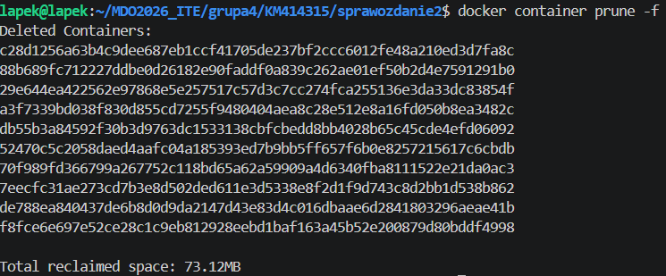

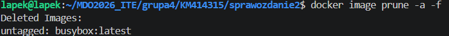
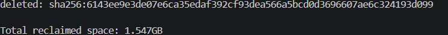

