# Sprawozdanie 3
## Krzysztof Mamcarz

## Środowisko

Ćwiczenie wykonano w następującym środowisku:

- System hosta: Windows 11 Education
- Maszyna wirtualna: Ubuntu Server 24.04
- Hypervisor: Hyper V
- Dostęp do maszyny: SSH
- Edytor: Microsoft VS code
- Klient Git: Git 2.43.0

## Klonowanie repozytorium, przygotowanie środowiska i testowanie 

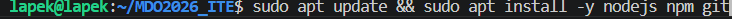
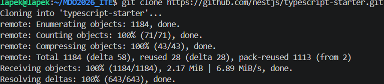

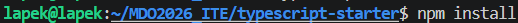

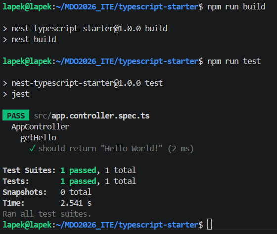

## Izolacja i Powtarzalność 

### Montowanie kontenera
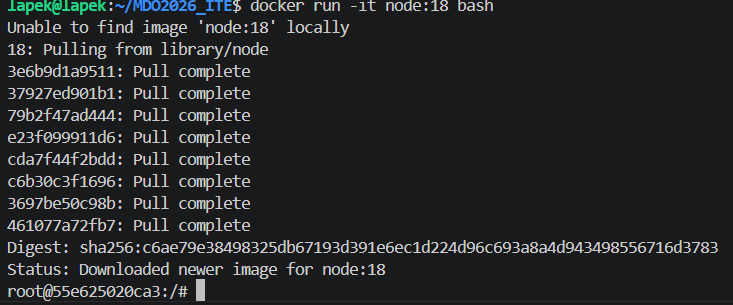

### Powtórzenie operacji w kontenerze 

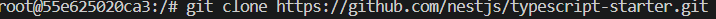
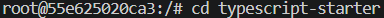
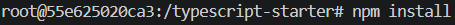

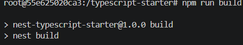
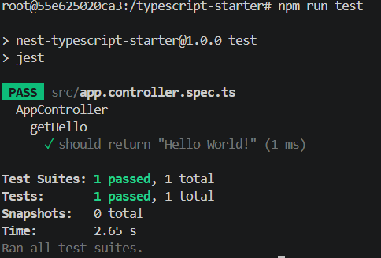

## Automatyzacja

### Pliki Dockerfile

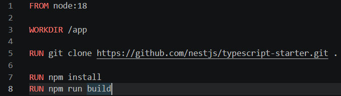

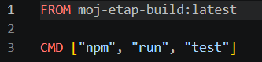

## Testowanie plików Dockerfile

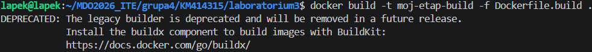
...
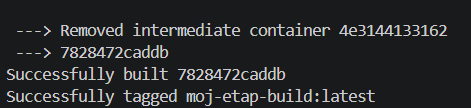

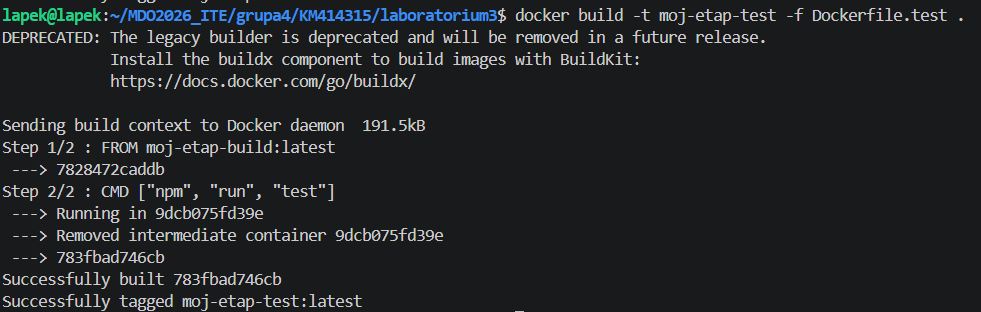

### Testy poprawne

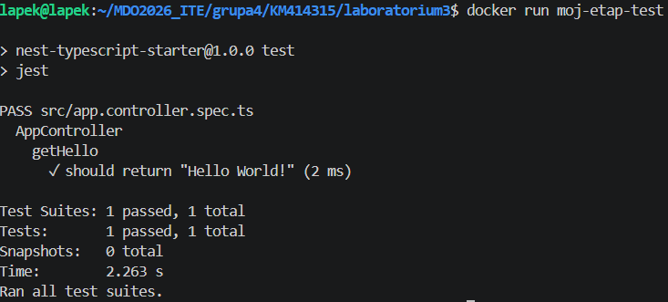

## Pracuje dobrze ?

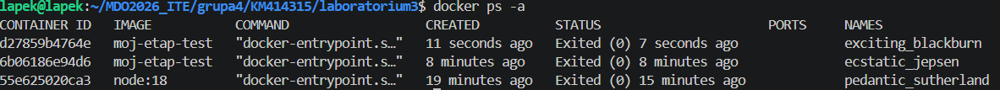

## Co pracuje w takim kontenerze?

Tylko wyizolowany proces potrzebny do wykonania zadania 
