### Metodyki DevOps – Sprawozdanie Zbiorcze lab 1-4
### Autor: Kinga Sulej gr.6 

## LAB1

1.	Instalacja VirtualBox i konfiguracja

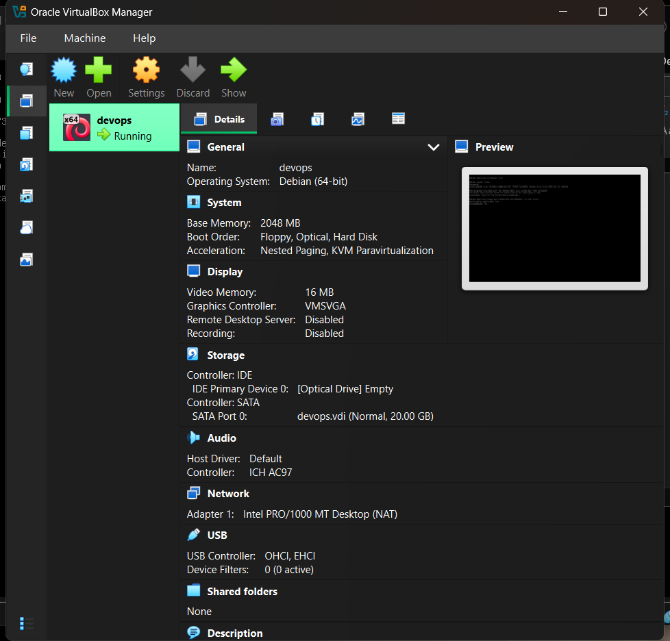

2.	Instalacja i uruchomienie środowiska (debian)

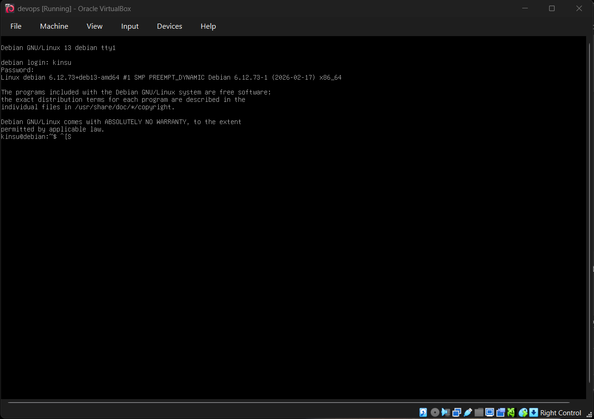

3.	Po ustawieniu port forwarding rule udało się połączyć przez ssh

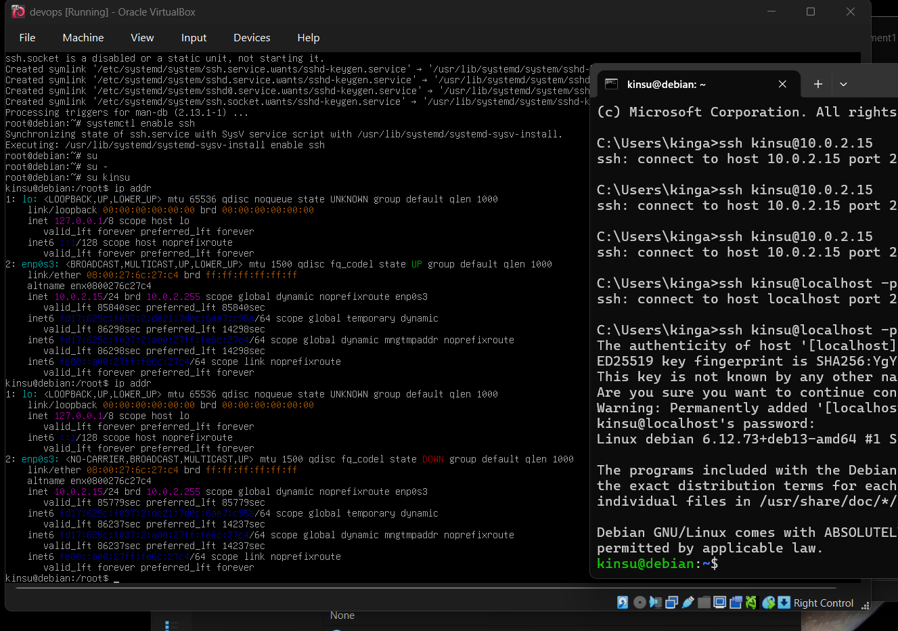
 
4.	Przeslanie pliku na VM

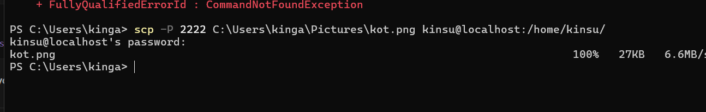

Obraz przesłał się poprawnie do maszyny 

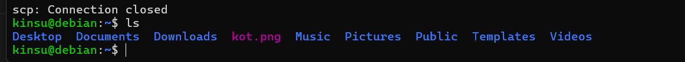
 
5.	Klonwowanie repo z wewnątrz maszyny

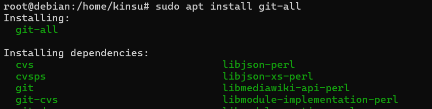

Klonowanie działa

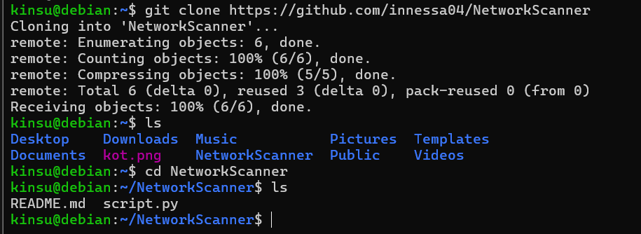

6.	Połączenie przez filezilla

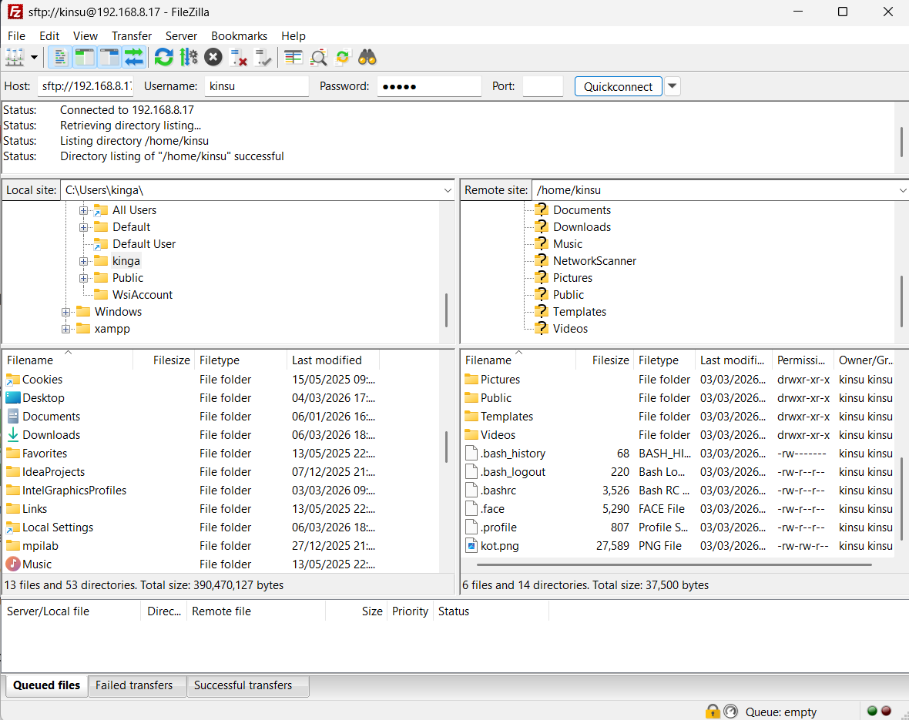
 
7.	Zadania – class1
Instalacja klienta GIT i klonowanie repozytorium grupy

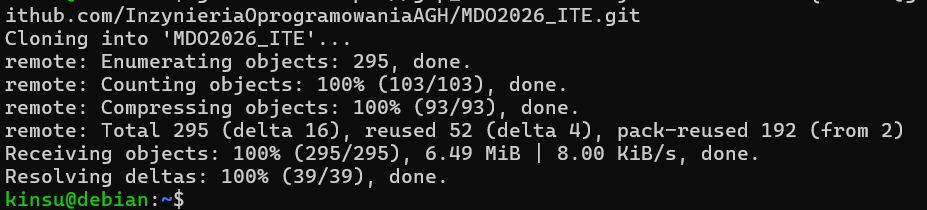
 
Tworzenie kluczy SSH
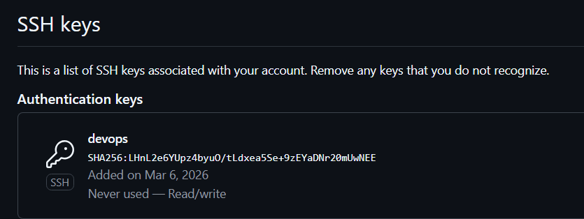

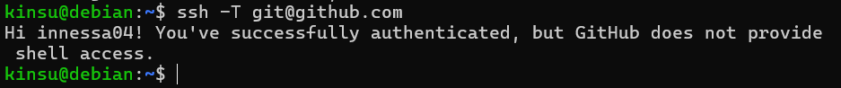

Konfiguracja w Visual Studio Code

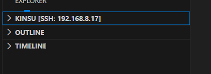

Git Hook

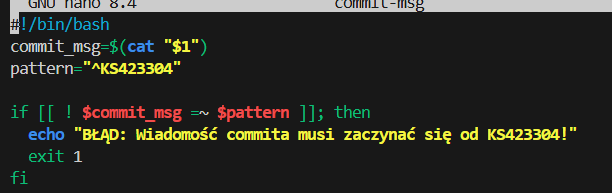

Zdalne źródło

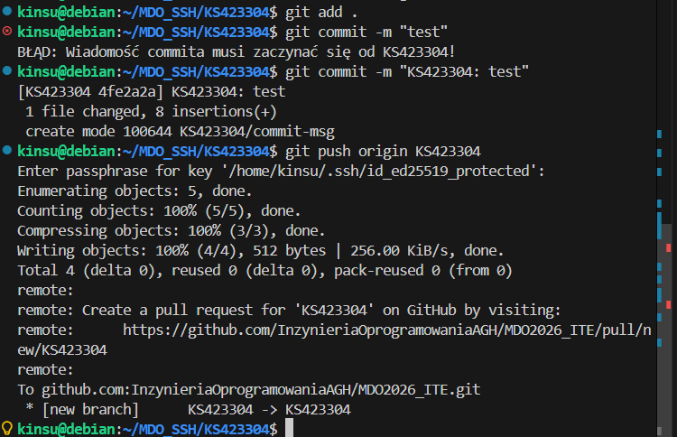

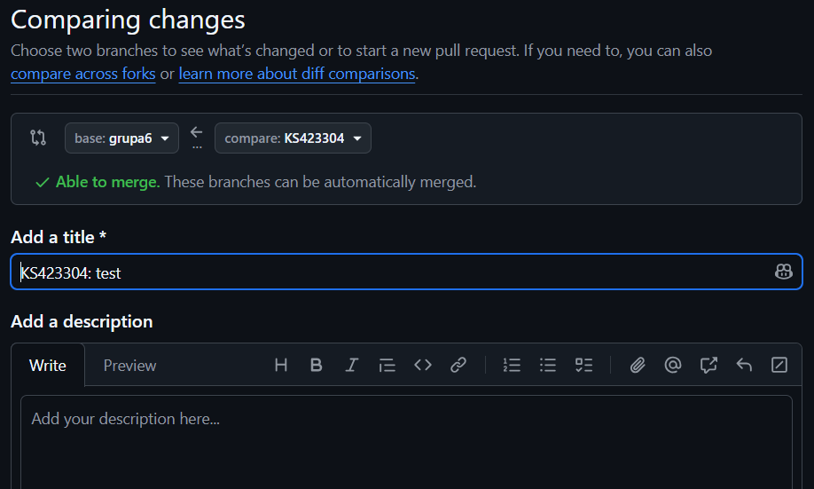

## LAB2

1. Instalacja dockera
   
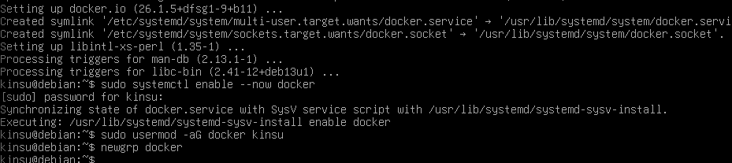

2. Pobranie obrazów

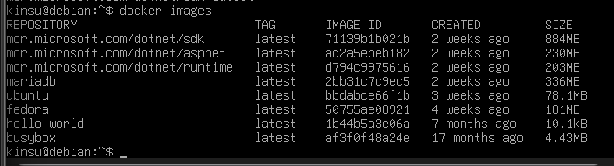

3. Uruchomienie kontenerów i sprawdzenie kodu wyjścia
   


4. Busybox


5. System w kontenerze

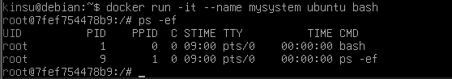

Z drugiego terminala:


6. Dockerfile i klonowanie repo 

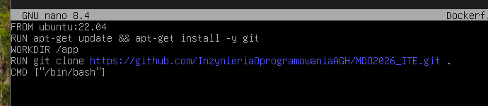


7. Czyszczenie kontenerów (dla kroku 6 z instrukcji nie udało się zrobić zrzutu w 
odpowiednim momencie, więc dodatkowo wrzucam „dowód” że było to 
zrobione”


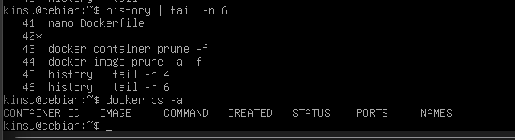

 ## LAB3

Wybrane oprogramowanie – biblioteka do parsowania URL https://github.com/unshiftio/url-parse

1. Klon repo i instalacja zależności


2. Wykonanie testów (poprzez npm test)

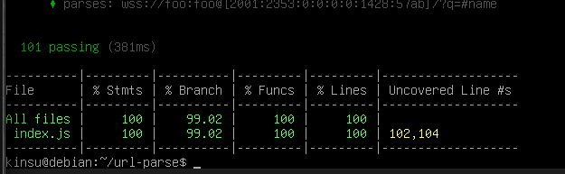

3. Uruchomienie kontenera, wewnątrz klonowanie repo (uruchomienie nastąpiło komendą `docker run -it --name devops-build node:18-slim /bin/bash`)
   
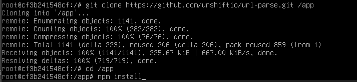

4. Plik Dockerfile.build
   
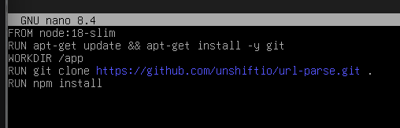

5. Plik Dockerfile.test
   


6. Budowanie pierwszego obrazu
   


7. Budowanie drugiego obrazu
   
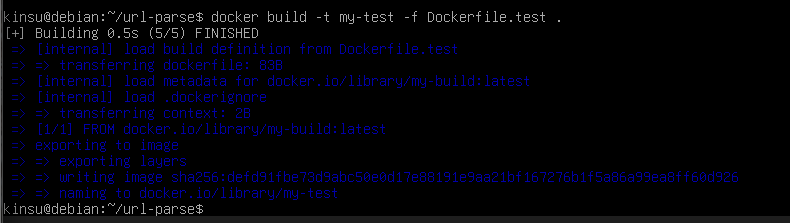

8. Sprawdzenie poprawności działania
   
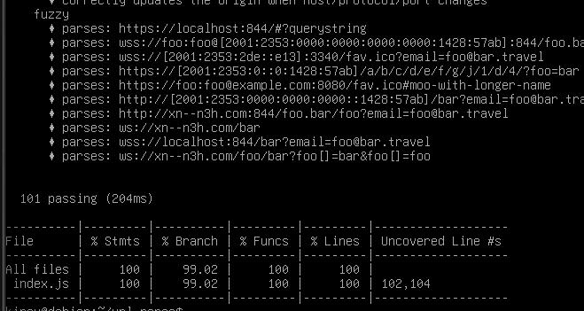

Po wykonaniu `docker run --name testowy-k my-test`
Testy przebiegły poprawnie.

Dodatkowo po wykonaniu `docker ps -a` kontener ma status exited, co oznacza że proces wewnątrz kontenera zakończył się bez żadnych błędów.

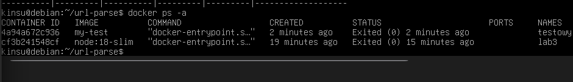

Odpowiadając na pytanie co pracuje w takim kontenerze – pracuje w nim tylko npm test (silnik node.js).

## LAB4

### Zachowywanie stanu między kontenerami 
1. Utworzenie dwóch woluminów

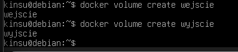

2. Sklonowanie repozytorium bez Gita w kontenerze docelowym

Skoro kontener budujący nie może mieć gita, używam kontenera pomocniczego bazującego na alpine, który pobiera kod kod na wolumin i jest od razu usuwany


Jak widać na powyższym zdjęciu, następnie uruchomiono właściwy kontener bazowy ze środowiskiem Node.js,  za pomocą flag -v podłączono do niego woluminy wejściowy (zawierający pobrany wcześniej kod źródłowy) i wyjściowy (pusty, przeznaczony na gotowy build).
 
3. Po wykonaniu wewnątrz kontenera  ```npm install``` i następnym ```npm test``` - procesy zakończyły się pomyślnie.

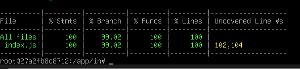

4. Skopiowanie do drugiego woluminu

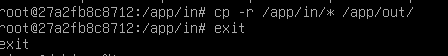

5. Powtórzenie czynności z klonowaniem na wolumin wejściowy wewnątrz kontenera

Uruchomienie czystego kontenera

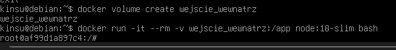

Instalacja gita komendą ```apt-get update && apt-get install -y git```\
Klon repo do woluminu


testy przebiegły pomyślnie 


6. Automatyzacja za pomocą ```docker build``` i ```Dockerfile```

Ręczne uruchamianie kontenerów, mapowanie woluminów i wpisywanie komend powinno być stosowane głównie do celów badawczych/naukowych (tak jak na labie), w praktyce te procesy są automatyzowane - Docker BuildKit udostępnia flagę ```--mount``` dla instrukcji RUN, co pozwala odtworzyć wyżej wykonane kroki

 ## Eksponowanie portu i łączność między kontenerami

1. Uruchomienie serwera iperf wewnątrz kontenera i znalezienie jego adresu IP

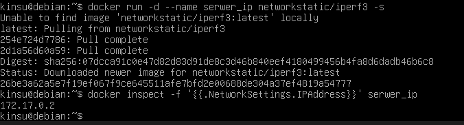

2. Połączenie z drugiego kontenera


W domyślnej sieci mostkowej Dockera, kontenery komunikują się ze sobą, ale trzeba najpierw znać ich adres IP

3. Własna sieć

Tworzenie sieci, odpalanie nowego serwera z wpięciem go do nowo utworzonej sieci, odpalenie klienta i połączenie 

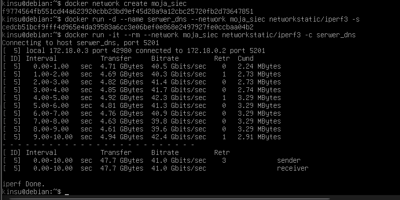

Dzięki utworzeniu dedykowanej sieci mostkowej,  kontenery mogą się komunikować ze sobą przy użyciu swoich nazw, dzięki czemu nie trzeba polegać na przydzielanych adresach IP

4. Połączenie się z hosta

Pierwszy krok to przygotowanie serwera 
``` docker run -d --name iperf_next -p 5201:5201 networkstatic/iperf3 -s ```
Połączenie z hosta 


Test przebiega pozytywnie - przepustowość jest wysoka, co wynika z faktu, że ruch nie przechodzi przez fizyczną kartę sieciową, tylko przez wirtualny interfejs w pamięci RAM - prędkość jest ograniczona jedynie mocą cpu

Połączenie spoza hosta jest problemem, ponieważ maszyna wirtualna działa domyślnie w sieci typu NAT (co widać po adresie ```10.0.2.15``` - jest schowana za wirtualnym routerem i system (Windows) jej nie widzi, aby test się udał, należy zrobić Port Forwarding w ustawieniach VMKi 

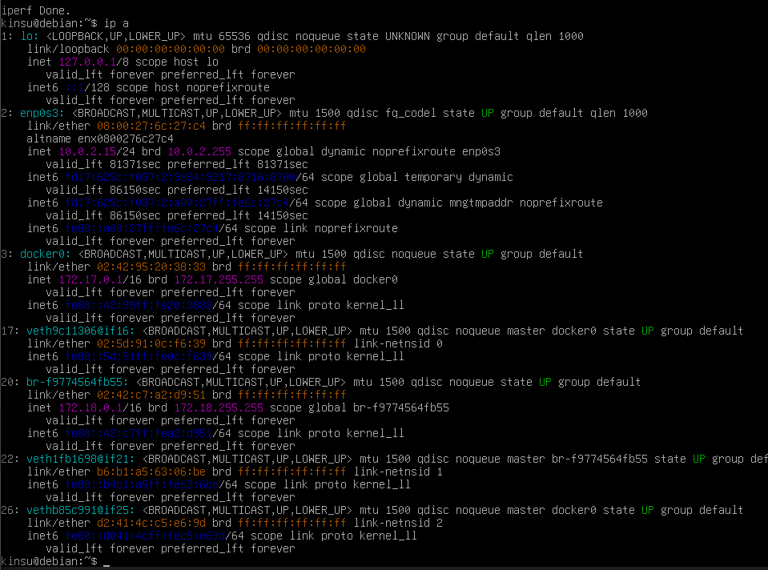

Wyciągnięcie logów z kontenera


## Usługi w rozumieniu systemu, kontenera i klastra
1. Zestawienie ubuntu w tle i wejście do niego

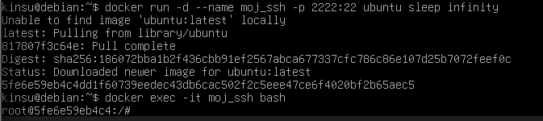

Instalacja SSH wewnątrz kontenera (```apt-get install -y openssh-server```) i uruchomienie

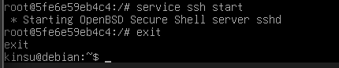

2. Łączenie 


Z reguły, zestawianie SSH w kontenerze to zazwyczaj zły pomysł, ponieważ kontener ma z załozenia uruchamiać tylko jeden proces, dlatego SSH generuje dodatkowe obciążenie i jest zresztą zbędne, ponieważ Docker posiada swoje narzędzie do wchodzenia do kontenerów (```docker exec```) - może to mieć sens w przypadku tworzenia honeypotów lub jumpboxów

## Przygotowanie do uruchomienia Jenkins
1. Tworzenie sieci dla Jenkinsa i odpalenie DinD (Docker-in-Docker)


2. Uruchomienie Jenkinsa


3. Działające kontenery + ekran logowania

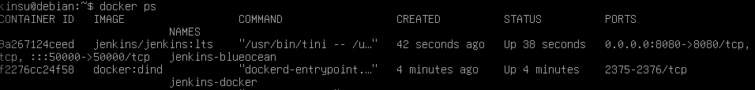 \


 
 


 

