## Sprawozdanie z zajęć 10 – Kinga Sulej gr. 6

### Instalacja klastra k8s 

Instalacja została przeprowadzona w bezpieczny sposób, pobierając binaria bezpośrednio z oficjalnych repozytoriów za pomocą HTTPS (`curl -LO`), przebiega ona zgodnie z poniższymi komendami:

`curl -LO https://storage.googleapis.com/minikube/releases/latest/minikube-linux-amd64`
```sudo install minikube-linux-amd64 /usr/local/bin/minikube`
`curl -LO "https://dl.k8s.io/release/$(curl -L -s https://dl.k8s.io/release/stable.txt)/bin/linux/amd64/kubectl"`
`sudo install -o root -g root -m 0755 kubectl /usr/local/bin/kubectl`

2. Start z mitygacją zasobów

Z powodu ograniczeń zasobów przydzielonych do maszyny wirtualnej, konieczna była mitygacja wymagań sprzętowych środowiska Minikube, zgodnie z poniższą komendą. 

`minikube start --driver=docker --cpus=2 --memory=1800`
mitygacja - 

wynik (weryfikacja działania) `kubectl get nodes`

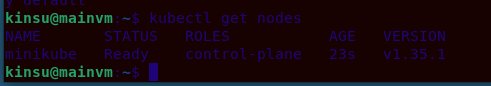

Uruchomienie dashboardu (`minikube dashboard --url`) : 

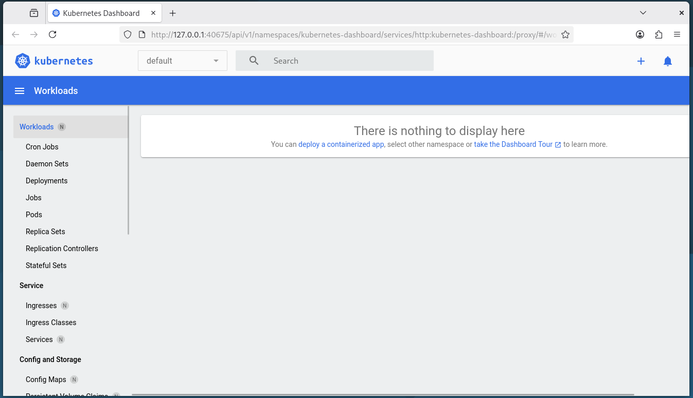

### Analiza posiadanego kontenera 

Z uwagi na to, że program z oryginalnego pipeline'u (skrypt oparty o moduł `url-parse`) był aplikacją pracującą w tle i nie wyprowadzał interfejsu funkcjonalnego przez sieć, zgodnie z wytycznymi z instrukcji zastosowano wariant **Optimum**. Wykorzystano obraz-gotowiec oparty na serwerze webowym `nginx` i wzbogacono go o własną konfigurację.

1. Przed rozpoczęciem budowy obrazu przygotowano stronę html i plik Dockerfile 

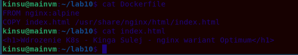

Budowa obrazu: `docker build -t kinsu-apka:v1 .`

Sprawdzenie czy działa:

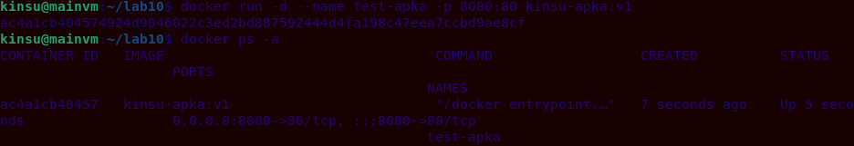

2. Załadowanie obrazu do minikube 

`minikube image load kinsu-apka:v1`

Weryfikacja: 

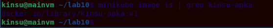

### Uruchamianie oprogramowania

1. Uruchomienie poda 

`kubectl run moje-wdrozenie --image=kinsu-apka:v1 --port=80 --labels app=moje-wdrozenie --image-pull-policy=Never`

Wynik:

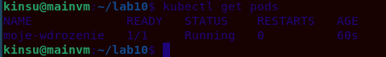

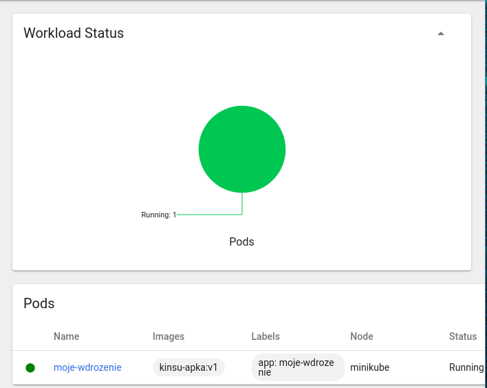

Potwierdza to pomyślnie utworzonego poda i znajdującego się w trybie `Running`

2. Przekierowanie portu

w celu uzyskania dostępu do funkcjonalności serwera, wyprowadzono port kontenera na maszynę lokalną (hosta) za pomocą mechanizmu port-forward. 

`kubectl port-forward pod/moje-wdrozenie 8080:80 &`

Test łączności za pomocą `curl`:

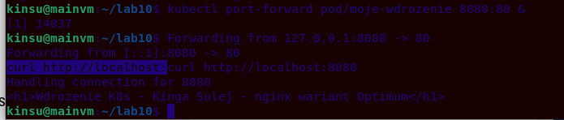

Wyświetla się kod html strony, co sugeruje poprawną odpowiedź 

### Przekucie wdrożenia w plik

1. Plik `.yaml`

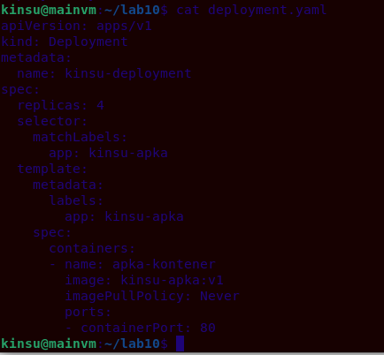

Zawiera on zdelkarowane 4 repliki oraz regułę `imagePullPolicy: Never` żeby użyć lokalnego obrazu

2. Uruchomienie wdrożenia i sprawdzenie statusu 

`kubectl apply -f ~/lab10/deployment.yaml`

`kubectl rollout status deployment/kinsu-deployment`

Efekt: 

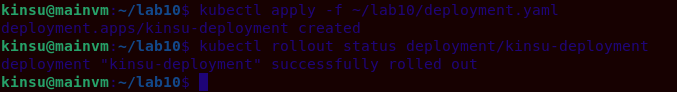

3. Wyeksponowanie jako serwis i weryfikacja

`kubectl expose deployment kinsu-deployment --type=NodePort --port=80`

Tabela podsumowująca: 


Widoczne są 4 działające niezależnie pody, usługa (service/kinsu-deployment) oraz kontroler ReplicaSet czuwający nad krotnością instancji

4. Przekierowanie portu do serwisu

Ostateczny test łączności i komunikacji sieciowej z rozproszonymi replikami aplikacji: 

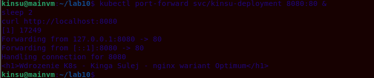