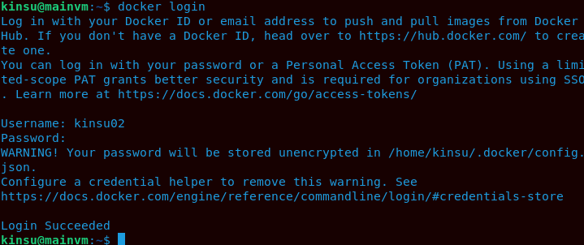
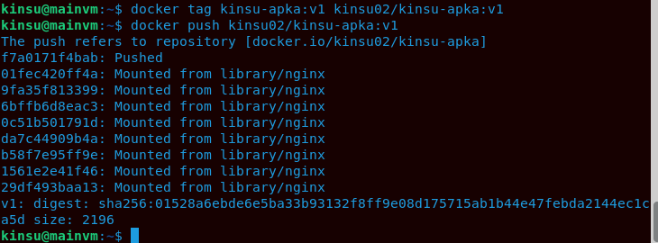
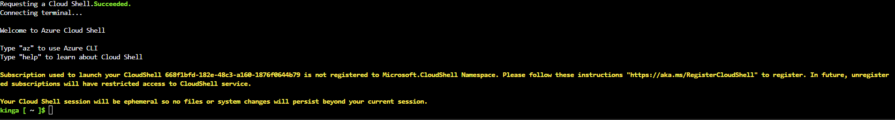
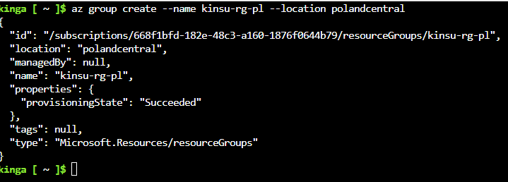
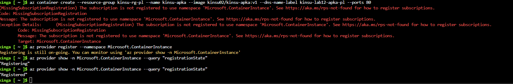
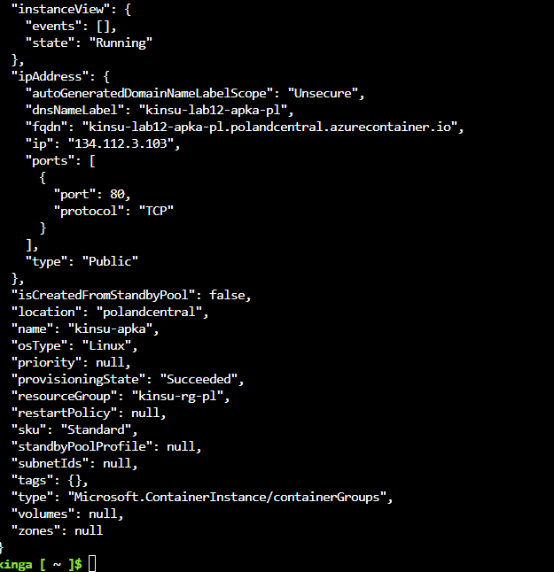

## Sprawozdanie z zajęć 12 – Kinga Sulej gr. 6

### Wdrażanie na zarządzalne kontenery w chmurze (Azure)

1. Przygotowanie kontenera - wypchnięcie obrazu na DockerHub

Logowanie na DH

Tagowanie obrazu i wypchnięcie 

2. Zalogowanie do Azure i odpalenie konsoli 

Po zalogowaniu się swoimi danymi studenckimi, uruchomiono terminal (ikona w prawym górnym rogu, obok zębatki) - Cloud Shell

Utwprzenie Resource Group 

Wdrożenie kontenera - przy okazji włączenie obsługi kontenerów poprzez `az provider register --namespace Microsoft.ContainerInstance` - po uzyskaniu statusu "Registered" udało się ostatecznie stworzyć kontener 

Efekt pełnego stworzenia kontenera (fragment zwróconego pliku JSON)

Weryfikacja wdrożenia - za pomocą poleceń interfejsu CLI wyciągnięto status wdrożenia (`State: Succeeded`) oraz publiczny adres FQDN. 
Polecenie `az container logs`, pobiera dzienniki zdarzeń, jednocześnie udowadniając stabilną pracę procesu w tle.
Dodatkowo zweryfikaowano działanie usługi sieciowej poprzed użycie `curl`

Na zakończenie pracy, w celu optymalizacji kosztów zatrzymano i całkowicie usunięto utworzoną grupę zasobów poleceniem `az group delete`.

