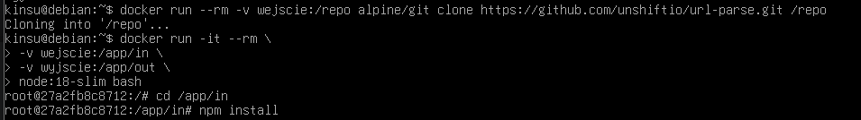
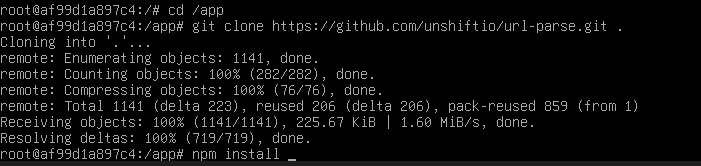
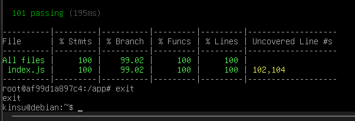
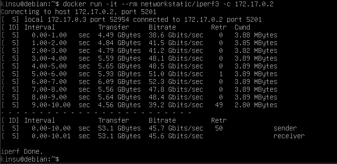
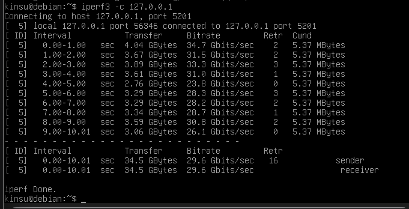
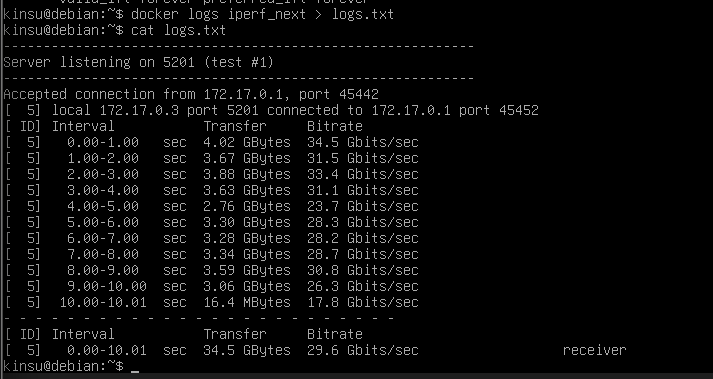
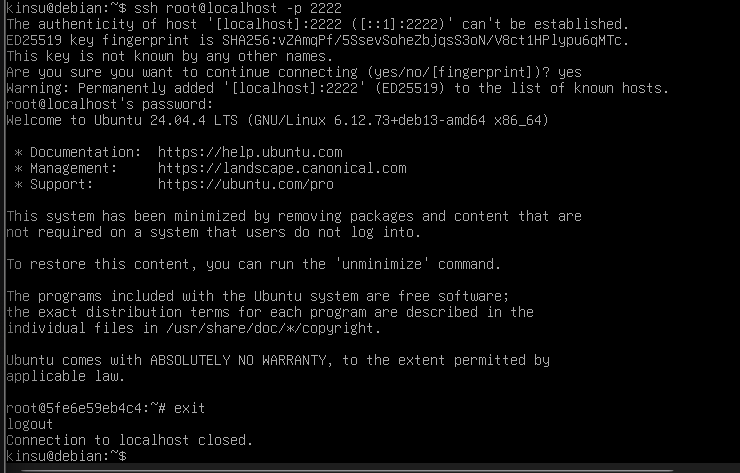
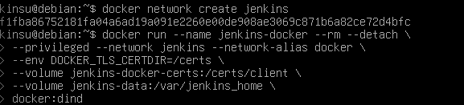
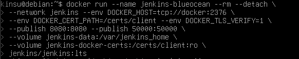
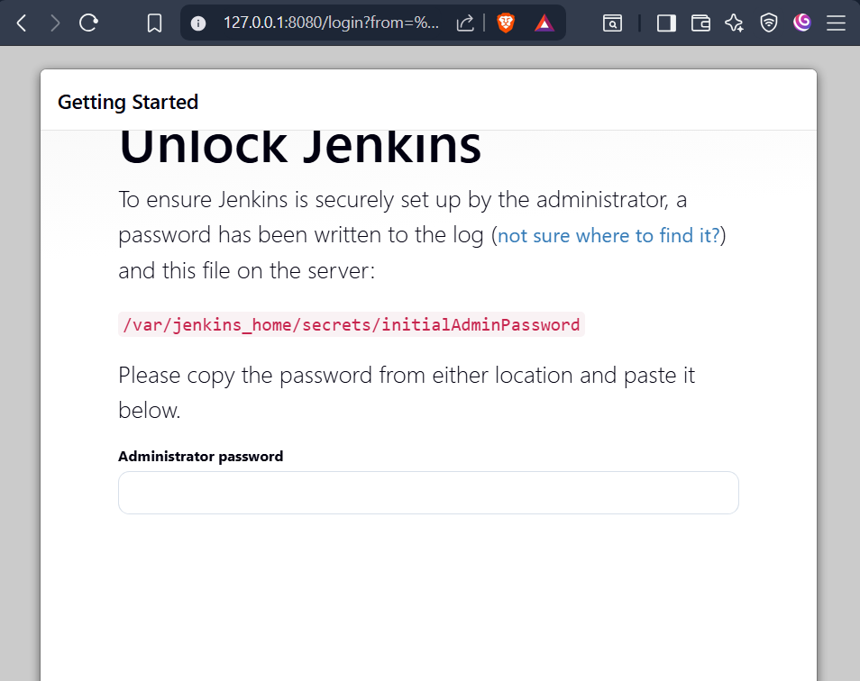

# devops-4
## Zachowywanie stanu między kontenerami 
1. Utworzenie dwóch woluminów


2. Sklonowanie repozytorium bez Gita w kontenerze docelowym

Skoro kontener budujący nie może mieć gita, używam kontenera pomocniczego bazującego na alpine, który pobiera kod kod na wolumin i jest od razu usuwany



Jak widać na powyższym zdjęciu, następnie uruchomiono właściwy kontener bazowy ze środowiskiem Node.js,  za pomocą flag -v podłączono do niego woluminy wejściowy (zawierający pobrany wcześniej kod źródłowy) i wyjściowy (pusty, przeznaczony na gotowy build).
 
3. Po wykonaniu wewnątrz kontenera  ```npm install``` i następnym ```npm test``` - procesy zakończyły się pomyślnie.


4. Skopiowanie do drugiego woluminu


5. Powtórzenie czynności z klonowaniem na wolumin wejściowy wewnątrz kontenera

Uruchomienie czystego kontenera


Instalacja gita komendą ```apt-get update && apt-get install -y git```\
Klon repo do woluminu



testy przebiegły pomyślnie 



6. Automatyzacja za pomocą ```docker build``` i ```Dockerfile```

Ręczne uruchamianie kontenerów, mapowanie woluminów i wpisywanie komend powinno być stosowane głównie do celów badawczych/naukowych (tak jak na labie), w praktyce te procesy są automatyzowane - Docker BuildKit udostępnia flagę ```--mount``` dla instrukcji RUN, co pozwala odtworzyć wyżej wykonane kroki

 ## Eksponowanie portu i łączność między kontenerami

1. Uruchomienie serwera iperf wewnątrz kontenera i znalezienie jego adresu IP


2. Połączenie z drugiego kontenera



W domyślnej sieci mostkowej Dockera, kontenery komunikują się ze sobą, ale trzeba najpierw znać ich adres IP

3. Własna sieć

Tworzenie sieci, odpalanie nowego serwera z wpięciem go do nowo utworzonej sieci, odpalenie klienta i połączenie 


Dzięki utworzeniu dedykowanej sieci mostkowej,  kontenery mogą się komunikować ze sobą przy użyciu swoich nazw, dzięki czemu nie trzeba polegać na przydzielanych adresach IP

4. Połączenie się z hosta

Pierwszy krok to przygotowanie serwera 
``` docker run -d --name iperf_next -p 5201:5201 networkstatic/iperf3 -s ```
Połączenie z hosta 



Test przebiega pozytywnie - przepustowość jest wysoka, co wynika z faktu, że ruch nie przechodzi przez fizyczną kartę sieciową, tylko przez wirtualny interfejs w pamięci RAM - prędkość jest ograniczona jedynie mocą cpu

Połączenie spoza hosta jest problemem, ponieważ maszyna wirtualna działa domyślnie w sieci typu NAT (co widać po adresie ```10.0.2.15``` - jest schowana za wirtualnym routerem i system (Windows) jej nie widzi, aby test się udał, należy zrobić Port Forwarding w ustawieniach VMKi 


Wyciągnięcie logów z kontenera



## Usługi w rozumieniu systemu, kontenera i klastra
1. Zestawienie ubuntu w tle i wejście do niego


Instalacja SSH wewnątrz kontenera (```apt-get install -y openssh-server```) i uruchomienie


2. Łączenie 



Z reguły, zestawianie SSH w kontenerze to zazwyczaj zły pomysł, ponieważ kontener ma z załozenia uruchamiać tylko jeden proces, dlatego SSH generuje dodatkowe obciążenie i jest zresztą zbędne, ponieważ Docker posiada swoje narzędzie do wchodzenia do kontenerów (```docker exec```) - może to mieć sens w przypadku tworzenia honeypotów lub jumpboxów

## Przygotowanie do uruchomienia Jenkins
1. Tworzenie sieci dla Jenkinsa i odpalenie DinD (Docker-in-Docker)



2. Uruchomienie Jenkinsa



3. Działające kontenery + ekran logowania

 \





