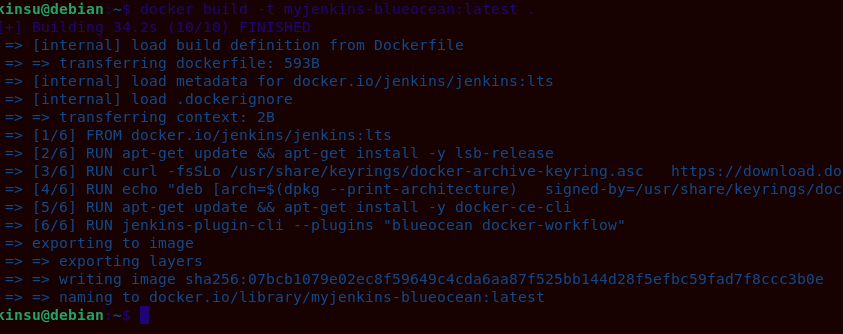
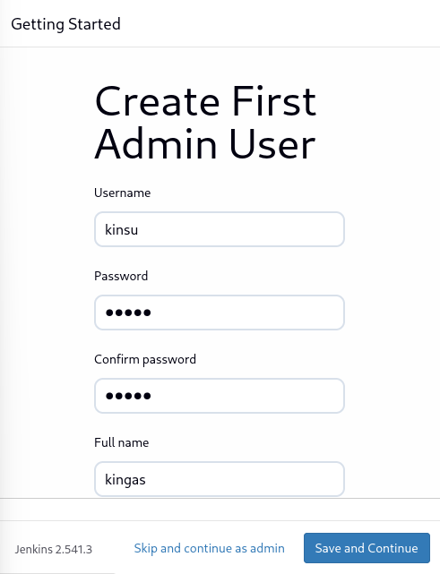
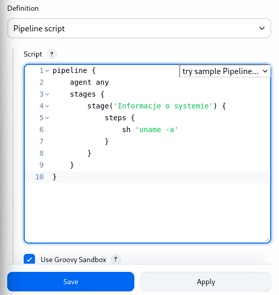
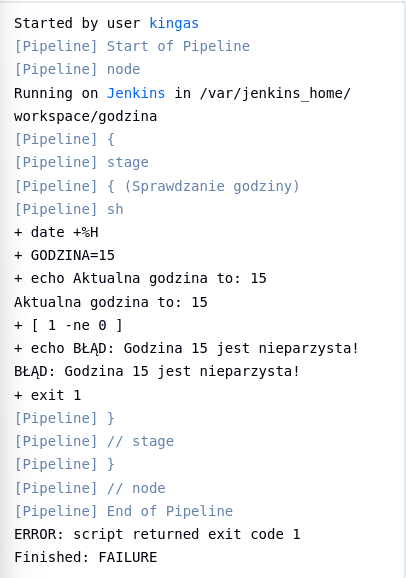
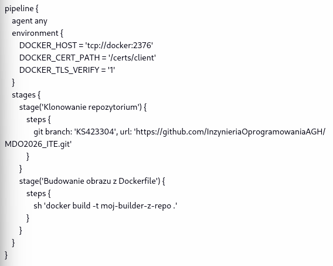

### Metodyki Devops - lab 5
## Kinga Sulej gr. 6 
## Przygotowanie Jenkins
1. Obraz eksponujący środowisko
   


2. Obraz blueocean
Utworzenie Dockerfile (na podstawie dokumentacji)


Budowa obrazu komendą
```docker build -t myjenkins-blueocean:latest .```

Bazowy obraz zawiera tylko podstawowy serwer Jenkinsa, przygotowany na jego podstawie nowy obraz różni się tym, że ma zainstalowanego klienta docker-ce-cli (co pozwala mu na komunikację ze środowiskiem zagnieżdżonym DinD) oraz preinstalowane wtyczki blueocean, które całkowicie zmieniają interfejs użytkownika w stosunku do klasycznego Jenkinsa.



Uruchomienie blueocean


Komendą ```docker logs jenkins-blueocean``` szukam hasła do zalogowania się na Jenkins
Po zalogowaniu wybieram opcję "Install suggested plugins" w panelu głównym i tworzę pierwszego użytkownika 



O archiwizację i zabezpieczenie logów oraz konfiguracji zadbano podczas uruchamiania obu kontenerów. W poleceniach użyto parametru ```--volume jenkins-data:/var/jenkins_home```. Wewnątrz katalogu ```/var/jenkins_home serwer``` przechowuje wszystkie swoje dane, projekty oraz logi. Dzięki zmapowaniu go do nazwanego woluminu Dockera ```jenkins-data```, dane te zostały przeniesione poza środowisko kontenera na bezpieczny dysk fizyczny maszyny. Dzięki temu, nawet jeśli kontener zostanie zatrzymany i usunięty (```--rm```), logi i konfiguracja pozostaną bezpieczne i przetrwają do kolejnego uruchomienia.


## Uruchomienie
1. Klikam "New Item" w panelu głównym
2. Opcja ```pipeline```
   


3. Tworzenie skryptu



4. Po kliknięciu ```Build Now``` i wejściu w ```Console Output``` pokazuje się następująco:


5. Analogiczne czynności wykonuję dla projektu z nieparzystą godziną
Skrypt: 


Output (jest godzina 10, serwer pokazuje o 4h do przodu, ale zasada działania jest spełniona): 


Ewentualnie dla sprawdzenia, po zmianie godziny w systemie na 11 (serwerowa 15), jest zwracany błąd 



6. Docker pull
Skrypt:


Output: widoczny sukces


## Nowy obiekt pipeline
1. Analogicznie według poprzednich przykładów stworzono nowy obiekt o nazwie ```budowazrepo```




Drugie uruchomienie pipeline'u trwało znacznie krócej, ponieważ Docker wykorzystał cache. Kod na gałęzi oraz zawartość pliku Dockerfile nie uległy zmianie, środowisko pominęło proces ponownego budowania warstw.


   


