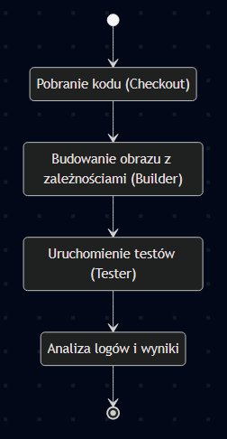
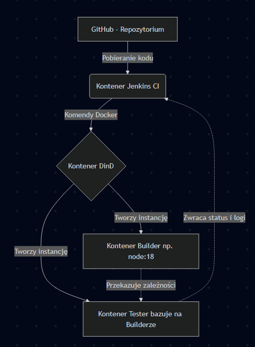
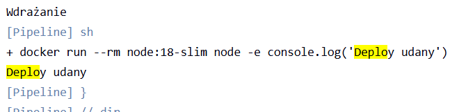
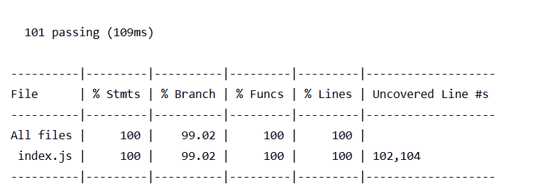

## Sprawozdanie z zajęć 06 – Kinga Sulej gr. 6
### Opis celu (kont. instrukcja z lab 5) 
Wymagania wstępne środowiska: 
* Działająca instancja serwera ciągłej integracji (Jenkins) uruchomiona jako kontener Docker.

* Skonfigurowane i połączone środowisko zagnieżdżone Docker-in-Docker (DinD), pozwalające Jenkinsowi na bezpieczne budowanie obrazów.

* Sforkowane repozytorium z kodem źródłowym aplikacji (np. Node.js url-parse) wraz z plikami Dockerfile oraz Jenkinsfile.

* Dostęp do zewnętrznego rejestru lub mechanizmu archiwizacji artefaktów.

Diagram aktywności (kolejne etapy CI)



Diagram wdrożeniowy (relacje i architektura)



### Pipeline: składnia 

1. Kroki `build -> test` znajdują się w Jenkinsfile załączonym w repozytorium.

Krok Build: sekcja stage('2. Build'). Wywołanie komendy ```docker build -f``` Dockerfile.build.

Krok Test: sekcja stage('3. Test'). Wywołanie komendy ```docker run ...``` na obrazie testowym.

2. DinD vs kontener CI

Instalacja bezpośrednio na kontenerze CI zakłada zainstalowanie wszystkich niezbędnych narzędzi bezpośrednio w systemie, na którym działa serwer Jenkins, co w przypadku obsługi wielu projektów prowadzi do "bałaganu" i różne aplikacje mogą się gryźć wersjami. Budowanie na dedykowanym środowisku (DinD) pozwala na zostawienie serwera Jenkins który pełni rolę orkiestratora, proces budowania odbywa się w osobnym kontenerze DinD, który powołuje do życia kontenery budujące, które po zakończeniu pracy są usuwane, co jest bezpieczniejsze i czystsze. 

### Kompletny pipeline 

1. Wstępna konfiguracja - obraz eksponujący środowisko, co zostało przedstawione w poprzednim sprawozdaniu.

2. Plik ```Dockerfile.jenkins``` został załączony do repozytorium 

3. Kontener builder -> plik ```Dockerfile.build``` utworzony zgodnie z wymaganiami, podobnie obraz testujący, plik ```Dockerfile.test```. W przypadku błędów, Jenkins to wyłapie i pokaże czerwone logi. 

4. Deploy i dyskusja

Kwestia czyszczenia kontenera buildowego - taki kontener nie jest wdrażany, po zakończeniu etapu buildu, artefakt jest wyodrębniany, a kontener z zależnościami jest niszczony - docelowe wdrożenie następuje w nowym, odseparowanym kontenerze. 

Wdrożenie docelowe - tutaj zastosowałam podejście z wykorzystaniem pliku, ponieważ aplikacja jest napisana w Node.js, program zostaje zapakowany do formatu TAR, a jednocześnie, do celów uruchomieniowych, aplikacja jest dystrybuowana jako obraz dockera, co gwarantuje przenośność środowiska. Zgodnie z dobrymi praktykami, obraz docelowy nie może zawierać zawartości sklonowanego repozytorium, logów i artefaktów z builda (i nie zawiera). 

Dowód 1 - screen paczki 


Różnica między ```node``` a ```node-slim``` polega na tym, że ```node``` jest ciężki, zawiera praktycznie kompletne środowisko, dlatego pełni rolę buildera, natomiast ```node slim``` to zminimalizowany obraz, zawierający sam silnik js, dlatego pełni rolę docelowego środowiska Deploy 

Opis procesu Deploy 

Ze względu na tworzenie paczki .tgz, krok Deploy jest realizowany jako tzw. Smoke Test, proces polega na tymczasowym powołaniu do życia odizolowanego kontenera docelowego, bazującego na lżejszym obrazie. Następnie montuje w nim wygenerowaną wcześniej paczkę z kodem i próbuje ją uruchomić za pomocą wbudowanych poleceń Node. Jeśli aplikacja wstanie i nie zgłosi błędu braku bibliotek deweloperskich, oznacza to, że wdrożenie jest poprawne, kontener jest poprawnie "odchudzony", a obraz docelowy jest gotowy do wdrożenia. 

Dowód 2 - wyciąg z logów potwierdzający udane wykonanie procesu 



5. Publish

Jako postać redystrybucyjną wybrano format tar (.tgz) czyli natywny format ekosystemu Node.js, co gwarantuje wersjonowanie zgodne z plikiem konfigutacji i zamyka całą aplikację w jednym pliku, gotowym do umieszczenia w repo artefaktów. 

Zgodnie z wymaganiami, powstały plik nie zostaje usunięty po zniszczeniu kontenera, zostaje on eksportowany i jest gotowy do pobrania ze strony podsumowującej ostatni build (co widać na jednym z wcześniejszych zdjęć). 

---

## Podsumowanie - lista kontrolna (06-Class.md)

### Ścieżka krytyczna

Zrealizowano wszystkie podstawowe kroki w ramach zautomatyzowanego potoku CI/CD. 

[x] commit (automatyczne pobranie zmian z systemu kontroli Git)

[x] clone (pobranie niezbędnych plików do przestrzeni roboczej)

[x] build (zbudowanie środowiska z zależnościami)

[x] test (wykonanie testów w dedykowanym środowisku)

[x] deploy (weryfikacja na lekkim kontenerze docelowym)

[x] publish (wygenerowanie i udostępnienie artefaktu na Jenkinsie)

### Lista kontrolna 

[x] Aplikacja została wybrana

Wybrano bibliotekę ```url-parse``` napisaną w środowisku Node.js

[x] Licencja potwierdza możliwość swobodnego obrotu kodem na potrzeby zadania

Aplikacja korzysta z otwartej licencji MIT, co pozwala na wymagany obrót kodem 

[x] Wybrany program buduje się

Proces pobierania modułów i budowania poprzez npm install przechodzi bezbłędnie.

[x] Przechodzą dołączone do niego testy

Wszystkie testy jednostkowe pomyślnie przeszły proces 



[x] Zdecydowano, czy jest potrzebny fork własnej kopii repozytorium

Wybrano opcję bez forka, wszystkie Dockerfile i Jenkinsfile znajdują się w repozytorium, a kod aplikacji jest pobierany przez ```git clone``` z oryginalnego repo podczas budowania obrazu 

[x] Stworzono diagram UML zawierający planowany pomysł na proces CI/CD

Gotowy, został wklejony na początku sprawozdania

[x] Wybrano kontener bazowy lub stworzono odpowiedni kontener wstepny (runtime dependencies)

Jako kontener bazowy (Builder) wybrano obraz node:18, który posiada wbudowane niezbędne narzędzia 

[x] Build został wykonany wewnątrz kontenera

Proces ```npm install``` został odizolowany i wykonany we wnętrzu kontenera podczas budowy obrazu


[x] Testy zostały wykonane wewnątrz kontenera (kolejnego)

Proces wykonano w dedykowanym kontenerze testowym uruchamianym na odpowiednim etapie 

[x] Kontener testowy jest oparty o kontener build

Tak, jest to zaimplementowane to w pliku Dockerfile.test przy użyciu dyrektywy FROM aplikacja-build:latest, dzięki czemu obraz testowy dostaje gotowe środowisko.

[x] Logi z procesu są odkładane jako numerowany artefakt, niekoniecznie jawnie

Serwer Jenkinsa automatycznie odkłada pełne logi z każdego wykonania pipeline'u, przypisując im konkretny numer (np. Build #10).

[x] Zdefiniowano kontener typu 'deploy' pełniący rolę kontenera, w którym zostanie uruchomiona aplikacja

Jako środowisko uruchomieniowe wybrano zminimalizowany obraz node:18-slim.

[x] Uzasadniono czy kontener buildowy nadaje się do tej roli/opisano proces stworzenia nowego

Uzasadnienie znajduje się powyżej w sprawozdaniu

[x] Wersjonowany kontener 'deploy' ze zbudowaną aplikacją jest wdrażany na instancję Dockera

Aplikacja jest uruchamiana na instancji weryfikacyjnej w zautomatyzowanym kroku Deploy

[x] Następuje weryfikacja, że aplikacja pracuje poprawnie (smoke test) poprzez uruchomienie kontenera 'deploy'

W logach Jenkinsa wyszedł pomyślny start aplikacji ("Deploy udany"), co  jest dowodem na przejście Smoke Testu.

[x] Zdefiniowano, jaki element ma być publikowany jako artefakt

Tak, artefaktem będzie gotowa paczka dystrybucyjna z kodem projektu

[x] Uzasadniono wybór: kontener z programem, plik binarny, flatpak, archiwum tar.gz, pakiet RPM/DEB

Tak, również znajduje się to wyjaśnione powyżej w sprawozdaniu 

[x] Opisano proces wersjonowania artefaktu (można użyć semantic versioning)

Proces wersjonowania jest dziedziczony z pliku package.json i opiera się o semantic versioning - nazewnictwo plików w formacie nazwa-x.y.z.tgz ( url-parse-1.5.10.tgz).

[x] Dostępność artefaktu: publikacja do Rejestru online, artefakt załączony jako rezultat builda w Jenkinsie

Artefakt jest załączany w panelu podsumowania buildu w Jenkinsie, skąd każdy kto ma do tego uprawnienia może go pobrać 

[x] Przedstawiono sposób na zidentyfikowanie pochodzenia artefaktu

Pochodzenie wygenerowanej paczki identyfikuje się poprzez jej przypięcie do konkretnego, unikalnego numeru buildu w historii pipeline'u na Jenkinsie

[x] Pliki Dockerfile i Jenkinsfile dostępne w sprawozdaniu w kopiowalnej postaci oraz obok sprawozdania, jako osobne pliki

<details>
<summary><b>Dockerfile.build</b></summary>

```
FROM node:18-slim
RUN apt-get update && apt-get install -y git
WORKDIR /app
RUN git clone https://github.com/unshiftio/url-parse.git .
RUN npm install 
```  

</details>

<details>
<summary><b>Dockerfile.test</b></summary>
  
```
FROM my-build:latest
CMD ["npm", "test"] 
```

</details>

<details>
<summary><b>Jenkinsfile</b></summary>

```
pipeline {
    agent any
    stages {
        stage('Collect') {
            steps {
                echo 'Pobieranie kodu z repozytorium'
                checkout scm
            }
        }
        stage('Build') {
            steps {
                dir('KS423304/Spr6') {
                    echo 'Budowanie obrazu bazowego'
                    sh 'docker build -t aplikacja-build:latest -f Dockerfile.build .'
                }
            }
        }
        stage('Test') {
            steps {
                dir('KS423304/Spr6') {
                    echo 'Budowanie obrazu testowego i uruchamianie testów'
                    sh 'docker build -t aplikacja-test:latest -f Dockerfile.test .'
                    sh 'docker run --rm aplikacja-test:latest'
                }
            }
        }
        stage('Deploy') {
            steps {
                dir('KS423304/Spr6') {
                    echo 'Wdrażanie'
                    sh 'docker run --rm node:18-slim node -e "console.log(\'Deploy udany\')"'
                }
            }
        }
        stage('Publish') {
            steps {
                dir('KS423304/Spr6') {
                    echo 'Pakowanie i publikacja artefaktu'
                    sh '''
                    docker rm -f temp-pack || true
                    docker run --name temp-pack aplikacja-build:latest npm pack
                    docker cp temp-pack:/app/url-parse-1.5.10.tgz .
                    docker rm temp-pack
                    '''
                }
                archiveArtifacts artifacts: 'KS423304/Spr6/*.tgz', fingerprint: true
            }
        }
    }
}
```  

</details>

Dodatkowo pliki leżą w tym samym repozytorium co sprawozdanie 

[x] Zweryfikowano potencjalną rozbieżność między zaplanowanym UML a otrzymanym efektem

Proces wdrożony na serwerze Jenkins pokrywa się z założeniami zaplanowanymi na początkowym diagramie UML
