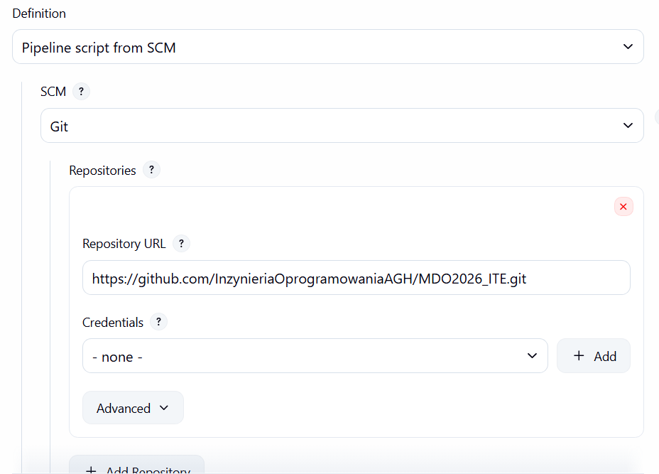
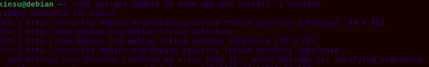
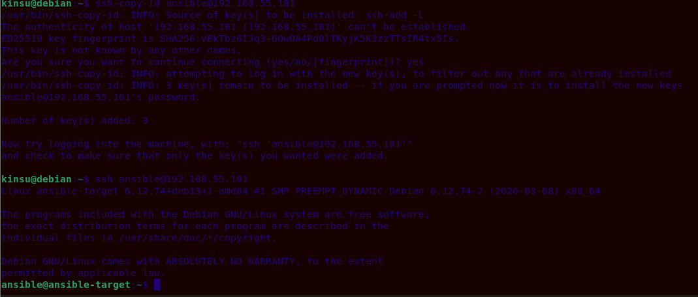

## Sprawozdanie z zajęć 06 – Kinga Sulej gr. 6
### Jenkinsfile: lista kontrolna

[x] Przepis dostarczany z SCM, a nie wklejony w Jenkinsa lub sprawozdanie (co załatwia nam clone)

Konfiguracja potoku w Jenkinsie została ustawiona na opcję Pipeline script from SCM, system samodzielnie pobiera Jenkinsfile'a bezpośrednio z repozytorium podczas każdego uruchomienia



[x] Posprzątaliśmy i wiemy, że odbyło się to skutecznie - mamy pewność, że pracujemy na najnowszym (a nie cache'owanym kodzie)

Dzięki każdorazowemu pobieraniu świeżego kodu z GitHuba oraz używaniu flagi --rm przy uruchamianiu kontenerów tymczasowych, środowisko nie przechowuje starych stanów blokujących kolejne wykonania

[x] Etap Build dysponuje repozytorium i plikami Dockerfile

W pliku Jenkinsfile użyto dyrektywy dir('KS423304/Spr6'), która przemieszcza kontekst wykonania do odpowiedniego podkatalogu przed wywołaniem poleceń 


[x] Etap Build tworzy obraz buildowy, np. BLDR

Wykonywane jest polecenie docker build -t aplikacja-build:latest, które tworzy ciężki obraz budujący (Builder) oparty o node:18-slim z zainstalowanym gitem 

[x] Etap Build (lub oddzielny etap) przygotowuje artefakt - jeżeli docelowy kontener ma być odmienny

Oryginalny proces instalacji zależności (npm install) zachodzi w kontenerze buildowym, jednak sam artefakt wyciągany jest z niego w dedykowanym kroku Publish do późniejszego wdrożenia na lżejszym środowisku 

[x] Etap Test przeprowadza testy

Budowany jest dedykowany obraz testowy (aplikacja-test:latest) bazujący na obrazie buildowym, wewnątrz którego uruchamiana jest komenda ```npm test``` 

[x] Etap Deploy przygotowuje obraz lub artefakt pod wdrożenie.

Jako środowisko wdrożeniowe przygotowano obraz node:18-slim, pełniący funkcję lekkiego środowiska uruchomieniowego 

[x] Etap Deploy przeprowadza wdrożenie

Zaimplementowano Smoke Test, który uruchamia środowisko i potwierdza jego gotowość

[x] Etap Publish wysyła obraz docelowy do Rejestru i/lub dodaje artefakt do historii builda

Skompresowana paczka redystrybucyjna (.tgz) jest wyciągana z kontenera budującego poleceniem docker cp, a następnie załączana do historii wykonania w Jenkinsie za pomocą dyrektywy archiveArtifacts

[x] Ponowne uruchomienie naszego pipeline'u powinno zapewniać, że pracujemy na najnowszym kodzie. Pipeline musi zadziałać więcej niż jeden raz.

Potok został uruchomiony wielokrotnie z rzędu z pełnym sukcesem, zastosowanie izolacji kontenerów i usuwania zasobów tymczasowych (docker rm -f temp-pack) eliminuje ryzyko wystąpienia konfliktów


### Definition of done 

Proces został zrealizowany skutecznie, na końcu powstaje gotowy, niezależny artefakt. 

*Czy opublikowany obraz może być pobrany z Rejestru i uruchomiony w Dockerze bez modyfikacji?*

Świadomie postawiono na publikację samej paczki (artefaktu), a nie wypychanie gotowego kontenera do publicznego rejestru, ale tak - zostało to udowodnione w etapie Deployu (Smoke Test), aplikacja została odpalona na surowo w nowym kontenerze node:18-slim, co oznacza, że jeśli ktokolwiek weźmie paczkę i wrzuci ją do takiego środowiska, aplikacja wstanie od razu

*Czy dołączony do jenkinsowego przejścia artefakt ma szansę zadziałać od razu na maszynie docelowej?*

Tak, utworzony artefakt to standardowa, zamknięta paczka ekosystemu npm, która wymaga wyłącznie środowiska z zainstalowanym Node.js, po pobraniu paczki z Jenkinsa i wykonaniu komendy ```npm install ./url-parse-1.5.10.tgz``` (lub uruchomieniu jej bezpośrednio) aplikacja instaluje się i jest gotowa do działania bez żadnej pozostałej konfiguracji


### Ansible 

1. Instalacja VM-ki z debianem, pozbawiam ją środowiska graficznego żeby była jak najlżejsza


2. Instalacja wymaganych pakietów, zmiana nazwy hosta, tworzenie użytkownika


3. Wykonanie migawki


4. Instalacja ansible na głównej maszynie 



5. Wymiana kluczy 

Wygenerowanie klucza na głównej maszynie 


Wymiana kluczy i sprawdzenie logowania ssh


