## Sprawozdanie z zajęć 08 – Kinga Sulej gr. 6
### Instalacja Ansible 

1. Instalacja VM-ki z debianem, pozbawiam ją środowiska graficznego żeby była jak najlżejsza


2. Instalacja wymaganych pakietów, zmiana nazwy hosta, tworzenie użytkownika


3. Wykonanie migawki


4. Instalacja ansible na głównej maszynie 


5. Wymiana kluczy 

Wygenerowanie klucza na głównej maszynie 

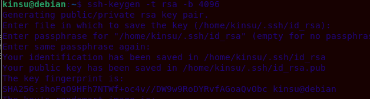

Wymiana kluczy i sprawdzenie logowania ssh


### Inwentaryzacja 

1. Ustalenie nazw maszyn 

Maszyna główna

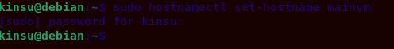

Maszyna z ansible ma już ustawiony swój hostname na ```ansible-target```

2. Nazwy DNS

Edycja pliku ```/etc/hosts``` na maszynie głównej oraz na ansible 

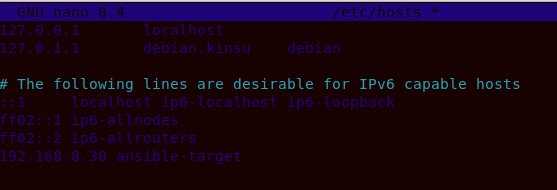

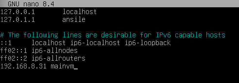

Po wykonaniu ```ping``` na obu maszynach, widzimy że pakiety lecą poprawnie 

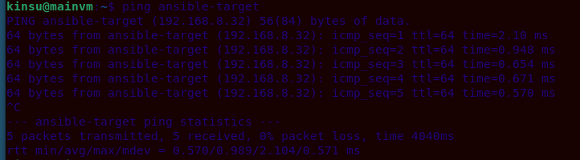

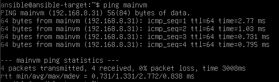

3. Tworzenie pliku inwentaryzacji 

Na głównej maszynie utworzono plik o nazwie ```inventory.ini```

```
[Orchestrators]
ansible-master ansible_connection=local

[Endpoints]
ansible-target ansible_user=ansible
```

4. Weryfikacja łączności (to już było robione, więc sprawdzimy to komendą ansible)

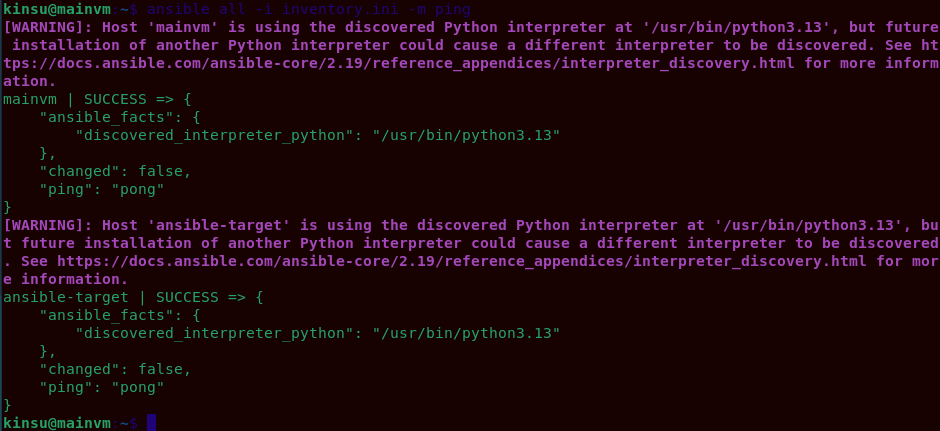

Zielony komunikat ```ping:pong``` przy obu nazwach oznacza, że inwentaryzacja oraz ssh bez hasła działa i maszyny widzą się po nazwach. 

## Zdalne wywoływanie procedur

1. Tworzenie playbooka

<details>
<summary><b>Playbook.yml</b></summary>

---
- name: Test polaczenia 
  hosts: all
  tasks:
    - name: Wyslanie ping
      ping:

- name: Kopiowanie plikow
  hosts: Endpoints
  tasks:
    - name: Kopiowanie inventory.ini na endpoints 
      copy:
        src: inventory.ini
        dest: /home/ansible/inventory.ini

- name: Administracja systemem 
  hosts: Endpoints
  become: yes 
  tasks:
    - name: Aktualizacja pakietow (apt update & upgrade)
      apt:
        update_cache: yes
        upgrade: dist

    - name: rng-tools
      apt:
        name: rng-tools
        state: present

    - name: restart sshd i rngd
      service:
        name: "{{ item }}"
        state: restarted
      loop:
        - sshd
        - rngd

</details>

2. Pierwsze uruchomienie 

Uruchamiam komendą ```ansible-playbook -i inventory.ini playbook.yml```

Efekt: 

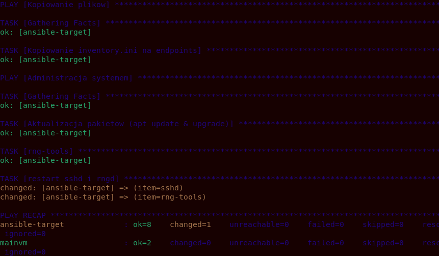

3. Test wyłączonego SSH

Na maszynie ansible zatrzymuję SSH komendą ```systemctl stop ssh```

Efekt po ponownym wykonaniu ```ansible-playbook -i inventory.ini playbook.yml``` na maszynie głównej 

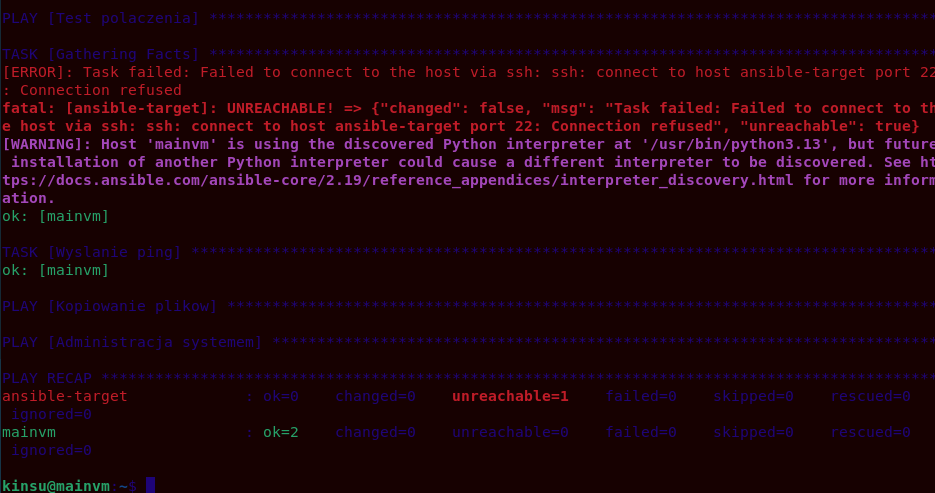

Od razu wyświetla się błąd ```UNREACHABLE``` co jest dowodem na to, że Ansible wyłapuje awarię maszyny 

## Zarządzanie artefaktem 

Artefaktem z poprzedniego labu była paczka .tgz

1. Pobranie artefaktu i stworzenie roli

```ansible-galaxy init deploy_app```

Powyższa komenda tworzy strukturę folderów roli, przenoszę ją, żeby ansible wiedział skąd ma ją wziąć 

```mv url-parse-1.5.10.tgz deploy_app/files/```

2. Tworzenie kolejnego yamla - zadania dla roli 

<details>
<summary><b>Main.yml</b></summary>

---
- name: Instalacja dockera 
  apt:
    name: docker.io
    state: present
    update_cache: yes

- name: Kopiowanie paczki z aplikacja 
  copy:
    src: url-parse-1.5.10.tgz
    dest: /tmp/url-parse-1.5.10.tgz

- name: Uruchomienie aplikacji w kontenerze Node 
  shell: |
    docker rm -f test-app || true
    docker run -d --name test-app -v /tmp/url-parse-1.5.10.tgz:/app.tgz node:18-slim sh -c "npm install -g /app.tgz && sleep 60"
  register: run_output

- name: Weryfikacja dzialania 
  shell: docker ps | grep test-app
  register: check_output

- name: Dowod dzialania
  debug:
    msg: "Sukces! Kontener widoczny w systemie: {{ check_output.stdout }}"

- name: Posprzataj - zatrzymaj i usun kontener
  shell: docker rm -f test-app

</details>

3. Główny skrypt 

<details>
<summary><b>master_deploy.yml</b></summary>

---
- name: Wdrazanie artefaktu przez role Ansible Galaxy
  hosts: Endpoints
  become: yes
  roles:
    - deploy_app

</details>

4. Odpalenie skryptu 

```ansible-playbook -i inventory.ini master_deploy.yml```

Efekt: 

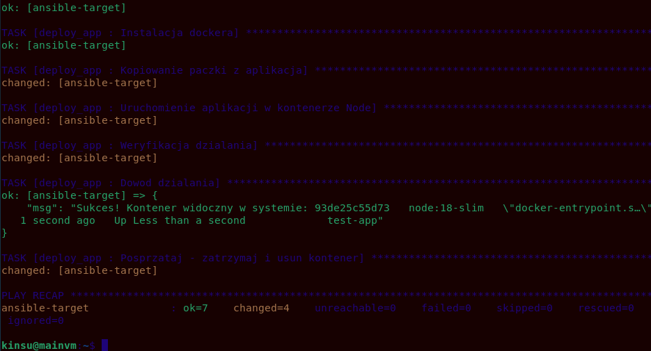

Na załączonym zrzucie ```PLAY RECAP``` widać, że główny playbook zakończył się sukcesem

Dodatkowo, w meta/mail.yml wypełniono plik tak, jak na poniższym zrzucie ekranu: 

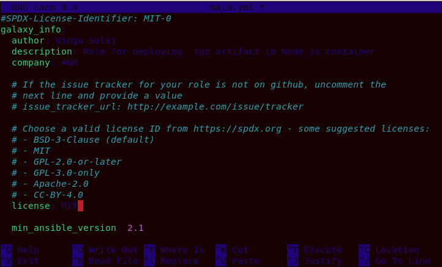

Sanity check - dodany na początku pliku ```main.yml```, aby sprawdzić, czy ilość miejsca na dysku jest wystarczająca przed rozpoczęciem instalacji oraz jaki mamy system

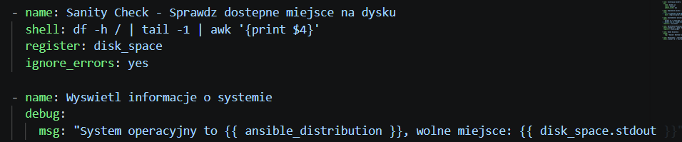